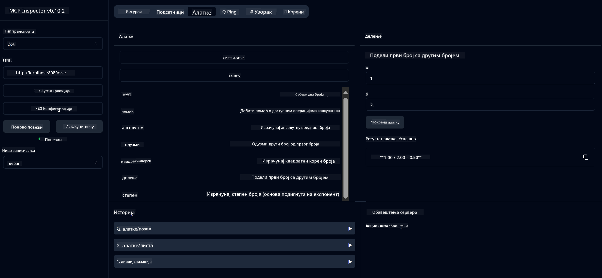

<!--
CO_OP_TRANSLATOR_METADATA:
{
  "original_hash": "13231e9951b68efd9df8c56bd5cdb27e",
  "translation_date": "2025-07-13T22:31:42+00:00",
  "source_file": "03-GettingStarted/samples/java/calculator/README.md",
  "language_code": "sr"
}
-->
# Basic Calculator MCP Service

Ова услуга пружа основне операције калкулатора преко Model Context Protocol (MCP) користећи Spring Boot са WebFlux транспортом. Дизајнирана је као једноставан пример за почетнике који уче о MCP имплементацијама.

За више информација, погледајте [MCP Server Boot Starter](https://docs.spring.io/spring-ai/reference/api/mcp/mcp-server-boot-starter-docs.html) референтну документацију.

## Преглед

Услуга приказује:
- Подршку за SSE (Server-Sent Events)
- Аутоматску регистрацију алата користећи Spring AI `@Tool` анотацију
- Основне функције калкулатора:
  - Сабирање, одузимање, множење, дељење
  - Израчунавање степена и квадратног корена
  - Модулус (остатак) и апсолутна вредност
  - Помоћна функција за опис операција

## Карактеристике

Ова услуга калкулатора нуди следеће могућности:

1. **Основне аритметичке операције**:
   - Сабирање два броја
   - Одузимање једног броја од другог
   - Множење два броја
   - Дељење једног броја са другим (са провером дељења са нулом)

2. **Напредне операције**:
   - Израчунавање степена (подизање базе на експонент)
   - Израчунавање квадратног корена (са провером негативног броја)
   - Израчунавање модулуса (остатка при дељењу)
   - Израчунавање апсолутне вредности

3. **Систем помоћи**:
   - Уграђена помоћна функција која објашњава све доступне операције

## Коришћење услуге

Услуга излаже следеће API крајње тачке преко MCP протокола:

- `add(a, b)`: Сабери два броја
- `subtract(a, b)`: Одузми други број од првог
- `multiply(a, b)`: Помножи два броја
- `divide(a, b)`: Подели први број са другим (са провером нуле)
- `power(base, exponent)`: Израчунај степен броја
- `squareRoot(number)`: Израчунај квадратни корен (са провером негативног броја)
- `modulus(a, b)`: Израчунај остатак при дељењу
- `absolute(number)`: Израчунај апсолутну вредност
- `help()`: Добиј информације о доступним операцијама

## Тест клијент

Једноставан тест клијент је укључен у пакет `com.microsoft.mcp.sample.client`. Класа `SampleCalculatorClient` демонстрира доступне операције калкулаторске услуге.

## Коришћење LangChain4j клијента

Пројекат укључује пример LangChain4j клијента у `com.microsoft.mcp.sample.client.LangChain4jClient` који показује како интегрисати калкулаторску услугу са LangChain4j и GitHub моделима:

### Захтеви

1. **Подешавање GitHub токена**:
   
   Да бисте користили GitHub AI моделе (нпр. phi-4), потребан вам је лични приступни токен са GitHub-а:

   a. Идите у подешавања свог GitHub налога: https://github.com/settings/tokens
   
   b. Кликните на "Generate new token" → "Generate new token (classic)"
   
   в. Дајте свом токену описно име
   
   г. Изаберите следеће опсеге:
      - `repo` (пуна контрола приватних репозиторијума)
      - `read:org` (читање организације и чланства у тимовима, читање организационих пројеката)
      - `gist` (креирање гистова)
      - `user:email` (приступ адресама е-поште корисника (само за читање))
   
   д. Кликните "Generate token" и копирајте нови токен
   
   е. Поставите га као системску променљиву окружења:
      
      На Windows-у:
      ```
      set GITHUB_TOKEN=your-github-token
      ```
      
      На macOS/Linux-у:
      ```bash
      export GITHUB_TOKEN=your-github-token
      ```

   ж. За трајно подешавање, додајте га у системске променљиве окружења преко подешавања система

2. Додајте LangChain4j GitHub зависност у свој пројекат (већ укључено у pom.xml):
   ```xml
   <dependency>
       <groupId>dev.langchain4j</groupId>
       <artifactId>langchain4j-github</artifactId>
       <version>${langchain4j.version}</version>
   </dependency>
   ```

3. Уверите се да је калкулатор сервер покренут на `localhost:8080`

### Покретање LangChain4j клијента

Овај пример показује:
- Повезивање на калкулатор MCP сервер преко SSE транспорта
- Коришћење LangChain4j за креирање чат бота који користи калкулаторске операције
- Интеграцију са GitHub AI моделима (сада користећи phi-4 модел)

Клијент шаље следеће примерке упита да демонстрира функционалност:
1. Израчунавање збира два броја
2. Пронаћи квадратни корен броја
3. Добијање помоћи о доступним калкулаторским операцијама

Покрените пример и проверите излаз у конзоли да видите како AI модел користи калкулаторске алате за одговоре.

### Конфигурација GitHub модела

LangChain4j клијент је конфигурисан да користи GitHub phi-4 модел са следећим подешавањима:

```java
ChatLanguageModel model = GitHubChatModel.builder()
    .apiKey(System.getenv("GITHUB_TOKEN"))
    .timeout(Duration.ofSeconds(60))
    .modelName("phi-4")
    .logRequests(true)
    .logResponses(true)
    .build();
```

Да бисте користили друге GitHub моделе, једноставно промените параметар `modelName` на други подржани модел (нпр. "claude-3-haiku-20240307", "llama-3-70b-8192" итд.).

## Зависности

Пројекат захтева следеће кључне зависности:

```xml
<!-- For MCP Server -->
<dependency>
    <groupId>org.springframework.ai</groupId>
    <artifactId>spring-ai-starter-mcp-server-webflux</artifactId>
</dependency>

<!-- For LangChain4j integration -->
<dependency>
    <groupId>dev.langchain4j</groupId>
    <artifactId>langchain4j-mcp</artifactId>
    <version>${langchain4j.version}</version>
</dependency>

<!-- For GitHub models support -->
<dependency>
    <groupId>dev.langchain4j</groupId>
    <artifactId>langchain4j-github</artifactId>
    <version>${langchain4j.version}</version>
</dependency>
```

## Изградња пројекта

Изградите пројекат користећи Maven:
```bash
./mvnw clean install -DskipTests
```

## Покретање сервера

### Коришћење Јаве

```bash
java -jar target/calculator-server-0.0.1-SNAPSHOT.jar
```

### Коришћење MCP Inspector-а

MCP Inspector је користан алат за интеракцију са MCP услугама. Да бисте га користили са овом калкулаторском услугом:

1. **Инсталирајте и покрените MCP Inspector** у новом терминал прозору:
   ```bash
   npx @modelcontextprotocol/inspector
   ```

2. **Приступите веб интерфејсу** кликом на URL који апликација приказује (обично http://localhost:6274)

3. **Конфигуришите везу**:
   - Подесите тип транспорта на "SSE"
   - Поставите URL на SSE крајњу тачку вашег сервера: `http://localhost:8080/sse`
   - Кликните "Connect"

4. **Користите алате**:
   - Кликните "List Tools" да видите доступне калкулаторске операције
   - Изаберите алат и кликните "Run Tool" да извршите операцију



### Коришћење Docker-а

Пројекат укључује Dockerfile за контејнеризовану имплементацију:

1. **Изградите Docker слику**:
   ```bash
   docker build -t calculator-mcp-service .
   ```

2. **Покрените Docker контејнер**:
   ```bash
   docker run -p 8080:8080 calculator-mcp-service
   ```

Ово ће:
- Изградити мулти-степену Docker слику са Maven 3.9.9 и Eclipse Temurin 24 JDK
- Креирати оптимизовану слику контејнера
- Изложити услугу на порту 8080
- Покренути MCP калкулатор услугу унутар контејнера

Можете приступити услузи на `http://localhost:8080` када контејнер буде покренут.

## Решавање проблема

### Чести проблеми са GitHub токеном

1. **Проблеми са дозволама токена**: Ако добијете грешку 403 Forbidden, проверите да ли ваш токен има исправне дозволе као што је наведено у захтевима.

2. **Токен није пронађен**: Ако добијете грешку "No API key found", уверите се да је GITHUB_TOKEN променљива окружења исправно подешена.

3. **Ограничење броја захтева**: GitHub API има ограничења броја захтева. Ако наиђете на грешку ограничења (статус код 429), сачекајте неколико минута пре поновног покушаја.

4. **Истек токена**: GitHub токени могу истећи. Ако добијете грешке при аутентификацији након неког времена, генеришите нови токен и ажурирајте променљиву окружења.

Ако вам је потребна додатна помоћ, погледајте [LangChain4j документацију](https://github.com/langchain4j/langchain4j) или [GitHub API документацију](https://docs.github.com/en/rest).

**Одрицање од одговорности**:  
Овај документ је преведен коришћењем AI сервиса за превођење [Co-op Translator](https://github.com/Azure/co-op-translator). Иако се трудимо да превод буде тачан, молимо вас да имате у виду да аутоматски преводи могу садржати грешке или нетачности. Оригинални документ на његовом изворном језику треба сматрати ауторитетним извором. За критичне информације препоручује се професионални људски превод. Нисмо одговорни за било каква неспоразума или погрешна тумачења настала коришћењем овог превода.