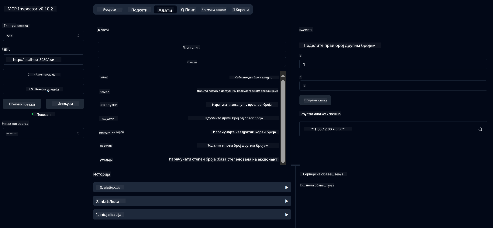

<!--
CO_OP_TRANSLATOR_METADATA:
{
  "original_hash": "13231e9951b68efd9df8c56bd5cdb27e",
  "translation_date": "2025-05-17T13:18:38+00:00",
  "source_file": "03-GettingStarted/samples/java/calculator/README.md",
  "language_code": "sr"
}
-->
# Osnovni Kalkulator MCP Servis

Ovaj servis pruža osnovne operacije kalkulatora putem Model Context Protocol (MCP) koristeći Spring Boot sa WebFlux transportom. Dizajniran je kao jednostavan primer za početnike koji uče o MCP implementacijama.

Za više informacija, pogledajte referentnu dokumentaciju [MCP Server Boot Starter](https://docs.spring.io/spring-ai/reference/api/mcp/mcp-server-boot-starter-docs.html).

## Pregled

Servis prikazuje:
- Podršku za SSE (Server-Sent Events)
- Automatsku registraciju alata koristeći Spring AI `@Tool` anotaciju
- Osnovne funkcije kalkulatora:
  - Sabiranje, oduzimanje, množenje, deljenje
  - Izračunavanje stepena i kvadratnog korena
  - Modulo (ostatak) i apsolutna vrednost
  - Funkcija pomoći za opise operacija

## Karakteristike

Ovaj kalkulator servis nudi sledeće mogućnosti:

1. **Osnovne aritmetičke operacije**:
   - Sabiranje dva broja
   - Oduzimanje jednog broja od drugog
   - Množenje dva broja
   - Deljenje jednog broja drugim (sa proverom deljenja nulom)

2. **Napredne operacije**:
   - Izračunavanje stepena (podizanje baze na eksponent)
   - Izračunavanje kvadratnog korena (sa proverom negativnog broja)
   - Izračunavanje modula (ostatka)
   - Izračunavanje apsolutne vrednosti

3. **Sistem pomoći**:
   - Ugrađena funkcija pomoći koja objašnjava sve dostupne operacije

## Korišćenje servisa

Servis izlaže sledeće API krajnje tačke putem MCP protokola:

- `add(a, b)`: Saberi dva broja
- `subtract(a, b)`: Oduzmi drugi broj od prvog
- `multiply(a, b)`: Pomnoži dva broja
- `divide(a, b)`: Podeli prvi broj drugim (sa proverom nule)
- `power(base, exponent)`: Izračunaj stepen broja
- `squareRoot(number)`: Izračunaj kvadratni koren (sa proverom negativnog broja)
- `modulus(a, b)`: Izračunaj ostatak pri deljenju
- `absolute(number)`: Izračunaj apsolutnu vrednost
- `help()`: Dobij informacije o dostupnim operacijama

## Test Klijent

Jednostavan test klijent je uključen u `com.microsoft.mcp.sample.client` paket. `SampleCalculatorClient` klasa demonstrira dostupne operacije kalkulator servisa.

## Korišćenje LangChain4j Klijenta

Projekat uključuje LangChain4j primer klijenta u `com.microsoft.mcp.sample.client.LangChain4jClient` koji pokazuje kako integrisati kalkulator servis sa LangChain4j i GitHub modelima:

### Preduslovi

1. **Postavljanje GitHub Tokena**:
   
   Da biste koristili GitHub-ove AI modele (kao što je phi-4), potrebno vam je GitHub personalni pristupni token:

   a. Idite na podešavanja vašeg GitHub naloga: https://github.com/settings/tokens
   
   b. Kliknite "Generate new token" → "Generate new token (classic)"
   
   c. Dajte svom tokenu opisno ime
   
   d. Izaberite sledeće opsege:
      - `repo` (Potpuna kontrola privatnih repozitorijuma)
      - `read:org` (Čitanje članstva u organizaciji i timu, čitanje projekata organizacije)
      - `gist` (Kreiranje gista)
      - `user:email` (Pristup korisničkim email adresama (samo za čitanje))
   
   e. Kliknite "Generate token" i kopirajte svoj novi token
   
   f. Postavite ga kao promenljivu okruženja:
      
      Na Windowsu:
      ```
      set GITHUB_TOKEN=your-github-token
      ```
      
      Na macOS/Linuxu:
      ```bash
      export GITHUB_TOKEN=your-github-token
      ```

   g. Za trajno postavljanje, dodajte ga u promenljive okruženja putem sistemskih podešavanja

2. Dodajte LangChain4j GitHub zavisnost u vaš projekat (već uključeno u pom.xml):
   ```xml
   <dependency>
       <groupId>dev.langchain4j</groupId>
       <artifactId>langchain4j-github</artifactId>
       <version>${langchain4j.version}</version>
   </dependency>
   ```

3. Osigurajte da kalkulator server radi na `localhost:8080`

### Pokretanje LangChain4j Klijenta

Ovaj primer demonstrira:
- Povezivanje sa kalkulator MCP serverom putem SSE transporta
- Korišćenje LangChain4j za kreiranje chat bota koji koristi kalkulator operacije
- Integracija sa GitHub AI modelima (sada koristi phi-4 model)

Klijent šalje sledeće uzorke upita da demonstrira funkcionalnost:
1. Izračunavanje zbira dva broja
2. Pronalaženje kvadratnog korena broja
3. Dobijanje informacija o dostupnim kalkulator operacijama

Pokrenite primer i proverite izlaz na konzoli da vidite kako AI model koristi kalkulator alate za odgovaranje na upite.

### Konfiguracija GitHub Modela

LangChain4j klijent je konfigurisan da koristi GitHub-ov phi-4 model sa sledećim podešavanjima:

```java
ChatLanguageModel model = GitHubChatModel.builder()
    .apiKey(System.getenv("GITHUB_TOKEN"))
    .timeout(Duration.ofSeconds(60))
    .modelName("phi-4")
    .logRequests(true)
    .logResponses(true)
    .build();
```

Da biste koristili različite GitHub modele, jednostavno promenite `modelName` parametar na drugi podržani model (npr. "claude-3-haiku-20240307", "llama-3-70b-8192", itd.).

## Zavisnosti

Projekat zahteva sledeće ključne zavisnosti:

```xml
<!-- For MCP Server -->
<dependency>
    <groupId>org.springframework.ai</groupId>
    <artifactId>spring-ai-starter-mcp-server-webflux</artifactId>
</dependency>

<!-- For LangChain4j integration -->
<dependency>
    <groupId>dev.langchain4j</groupId>
    <artifactId>langchain4j-mcp</artifactId>
    <version>${langchain4j.version}</version>
</dependency>

<!-- For GitHub models support -->
<dependency>
    <groupId>dev.langchain4j</groupId>
    <artifactId>langchain4j-github</artifactId>
    <version>${langchain4j.version}</version>
</dependency>
```

## Izgradnja Projekta

Izgradite projekat koristeći Maven:
```bash
./mvnw clean install -DskipTests
```

## Pokretanje Servera

### Korišćenje Jave

```bash
java -jar target/calculator-server-0.0.1-SNAPSHOT.jar
```

### Korišćenje MCP Inspectora

MCP Inspector je koristan alat za interakciju sa MCP servisima. Da biste ga koristili sa ovim kalkulator servisom:

1. **Instalirajte i pokrenite MCP Inspector** u novom terminal prozoru:
   ```bash
   npx @modelcontextprotocol/inspector
   ```

2. **Pristupite web UI** klikom na URL koji aplikacija prikazuje (obično http://localhost:6274)

3. **Konfigurišite konekciju**:
   - Postavite tip transporta na "SSE"
   - Postavite URL na SSE krajnju tačku vašeg servera: `http://localhost:8080/sse`
   - Kliknite "Connect"

4. **Koristite alate**:
   - Kliknite "List Tools" da vidite dostupne kalkulator operacije
   - Izaberite alat i kliknite "Run Tool" da izvršite operaciju



### Korišćenje Dockera

Projekat uključuje Dockerfile za kontejnerizovano postavljanje:

1. **Izgradite Docker sliku**:
   ```bash
   docker build -t calculator-mcp-service .
   ```

2. **Pokrenite Docker kontejner**:
   ```bash
   docker run -p 8080:8080 calculator-mcp-service
   ```

Ovo će:
- Izgraditi multi-stage Docker sliku sa Maven 3.9.9 i Eclipse Temurin 24 JDK
- Kreirati optimizovanu sliku kontejnera
- Izložiti servis na portu 8080
- Pokrenuti MCP kalkulator servis unutar kontejnera

Možete pristupiti servisu na `http://localhost:8080` kada kontejner radi.

## Rešavanje Problema

### Uobičajeni Problemi sa GitHub Tokenom

1. **Problemi sa dozvolama tokena**: Ako dobijete 403 Forbidden grešku, proverite da li vaš token ima ispravne dozvole kako je navedeno u preduslovima.

2. **Token nije pronađen**: Ako dobijete grešku "No API key found", osigurajte da je GITHUB_TOKEN promenljiva okruženja pravilno postavljena.

3. **Ograničenje brzine**: GitHub API ima ograničenja brzine. Ako naiđete na grešku ograničenja brzine (status kod 429), sačekajte nekoliko minuta pre nego što ponovo pokušate.

4. **Istek tokena**: GitHub tokeni mogu isteći. Ako dobijete greške autentikacije nakon nekog vremena, generišite novi token i ažurirajte svoju promenljivu okruženja.

Ako vam je potrebna dodatna pomoć, proverite [LangChain4j dokumentaciju](https://github.com/langchain4j/langchain4j) ili [GitHub API dokumentaciju](https://docs.github.com/en/rest).

**Одричање од одговорности**:  
Овај документ је преведен коришћењем услуге превођења вештачке интелигенције [Co-op Translator](https://github.com/Azure/co-op-translator). Иако се трудимо да обезбедимо тачност, молимо вас да имате у виду да аутоматски преводи могу садржати грешке или нетачности. Оригинални документ на његовом изворном језику треба сматрати меродавним извором. За критичне информације, препоручује се професионални људски превод. Нисмо одговорни за било каква погрешна разумевања или тумачења која могу настати услед коришћења овог превода.