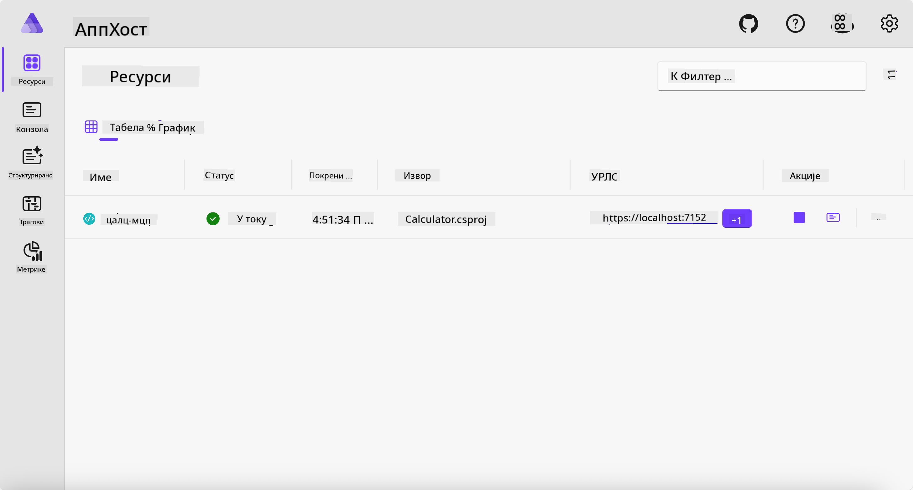
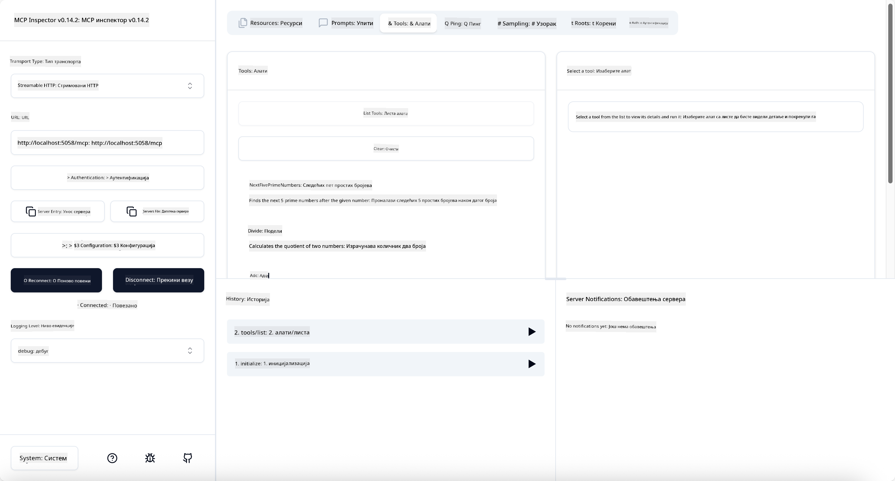

<!--
CO_OP_TRANSLATOR_METADATA:
{
  "original_hash": "0bc7bd48f55f1565f1d95ccb2c16f728",
  "translation_date": "2025-07-13T23:10:06+00:00",
  "source_file": "04-PracticalImplementation/samples/csharp/README.md",
  "language_code": "sr"
}
-->
# Пример

Претходни пример показује како користити локални .NET пројекат са типом `stdio`. И како покренути сервер локално у контејнеру. Ово је добро решење у многим ситуацијама. Међутим, може бити корисно да сервер ради удаљено, као у облачном окружењу. Ту долази до изражаја тип `http`.

Када погледате решење у фасцикли `04-PracticalImplementation`, може изгледати знатно сложеније од претходног. Али у стварности, није тако. Ако пажљиво погледате пројекат `src/Calculator`, видећете да је углавном исти код као у претходном примеру. Једина разлика је што користимо другу библиотеку `ModelContextProtocol.AspNetCore` за руковање HTTP захтевима. И мењамо методу `IsPrime` да буде приватна, само да покажемо да у коду можете имати приватне методе. Остатак кода је исти као раније.

Остали пројекти су из [.NET Aspire](https://learn.microsoft.com/dotnet/aspire/get-started/aspire-overview). Имати .NET Aspire у решењу побољшава искуство програмера током развоја и тестирања и помаже у посматрању система. Није обавезно за покретање сервера, али је добра пракса да га имате у свом решењу.

## Покрени сервер локално

1. У VS Code-у (са C# DevKit екстензијом), идите у директоријум `04-PracticalImplementation/samples/csharp`.
1. Покрените следећу команду да бисте стартовали сервер:

   ```bash
    dotnet watch run --project ./src/AppHost
   ```

1. Када веб прегледач отвори .NET Aspire контролну таблу, запамтите `http` URL. Требало би да буде нешто као `http://localhost:5058/`.

   

## Тестирање Streamable HTTP са MCP Inspector-ом

Ако имате Node.js верзију 22.7.5 или новију, можете користити MCP Inspector за тестирање вашег сервера.

Покрените сервер и у терминалу извршите следећу команду:

```bash
npx @modelcontextprotocol/inspector http://localhost:5058
```



- Изаберите `Streamable HTTP` као тип транспорта.
- У поље Url унесите URL сервера који сте раније запамтили и додајте `/mcp`. Требало би да буде `http` (не `https`), нешто као `http://localhost:5058/mcp`.
- Кликните на дугме Connect.

Добра ствар код Inspector-а је што пружа добру видљивост шта се дешава.

- Покушајте да набројите доступне алате
- Испробајте неке од њих, требало би да раде као и раније.

## Тестирање MCP сервера са GitHub Copilot Chat у VS Code-у

Да бисте користили Streamable HTTP транспорт са GitHub Copilot Chat-ом, промените конфигурацију сервера `calc-mcp` који сте раније креирали да изгледа овако:

```jsonc
// .vscode/mcp.json
{
  "servers": {
    "calc-mcp": {
      "type": "http",
      "url": "http://localhost:5058/mcp"
    }
  }
}
```

Урадите неке тестове:

- Питајте за "3 простa броја после 6780". Обратите пажњу како Copilot користи нове алате `NextFivePrimeNumbers` и враћа само прва 3 проста броја.
- Питајте за "7 простa броја после 111", да видите шта ће се десити.
- Питајте "Јован има 24 лизалице и жели да их подели на своје 3 деце. Колико лизалица сваки дете добија?", да видите резултат.

## Деплој сервера на Azure

Хајде да деплојујемо сервер на Azure како би више људи могло да га користи.

У терминалу идите у фасциклу `04-PracticalImplementation/samples/csharp` и покрените следећу команду:

```bash
azd up
```

Када се деплој заврши, требало би да видите поруку као ова:


Узмите URL и користите га у MCP Inspector-у и у GitHub Copilot Chat-у.

```jsonc
// .vscode/mcp.json
{
  "servers": {
    "calc-mcp": {
      "type": "http",
      "url": "https://calc-mcp.gentleriver-3977fbcf.australiaeast.azurecontainerapps.io/mcp"
    }
  }
}
```

## Шта следи?

Испробали смо различите типове транспорта и алате за тестирање. Такође смо деплојовали ваш MCP сервер на Azure. Али шта ако наш сервер треба приступ приватним ресурсима? На пример, бази података или приватном API-ју? У следећем поглављу ћемо видети како можемо побољшати безбедност нашег сервера.

**Одрицање од одговорности**:  
Овај документ је преведен коришћењем AI услуге за превођење [Co-op Translator](https://github.com/Azure/co-op-translator). Иако се трудимо да превод буде тачан, молимо вас да имате у виду да аутоматски преводи могу садржати грешке или нетачности. Оригинални документ на његовом изворном језику треба сматрати ауторитетним извором. За критичне информације препоручује се професионални људски превод. Нисмо одговорни за било каква неспоразума или погрешна тумачења која произилазе из коришћења овог превода.