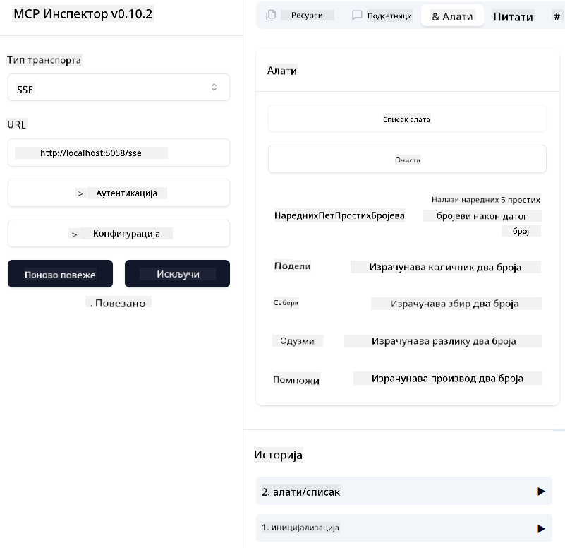
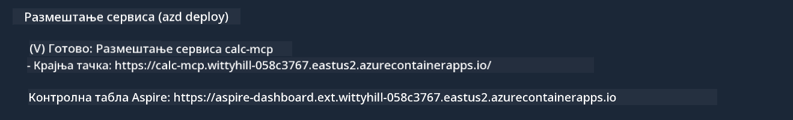

<!--
CO_OP_TRANSLATOR_METADATA:
{
  "original_hash": "5020a3e1a1c7f30c00f9e37f1fa208e3",
  "translation_date": "2025-05-17T14:12:51+00:00",
  "source_file": "04-PracticalImplementation/samples/csharp/README.md",
  "language_code": "sr"
}
-->
# Primer

Prethodni primer pokazuje kako koristiti lokalni .NET projekat sa `sdio` tipom. I kako pokrenuti server lokalno u kontejneru. Ovo je dobro rešenje u mnogim situacijama. Međutim, može biti korisno da server radi udaljeno, kao u okruženju oblaka. Tu dolazi `http` tip.

Gledajući rešenje u `04-PracticalImplementation` folderu, može izgledati mnogo složenije nego prethodno. Ali u stvarnosti, nije. Ako pažljivo pogledate projekat `src/mcpserver/mcpserver.csproj`, videćete da je uglavnom isti kod kao u prethodnom primeru. Jedina razlika je što koristimo drugu biblioteku `ModelContextProtocol.AspNetCore` za rukovanje HTTP zahtevima. I menjamo metodu `IsPrime` da bude privatna, samo da pokažemo da možete imati privatne metode u vašem kodu. Ostatak koda je isti kao pre.

Drugi projekti su iz [.NET Aspire](https://learn.microsoft.com/dotnet/aspire/get-started/aspire-overview). Imati .NET Aspire u rešenju će poboljšati iskustvo programera tokom razvoja i testiranja i pomoći sa preglednošću. Nije potrebno za pokretanje servera, ali je dobra praksa imati ga u vašem rešenju.

## Pokrenite server lokalno

1. Iz VS Code (sa C# DevKit ekstenzijom), otvorite rešenje `04-PracticalImplementation\samples\csharp\src\Calculator-chap4.sln`.
2. Pritisnite `F5` da pokrenete server. Trebalo bi da se otvori web pretraživač sa .NET Aspire kontrolnom tablom.

ili

1. Iz terminala, idite do foldera `04-PracticalImplementation\samples\csharp\src`
2. Izvršite sledeću komandu da pokrenete server:
   ```bash
    dotnet run --project .\AppHost
   ```

3. Sa kontrolne table, zabeležite `http` URL. Trebalo bi da bude nešto poput `http://localhost:5058/`.

## Test `SSE` sa ModelContext Protocol Inspector

Ako imate Node.js 22.7.5 i više, možete koristiti ModelContext Protocol Inspector za testiranje vašeg servera.

Pokrenite server i izvršite sledeću komandu u terminalu:

```bash
npx @modelcontextprotocol/inspector@latest
```



- Izaberite `SSE` as the Transport type. SSE stand for Server-Sent Events. 
- In the Url field, enter the URL of the server noted earlier,and append `/sse`. Trebalo bi da bude `http` (ne `https`) something like `http://localhost:5058/sse`.
- select the Connect button.

A nice thing about the Inspector is that it provide a nice visibility on what is happening.

- Try listing the availables tools
- Try some of them, it should works just like before.


## Test `SSE` with Github Copilot Chat in VS Code

To use the `SSE` transport with Github Copilot Chat, change the configuration of the `mcp-calc` server kreiran prethodno da izgleda ovako:

```json
"mcp-calc": {
    "type": "sse",
    "url": "http://localhost:5058/sse"
}
```

Uradite neke testove:
- Zatražite 3 prostih brojeva nakon 6780. Obratite pažnju kako Copilot koristi nove alate `NextFivePrimeNumbers` i vraća samo prve 3 prosta broja.
- Zatražite 7 prostih brojeva nakon 111, da vidite šta se dešava.

# Postavite server na Azure

Hajde da postavimo server na Azure da ga više ljudi može koristiti.

Iz terminala, idite do foldera `04-PracticalImplementation\samples\csharp\src` i pokrenite sledeću komandu:

```bash
azd init
```

Ovo će kreirati nekoliko fajlova lokalno da sačuva konfiguraciju Azure resursa i vašu infrastrukturu kao kod (IaC).

Zatim, pokrenite sledeću komandu da postavite server na Azure:

```bash
azd up
```

Kada se postavljanje završi, trebalo bi da vidite poruku kao ovu:



Idite do Aspire kontrolne table i zabeležite `HTTP` URL da ga koristite u MCP Inspector i u Github Copilot Chat.

## Šta dalje?

Probali smo različite tipove transporta, alate za testiranje i takođe postavili naš MCP server na Azure. Ali šta ako našem serveru treba pristup privatnim resursima? Na primer, bazi podataka ili privatnom API-ju? U sledećem poglavlju, videćemo kako možemo poboljšati sigurnost našeg servera.

**Одрицање од одговорности**:  
Овај документ је преведен коришћењем услуге вештачке интелигенције за превођење [Co-op Translator](https://github.com/Azure/co-op-translator). Иако се трудимо да обезбедимо тачност, молимо вас да будете свесни да аутоматизовани преводи могу садржати грешке или нетачности. Оригинални документ на свом изворном језику треба сматрати ауторитативним извором. За критичне информације, препоручује се професионални превод од стране људи. Не сносимо одговорност за било какве неспоразуме или погрешна тумачења која могу настати услед коришћења овог превода.