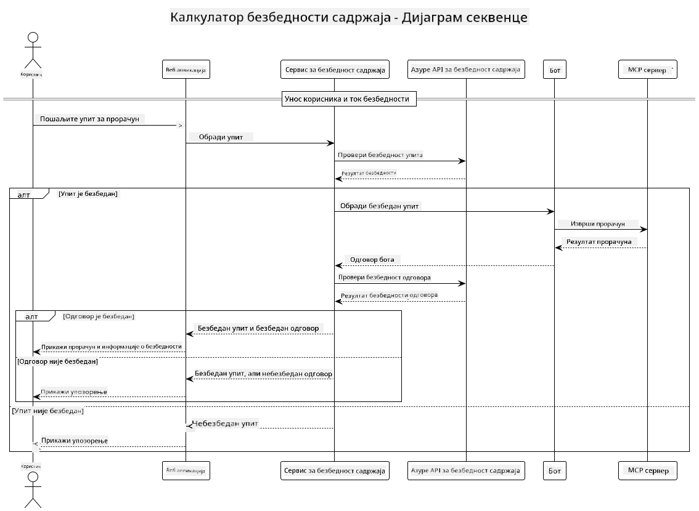

<!--
CO_OP_TRANSLATOR_METADATA:
{
  "original_hash": "e5ea5e7582f70008ea9bec3b3820f20a",
  "translation_date": "2025-05-17T14:32:29+00:00",
  "source_file": "04-PracticalImplementation/samples/java/containerapp/README.md",
  "language_code": "sr"
}
-->
## Arhitektura sistema

Ovaj projekat demonstrira veb aplikaciju koja koristi proveru bezbednosti sadržaja pre nego što korisničke zahteve prosledi kalkulator servisu putem Model Context Protocol (MCP).



### Kako funkcioniše

1. **Unos korisnika**: Korisnik unosi zahtev za računanje u veb interfejs
2. **Provera bezbednosti sadržaja (Unos)**: Zahtev se analizira putem Azure Content Safety API-ja
3. **Odluka o bezbednosti (Unos)**:
   - Ako je sadržaj bezbedan (stepen ozbiljnosti < 2 u svim kategorijama), prosleđuje se kalkulatoru
   - Ako je sadržaj označen kao potencijalno štetan, proces se zaustavlja i vraća se upozorenje
4. **Integracija kalkulatora**: Bezbedan sadržaj obrađuje LangChain4j, koji komunicira sa MCP serverom kalkulatora
5. **Provera bezbednosti sadržaja (Izlaz)**: Odgovor bota se analizira putem Azure Content Safety API-ja
6. **Odluka o bezbednosti (Izlaz)**:
   - Ako je odgovor bota bezbedan, prikazuje se korisniku
   - Ako je odgovor bota označen kao potencijalno štetan, zamenjuje se upozorenjem
7. **Odgovor**: Rezultati (ako su bezbedni) prikazuju se korisniku zajedno sa obe analize bezbednosti

## Korišćenje Model Context Protocol (MCP) sa kalkulator servisima

Ovaj projekat demonstrira kako koristiti Model Context Protocol (MCP) za pozivanje MCP servisa kalkulatora iz LangChain4j. Implementacija koristi lokalni MCP server koji radi na portu 8080 za pružanje operacija kalkulatora.

### Postavljanje Azure Content Safety servisa

Pre korišćenja funkcija bezbednosti sadržaja, potrebno je kreirati resurs za Azure Content Safety servis:

1. Prijavite se na [Azure Portal](https://portal.azure.com)
2. Kliknite na "Create a resource" i pretražite "Content Safety"
3. Izaberite "Content Safety" i kliknite "Create"
4. Unesite jedinstveno ime za vaš resurs
5. Izaberite vašu pretplatu i grupu resursa (ili kreirajte novu)
6. Izaberite podržani region (proverite [Dostupnost regiona](https://azure.microsoft.com/en-us/global-infrastructure/services/?products=cognitive-services) za detalje)
7. Izaberite odgovarajući nivo cena
8. Kliknite "Create" da biste rasporedili resurs
9. Kada je raspoređivanje završeno, kliknite "Go to resource"
10. U levom panelu, pod "Resource Management", izaberite "Keys and Endpoint"
11. Kopirajte jedan od ključeva i URL krajnje tačke za korišćenje u sledećem koraku

### Konfigurisanje promenljivih okruženja

Postavite `GITHUB_TOKEN` promenljivu okruženja za GitHub models autentifikaciju:
```sh
export GITHUB_TOKEN=<your_github_token>
```

Za funkcije bezbednosti sadržaja, postavite:
```sh
export CONTENT_SAFETY_ENDPOINT=<your_content_safety_endpoint>
export CONTENT_SAFETY_KEY=<your_content_safety_key>
```

Ove promenljive okruženja koristi aplikacija za autentifikaciju sa Azure Content Safety servisom. Ako ove promenljive nisu postavljene, aplikacija će koristiti vrednosti za demonstraciju, ali funkcije bezbednosti sadržaja neće raditi ispravno.

### Pokretanje MCP servera kalkulatora

Pre pokretanja klijenta, potrebno je pokrenuti MCP server kalkulatora u SSE modu na localhost:8080.

## Opis projekta

Ovaj projekat demonstrira integraciju Model Context Protocol (MCP) sa LangChain4j za pozivanje servisa kalkulatora. Ključne karakteristike uključuju:

- Korišćenje MCP-a za povezivanje sa servisom kalkulatora za osnovne matematičke operacije
- Dvoslojna provera bezbednosti sadržaja za korisničke zahteve i odgovore bota
- Integracija sa GitHub-ovim gpt-4.1-nano modelom putem LangChain4j
- Korišćenje Server-Sent Events (SSE) za MCP transport

## Integracija bezbednosti sadržaja

Projekat uključuje sveobuhvatne funkcije bezbednosti sadržaja kako bi osigurao da su i korisnički unosi i odgovori sistema bez štetnog sadržaja:

1. **Provera unosa**: Svi korisnički zahtevi se analiziraju za kategorije štetnog sadržaja kao što su govor mržnje, nasilje, samopovređivanje i seksualni sadržaj pre obrade.

2. **Provera izlaza**: Čak i kada se koriste potencijalno necenzurisani modeli, sistem proverava sve generisane odgovore kroz iste filtere bezbednosti sadržaja pre nego što ih prikaže korisniku.

Ovaj dvoslojni pristup osigurava da sistem ostaje bezbedan bez obzira na to koji AI model se koristi, štiteći korisnike od štetnih unosa i potencijalno problematičnih AI generisanih izlaza.

## Veb klijent

Aplikacija uključuje korisnički prijateljski veb interfejs koji omogućava korisnicima da interaguju sa sistemom Kalkulator bezbednosti sadržaja:

### Karakteristike veb interfejsa

- Jednostavan, intuitivan obrazac za unos zahteva za računanje
- Dvoslojna validacija bezbednosti sadržaja (unos i izlaz)
- Povratne informacije u realnom vremenu o bezbednosti zahteva i odgovora
- Oznake bezbednosti u boji za lako tumačenje
- Čist, responzivan dizajn koji radi na raznim uređajima
- Primeri bezbednih zahteva za vođenje korisnika

### Korišćenje veb klijenta

1. Pokrenite aplikaciju:
   ```sh
   mvn spring-boot:run
   ```

2. Otvorite vaš pretraživač i idite na `http://localhost:8087`

3. Unesite zahtev za računanje u predviđeno polje za tekst (npr. "Izračunaj zbir 24.5 i 17.3")

4. Kliknite "Submit" da obradite vaš zahtev

5. Pogledajte rezultate, koji će uključivati:
   - Analizu bezbednosti sadržaja vašeg zahteva
   - Izračunati rezultat (ako je zahtev bio bezbedan)
   - Analizu bezbednosti sadržaja odgovora bota
   - Bilo kakva upozorenja o bezbednosti ako su unos ili izlaz bili označeni

Veb klijent automatski upravlja oba procesa verifikacije bezbednosti sadržaja, osiguravajući da su sve interakcije bezbedne i prikladne bez obzira na to koji AI model se koristi.

**Одрицање од одговорности**:  
Овај документ је преведен коришћењем услуге за превођење помоћу вештачке интелигенције [Co-op Translator](https://github.com/Azure/co-op-translator). Иако се трудимо да обезбедимо тачност, молимо вас да будете свесни да аутоматизовани преводи могу садржати грешке или нетачности. Оригинални документ на његовом изворном језику треба сматрати меродавним извором. За критичне информације, препоручује се професионални људски превод. Не сносимо одговорност за било каква погрешна схватања или погрешне интерпретације које могу произаћи из коришћења овог превода.