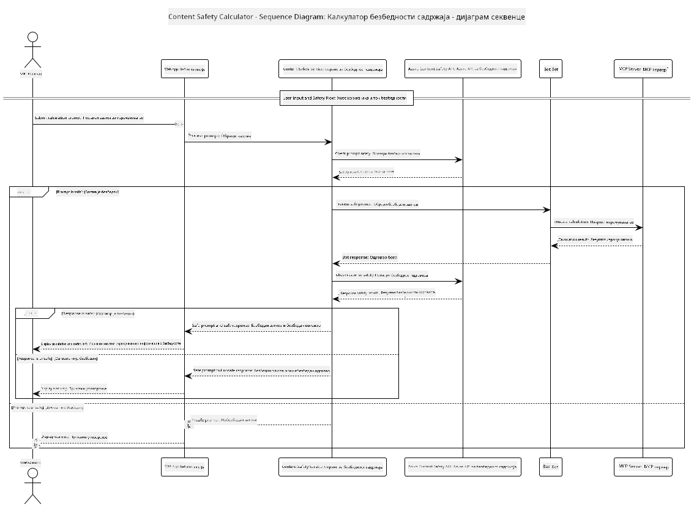

<!--
CO_OP_TRANSLATOR_METADATA:
{
  "original_hash": "e5ea5e7582f70008ea9bec3b3820f20a",
  "translation_date": "2025-07-13T23:20:30+00:00",
  "source_file": "04-PracticalImplementation/samples/java/containerapp/README.md",
  "language_code": "sr"
}
-->
## Архитектура система

Овај пројекат демонстрира веб апликацију која користи проверу безбедности садржаја пре него што проследи корисничке упите ка сервису калкулатора преко Model Context Protocol (MCP).



### Како функционише

1. **Кориснички унос**: Корисник уноси упит за израчунавање у веб интерфејсу  
2. **Провера безбедности садржаја (унос)**: Упит се анализира помоћу Azure Content Safety API  
3. **Одлука о безбедности (унос)**:  
   - Ако је садржај безбедан (озбиљност < 2 у свим категоријама), прослеђује се калкулатору  
   - Ако је садржај означен као потенцијално штетан, процес се зауставља и враћа упозорење  
4. **Интеграција калкулатора**: Безбедан садржај обрађује LangChain4j, који комуницира са MCP калкулатор сервером  
5. **Провера безбедности садржаја (излаз)**: Одговор бота се анализира помоћу Azure Content Safety API  
6. **Одлука о безбедности (излаз)**:  
   - Ако је одговор бота безбедан, приказује се кориснику  
   - Ако је одговор бота означен као потенцијално штетан, замењује се упозорењем  
7. **Одговор**: Резултати (ако су безбедни) се приказују кориснику заједно са обе анализе безбедности

## Коришћење Model Context Protocol (MCP) са сервисима калкулатора

Овај пројекат показује како користити Model Context Protocol (MCP) за позивање MCP сервиса калкулатора из LangChain4j. Имплементација користи локални MCP сервер који ради на порту 8080 за пружање калкулаторских операција.

### Подешавање Azure Content Safety сервиса

Пре коришћења функција безбедности садржаја, потребно је да креирате Azure Content Safety ресурс:

1. Пријавите се на [Azure Portal](https://portal.azure.com)  
2. Кликните на "Create a resource" и потражите "Content Safety"  
3. Изаберите "Content Safety" и кликните "Create"  
4. Унесите јединствено име за ваш ресурс  
5. Изаберите вашу претплату и групу ресурса (или креирајте нову)  
6. Изаберите подржани регион (погледајте [Region availability](https://azure.microsoft.com/en-us/global-infrastructure/services/?products=cognitive-services) за детаље)  
7. Изаберите одговарајући ниво цене  
8. Кликните "Create" да бисте покренули ресурс  
9. Када се имплементација заврши, кликните "Go to resource"  
10. У левом менију, под "Resource Management", изаберите "Keys and Endpoint"  
11. Копирајте један од кључева и URL крајње тачке за коришћење у следећем кораку

### Конфигурисање променљивих окружења

Подесите `GITHUB_TOKEN` променљиву окружења за аутентификацију GitHub модела:  
```sh
export GITHUB_TOKEN=<your_github_token>
```

За функције безбедности садржаја, подесите:  
```sh
export CONTENT_SAFETY_ENDPOINT=<your_content_safety_endpoint>
export CONTENT_SAFETY_KEY=<your_content_safety_key>
```

Ове променљиве окружења користи апликација за аутентификацију са Azure Content Safety сервисом. Ако ове променљиве нису подешене, апликација ће користити замене за демонстрацију, али функције безбедности садржаја неће радити исправно.

### Покретање MCP сервера калкулатора

Пре покретања клијента, потребно је покренути MCP сервер калкулатора у SSE режиму на localhost:8080.

## Опис пројекта

Овај пројекат демонстрира интеграцију Model Context Protocol (MCP) са LangChain4j за позивање калкулаторских сервиса. Кључне карактеристике укључују:

- Коришћење MCP за повезивање са сервисом калкулатора за основне математичке операције  
- Двострука провера безбедности садржаја на корисничким упитима и одговорима бота  
- Интеграција са GitHub-овим gpt-4.1-nano моделом преко LangChain4j  
- Коришћење Server-Sent Events (SSE) за MCP транспорт

## Интеграција безбедности садржаја

Пројекат укључује свеобухватне функције безбедности садржаја како би се осигурало да су и кориснички уноси и системски одговори без штетног садржаја:

1. **Провера уноса**: Сви кориснички упити се анализирају на категорије штетног садржаја као што су говор мржње, насиље, самоповређивање и сексуални садржај пре обраде.

2. **Провера излаза**: Чак и када се користе потенцијално неконтролисани модели, систем проверава све генерисане одговоре кроз исте филтере безбедности садржаја пре приказивања кориснику.

Ова двострука провера осигурава да систем остане безбедан без обзира који AI модел се користи, штитећи кориснике од штетних уноса и потенцијално проблематичних AI генерисаних одговора.

## Веб клијент

Апликација укључује кориснички пријатељски веб интерфејс који омогућава интеракцију са системом Content Safety Calculator:

### Карактеристике веб интерфејса

- Једноставан и интуитиван формулар за унос упита за израчунавање  
- Двострука провера безбедности садржаја (унос и излаз)  
- Повратне информације у реалном времену о безбедности упита и одговора  
- Боје као индикатори безбедности за лакше разумевање  
- Чист и прилагодљив дизајн који ради на различитим уређајима  
- Примери безбедних упита као смернице за кориснике

### Коришћење веб клијента

1. Покрените апликацију:  
   ```sh
   mvn spring-boot:run
   ```

2. Отворите прегледач и идите на `http://localhost:8087`

3. Унесите упит за израчунавање у предвиђено поље (нпр. "Израчунај збир 24.5 и 17.3")

4. Кликните "Submit" да бисте обрадили захтев

5. Погледајте резултате, који укључују:  
   - Анализу безбедности вашег упита  
   - Израчунати резултат (ако је упит био безбедан)  
   - Анализу безбедности одговора бота  
   - Сва упозорења о безбедности ако је унос или излаз означен

Веб клијент аутоматски обрађује оба процеса провере безбедности садржаја, осигуравајући да су све интеракције безбедне и прикладне без обзира који AI модел се користи.

**Одрицање од одговорности**:  
Овај документ је преведен коришћењем AI преводилачке услуге [Co-op Translator](https://github.com/Azure/co-op-translator). Иако се трудимо да превод буде тачан, молимо вас да имате у виду да аутоматски преводи могу садржати грешке или нетачности. Оригинални документ на његовом изворном језику треба сматрати ауторитетним извором. За критичне информације препоручује се професионални људски превод. Нисмо одговорни за било каква неспоразума или погрешна тумачења која произилазе из коришћења овог превода.