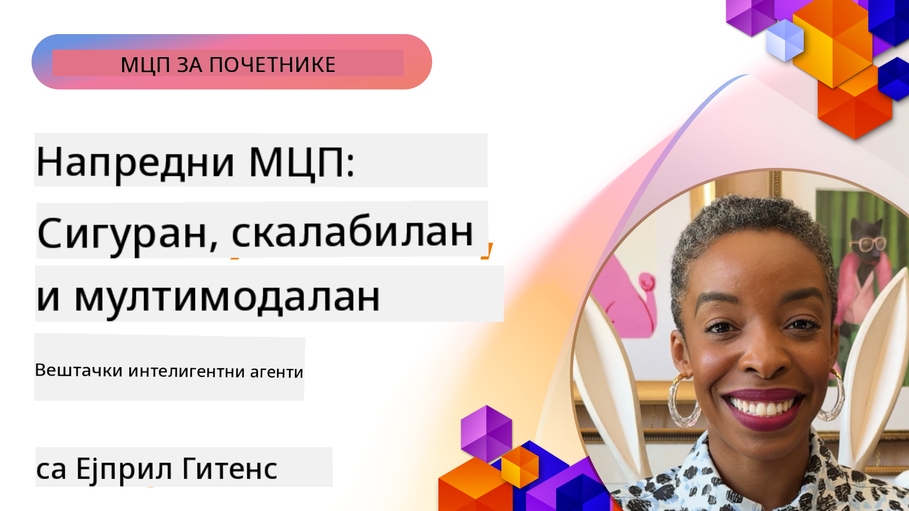

<!--
CO_OP_TRANSLATOR_METADATA:
{
  "original_hash": "d204bc94ea6027d06a703b21b711ca57",
  "translation_date": "2025-08-19T17:19:32+00:00",
  "source_file": "05-AdvancedTopics/README.md",
  "language_code": "sr"
}
-->
# Напредне теме у MCP

_(Кликните на слику изнад да бисте погледали видео лекцију)_

Ово поглавље обухвата низ напредних тема у имплементацији Model Context Protocol (MCP), укључујући мултимодалну интеграцију, скалабилност, најбоље праксе за безбедност и интеграцију у предузећима. Ове теме су кључне за изградњу робусних и продукцијски спремних MCP апликација које могу задовољити захтеве савремених AI система.

## Преглед

Ова лекција истражује напредне концепте у имплементацији Model Context Protocol-а, са фокусом на мултимодалну интеграцију, скалабилност, најбоље праксе за безбедност и интеграцију у предузећима. Ове теме су од суштинског значаја за изградњу продукцијских MCP апликација које могу да обрађују сложене захтеве у корпоративним окружењима.

## Циљеви учења

На крају ове лекције, моћи ћете да:

- Имплементирате мултимодалне могућности у MCP оквирима
- Дизајнирате скалабилне MCP архитектуре за сценарије са великим оптерећењем
- Примените најбоље праксе за безбедност у складу са MCP принципима безбедности
- Интегришете MCP са корпоративним AI системима и оквирима
- Оптимизујете перформансе и поузданост у продукцијским окружењима

## Лекције и пример пројекти

| Линк | Наслов | Опис |
|------|-------|-------------|
| [5.1 Интеграција са Azure](./mcp-integration/README.md) | Интеграција са Azure | Научите како да интегришете ваш MCP сервер на Azure |
| [5.2 Мултимодални пример](./mcp-multi-modality/README.md) | MCP мултимодални примери | Примери за аудио, слике и мултимодални одговор |
| [5.3 MCP OAuth2 пример](../../../05-AdvancedTopics/mcp-oauth2-demo) | MCP OAuth2 демонстрација | Минимална Spring Boot апликација која приказује OAuth2 са MCP, као сервер за ауторизацију и ресурс. Демонстрира издавање сигурних токена, заштићене крајње тачке, Azure Container Apps деплојмент и интеграцију API Management-а. |
| [5.4 Root Contexts](./mcp-root-contexts/README.md) | Root контексти | Сазнајте више о root контекстима и како да их имплементирате |
| [5.5 Рутање](./mcp-routing/README.md) | Рутање | Научите различите типове рутања |
| [5.6 Узорковање](./mcp-sampling/README.md) | Узорковање | Научите како да радите са узорковањем |
| [5.7 Скалабилност](./mcp-scaling/README.md) | Скалабилност | Сазнајте више о скалабилности |
| [5.8 Безбедност](./mcp-security/README.md) | Безбедност | Заштитите ваш MCP сервер |
| [5.9 MCP за претрагу веба](./web-search-mcp/README.md) | MCP претрага веба | Python MCP сервер и клијент који се интегришу са SerpAPI за претрагу веба, вести, производа и Q&A у реалном времену. Демонстрира оркестрацију више алата, интеграцију спољних API-ја и робусно руковање грешкама. |
| [5.10 Стриминг у реалном времену](./mcp-realtimestreaming/README.md) | Стриминг | Стриминг података у реалном времену постао је неопходан у данашњем свету вођеном подацима, где предузећа и апликације захтевају тренутни приступ информацијама за доношење благовремених одлука. |
| [5.11 Претрага веба у реалном времену](./mcp-realtimesearch/README.md) | Претрага веба | MCP трансформише претрагу веба у реалном времену пружајући стандардизовани приступ управљању контекстом између AI модела, претраживача и апликација. |
| [5.12 Entra ID аутентикација за MCP сервере](./mcp-security-entra/README.md) | Entra ID аутентикација | Microsoft Entra ID пружа робусно решење за управљање идентитетом и приступом у облаку, помажући да се осигура да само овлашћени корисници и апликације могу да комуницирају са вашим MCP сервером. |
| [5.13 Интеграција Azure AI Foundry агента](./mcp-foundry-agent-integration/README.md) | Интеграција Azure AI Foundry | Научите како да интегришете MCP сервере са Azure AI Foundry агентима, омогућавајући моћну оркестрацију алата и корпоративне AI могућности са стандардизованим спољним изворима података. |
| [5.14 Инжењеринг контекста](./mcp-contextengineering/README.md) | Инжењеринг контекста | Будуће могућности техника инжењеринга контекста за MCP сервере, укључујући оптимизацију контекста, динамичко управљање контекстом и стратегије за ефикасно креирање упита у MCP оквирима. |

## Додатне референце

За најновије информације о напредним MCP темама, погледајте:
- [MCP документација](https://modelcontextprotocol.io/)
- [MCP спецификација](https://spec.modelcontextprotocol.io/)
- [GitHub репозиторијум](https://github.com/modelcontextprotocol)

## Кључни закључци

- Мултимодалне MCP имплементације проширују AI могућности изван обраде текста
- Скалабилност је од суштинског значаја за корпоративне деплојменте и може се постићи кроз хоризонтално и вертикално скалирање
- Свеобухватне мере безбедности штите податке и обезбеђују правилну контролу приступа
- Интеграција у предузећима са платформама као што су Azure OpenAI и Microsoft AI Foundry побољшава MCP могућности
- Напредне MCP имплементације имају користи од оптимизованих архитектура и пажљивог управљања ресурсима

## Вежба

Дизајнирајте MCP имплементацију на нивоу предузећа за одређени случај употребе:

1. Идентификујте мултимодалне захтеве за ваш случај употребе
2. Наведите контроле безбедности потребне за заштиту осетљивих података
3. Дизајнирајте скалабилну архитектуру која може да обрађује променљиво оптерећење
4. Планирајте тачке интеграције са корпоративним AI системима
5. Документујте потенцијалне уске грла у перформансама и стратегије за њихово ублажавање

## Додатни ресурси

- [Azure OpenAI документација](https://learn.microsoft.com/en-us/azure/ai-services/openai/)
- [Microsoft AI Foundry документација](https://learn.microsoft.com/en-us/ai-services/)

---

## Шта следи

- [5.1 MCP интеграција](./mcp-integration/README.md)

**Одрицање од одговорности**:  
Овај документ је преведен коришћењем услуге за превођење помоћу вештачке интелигенције [Co-op Translator](https://github.com/Azure/co-op-translator). Иако се трудимо да обезбедимо тачност, молимо вас да имате у виду да аутоматски преводи могу садржати грешке или нетачности. Оригинални документ на његовом изворном језику треба сматрати меродавним извором. За критичне информације препоручује се професионални превод од стране људи. Не преузимамо одговорност за било каква погрешна тумачења или неспоразуме који могу настати услед коришћења овог превода.