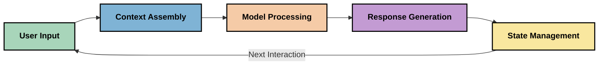
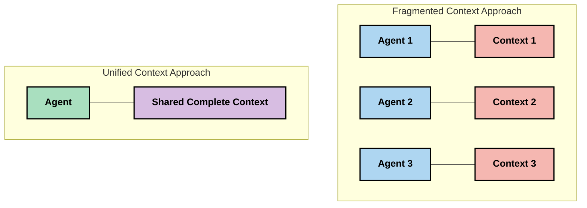
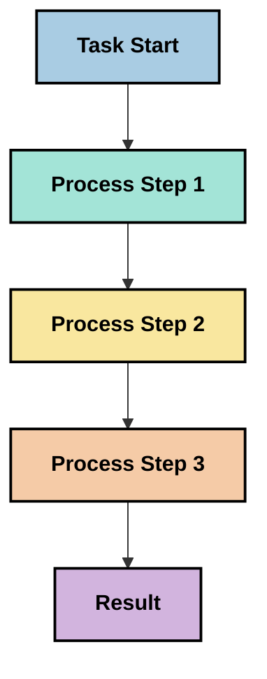
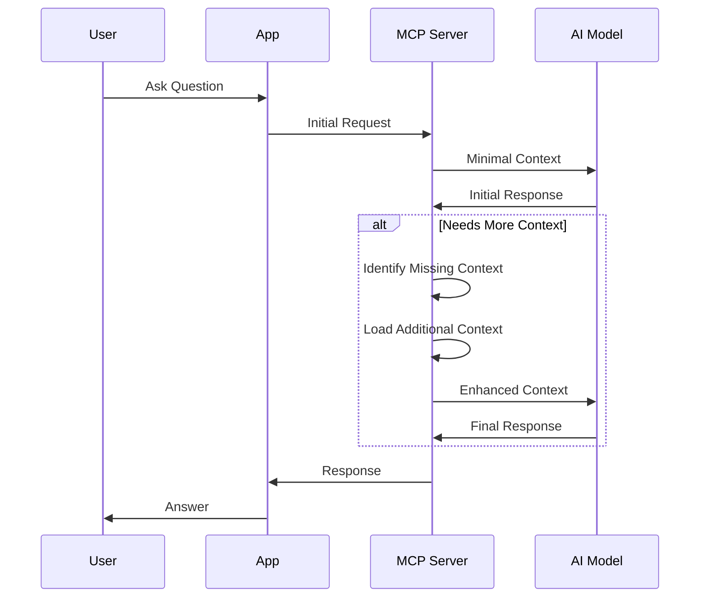
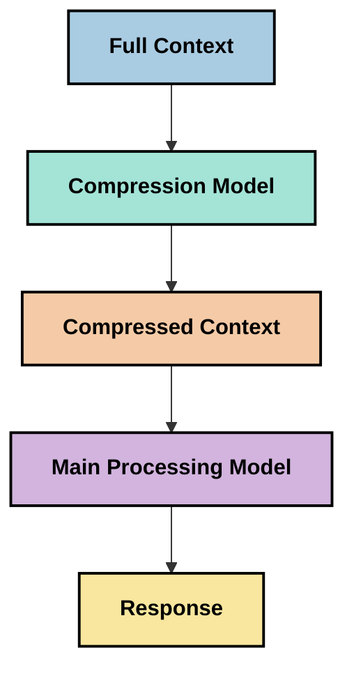

<!--
CO_OP_TRANSLATOR_METADATA:
{
  "original_hash": "fd169ca3071b81b5ee282e194bc823df",
  "translation_date": "2025-09-15T21:12:07+00:00",
  "source_file": "05-AdvancedTopics/mcp-contextengineering/README.md",
  "language_code": "sr"
}
-->
# Контекстно инжењерство: Нови концепт у MCP екосистему

## Преглед

Контекстно инжењерство је нови концепт у области вештачке интелигенције који истражује како се информације структуирају, достављају и одржавају током интеракција између клијената и AI услуга. Како се екосистем Model Context Protocol (MCP) развија, разумевање ефикасног управљања контекстом постаје све важније. Овај модул уводи концепт контекстног инжењерства и истражује његове потенцијалне примене у MCP имплементацијама.

## Циљеви учења

На крају овог модула, моћи ћете да:

- Разумете нови концепт контекстног инжењерства и његову потенцијалну улогу у MCP апликацијама
- Идентификујете кључне изазове у управљању контекстом које MCP протокол решава
- Истражите технике за побољшање перформанси модела кроз боље управљање контекстом
- Размотрите приступе за мерење и процену ефикасности контекста
- Примените ове нове концепте за побољшање AI искустава кроз MCP оквир

## Увод у контекстно инжењерство

Контекстно инжењерство је нови концепт који се фокусира на намерно дизајнирање и управљање током информација између корисника, апликација и AI модела. За разлику од утврђених области као што је prompt engineering, контекстно инжењерство је још увек у процесу дефинисања од стране практичара који раде на решавању јединствених изазова у пружању AI моделима правих информација у правом тренутку.

Како су велики језички модели (LLMs) еволуирали, важност контекста постала је све очигледнија. Квалитет, релевантност и структура контекста који пружамо директно утичу на излаз модела. Контекстно инжењерство истражује овај однос и настоји да развије принципе за ефикасно управљање контекстом.

> "У 2025. години, модели који постоје су изузетно интелигентни. Али чак ни најпаметнији човек неће моћи ефикасно да ради свој посао без контекста онога што се од њега тражи... 'Контекстно инжењерство' је следећи ниво prompt engineering-а. Ради се о томе да се ово ради аутоматски у динамичком систему." — Волден Јан, Cognition AI

Контекстно инжењерство може обухватати:

1. **Избор контекста**: Одређивање које су информације релевантне за одређени задатак
2. **Структурирање контекста**: Организовање информација ради максималног разумевања модела
3. **Достава контекста**: Оптимизација начина и времена слања информација моделима
4. **Одржавање контекста**: Управљање стањем и еволуцијом контекста током времена
5. **Евалуација контекста**: Мерење и побољшање ефикасности контекста

Ове области фокуса су посебно релевантне за MCP екосистем, који пружа стандардизован начин за апликације да пруже контекст LLM-овима.

## Перспектива путовања контекста

Један од начина да се визуализује контекстно инжењерство је праћење пута који информације пролазе кроз MCP систем:



### Кључне фазе у путовању контекста:

1. **Кориснички унос**: Сирове информације од корисника (текст, слике, документи)
2. **Састављање контекста**: Комбинација корисничког уноса са системским контекстом, историјом разговора и другим преузетим информацијама
3. **Обрада модела**: AI модел обрађује састављени контекст
4. **Генерисање одговора**: Модел производи излазе на основу пруженог контекста
5. **Управљање стањем**: Систем ажурира своје унутрашње стање на основу интеракције

Ова перспектива истиче динамичну природу контекста у AI системима и поставља важна питања о томе како најбоље управљати информацијама у свакој фази.

## Нови принципи у контекстном инжењерству

Како се област контекстног инжењерства обликује, неки рани принципи почињу да се појављују међу практичарима. Ови принципи могу помоћи у доношењу одлука о MCP имплементацији:

### Принцип 1: Делите контекст потпуно

Контекст треба да се дели потпуно између свих компоненти система, а не да буде фрагментисан међу више агената или процеса. Када је контекст распршен, одлуке донете у једном делу система могу бити у сукобу са одлукама донетим другде.



У MCP апликацијама, ово сугерише дизајнирање система где контекст тече беспрекорно кроз целу линију, а не да буде раздвојен.

### Принцип 2: Препознајте да акције носе имплицитне одлуке

Свака акција коју модел предузме садржи имплицитне одлуке о томе како тумачити контекст. Када више компоненти делује на различитим контекстима, ове имплицитне одлуке могу бити у сукобу, што доводи до недоследних резултата.

Овај принцип има важне импликације за MCP апликације:
- Преферирајте линеарну обраду сложених задатака уместо паралелног извршења са фрагментираним контекстом
- Осигурајте да све тачке одлучивања имају приступ истим контекстуалним информацијама
- Дизајнирајте системе где каснији кораци могу видети комплетан контекст ранијих одлука

### Принцип 3: Ускладите дубину контекста са ограничењима прозора

Како разговори и процеси постају дужи, прозори контекста на крају постају препуни. Ефикасно контекстно инжењерство истражује приступе за управљање овом тензијом између свеобухватног контекста и техничких ограничења.

Потенцијални приступи који се истражују укључују:
- Компресију контекста која задржава суштинске информације уз смањење употребе токена
- Прогресивно учитавање контекста на основу релевантности за тренутне потребе
- Сажимање претходних интеракција уз очување кључних одлука и чињеница

## Изазови контекста и MCP протокол

Model Context Protocol (MCP) је дизајниран са свешћу о јединственим изазовима управљања контекстом. Разумевање ових изазова помаже у објашњавању кључних аспеката MCP протокола:

### Изазов 1: Ограничења прозора контекста
Већина AI модела има фиксне величине прозора контекста, што ограничава количину информација које могу обрадити одједном.

**Одговор MCP дизајна:** 
- Протокол подржава структуриран, ресурсно базиран контекст који се може ефикасно реферисати
- Ресурси се могу пагинирати и учитавати прогресивно

### Изазов 2: Одређивање релевантности
Тешко је одредити које су информације најрелевантније за укључивање у контекст.

**Одговор MCP дизајна:**
- Флексибилни алати омогућавају динамично преузимање информација на основу потребе
- Структурирани упити омогућавају конзистентну организацију контекста

### Изазов 3: Перзистенција контекста
Управљање стањем кроз интеракције захтева пажљиво праћење контекста.

**Одговор MCP дизајна:**
- Стандардизовано управљање сесијама
- Јасно дефинисани обрасци интеракције за еволуцију контекста

### Изазов 4: Мултимодални контекст
Различите врсте података (текст, слике, структурирани подаци) захтевају различито руковање.

**Одговор MCP дизајна:**
- Дизајн протокола прилагођава различите типове садржаја
- Стандардизована репрезентација мултимодалних информација

### Изазов 5: Безбедност и приватност
Контекст често садржи осетљиве информације које морају бити заштићене.

**Одговор MCP дизајна:**
- Јасне границе између одговорности клијента и сервера
- Опције локалне обраде за минимизирање изложености података

Разумевање ових изазова и како MCP одговара на њих пружа основу за истраживање напреднијих техника контекстног инжењерства.

## Нови приступи у контекстном инжењерству

Како се област контекстног инжењерства развија, појављују се неколико обећавајућих приступа. Они представљају тренутно размишљање, а не утврђене најбоље праксе, и вероватно ће се развијати како стичемо више искуства са MCP имплементацијама.

### 1. Линеарна обрада у једном току

За разлику од архитектура са више агената које расподељују контекст, неки практичари откривају да линеарна обрада у једном току производи конзистентније резултате. Ово је у складу са принципом одржавања јединственог контекста.



Иако овај приступ може изгледати мање ефикасан од паралелне обраде, често производи кохерентније и поузданије резултате јер сваки корак гради на потпуном разумевању претходних одлука.

### 2. Чанковање и приоритизација контекста

Разбијање великих контекста на управљиве делове и приоритизација онога што је најважније.

```python
# Conceptual Example: Context Chunking and Prioritization
def process_with_chunked_context(documents, query):
    # 1. Break documents into smaller chunks
    chunks = chunk_documents(documents)
    
    # 2. Calculate relevance scores for each chunk
    scored_chunks = [(chunk, calculate_relevance(chunk, query)) for chunk in chunks]
    
    # 3. Sort chunks by relevance score
    sorted_chunks = sorted(scored_chunks, key=lambda x: x[1], reverse=True)
    
    # 4. Use the most relevant chunks as context
    context = create_context_from_chunks([chunk for chunk, score in sorted_chunks[:5]])
    
    # 5. Process with the prioritized context
    return generate_response(context, query)
```

Горњи концепт илуструје како можемо разбити велике документе на управљиве делове и изабрати само најрелевантније делове за контекст. Овај приступ може помоћи у раду унутар ограничења прозора контекста, а истовремено искористити велике базе знања.

### 3. Прогресивно учитавање контекста

Учитавање контекста прогресивно, по потреби, уместо одједном.



Прогресивно учитавање контекста започиње са минималним контекстом и проширује се само када је потребно. Ово може значајно смањити употребу токена за једноставне упите, а истовремено задржати способност да се обрађују сложена питања.

### 4. Компресија и сажимање контекста

Смањење величине контекста уз очување суштинских информација.



Компресија контекста се фокусира на:
- Уклањање сувишних информација
- Сажимање дугог садржаја
- Извлачење кључних чињеница и детаља
- Очување критичних елемената контекста
- Оптимизацију за ефикасност токена

Овај приступ може бити посебно вредан за одржавање дугих разговора унутар прозора контекста или за ефикасну обраду великих докумената. Неки практичари користе специјализоване моделе посебно за компресију контекста и сажимање историје разговора.

## Истраживачке разматрања у контекстном инжењерству

Док истражујемо нову област контекстног инжењерства, неколико разматрања вреди имати на уму приликом рада са MCP имплементацијама. Ово нису прописане најбоље праксе, већ области истраживања које могу донети побољшања у вашем специфичном случају употребе.

### Размотрите своје циљеве контекста

Пре имплементације сложених решења за управљање контекстом, јасно дефинишите шта желите да постигнете:
- Које специфичне информације модел треба да би био успешан?
- Које информације су суштинске, а које допунске?
- Која су ваша ограничења перформанси (кашњење, ограничења токена, трошкови)?

### Истражите слојевите приступе контексту

Неки практичари налазе успех са контекстом организованим у концептуалне слојеве:
- **Језгро слој**: Суштинске информације које модел увек треба
- **Ситуациони слој**: Контекст специфичан за тренутну интеракцију
- **Подржавајући слој**: Додатне информације које могу бити корисне
- **Резервни слој**: Информације које се приступају само када су потребне

### Истражите стратегије преузимања

Ефикасност вашег контекста често зависи од начина на који преузимате информације:
- Семантичка претрага и уградње за проналажење концептуално релевантних информација
- Претрага заснована на кључним речима за специфичне чињеничне детаље
- Хибридни приступи који комбинују више метода преузимања
- Филтрирање метаподатака за сужење обима на основу категорија, датума или извора

### Експериментишите са кохеренцијом контекста

Структура и ток вашег контекста могу утицати на разумевање модела:
- Груписање повезаних информација заједно
- Коришћење конзистентног форматирања и организације
- Одржавање логичког или хронолошког редоследа где је прикладно
- Избегавање контрадикторних информација

### Одмерите компромисе архитектура са више агената

Иако су архитектуре са више агената популарне у многим AI оквирима, оне долазе са значајним изазовима за управљање контекстом:
- Фрагментација контекста може довести до недоследних одлука међу агентима
- Паралелна обрада може увести конфликте које је тешко помирити
- Трошкови комуникације између агената могу надокнадити добитке у перформансама
- Комплексно управљање стањем је потребно за одржавање кохеренције

У многим случајевима, приступ са једним агентом уз свеобухватно управљање контекстом може произвести поузданије резултате од више специјализованих агената са фрагментираним контекстом.

### Развијте методе евалуације

Да бисте побољшали контекстно инжењерство током времена, размотрите како ћете мерити успех:
- A/B тестирање различитих структура контекста
- Праћење употребе токена и времена одговора
- Праћење задовољства корисника и стопе завршетка задатака
- Анализа када и зашто стратегије контекста не успевају

Ова разматрања представљају активне области истраживања у простору контекстног инжењерства. Како се област развија, вероватно ће се појавити дефинитивнији обрасци и праксе.

## Мерење е
- [Model Context Protocol Website](https://modelcontextprotocol.io/)
- [Model Context Protocol Specification](https://github.com/modelcontextprotocol/modelcontextprotocol)
- [MCP Documentation](https://modelcontextprotocol.io/docs)
- [MCP C# SDK](https://github.com/modelcontextprotocol/csharp-sdk)
- [MCP Python SDK](https://github.com/modelcontextprotocol/python-sdk)
- [MCP TypeScript SDK](https://github.com/modelcontextprotocol/typescript-sdk)
- [MCP Inspector](https://github.com/modelcontextprotocol/inspector) - Визуелни алат за тестирање MCP сервера

### Чланци о инжењерингу контекста
- [Не правите мулти-агенте: Принципи инжењеринга контекста](https://cognition.ai/blog/dont-build-multi-agents) - Увид Валдена Јана у принципе инжењеринга контекста
- [Практични водич за прављење агената](https://cdn.openai.com/business-guides-and-resources/a-practical-guide-to-building-agents.pdf) - Водич OpenAI-а за ефикасан дизајн агената
- [Прављење ефикасних агената](https://www.anthropic.com/engineering/building-effective-agents) - Приступ компаније Anthropic развоју агената

### Повезана истраживања
- [Динамичко допуњавање претраге за моделе великог језика](https://arxiv.org/abs/2310.01487) - Истраживање о динамичким приступима претрази
- [Изгубљени у средини: Како језички модели користе дуге контексте](https://arxiv.org/abs/2307.03172) - Важно истраживање о обрасцима обраде контекста
- [Хијерархијска генерација слика условљена текстом уз CLIP латенте](https://arxiv.org/abs/2204.06125) - Рад о DALL-E 2 са увидима у структуру контекста
- [Истраживање улоге контекста у архитектурама модела великог језика](https://aclanthology.org/2023.findings-emnlp.124/) - Недавно истраживање о руковању контекстом
- [Сарадња мулти-агената: Преглед](https://arxiv.org/abs/2304.03442) - Истраживање о системима мулти-агената и њиховим изазовима

### Додатни ресурси
- [Технике оптимизације прозора контекста](https://learn.microsoft.com/en-us/azure/ai-services/openai/concepts/context-window)
- [Напредне RAG технике](https://www.microsoft.com/en-us/research/blog/retrieval-augmented-generation-rag-and-frontier-models/)
- [Документација о семантичком језгру](https://github.com/microsoft/semantic-kernel)
- [АИ алат за управљање контекстом](https://github.com/microsoft/aitoolkit)

## Шта следи

- [5.15 MCP Custom Transport](../mcp-transport/README.md)

---

**Одрицање од одговорности**:  
Овај документ је преведен коришћењем услуге за превођење помоћу вештачке интелигенције [Co-op Translator](https://github.com/Azure/co-op-translator). Иако настојимо да обезбедимо тачност, молимо вас да имате у виду да аутоматски преводи могу садржати грешке или нетачности. Оригинални документ на његовом изворном језику треба сматрати ауторитативним извором. За критичне информације препоручује се професионални превод од стране људи. Не преузимамо одговорност за било каква погрешна тумачења или неспоразуме који могу настати услед коришћења овог превода.