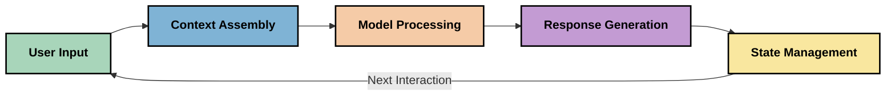
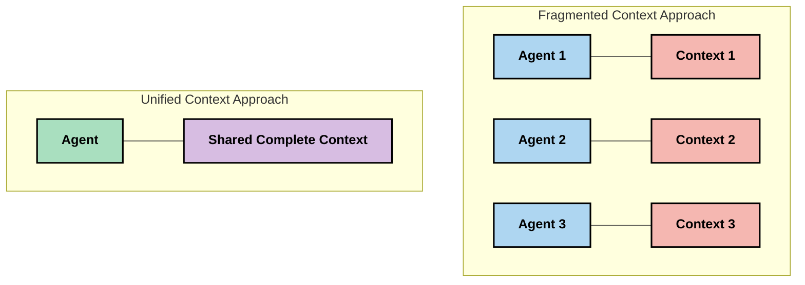
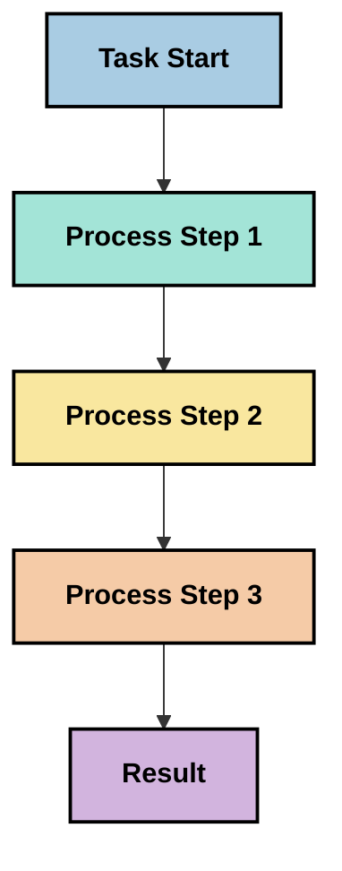
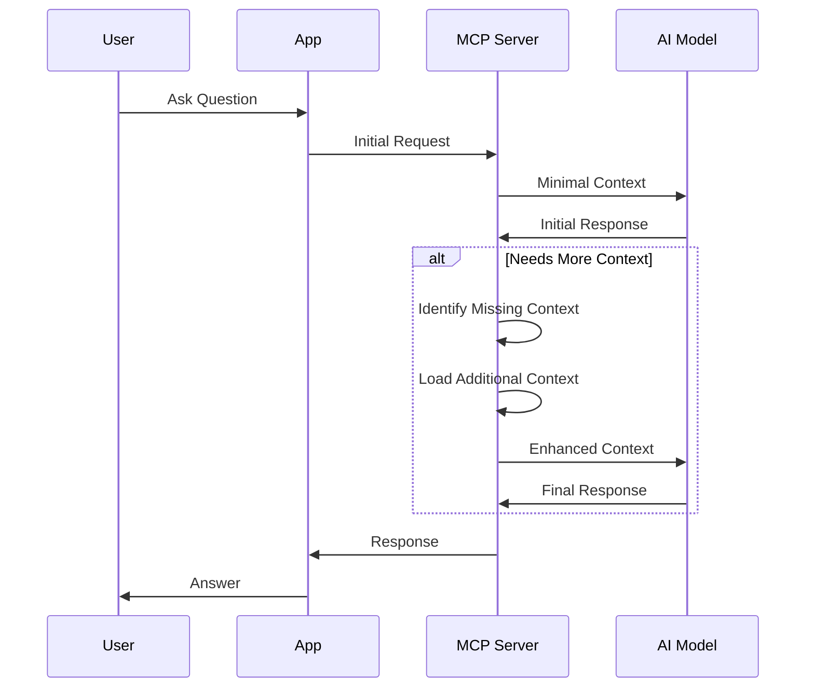
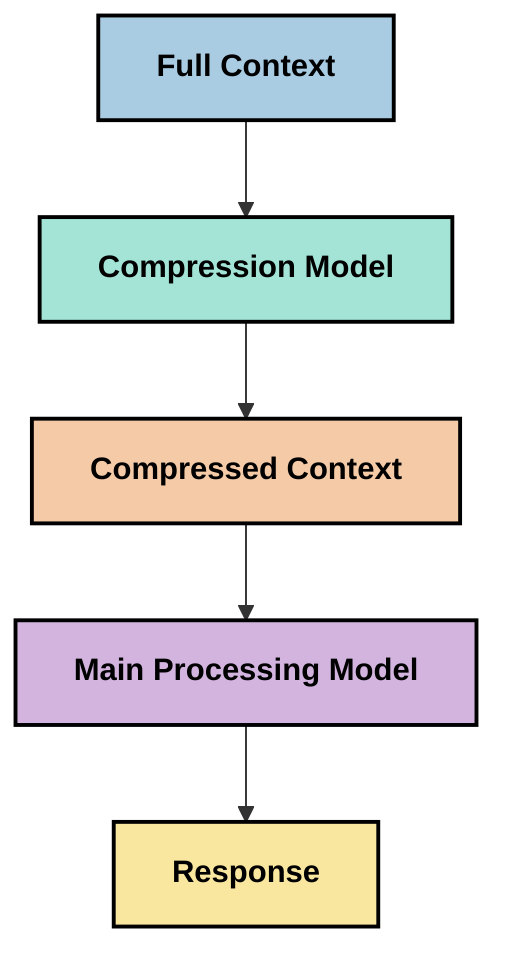

<!--
CO_OP_TRANSLATOR_METADATA:
{
  "original_hash": "5762e8e74dd99d8b7dbb31e69a82561e",
  "translation_date": "2025-07-17T13:21:52+00:00",
  "source_file": "05-AdvancedTopics/mcp-contextengineering/README.md",
  "language_code": "sr"
}
-->
# Context Engineering: Нови концепт у MCP екосистему

## Преглед

Context engineering је нови концепт у области вештачке интелигенције који истражује како се информације структуирају, достављају и одржавају током интеракција између корисника и AI сервиса. Како се Model Context Protocol (MCP) екосистем развија, разумевање ефикасног управљања контекстом постаје све важније. Овај модул уводи концепт context engineering-а и истражује његове потенцијалне примене у MCP имплементацијама.

## Циљеви учења

На крају овог модула, моћи ћете да:

- Разумете нови концепт context engineering-а и његову могућу улогу у MCP апликацијама
- Идентификујете кључне изазове у управљању контекстом које MCP протокол решава
- Истражите технике за побољшање перформанси модела кроз боље руковање контекстом
- Размотрите приступе за мерење и процену ефикасности контекста
- Примените ове нове концепте за унапређење AI искустава кроз MCP оквир

## Увод у Context Engineering

Context engineering је нови концепт усмерен на свесно дизајнирање и управљање протоком информација између корисника, апликација и AI модела. За разлику од већ устаљених области као што је prompt engineering, context engineering још увек дефинишу практичари док решавају јединствене изазове обезбеђивања правих информација AI моделима у правом тренутку.

Како су велики језички модели (LLM) еволуирали, значај контекста постаје све очигледнији. Квалитет, релевантност и структура контекста који пружамо директно утичу на излаз модела. Context engineering истражује ову везу и настоји да развије принципе за ефикасно управљање контекстом.

> "У 2025. моделима су изузетно интелигентни. Али чак ни најпаметнији човек неће моћи ефикасно да обави свој посао без контекста онога што му се тражи... 'Context engineering' је следећи ниво prompt engineering-а. Ради се о аутоматском управљању у динамичном систему." — Walden Yan, Cognition AI

Context engineering може обухватити:

1. **Избор контекста**: Одређивање које су информације релевантне за одређени задатак
2. **Структурирање контекста**: Организација информација ради максималног разумевања од стране модела
3. **Достављање контекста**: Оптимизација начина и времена слања информација моделима
4. **Одржавање контекста**: Управљање стањем и развојем контекста током времена
5. **Процена контекста**: Мерење и унапређење ефикасности контекста

Ове области су посебно релевантне за MCP екосистем, који пружа стандардизован начин да апликације обезбеде контекст LLM моделима.

## Перспектива путовања контекста

Један начин да се визуализује context engineering је праћење пута који информација пролази кроз MCP систем:



### Кључне фазе у путовању контекста:

1. **Унос корисника**: Сирове информације од корисника (текст, слике, документи)
2. **Састављање контекста**: Комбинација уноса корисника са системским контекстом, историјом разговора и другим преузетим информацијама
3. **Обрада модела**: AI модел обрађује састављени контекст
4. **Генерисање одговора**: Модел производи излаз на основу достављеног контекста
5. **Управљање стањем**: Систем ажурира свој интерни статус на основу интеракције

Ова перспектива истиче динамичну природу контекста у AI системима и поставља важна питања о најбољем начину управљања информацијама у свакој фази.

## Нови принципи у Context Engineering-у

Како се област context engineering-а развија, неки рани принципи почињу да се формирају међу практичарима. Ови принципи могу помоћи у доношењу одлука о MCP имплементацијама:

### Принцип 1: Делите контекст у потпуности

Контекст треба да буде у потпуности доступан свим компонентама система, а не фрагментиран између више агената или процеса. Када је контекст распоређен, одлуке донете у једном делу система могу бити у конфликту са оним у другом.



У MCP апликацијама ово сугерише дизајн система у којима контекст непрекидно тече кроз цео процес, а не да буде подељен у одвојене делове.

### Принцип 2: Препознајте да акције носе имплицитне одлуке

Свака акција коју модел предузме носи у себи имплицитне одлуке о томе како тумачити контекст. Када више компоненти делује на различитим контекстима, ове имплицитне одлуке могу бити у конфликту, што доводи до неконзистентних резултата.

Овај принцип има важне импликације за MCP апликације:
- Преферирати линеарну обраду сложених задатака уместо паралелног извршавања са фрагментираним контекстом
- Обезбедити да све тачке одлучивања имају приступ истим контекстуалним информацијама
- Дизајнирати системе где каснији кораци могу видети цео контекст ранијих одлука

### Принцип 3: Балансирајте дубину контекста са ограничењима прозора

Како разговори и процеси постају дужи, контекстуални прозори се пуне. Ефикасан context engineering истражује приступе за управљање овим сукобом између свеобухватног контекста и техничких ограничења.

Потенцијални приступи укључују:
- Компресију контекста која задржава суштинске информације уз смањење броја токена
- Прогресивно учитавање контекста на основу релевантности тренутним потребама
- Сажимање претходних интеракција уз очување кључних одлука и чињеница

## Изазови контекста и дизајн MCP протокола

Model Context Protocol (MCP) је дизајниран са свешћу о јединственим изазовима управљања контекстом. Разумевање ових изазова помаже да се објасне кључни аспекти дизајна MCP протокола:

### Изазов 1: Ограничења контекстуалног прозора  
Већина AI модела има фиксну величину контекстуалног прозора, што ограничава колико информација могу обрадити одједном.

**Одговор MCP дизајна:**  
- Протокол подржава структуирани, ресурсно базирани контекст који се може ефикасно реферисати  
- Ресурси могу бити пагинирани и учитавани прогресивно

### Изазов 2: Одређивање релевантности  
Тешко је одредити које су информације најрелевантније за укључивање у контекст.

**Одговор MCP дизајна:**  
- Флексибилни алати омогућавају динамичко преузимање информација по потреби  
- Структурирани промптови омогућавају доследну организацију контекста

### Изазов 3: Перзистенција контекста  
Управљање стањем кроз интеракције захтева пажљиво праћење контекста.

**Одговор MCP дизајна:**  
- Стандардизовано управљање сесијама  
- Јасно дефинисани обрасци интеракције за еволуцију контекста

### Изазов 4: Мултимодални контекст  
Различити типови података (текст, слике, структуирани подаци) захтевају различите приступе.

**Одговор MCP дизајна:**  
- Дизајн протокола омогућава различите типове садржаја  
- Стандардизована репрезентација мултимодалних информација

### Изазов 5: Безбедност и приватност  
Контекст често садржи осетљиве информације које морају бити заштићене.

**Одговор MCP дизајна:**  
- Јасне границе између одговорности клијента и сервера  
- Опције локалне обраде ради минимализације излагања података

Разумевање ових изазова и начина на који их MCP решава пружа основу за истраживање напреднијих техника context engineering-а.

## Нови приступи у Context Engineering-у

Како се област context engineering-а развија, појављују се неки обећавајући приступи. Они представљају тренутна размишљања, а не устаљене праксе, и вероватно ће се развијати како стичемо више искуства са MCP имплементацијама.

### 1. Линеарна обрада у једном току

За разлику од мулти-агентских архитектура које распоређују контекст, неки практичари откривају да линеарна обрада у једном току даје конзистентније резултате. Ово је у складу са принципом одржавања јединственог контекста.



Иако овај приступ може деловати мање ефикасно од паралелне обраде, често даје кохерентније и поузданије резултате јер сваки корак гради на потпуном разумевању претходних одлука.

### 2. Дељење и приоритизација контекста

Разбијање великих контекста на управљиве делове и приоритизација најважнијег.

```python
# Conceptual Example: Context Chunking and Prioritization
def process_with_chunked_context(documents, query):
    # 1. Break documents into smaller chunks
    chunks = chunk_documents(documents)
    
    # 2. Calculate relevance scores for each chunk
    scored_chunks = [(chunk, calculate_relevance(chunk, query)) for chunk in chunks]
    
    # 3. Sort chunks by relevance score
    sorted_chunks = sorted(scored_chunks, key=lambda x: x[1], reverse=True)
    
    # 4. Use the most relevant chunks as context
    context = create_context_from_chunks([chunk for chunk, score in sorted_chunks[:5]])
    
    # 5. Process with the prioritized context
    return generate_response(context, query)
```

Горњи пример илуструје како можемо разложити велике документе на делове и изабрати само најрелевантније за контекст. Овај приступ помаже у раду у оквиру ограничења контекстуалног прозора уз коришћење великих база знања.

### 3. Прогресивно учитавање контекста

Учитавање контекста постепено, по потреби, а не све одједном.



Прогресивно учитавање почиње са минималним контекстом и шири га само када је потребно. Ово може значајно смањити коришћење токена за једноставне упите, а истовремено омогућити обраду сложених питања.

### 4. Компресија и сажимање контекста

Смањење величине контекста уз очување суштинских информација.



Компресија контекста фокусира се на:  
- Уклањање сувишних информација  
- Сажимање дугачког садржаја  
- Издвајање кључних чињеница и детаља  
- Очување критичних елемената контекста  
- Оптимизацију за ефикасност токена

Овај приступ је посебно вредан за одржавање дугих разговора у оквиру контекстуалних прозора или за ефикасну обраду великих докумената. Неки практичари користе специјализоване моделе посебно за компресију и сажимање историје разговора.

## Истраживачки аспекти Context Engineering-а

Док истражујемо нову област context engineering-а, вреди имати на уму неколико разматрања приликом рада са MCP имплементацијама. Ово нису прописане најбоље праксе, већ области за истраживање које могу донети побољшања у вашем конкретном случају.

### Размислите о својим циљевима контекста

Пре него што имплементирате сложена решења за управљање контекстом, јасно дефинишите шта желите да постигнете:  
- Које конкретне информације модел треба да би био успешан?  
- Које информације су суштинске, а које допунске?  
- Која су ваша ограничења у перформансама (латенција, лимити токена, трошкови)?

### Истражите слојевите приступе контексту

Неки практичари постижу успех са контекстом организованим у концептуалне слојеве:  
- **Основни слој**: Суштинске информације које модел увек треба  
- **Ситуациони слој**: Контекст специфичан за тренутну интеракцију  
- **Подршка**: Додатне информације које могу бити корисне  
- **Резервни слој**: Информације приступачне само по потреби

### Истражите стратегије преузимања

Ефикасност вашег контекста често зависи од начина на који преузимате информације:  
- Семантичка претрага и embeddings за проналажење концептуално релевантних информација  
- Претрага по кључним речима за специфичне чињеничне детаље  
- Хибридни приступи који комбинују више метода преузимања  
- Филтрирање метаподатака за сужење опсега по категоријама, датумима или изворима

### Експериментишите са кохерентношћу контекста

Структура и ток вашег контекста могу утицати на разумевање модела:  
- Груписање повезаних информација  
- Коришћење доследног форматирања и организације  
- Одржавање логичког или хронолошког редоследа где је прикладно  
- Избегавање контрадикторних информација

### Процените компромисе мулти-агентских архитектура

Иако су мулти-агентске архитектуре популарне у многим AI оквирима, оне доносе значајне изазове у управљању контекстом:  
- Фрагментација контекста може довести до неконзистентних одлука између агената  
- Паралелна обрада може увести конфликте које је тешко решити  
- Трошкови комуникације између агената могу поништити добитке у перформансама  
- Потребно је сложено управљање стањем за одржавање кохерентности

У многим случајевима, приступ са једним агентом и свеобухватним управљањем контекстом може дати поузданије резултате од више специјализованих агената са фрагментираним контекстом.

### Развијајте методе процене

Да бисте временом унапредили context engineering, размислите како ћете мерити успех:  
- A/B тестирање различитих структура контекста  
- Праћење коришћења токена и времена одговора  
- Прати задовољство корисника и стопу завршетка задатака  
- Анализа случајева када стратегије контекста не успевају

Ова разматрања представљају активне области истраживања у области context engineering-а. Како област буде сазревала, вероватно ће се појавити јаснији обрасци и праксе.

## Мерење ефикасности контекста: развијајући оквир

Како context engineering постаје концепт, практичари почињу да истражују како бисмо могли мерити његову ефикасност. Још не постоји устаљени оквир, али разматрају се различите метрике које би могле усмерити будући рад.

### Потенцијалне димензије мерења

#### 1. Разматрања у вези са уносом

- **Однос контекста и одговора**: Колико контекста је потребно у односу на величину одговора?  
- **Коришћење токена**: Који проценат токена из контекста утиче на одговор?  
- **Смањење контекста
- [Model Context Protocol сајт](https://modelcontextprotocol.io/)
- [Model Context Protocol спецификација](https://github.com/modelcontextprotocol/modelcontextprotocol)
- [MCP документација](https://modelcontextprotocol.io/docs)
- [MCP C# SDK](https://github.com/modelcontextprotocol/csharp-sdk)
- [MCP Python SDK](https://github.com/modelcontextprotocol/python-sdk)
- [MCP TypeScript SDK](https://github.com/modelcontextprotocol/typescript-sdk)
- [MCP Inspector](https://github.com/modelcontextprotocol/inspector) - Визуелни алат за тестирање MCP сервера

### Чланци о Context Engineering
- [Не правите мулти-агенте: Принципи Context Engineering](https://cognition.ai/blog/dont-build-multi-agents) - Увид Валда Јана у принципе context engineering-а
- [Практичан водич за прављење агената](https://cdn.openai.com/business-guides-and-resources/a-practical-guide-to-building-agents.pdf) - OpenAI водич за ефикасан дизајн агената
- [Прављење ефикасних агената](https://www.anthropic.com/engineering/building-effective-agents) - Приступ Anthropic-а развоју агената

### Повезана истраживања
- [Динамичко побољшање претраге за велике језичке моделе](https://arxiv.org/abs/2310.01487) - Истраживање динамичких приступа претрази
- [Изгубљени у средини: Како језички модели користе дуге контексте](https://arxiv.org/abs/2307.03172) - Важно истраживање о обради контекста
- [Хијерархијска генерација слика условљена текстом са CLIP латентима](https://arxiv.org/abs/2204.06125) - DALL-E 2 рад са увидима у структуру контекста
- [Истраживање улоге контекста у архитектурама великих језичких модела](https://aclanthology.org/2023.findings-emnlp.124/) - Недавно истраживање о руковању контекстом
- [Сарадња мулти-агената: Преглед](https://arxiv.org/abs/2304.03442) - Истраживање мулти-агентских система и њихових изазова

### Додатни ресурси
- [Технике оптимизације Context Window](https://learn.microsoft.com/en-us/azure/ai-services/openai/concepts/context-window)
- [Напредне RAG технике](https://www.microsoft.com/en-us/research/blog/retrieval-augmented-generation-rag-and-frontier-models/)
- [Semantic Kernel документација](https://github.com/microsoft/semantic-kernel)
- [AI алат за управљање контекстом](https://github.com/microsoft/aitoolkit)

## Шта следи
- [6. Заједнички доприноси](../../06-CommunityContributions/README.md)

**Одрицање од одговорности**:  
Овај документ је преведен коришћењем AI услуге за превођење [Co-op Translator](https://github.com/Azure/co-op-translator). Иако се трудимо да превод буде тачан, молимо вас да имате у виду да аутоматски преводи могу садржати грешке или нетачности. Оригинални документ на његовом изворном језику треба сматрати ауторитетним извором. За критичне информације препоручује се професионални људски превод. Нисмо одговорни за било каква неспоразума или погрешна тумачења која произилазе из коришћења овог превода.