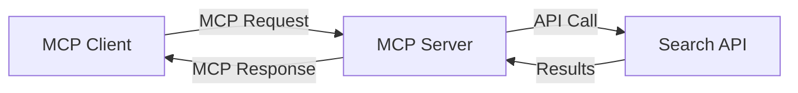
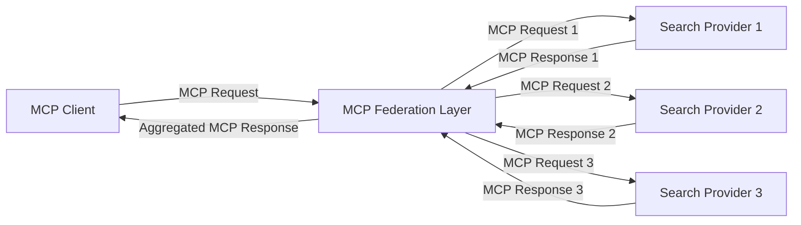
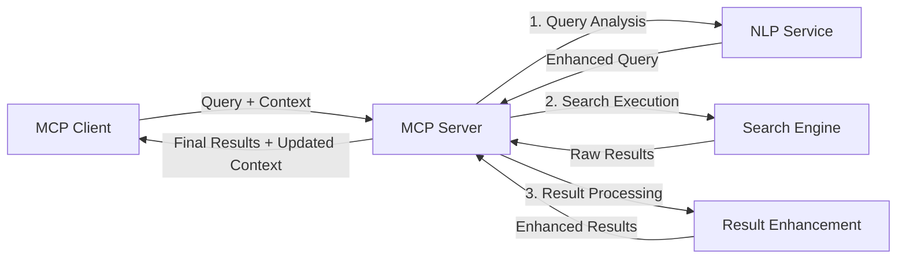

<!--
CO_OP_TRANSLATOR_METADATA:
{
  "original_hash": "eb12652eb7bd17f2193b835a344425c6",
  "translation_date": "2025-06-26T14:24:37+00:00",
  "source_file": "05-AdvancedTopics/mcp-realtimesearch/README.md",
  "language_code": "sr"
}
-->
## Одрицање од одговорности за примере кода

> **Важно обавештење**: примери кода у наставку показују интеграцију Model Context Protocol (MCP) са функционалношћу веб претраге. Иако прате обрасце и структуре званичних MCP SDK-ова, поједностављени су у образовне сврхе.
> 
> Ови примери илуструју:
> 
> 1. **Python имплементацију**: FastMCP сервер који пружа алат за веб претрагу и повезује се са спољним API-јем за претрагу. Пример показује правилно управљање животним циклусом, руковање контекстом и имплементацију алата, пратећи обрасце из [званичног MCP Python SDK-а](https://github.com/modelcontextprotocol/python-sdk). Сервер користи препоручени Streamable HTTP транспорт који је заменио старији SSE транспорт за продукцијске примене.
> 
> 2. **JavaScript имплементацију**: TypeScript/JavaScript имплементацију користећи FastMCP образац из [званичног MCP TypeScript SDK-а](https://github.com/modelcontextprotocol/typescript-sdk) за креирање сервера за претрагу са правилним дефиницијама алата и клијентским везама. Прати најновије препоручене обрасце за управљање сесијама и очување контекста.
> 
> За продукцијску употребу ови примери захтевају додатно руковање грешкама, аутентификацију и специфичну интеграцију API-ја. Приказани API ендпоинти (`https://api.search-service.example/search`) су замене и морају бити замењени стварним ендпоинтима услуга претраге.
> 
> За комплетне детаље и најсавременије приступе, погледајте [званичну MCP спецификацију](https://spec.modelcontextprotocol.io/) и документацију SDK-а.

## Основни појмови

### Model Context Protocol (MCP) оквир

У основи, Model Context Protocol пружа стандардан начин за размену контекста између AI модела, апликација и сервиса. У реалној веб претрази, овај оквир је кључан за креирање кохерентних, вишекратних претраживачких искустава. Кључне компоненте укључују:

1. **Клијент-сервер архитектура**: MCP успоставља јасну поделу између клијената (захтеваоца) и сервера (пружалаца претраге), омогућавајући флексибилне моделе распоређивања.

2. **JSON-RPC комуникација**: протокол користи JSON-RPC за размену порука, што га чини компатибилним са веб технологијама и лако имплементираним на различитим платформама.

3. **Управљање контекстом**: MCP дефинише структуиране методе за одржавање, ажурирање и коришћење претраживачког контекста кроз више интеракција.

4. **Дефиниције алата**: претраживачке могућности су изложене као стандардизовани алати са јасно дефинисаним параметрима и повратним вредностима.

5. **Подршка за стриминг**: протокол подржава стримовање резултата, што је важно за реално време претраге где резултати могу стизати поступно.

### Обрасци интеграције веб претраге

При интеграцији MCP-а са веб претрагом појављује се неколико образаца:

#### 1. Директна интеграција провајдера претраге

У овом обрасцу MCP сервер директно комуницира са једним или више API-ја за претрагу, преводећи MCP захтеве у API-специфичне позиве и форматирајући резултате као MCP одговоре.

#### 2. Федеративна претрага са очувањем контекста

Овај образац дистрибуира претраживачке упите преко више MCP-компатибилних провајдера претраге, од којих сваки може бити специјализован за различите типове садржаја или могућности претраге, уз одржавање јединственог контекста.

#### 3. Ланац претраге са побољшаним контекстом

У овом обрасцу процес претраге је подељен у више фаза, при чему се контекст обогаћује у сваком кораку, што резултира све релевантнијим резултатима.

### Компоненте претраживачког контекста

У MCP-базираној веб претрази, контекст обично укључује:

- **Историју упита**: претходне претраге у сесији
- **Корисничке преференције**: језик, регион, подешавања безбедне претраге
- **Историју интеракција**: који су резултати кликнути, време проведено на резултатима
- **Параметре претраге**: филтери, редослед сортирања и други модификатори претраге
- **Стручност домена**: контекст специфичан за тему претраге
- **Временски контекст**: фактори релевантности везани за време
- **Преференције извора**: поуздани или одабрани извори информација

## Примери употребе и апликације

### Истраживање и прикупљање информација

MCP побољшава радне токове истраживања тако што:

- Чува контекст истраживања кроз сесије претраге
- Омогућава сложеније и контекстуално релевантне упите
- Подржава федерацију претраге из више извора
- Олакшава извлачење знања из резултата претраге

### Мониторинг вести и трендова у реалном времену

MCP-покретана претрага нуди предности за праћење вести:

- Отkrivanje нових вести скоро у реалном времену
- Контекстуално филтрирање релевантних информација
- Праћење тема и ентитета из више извора
- Персонализована обавештења о вестима заснована на корисничком контексту

### AI-подржано прегледање и истраживање

MCP отвара нове могућности за AI-подржано прегледање:

- Контекстуалне препоруке претраге засноване на тренутној активности у прегледачу
- Беспрекорна интеграција веб претраге са асистентима покретаним LLM-ом
- Вишекратна рафинација претраге уз очуван контекст
- Побољшано проверавање чињеница и верификација информација

## Будући трендови и иновације

### Еволуција MCP-а у веб претрази

У будућности очекујемо да MCP буде развијен за:

- **Мултимодалну претрагу**: интеграција претраге текста, слика, звука и видео садржаја уз очуван контекст
- **Децентрализовану претрагу**: подршка за дистрибуиране и федеративне претраживачке екосистеме
- **Приватност претраге**: контекстуално свесне механизме заштите приватности у претрази
- **Разумевање упита**: дубинску семантичку анализу природних језика у претраживачким упитима

### Потенцијални технолошки напредак

Нове технологије које ће обликовати будућност MCP претраге:

1. **Невронске претраживачке архитектуре**: претраживачки системи засновани на уграђеним репрезентацијама оптимизовани за MCP
2. **Персонализовани претраживачки контекст**: учење индивидуалних образаца претраге корисника током времена
3. **Интеграција графова знања**: контекстуална претрага побољшана графовима знања специфичним за домен
4. **Крос-модални контекст**: очување контекста кроз различите модалитете претраге

## Практичне вежбе

### Вежба 1: Подешавање основне MCP претраживачке цевоводе

У овој вежби научићете како да:
- Конфигуришете основно MCP претраживачко окружење
- Имплементирате обрађиваче контекста за веб претрагу
- Тестирате и проверите очување контекста кроз више претраживачких корака

### Вежба 2: Израда асистента за истраживање са MCP претрагом

Креирајте комплетну апликацију која:
- Обрађује питања на природном језику за истраживање
- Изводи претраге на вебу уз свест о контексту
- Синтетизује информације из више извора
- Приказује организоване резултате истраживања

### Вежба 3: Имплементација федерације претраге из више извора са MCP

Напредна вежба која покрива:
- Контекстуално усмеравање упита ка више претраживача
- Рангирање и агрегирање резултата
- Контекстуално уклањање дупликата резултата
- Руководство метаподацима специфичним за изворе

## Додатни ресурси

- [Model Context Protocol спецификација](https://spec.modelcontextprotocol.io/) - Званична MCP спецификација и детаљна документација протокола
- [Model Context Protocol документација](https://modelcontextprotocol.io/) - Детаљни туторијали и водичи за имплементацију
- [MCP Python SDK](https://github.com/modelcontextprotocol/python-sdk) - Званична Python имплементација MCP протокола
- [MCP TypeScript SDK](https://github.com/modelcontextprotocol/typescript-sdk) - Званична TypeScript имплементација MCP протокола
- [MCP референтни сервери](https://github.com/modelcontextprotocol/servers) - Референтне имплементације MCP сервера
- [Bing Web Search API документација](https://learn.microsoft.com/en-us/bing/search-apis/bing-web-search/overview) - Microsoft API за веб претрагу
- [Google Custom Search JSON API](https://developers.google.com/custom-search/v1/overview) - Google програмабилни претраживач
- [SerpAPI документација](https://serpapi.com/search-api) - API за резултате претраживача
- [Meilisearch документација](https://www.meilisearch.com/docs) - Отворени претраживачки систем
- [Elasticsearch документација](https://www.elastic.co/guide/index.html) - Дистрибуирани систем за претрагу и аналитику
- [LangChain документација](https://python.langchain.com/docs/get_started/introduction) - Изградња апликација са LLM-овима

## Резултати учења

Након завршетка овог модула, моћи ћете да:

- Разумете основе реално-временске веб претраге и њене изазове
- Објасните како Model Context Protocol (MCP) унапређује могућности реално-временске претраге
- Имплементирате претраживачка решења базирана на MCP користећи популарне оквире и API-је
- Дизајнирате и имплементирате скалабилне и високоперформантне претраживачке архитектуре са MCP
- Примените MCP концепте у различитим случајевима употребе укључујући семантичку претрагу, асистенцију у истраживању и AI-подржано прегледање
- Процените нове трендове и будуће иновације у MCP-базираним претраживачким технологијама

### Разматрања о безбедности и поверењу

При имплементацији MCP-базираних решења за веб претрагу, имајте на уму следеће важне принципе из MCP спецификације:

1. **Сагласност и контрола корисника**: Корисници морају јасно дати сагласност и разумети све приступе подацима и операције. Ово је посебно важно за имплементације веб претраге које могу приступати спољним изворима података.

2. **Приватност података**: Осигурајте одговарајуће руковање упитима и резултатима претраге, посебно када могу садржати осетљиве информације. Имплементирајте одговарајуће контроле приступа за заштиту корисничких података.

3. **Безбедност алата**: Обезбедите правилну ауторизацију и валидацију претраживачких алата, јер они представљају потенцијалне безбедносне ризике због извођења произвољног кода. Описи понашања алата треба да се сматрају непоузданим осим ако нису добијени са поузданог сервера.

4. **Јасна документација**: Обезбедите јасну документацију о могућностима, ограничењима и безбедносним аспектима ваше MCP-базиране претраге, пратећи смернице из MCP спецификације.

5. **Робусни токови сагласности**: Креирајте робусне токове за сагласност и ауторизацију који јасно објашњавају шта сваки алат ради пре него што му се дозволи употреба, посебно за алате који комуницирају са спољним веб ресурсима.

За комплетне детаље о безбедности и поверењу у MCP, погледајте [званичну документацију](https://modelcontextprotocol.io/specification/2025-03-26#security-and-trust-%26-safety).

## Шта следи

- [5.11 Entra ID аутентификација за Model Context Protocol сервере](../mcp-security-entra/README.md)

**Одрицање од одговорности**:  
Овај документ је преведен помоћу AI сервиса за превођење [Co-op Translator](https://github.com/Azure/co-op-translator). Иако тежимо тачности, молимо вас да имате у виду да аутоматизовани преводи могу садржати грешке или нетачности. Оригинални документ на његовом изворном језику треба сматрати ауторитетним извором. За критичне информације препоручује се професионални људски превод. Нисмо одговорни за било каква неспоразума или погрешне тумачења која произилазе из коришћења овог превода.