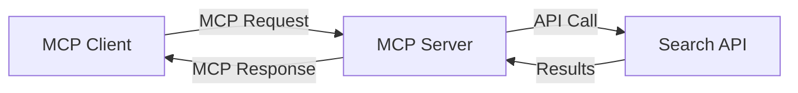
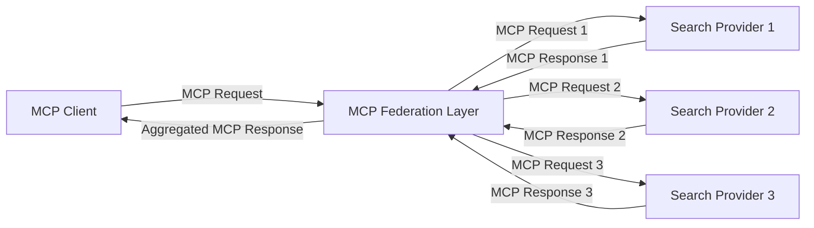
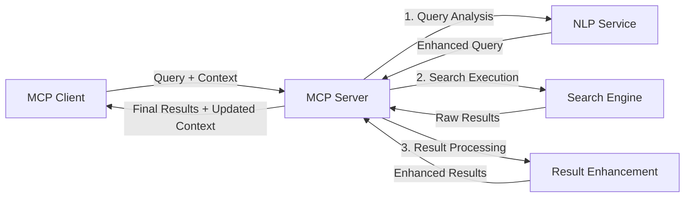

<!--
CO_OP_TRANSLATOR_METADATA:
{
  "original_hash": "333a03e51f90bdf3e6f1ba1694c73f36",
  "translation_date": "2025-07-17T11:51:20+00:00",
  "source_file": "05-AdvancedTopics/mcp-realtimesearch/README.md",
  "language_code": "sr"
}
-->
## Одрицање од одговорности за примере кода

> **Важно обавештење**: Примери кода у наставку показују интеграцију Model Context Protocol (MCP) са функционалношћу веб претраге. Иако прате обрасце и структуре званичних MCP SDK-ова, поједностављени су у образовне сврхе.
> 
> Ови примери илуструју:
> 
> 1. **Python имплементацију**: FastMCP сервер који пружа алат за веб претрагу и повезује се са спољним претраживачким API-јем. Овај пример показује правилно управљање животним циклусом, руковање контекстом и имплементацију алата пратећи обрасце из [званичног MCP Python SDK-а](https://github.com/modelcontextprotocol/python-sdk). Сервер користи препоручени Streamable HTTP транспорт који је заменио старији SSE транспорт за продукцијске примене.
> 
> 2. **JavaScript имплементацију**: TypeScript/JavaScript имплементацију користећи FastMCP образац из [званичног MCP TypeScript SDK-а](https://github.com/modelcontextprotocol/typescript-sdk) за креирање претраживачког сервера са исправним дефиницијама алата и клијентским везама. Прати најновије препоручене обрасце за управљање сесијом и очување контекста.
> 
> Ови примери би захтевали додатно руковање грешкама, аутентификацију и специфичан код за интеграцију API-ја за продукцијску употребу. Приказани API ендпоинти за претрагу (`https://api.search-service.example/search`) су замене и морали би бити замењени стварним ендпоинтима претраживачких сервиса.
> 
> За комплетне детаље имплементације и најсавременије приступе, молимо погледајте [званичну MCP спецификацију](https://spec.modelcontextprotocol.io/) и документацију SDK-а.

## Основни појмови

### Model Context Protocol (MCP) оквир

У основи, Model Context Protocol пружа стандардизован начин за размену контекста између AI модела, апликација и сервиса. У реалној веб претрази, овај оквир је кључан за креирање кохерентних претраживачких искустава са више корака. Кључне компоненте укључују:

1. **Клијент-сервер архитектура**: MCP успоставља јасну подјелу између претраживачких клијената (захтеватеља) и претраживачких сервера (пружаоца), омогућавајући флексибилне моделе распоређивања.

2. **JSON-RPC комуникација**: Протокол користи JSON-RPC за размену порука, што га чини компатибилним са веб технологијама и лако имплементираним на различитим платформама.

3. **Управљање контекстом**: MCP дефинише структуиране методе за одржавање, ажурирање и коришћење претраживачког контекста кроз више интеракција.

4. **Дефиниције алата**: Претраживачке могућности изложене су као стандардизовани алати са јасно дефинисаним параметрима и повратним вредностима.

5. **Подршка за стриминг**: Протокол подржава стриминг резултата, што је неопходно за реално време претраге где резултати могу стизати постепено.

### Обрасци интеграције веб претраге

При интеграцији MCP-а са веб претрагом, појављује се неколико образаца:

#### 1. Директна интеграција пружаоца претраге

У овом обрасцу, MCP сервер директно комуницира са једним или више претраживачких API-ја, преводећи MCP захтеве у API-специфичне позиве и форматирајући резултате као MCP одговоре.

#### 2. Федеративна претрага са очувањем контекста

Овај образац распоређује претраживачке упите преко више MCP-компатибилних пружалаца претраге, од којих сваки може бити специјализован за различите типове садржаја или претраживачке могућности, уз одржавање јединственог контекста.

#### 3. Ланац претраге са побољшаним контекстом

У овом обрасцу, процес претраге је подељен у више фаза, при чему се контекст обогаћује у сваком кораку, што резултира постепено релевантнијим резултатима.

### Компоненте претраживачког контекста

У MCP-базираној веб претрази, контекст обично укључује:

- **Историју упита**: Претходне претраживачке упите у сесији
- **Корисничке преференције**: Језик, регион, подешавања безбедне претраге
- **Историју интеракција**: Који су резултати кликнути, време проведено на резултатима
- **Параметре претраге**: Филтери, редослед сортирања и други модификатори претраге
- **Доменско знање**: Контекст специфичан за тему релевантан претрази
- **Временски контекст**: Фактори релевантности засновани на времену
- **Преференције извора**: Поуздани или омиљени извори информација

## Примери употребе и апликације

### Истраживање и прикупљање информација

MCP унапређује истраживачке токове рада тако што:

- Чува контекст истраживања кроз претраживачке сесије
- Омогућава софистицираније и контекстуално релевантне упите
- Подржава федерацију претраге из више извора
- Олакшава извлачење знања из резултата претраге

### Праћење вести и трендова у реалном времену

MCP-подржана претрага нуди предности за праћење вести:

- Откривање нових вести у скоро реалном времену
- Контекстуално филтрирање релевантних информација
- Праћење тема и ентитета преко више извора
- Персонализовани аларми за вести засновани на корисничком контексту

### AI-подржано прегледање и истраживање

MCP отвара нове могућности за AI-подржано прегледање:

- Контекстуалне претраживачке препоруке засноване на тренутној активности у прегледачу
- Беспрекорна интеграција веб претраге са LLM-подржаним асистентима
- Вишекратна прецизирања претраге уз очуван контекст
- Побољшано проверавање чињеница и верификација информација

## Будући трендови и иновације

### Еволуција MCP-а у веб претрази

У будућности очекујемо да ће MCP еволуирати како би обухватио:

- **Мултимодалну претрагу**: Интеграцију претраге текста, слика, звука и видеа уз очуван контекст
- **Децентрализовану претрагу**: Подршку за дистрибуиране и федеративне претраживачке екосистеме
- **Приватност претраге**: Механизми претраге који штите приватност уз свест о контексту  
- **Разумевање упита**: Дубинска семантичка анализа природних језичких претраживачких упита

### Потенцијални технолошки напредак

Нове технологије које ће обликовати будућност MCP претраге:

1. **Неуронске архитектуре претраге**: Системи претраге засновани на уграђивањима оптимизовани за MCP  
2. **Персонализовани контекст претраге**: Учење индивидуалних образаца претраге корисника током времена  
3. **Интеграција графа знања**: Контекстуална претрага побољшана графовима знања специфичним за домен  
4. **Крос-модални контекст**: Одржавање контекста кроз различите модалитете претраге

## Практичне вежбе

### Вежба 1: Постављање основне MCP претраживачке линије

У овој вежби ћете научити како да:  
- Конфигуришете основно MCP претраживачко окружење  
- Имплементирате обрађиваче контекста за веб претрагу  
- Тестирате и верификујете очување контекста кроз више итерација претраге

### Вежба 2: Израда истраживачког асистента са MCP претрагом

Креирајте комплетну апликацију која:  
- Обрађује истраживачка питања на природном језику  
- Изводи претраге на вебу уз свест о контексту  
- Синтетизује информације из више извора  
- Приказује организоване резултате истраживања

### Вежба 3: Имплементација федерације претраге из више извора са MCP

Напредна вежба која обухвата:  
- Контекстуално усмеравање упита ка више претраживача  
- Рангирање и агрегирање резултата  
- Контекстуално уклањање дупликата резултата претраге  
- Обраду метаподатака специфичних за извор

## Додатни ресурси

- [Model Context Protocol Specification](https://spec.modelcontextprotocol.io/) - Званична MCP спецификација и детаљна документација протокола  
- [Model Context Protocol Documentation](https://modelcontextprotocol.io/) - Детаљни туторијали и водичи за имплементацију  
- [MCP Python SDK](https://github.com/modelcontextprotocol/python-sdk) - Званична Python имплементација MCP протокола  
- [MCP TypeScript SDK](https://github.com/modelcontextprotocol/typescript-sdk) - Званична TypeScript имплементација MCP протокола  
- [MCP Reference Servers](https://github.com/modelcontextprotocol/servers) - Референтне имплементације MCP сервера  
- [Bing Web Search API Documentation](https://learn.microsoft.com/en-us/bing/search-apis/bing-web-search/overview) - Microsoft-ов API за веб претрагу  
- [Google Custom Search JSON API](https://developers.google.com/custom-search/v1/overview) - Google-ов програмски претраживач  
- [SerpAPI Documentation](https://serpapi.com/search-api) - API за странице резултата претраге  
- [Meilisearch Documentation](https://www.meilisearch.com/docs) - Отворени претраживач  
- [Elasticsearch Documentation](https://www.elastic.co/guide/index.html) - Распоређени претраживач и аналитички систем  
- [LangChain Documentation](https://python.langchain.com/docs/get_started/introduction) - Израда апликација са LLM-овима

## Резултати учења

Након завршетка овог модула, моћи ћете да:

- Разумете основе претраге веба у реалном времену и њене изазове  
- Објасните како Model Context Protocol (MCP) унапређује могућности претраге у реалном времену  
- Имплементирате претраживачка решења заснована на MCP користећи популарне оквире и API-је  
- Дизајнирате и имплементирате скалабилне, високо перформантне претраживачке архитектуре са MCP  
- Примените MCP концепте у различитим случајевима употребе, укључујући семантичку претрагу, истраживачку помоћ и претраживање уз подршку вештачке интелигенције  
- Процените нове трендове и будуће иновације у MCP заснованим технологијама претраге

### Разматрања о поверењу и безбедности

При имплементацији MCP заснованих решења за веб претрагу, имајте на уму ове важне принципе из MCP спецификације:

1. **Сагласност и контрола корисника**: Корисници морају јасно дати сагласност и разумети све приступе подацима и операције. Ово је посебно важно за имплементације веб претраге које могу приступати спољним изворима података.

2. **Приватност података**: Обезбедите одговарајућу обраду упита и резултата претраге, посебно када могу садржати осетљиве информације. Имплементирајте одговарајуће контроле приступа ради заштите корисничких података.

3. **Безбедност алата**: Обезбедите правилну ауторизацију и валидацију претраживачких алата, јер они представљају потенцијалне безбедносне ризике због извршавања произвољног кода. Описи понашања алата треба да се сматрају непоузданим осим ако нису добијени са поузданог сервера.

4. **Јасна документација**: Обезбедите јасну документацију о могућностима, ограничењима и безбедносним аспектима ваше MCP имплементације, пратећи смернице из MCP спецификације.

5. **Робусни токови сагласности**: Креирајте робусне токове сагласности и ауторизације који јасно објашњавају шта сваки алат ради пре него што му се одобри коришћење, посебно за алате који комуницирају са спољним веб ресурсима.

За комплетне детаље о безбедности и поверењу у MCP, погледајте [званичну документацију](https://modelcontextprotocol.io/specification/2025-03-26#security-and-trust-%26-safety).

## Шта следи

- [5.12 Entra ID Authentication for Model Context Protocol Servers](../mcp-security-entra/README.md)

**Одрицање од одговорности**:  
Овај документ је преведен коришћењем AI сервиса за превођење [Co-op Translator](https://github.com/Azure/co-op-translator). Иако се трудимо да превод буде тачан, молимо вас да имате у виду да аутоматски преводи могу садржати грешке или нетачности. Оригинални документ на његовом изворном језику треба сматрати ауторитетним извором. За критичне информације препоручује се професионални људски превод. Нисмо одговорни за било каква неспоразума или погрешна тумачења настала коришћењем овог превода.