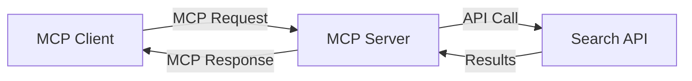
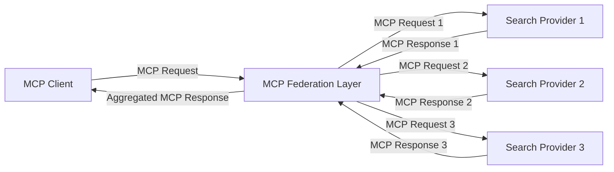
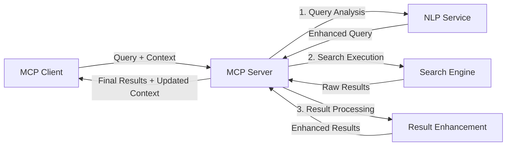

<!--
CO_OP_TRANSLATOR_METADATA:
{
  "original_hash": "16bef2c93c6a86d4ca6a8ce9e120e384",
  "translation_date": "2025-06-13T03:04:05+00:00",
  "source_file": "05-AdvancedTopics/mcp-realtimesearch/README.md",
  "language_code": "sr"
}
-->
## Ograničenje Primera Koda

> **Važna Napomena**: Primeri koda ispod pokazuju integraciju Model Context Protocol-a (MCP) sa funkcionalnošću pretraživanja na webu. Iako prate obrasce i strukture zvaničnih MCP SDK-ova, pojednostavljeni su u edukativne svrhe.
> 
> Ovi primeri prikazuju:
> 
> 1. **Python Implementacija**: FastMCP server koji pruža alat za web pretragu i povezuje se sa eksternim pretraživačkim API-jem. Primer pokazuje pravilno upravljanje životnim ciklusom, rukovanje kontekstom i implementaciju alata prateći obrasce [zvaničnog MCP Python SDK](https://github.com/modelcontextprotocol/python-sdk). Server koristi preporučeni Streamable HTTP transport koji je zamenio stariji SSE transport za produkciju.
> 
> 2. **JavaScript Implementacija**: TypeScript/JavaScript implementacija koristeći FastMCP obrazac iz [zvaničnog MCP TypeScript SDK](https://github.com/modelcontextprotocol/typescript-sdk) za kreiranje serverske pretrage sa pravilnim definicijama alata i klijentskim konekcijama. Prati najnovije preporučene obrasce za upravljanje sesijama i očuvanje konteksta.
> 
> Ovi primeri bi u produkciji zahtevali dodatno rukovanje greškama, autentifikaciju i specifične API integracije. Prikazani API endpointi za pretragu (`https://api.search-service.example/search`) su rezervisani i treba ih zameniti stvarnim servisima.
> 
> Za kompletne detalje implementacije i najnovije pristupe, pogledajte [zvaničnu MCP specifikaciju](https://spec.modelcontextprotocol.io/) i dokumentaciju SDK-a.

## Osnovni Koncepti

### Okvir Model Context Protocol-a (MCP)

U osnovi, Model Context Protocol pruža standardizovani način za razmenu konteksta između AI modela, aplikacija i servisa. U realnom vremenu web pretrage, ovaj okvir je ključan za kreiranje koherentnih iskustava pretrage sa više koraka. Ključne komponente uključuju:

1. **Klijent-Server Arhitektura**: MCP uspostavlja jasnu podelu između klijenata pretrage (zahtevaoca) i servera pretrage (pružalaca), omogućavajući fleksibilne modele implementacije.

2. **JSON-RPC Komunikacija**: Protokol koristi JSON-RPC za razmenu poruka, što ga čini kompatibilnim sa web tehnologijama i lakim za implementaciju na različitim platformama.

3. **Upravljanje Kontekstom**: MCP definiše strukturirane metode za održavanje, ažuriranje i korišćenje konteksta pretrage kroz više interakcija.

4. **Definicije Alata**: Mogućnosti pretrage izložene su kao standardizovani alati sa jasno definisanim parametrima i povratnim vrednostima.

5. **Podrška za Strimovanje**: Protokol podržava strimovanje rezultata, što je neophodno za realno-vremensku pretragu gde rezultati mogu stizati postepeno.

### Obrasci Integracije Web Pretrage

Kod integracije MCP-a sa web pretragom, pojavljuju se sledeći obrasci:

#### 1. Direktna Integracija Pružaoca Pretrage

U ovom obrascu, MCP server direktno komunicira sa jednim ili više pretraživačkih API-ja, prevodeći MCP zahteve u specifične API pozive i formatirajući rezultate kao MCP odgovore.

#### 2. Federisana Pretraga sa Očuvanjem Konteksta

Ovaj obrazac raspoređuje upite za pretragu preko više MCP-kompatibilnih pružalaca, od kojih se svaki može specijalizovati za različite tipove sadržaja ili mogućnosti pretrage, dok se održava jedinstveni kontekst.

#### 3. Lanac Pretrage sa Poboljšanim Kontekstom

Ovde je proces pretrage podeljen na više faza, pri čemu se kontekst obogaćuje u svakom koraku, što rezultira progresivno relevantnijim rezultatima.

### Komponente Konteksta Pretrage

U MCP-baziranoj web pretrazi, kontekst obično uključuje:

- **Istoriju Upita**: Prethodne pretrage u sesiji
- **Korisničke Preferencije**: Jezik, region, podešavanja bezbedne pretrage
- **Istoriju Interakcija**: Koji su rezultati kliknuti, vreme provedeno na rezultatima
- **Parametre Pretrage**: Filteri, redosledi sortiranja i drugi modifikatori pretrage
- **Stručno Znanje**: Kontekst vezan za specifičnu oblast relevantnu za pretragu
- **Vremenski Kontekst**: Faktori relevantnosti vezani za vreme
- **Preferencije Izvora**: Pouzdani ili omiljeni izvori informacija

## Primeri Upotrebe i Primene

### Istraživanje i Prikupljanje Informacija

MCP poboljšava istraživačke tokove rada tako što:

- Očuvava kontekst istraživanja kroz sesije pretrage
- Omogućava složenije i kontekstualno relevantne upite
- Podržava federisanu pretragu iz više izvora
- Olakšava izvlačenje znanja iz rezultata pretrage

### Praćenje Vesti i Trendova u Realnom Vremenu

Pretraga pokretana MCP-om nudi prednosti za praćenje vesti:

- Otkrivanje novih vesti gotovo u realnom vremenu
- Kontekstualno filtriranje relevantnih informacija
- Praćenje tema i entiteta preko više izvora
- Personalizovane obaveštenja o vestima na osnovu korisničkog konteksta

### AI-Poboljšano Pretraživanje i Istraživanje

MCP otvara nove mogućnosti za AI-poboljšano pretraživanje:

- Kontekstualni predlozi pretrage bazirani na aktuelnoj aktivnosti u pregledaču
- Besprekorno integrisanje web pretrage sa LLM-pokretanim asistentima
- Višekorakno usavršavanje pretrage uz održavanje konteksta
- Poboljšana provera činjenica i verifikacija informacija

## Budući Trendovi i Inovacije

### Evolucija MCP-a u Web Pretrazi

U budućnosti očekujemo da će MCP razvijati mogućnosti za:

- **Multimodalnu Pretragu**: Integraciju teksta, slike, zvuka i video pretrage uz očuvani kontekst
- **Decentralizovanu Pretragu**: Podršku za distribuirane i federisane pretraživačke ekosisteme
- **Privatnost Pretrage**: Mehanizme za očuvanje privatnosti prilagođene kontekstu
- **Razumevanje Upita**: Duboku semantičku analizu prirodnog jezika u upitima za pretragu

### Potencijalni Tehnološki Napredak

Tehnologije koje će oblikovati budućnost MCP pretrage:

1. **Neuralne Arhitekture Pretrage**: Sistemi pretrage zasnovani na ugrađenim reprezentacijama optimizovani za MCP
2. **Personalizovani Kontekst Pretrage**: Učenje obrazaca pretrage pojedinačnih korisnika tokom vremena
3. **Integracija Grafova Znanja**: Kontekstualna pretraga poboljšana domen-specifičnim grafovima znanja
4. **Kros-modalni Kontekst**: Očuvanje konteksta kroz različite modalitete pretrage

## Praktične Vežbe

### Vežba 1: Postavljanje Osnovnog MCP Pretraživačkog Pipelin-a

U ovoj vežbi naučićete kako da:
- Konfigurišete osnovno MCP pretraživačko okruženje
- Implementirate rukovaoce kontekstom za web pretragu
- Testirate i potvrdite očuvanje konteksta kroz iteracije pretrage

### Vežba 2: Izgradnja Istraživačkog Asistenta sa MCP Pretragom

Napravite kompletnu aplikaciju koja:
- Procesira istraživačka pitanja na prirodnom jeziku
- Izvodi pretrage na webu uz svest o kontekstu
- Sintetiše informacije iz više izvora
- Prikazuje organizovane istraživačke rezultate

### Vežba 3: Implementacija Federisane Pretrage iz Više Izvora sa MCP

Napredna vežba koja pokriva:
- Slanje upita sa svesti o kontekstu ka više pretraživača
- Rangiranje i agregaciju rezultata
- Kontekstualnu deduplikaciju rezultata pretrage
- Rukovanje metapodacima specifičnim za izvore

## Dodatni Resursi

- [Model Context Protocol Specifikacija](https://spec.modelcontextprotocol.io/) - Zvanična MCP specifikacija i detaljna dokumentacija protokola
- [Model Context Protocol Dokumentacija](https://modelcontextprotocol.io/) - Detaljni tutorijali i vodiči za implementaciju
- [MCP Python SDK](https://github.com/modelcontextprotocol/python-sdk) - Zvanična Python implementacija MCP protokola
- [MCP TypeScript SDK](https://github.com/modelcontextprotocol/typescript-sdk) - Zvanična TypeScript implementacija MCP protokola
- [MCP Referentni Serveri](https://github.com/modelcontextprotocol/servers) - Referentne implementacije MCP servera
- [Bing Web Search API Dokumentacija](https://learn.microsoft.com/en-us/bing/search-apis/bing-web-search/overview) - Microsoftov web pretraživački API
- [Google Custom Search JSON API](https://developers.google.com/custom-search/v1/overview) - Google-ov programabilni pretraživač
- [SerpAPI Dokumentacija](https://serpapi.com/search-api) - API za rezultate pretraživača
- [Meilisearch Dokumentacija](https://www.meilisearch.com/docs) - Open-source pretraživač
- [Elasticsearch Dokumentacija](https://www.elastic.co/guide/index.html) - Distribuirani pretraživački i analitički sistem
- [LangChain Dokumentacija](https://python.langchain.com/docs/get_started/introduction) - Izgradnja aplikacija sa LLM-ovima

## Ishodi Učenja

Nakon završetka ovog modula, moći ćete da:

- Razumete osnove realno-vremenske web pretrage i njene izazove
- Objasnite kako Model Context Protocol (MCP) poboljšava mogućnosti realno-vremenske pretrage
- Implementirate MCP-bazirane pretraživačke sisteme koristeći popularne okvire i API-je
- Dizajnirate i implementirate skalabilne, visokoperformantne arhitekture pretrage sa MCP-om
- Primenujete MCP koncepte u različitim slučajevima upotrebe, uključujući semantičku pretragu, istraživačku pomoć i AI-poboljšano pretraživanje
- Procenujete nove trendove i buduće inovacije u MCP-baziranim pretraživačkim tehnologijama

### Razmatranja o Bezbednosti i Pouzdanosti

Prilikom implementacije MCP-baziranih web pretraživačkih rešenja, imajte na umu sledeće važne principe iz MCP specifikacije:

1. **Saglasnost i Kontrola Korisnika**: Korisnici moraju jasno pristati i razumeti sve pristupe podacima i operacije. Ovo je naročito važno za implementacije koje pristupaju eksternim izvorima podataka.

2. **Privatnost Podataka**: Osigurajte odgovarajuće rukovanje upitima i rezultatima pretrage, posebno ako sadrže osetljive informacije. Implementirajte kontrole pristupa za zaštitu korisničkih podataka.

3. **Bezbednost Alata**: Implementirajte odgovarajuću autorizaciju i validaciju za alate za pretragu, jer oni predstavljaju potencijalni sigurnosni rizik zbog mogućnosti izvršavanja proizvoljnog koda. Opisi ponašanja alata ne treba da se smatraju pouzdanim osim ako nisu dobijeni sa poverljivog servera.

4. **Jasna Dokumentacija**: Obavezno pružite jasnu dokumentaciju o mogućnostima, ograničenjima i bezbednosnim aspektima vaše MCP-bazirane implementacije, prateći smernice iz MCP specifikacije.

5. **Robusni Procesi Saglasnosti**: Izgradite robusne tokove saglasnosti i autorizacije koji jasno objašnjavaju funkcije svakog alata pre nego što se dozvoli njihova upotreba, naročito za alate koji komuniciraju sa eksternim web resursima.

Za potpune detalje o bezbednosti i pouzdanosti MCP-a, pogledajte [zvaničnu dokumentaciju](https://modelcontextprotocol.io/specification/2025-03-26#security-and-trust-%26-safety).

## Šta sledi

- [6. Zajednički Doprinosi](../../06-CommunityContributions/README.md)

**Odricanje od odgovornosti**:  
Ovaj dokument je preveden korišćenjem AI servisa za prevođenje [Co-op Translator](https://github.com/Azure/co-op-translator). Iako težimo tačnosti, imajte na umu da automatski prevodi mogu sadržati greške ili netačnosti. Izvorni dokument na izvornom jeziku treba smatrati autoritativnim izvorom. Za kritične informacije preporučuje se profesionalni ljudski prevod. Ne snosimo odgovornost za bilo kakva nesporazumevanja ili pogrešna tumačenja nastala korišćenjem ovog prevoda.