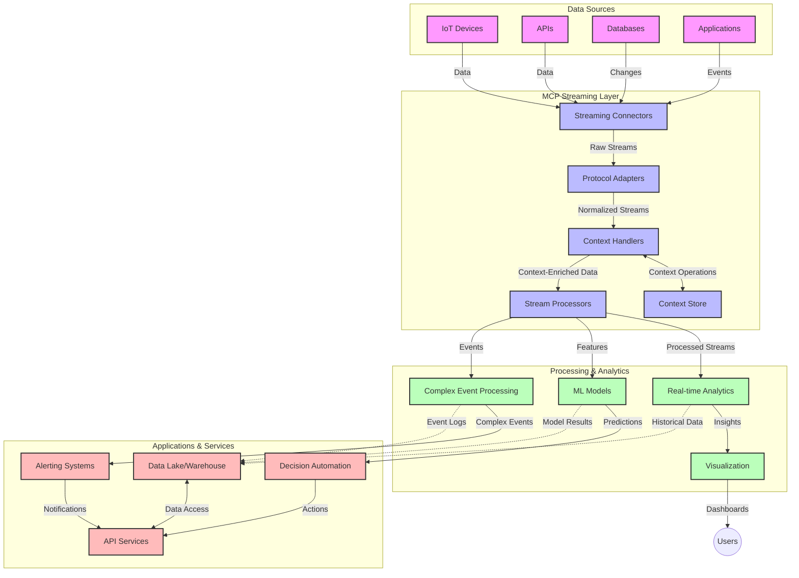

<!--
CO_OP_TRANSLATOR_METADATA:
{
  "original_hash": "68c518dbff8a3b127ed2aa934054c56c",
  "translation_date": "2025-06-11T17:32:41+00:00",
  "source_file": "05-AdvancedTopics/mcp-realtimestreaming/README.md",
  "language_code": "sr"
}
-->
# Model Context Protocol za striming podataka u realnom vremenu

## Pregled

Striming podataka u realnom vremenu postao je neophodan u današnjem svetu vođenom podacima, gde preduzeća i aplikacije zahtevaju trenutni pristup informacijama kako bi donosili pravovremene odluke. Model Context Protocol (MCP) predstavlja značajan napredak u optimizaciji ovih procesa strimovanja u realnom vremenu, poboljšavajući efikasnost obrade podataka, održavajući kontekstualni integritet i unapređujući ukupne performanse sistema.

Ovaj modul istražuje kako MCP transformiše striming podataka u realnom vremenu pružajući standardizovan pristup upravljanju kontekstom između AI modela, striming platformi i aplikacija.

## Uvod u striming podataka u realnom vremenu

Striming podataka u realnom vremenu je tehnološki koncept koji omogućava kontinuirani prenos, obradu i analizu podataka čim se generišu, dozvoljavajući sistemima da odmah reaguju na nove informacije. Za razliku od tradicionalne obrade u serijama koja radi sa statičkim skupovima podataka, striming obrađuje podatke u pokretu, pružajući uvide i akcije sa minimalnim kašnjenjem.

### Osnovni pojmovi strimovanja podataka u realnom vremenu:

- **Kontinuirani protok podataka**: Podaci se obrađuju kao neprekidni, beskonačni tok događaja ili zapisa.
- **Obrada sa niskom latencijom**: Sistemi su dizajnirani da minimizuju vreme između generisanja i obrade podataka.
- **Skalabilnost**: Arhitekture strimovanja moraju da podnesu varijabilne količine i brzine podataka.
- **Otpornost na greške**: Sistemi moraju biti otporni na kvarove kako bi se obezbedio neprekidan protok podataka.
- **Obrada sa održavanjem stanja**: Očuvanje konteksta kroz događaje je ključno za smisleniju analizu.

### Model Context Protocol i striming u realnom vremenu

Model Context Protocol (MCP) rešava nekoliko ključnih izazova u okruženjima za striming u realnom vremenu:

1. **Kontekstualna kontinuitet**: MCP standardizuje način na koji se kontekst održava kroz distribuirane komponente strimovanja, osiguravajući da AI modeli i procesorski čvorovi imaju pristup relevantnom istorijskom i okruženjskom kontekstu.

2. **Efikasno upravljanje stanjem**: Pružajući strukturirane mehanizme za prenos konteksta, MCP smanjuje opterećenje upravljanja stanjem u striming cevovodima.

3. **Interoperabilnost**: MCP stvara zajednički jezik za deljenje konteksta između različitih tehnologija za striming i AI modela, omogućavajući fleksibilnije i proširivije arhitekture.

4. **Kontekst optimizovan za striming**: Implementacije MCP-a mogu da prioritizuju koje su kontekstualne stavke najvažnije za donošenje odluka u realnom vremenu, optimizujući performanse i tačnost.

5. **Adaptivna obrada**: Uz pravilno upravljanje kontekstom preko MCP-a, sistemi za striming mogu dinamički prilagođavati obradu na osnovu promenljivih uslova i obrazaca u podacima.

U savremenim aplikacijama, od IoT mreža senzora do finansijskih platformi za trgovanje, integracija MCP-a sa tehnologijama za striming omogućava inteligentniju, kontekstualno svesnu obradu koja može adekvatno reagovati na složene i promenljive situacije u realnom vremenu.

## Ciljevi učenja

Na kraju ovog časa bićete u stanju da:

- Razumete osnove strimovanja podataka u realnom vremenu i njegove izazove
- Objasnite kako Model Context Protocol (MCP) unapređuje striming podataka u realnom vremenu
- Implementirate rešenja za striming zasnovana na MCP-u koristeći popularne okvire kao što su Kafka i Pulsar
- Dizajnirate i implementirate arhitekture za striming otporne na greške i visokih performansi sa MCP-om
- Primijenite koncepte MCP-a u IoT, finansijskom trgovanju i AI-driven analitici
- Procijenite nove trendove i buduće inovacije u tehnologijama strimovanja zasnovanim na MCP-u

### Definicija i značaj

Striming podataka u realnom vremenu podrazumeva kontinuiranu generaciju, obradu i isporuku podataka sa minimalnim kašnjenjem. Za razliku od obrade u serijama, gde se podaci prikupljaju i obrađuju u grupama, striming podaci se obrađuju inkrementalno čim stignu, omogućavajući trenutne uvide i akcije.

Ključne karakteristike strimovanja podataka u realnom vremenu uključuju:

- **Niska latencija**: Obrada i analiza podataka u roku od milisekundi do sekundi
- **Kontinuirani protok**: Neprekidni tokovi podataka iz različitih izvora
- **Neposredna obrada**: Analiza podataka čim stignu, a ne u serijama
- **Arhitektura vođena događajima**: Reagovanje na događaje čim se dese

### Izazovi u tradicionalnom strimovanju podataka

Tradicionalni pristupi strimovanju suočavaju se sa nekoliko ograničenja:

1. **Gubitak konteksta**: Teškoće u održavanju konteksta u distribuiranim sistemima
2. **Problemi sa skalabilnošću**: Izazovi u skaliranju za rukovanje velikim količinama i brzinama podataka
3. **Složenost integracije**: Problemi sa interoperabilnošću između različitih sistema
4. **Upravljanje latencijom**: Balansiranje između protoka podataka i vremena obrade
5. **Konzistentnost podataka**: Obezbeđivanje tačnosti i potpunosti podataka kroz ceo tok

## Razumevanje Model Context Protocol-a (MCP)

### Šta je MCP?

Model Context Protocol (MCP) je standardizovani komunikacioni protokol dizajniran da omogući efikasnu interakciju između AI modela i aplikacija. U kontekstu strimovanja podataka u realnom vremenu, MCP pruža okvir za:

- Očuvanje konteksta kroz ceo cevovod podataka
- Standardizaciju formata razmene podataka
- Optimizaciju prenosa velikih skupova podataka
- Unapređenje komunikacije između modela i između modela i aplikacija

### Osnovne komponente i arhitektura

Arhitektura MCP-a za striming u realnom vremenu sastoji se od nekoliko ključnih komponenti:

1. **Context Handlers**: Upravljaju i održavaju kontekstualne informacije kroz striming cevovod
2. **Stream Processors**: Obradjuju dolazne tokove podataka koristeći tehnike koje uzimaju u obzir kontekst
3. **Protocol Adapters**: Pretvaraju između različitih striming protokola uz očuvanje konteksta
4. **Context Store**: Efikasno skladišti i preuzima kontekstualne informacije
5. **Streaming Connectors**: Povezuju se sa različitim platformama za striming (Kafka, Pulsar, Kinesis, itd.)



### Kako MCP poboljšava obradu podataka u realnom vremenu

MCP rešava tradicionalne izazove strimovanja kroz:

- **Kontekstualni integritet**: Održavanje odnosa između podataka kroz ceo cevovod
- **Optimizovan prenos**: Smanjenje redundancije u razmeni podataka kroz inteligentno upravljanje kontekstom
- **Standardizovani interfejsi**: Pružanje konzistentnih API-ja za komponente strimovanja
- **Smanjena latencija**: Minimiziranje dodatnog opterećenja obradom kroz efikasno rukovanje kontekstom
- **Povećana skalabilnost**: Podrška horizontalnom skaliranju uz očuvanje konteksta

## Integracija i implementacija

Sistemi za striming podataka u realnom vremenu zahtevaju pažljiv dizajn arhitekture i implementaciju kako bi se održale performanse i kontekstualni integritet. Model Context Protocol nudi standardizovani pristup integraciji AI modela i tehnologija za striming, omogućavajući sofisticiranije, kontekstualno svesne cevovode za obradu podataka.

### Pregled integracije MCP-a u striming arhitekture

Implementacija MCP-a u okruženjima za striming u realnom vremenu uključuje nekoliko ključnih aspekata:

1. **Serijalizacija i transport konteksta**: MCP pruža efikasne mehanizme za kodiranje kontekstualnih informacija unutar paketa striming podataka, osiguravajući da bitan kontekst prati podatke kroz ceo proces. Ovo uključuje standardizovane formate serijalizacije optimizovane za striming transport.

2. **Obrada tokova sa održavanjem stanja**: MCP omogućava inteligentniju obradu sa održavanjem stanja tako što održava konzistentnu reprezentaciju konteksta kroz procesorske čvorove. Ovo je naročito važno u distribuiranim striming arhitekturama gde je upravljanje stanjem tradicionalno izazovno.

3. **Vreme događaja vs. vreme obrade**: Implementacije MCP-a u striming sistemima moraju rešavati uobičajeni izazov razlikovanja kada su se događaji desili i kada se vrši njihova obrada. Protokol može uključiti vremenski kontekst koji čuva semantiku vremena događaja.

4. **Upravljanje pritisakom (Backpressure)**: Standardizacijom upravljanja kontekstom, MCP pomaže u upravljanju pritiskom u striming sistemima, omogućavajući komponentama da komuniciraju svoje kapacitete obrade i prilagođavaju protok podataka.

5. **Kontekstualno prozoričenje i agregacija**: MCP olakšava sofisticiranije operacije prozoričenja pružajući strukturirane reprezentacije vremenskog i relacijskog konteksta, omogućavajući smislenije agregacije kroz tokove događaja.

6. **Obrada tačno jednom (Exactly-Once Processing)**: U sistemima gde je potrebna semantika tačno jednom, MCP može uključiti metapodatke obrade koji pomažu u praćenju i verifikaciji statusa obrade kroz distribuirane komponente.

Implementacija MCP-a u različitim tehnologijama za striming stvara jedinstven pristup upravljanju kontekstom, smanjujući potrebu za prilagođenim kodom za integraciju i povećavajući sposobnost sistema da održava smisleni kontekst tokom protoka podataka.

### MCP u različitim okvirima za striming podataka

MCP se može integrisati sa popularnim okvirima za striming, uključujući:

#### Integracija sa Apache Kafka

```python
from mcp_streaming import MCPKafkaConnector

# Initialize MCP Kafka connector
connector = MCPKafkaConnector(
    bootstrap_servers='localhost:9092',
    context_preservation=True
)

# Create a context-aware consumer
consumer = connector.create_consumer('input-topic')

# Process streaming data with context
for message in consumer:
    context = message.get_context()
    data = message.get_value()
    
    # Process with context awareness
    result = process_with_context(data, context)
    
    # Produce output with preserved context
    connector.produce('output-topic', result, context=context)
```

#### Implementacija sa Apache Pulsar

```python
from mcp_streaming import MCPPulsarClient

# Initialize MCP Pulsar client
client = MCPPulsarClient('pulsar://localhost:6650')

# Subscribe with context awareness
consumer = client.subscribe('input-topic', 'subscription-name', 
                           context_enabled=True)

# Process messages with context preservation
while True:
    message = consumer.receive()
    context = message.get_context()
    
    # Process with context
    result = process_with_context(message.data(), context)
    
    # Acknowledge the message
    consumer.acknowledge(message)
    
    # Send result with preserved context
    producer = client.create_producer('output-topic')
    producer.send(result, context=context)
```

### Najbolje prakse za implementaciju

Prilikom implementacije MCP-a za striming u realnom vremenu:

1. **Dizajn za otpornost na greške**:
   - Implementirajte pravilno rukovanje greškama
   - Koristite dead-letter queue za neuspele poruke
   - Dizajnirajte idempotentne procesore

2. **Optimizacija performansi**:
   - Konfigurišite odgovarajuće veličine bafera
   - Koristite batch obradu gde je prikladno
   - Implementirajte mehanizme za upravljanje pritiskom

3. **Praćenje i nadzor**:
   - Pratite metrike obrade tokova
   - Nadgledajte propagaciju konteksta
   - Postavite alarme za anomalije

4. **Zaštita tokova**:
   - Implementirajte enkripciju za osetljive podatke
   - Koristite autentifikaciju i autorizaciju
   - Primijenite odgovarajuće kontrole pristupa

### MCP u IoT i edge računarstvu

MCP unapređuje IoT striming kroz:

- Očuvanje konteksta uređaja kroz cevovod obrade
- Omogućavanje efikasnog strimovanja podataka sa edge uređaja do oblaka
- Podršku za analitiku u realnom vremenu na IoT tokovima podataka
- Olakšavanje komunikacije uređaj-uređaj sa kontekstom

Primer: Mreže senzora u pametnim gradovima  
```
Sensors → Edge Gateways → MCP Stream Processors → Real-time Analytics → Automated Responses
```

### Uloga u finansijskim transakcijama i trgovanju visokim frekvencijama

MCP pruža značajne prednosti za striming finansijskih podataka:

- Ultra-niska latencija obrade za odluke o trgovanju
- Očuvanje konteksta transakcija tokom obrade
- Podrška za složenu obradu događaja sa kontekstualnom svesnošću
- Obezbeđivanje konzistentnosti podataka u distribuiranim trgovačkim sistemima

### Unapređenje AI-driven analitike podataka

MCP otvara nove mogućnosti za analitiku u realnom vremenu:

- Trening i inferencija modela u realnom vremenu
- Kontinuirano učenje iz strimovanih podataka
- Ekstrakcija funkcija uzimajući u obzir kontekst
- Višestruki pipelines za inferenciju modela uz očuvanje konteksta

## Budući trendovi i inovacije

### Evolucija MCP-a u realnim vremenskim okruženjima

U budućnosti očekujemo da MCP evoluira kako bi se pozabavio:

- **Integracijom kvantnog računarstva**: Priprema za kvantne sisteme za striming
- **Edge-native obradom**: Prebacivanje više kontekstualno svesne obrade na edge uređaje
- **Autonomnim upravljanjem tokovima**: Samooptimizujući se cevovodi za striming
- **Federisanim strimovanjem**: Distribuirana obrada uz očuvanje privatnosti

### Potencijalni tehnološki napreci

Nove tehnologije koje će oblikovati budućnost MCP strimovanja:

1. **AI-optimizovani protokoli za striming**: Prilagođeni protokoli specifični za AI radne zadatke
2. **Integracija neuromorfnih računara**: Računari inspirisani mozgom za obradu tokova
3. **Serverless striming**: Event-driven, skalabilni striming bez upravljanja infrastrukturom
4. **Distribuirane baze konteksta**: Globalno distribuirano, a visoko konzistentno upravljanje kontekstom

## Praktične vežbe

### Vežba 1: Postavljanje osnovnog MCP striming cevovoda

U ovoj vežbi naučićete kako da:
- Konfigurišete osnovno MCP striming okruženje
- Implementirate context handlere za obradu tokova
- Testirate i validirate očuvanje konteksta

### Vežba 2: Izrada dashboard-a za analitiku u realnom vremenu

Kreirajte kompletnu aplikaciju koja:
- Prima strimovane podatke koristeći MCP
- Obradjuje tok dok održava kontekst
- Vizualizuje rezultate u realnom vremenu

### Vežba 3: Implementacija složene obrade događaja sa MCP-om

Napredna vežba koja obuhvata:
- Detekciju obrazaca u tokovima
- Kontekstualnu korelaciju kroz više tokova
- Generisanje složenih događaja sa očuvanim kontekstom

## Dodatni resursi

- [Model Context Protocol Specification](https://github.com/microsoft/model-context-protocol) - Zvanična MCP specifikacija i dokumentacija
- [Apache Kafka Documentation](https://kafka.apache.org/documentation/) - Naučite o Kafki za obradu tokova
- [Apache Pulsar](https://pulsar.apache.org/) - Jedinstvena platforma za poruke i striming
- [Streaming Systems: The What, Where, When, and How of Large-Scale Data Processing](https://www.oreilly.com/library/view/streaming-systems/9781491983867/) - Sveobuhvatna knjiga o arhitekturama za striming
- [Microsoft Azure Event Hubs](https://learn.microsoft.com/en-us/azure/event-hubs/event-hubs-about) - Usluga upravljanog strimovanja događaja
- [MLflow Documentation](https://mlflow.org/docs/latest/index.html) - Za praćenje i implementaciju ML modela
- [Real-Time Analytics with Apache Storm](https://storm.apache.org/releases/current/index.html) - Okvir za obradu u realnom vremenu
- [Flink ML](https://nightlies.apache.org/flink/flink-ml-docs-master/) - Biblioteka za mašinsko učenje za Apache Flink
- [LangChain Documentation](https://python.langchain.com/docs/get_started/introduction) - Izgradnja aplikacija sa LLM-ovima

## Ishodi učenja

Završetkom ovog modula bićete u stanju da:

- Razumete osnove strimovanja podataka u realnom vremenu i njegove izazove
- Objasnite kako Model Context Protocol (MCP) unapređuje striming podataka u realnom vremenu
- Implementirate rešenja za striming zasnovana na MCP-u koristeći popularne okvire kao što su Kafka i Pulsar
- Dizajnirate i implementirate arhitekture za striming otporne na greške i visokih

**Одрицање од одговорности**:  
Овај документ је преведен помоћу AI сервиса за превођење [Co-op Translator](https://github.com/Azure/co-op-translator). Иако настојимо да превод буде тачан, имајте у виду да аутоматски преводи могу садржати грешке или нетачности. Оригинални документ на његовом изворном језику треба сматрати ауторитетним извором. За критичне информације препоручује се професионални људски превод. Нисмо одговорни за било каква неспоразума или погрешна тумачења настала коришћењем овог превода.