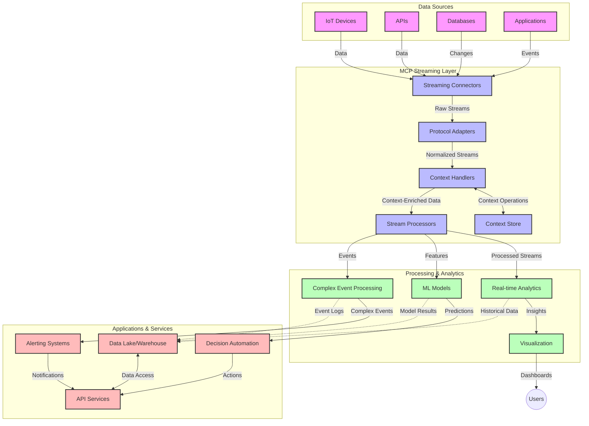

<!--
CO_OP_TRANSLATOR_METADATA:
{
  "original_hash": "b41174ac781ebf228b2043cbdfc09105",
  "translation_date": "2025-06-12T00:49:40+00:00",
  "source_file": "05-AdvancedTopics/mcp-realtimestreaming/README.md",
  "language_code": "sr"
}
-->
# Model Context Protocol za strimovanje podataka u realnom vremenu

## Pregled

Strimovanje podataka u realnom vremenu postalo je neophodno u današnjem svetu vođenom podacima, gde preduzeća i aplikacije zahtevaju trenutni pristup informacijama kako bi donosili pravovremene odluke. Model Context Protocol (MCP) predstavlja značajan napredak u optimizaciji ovih procesa strimovanja, poboljšavajući efikasnost obrade podataka, održavajući kontekstualni integritet i unapređujući ukupne performanse sistema.

Ovaj modul istražuje kako MCP transformiše strimovanje podataka u realnom vremenu pružajući standardizovan pristup upravljanju kontekstom između AI modela, platformi za strimovanje i aplikacija.

## Uvod u strimovanje podataka u realnom vremenu

Strimovanje podataka u realnom vremenu je tehnološki koncept koji omogućava kontinuirani prenos, obradu i analizu podataka dok se generišu, omogućavajući sistemima da odmah reaguju na nove informacije. Za razliku od tradicionalne obrade u serijama koja radi sa statičnim skupovima podataka, strimovanje obrađuje podatke u pokretu, pružajući uvide i akcije sa minimalnim kašnjenjem.

### Osnovni pojmovi strimovanja podataka u realnom vremenu:

- **Kontinuirani protok podataka**: Podaci se obrađuju kao neprekidni, beskonačni tok događaja ili zapisa.
- **Obrada sa niskom latencijom**: Sistemi su dizajnirani da minimizuju vreme između generisanja i obrade podataka.
- **Skalabilnost**: Arhitekture za strimovanje moraju da podnesu promenljive količine i brzine podataka.
- **Otpornost na greške**: Sistemi moraju biti otporni na kvarove kako bi obezbedili neprekidan tok podataka.
- **Obrada sa stanjem**: Održavanje konteksta između događaja je ključno za smisleniju analizu.

### Model Context Protocol i strimovanje u realnom vremenu

Model Context Protocol (MCP) rešava nekoliko ključnih izazova u okruženjima za strimovanje u realnom vremenu:

1. **Kontekstualna kontinuitet**: MCP standardizuje način na koji se kontekst održava kroz distribuirane komponente strimovanja, osiguravajući da AI modeli i čvorovi za obradu imaju pristup relevantnom istorijskom i okruženjskom kontekstu.

2. **Efikasno upravljanje stanjem**: Pružajući strukturirane mehanizme za prenos konteksta, MCP smanjuje opterećenje upravljanja stanjem u strim cevovodima.

3. **Interoperabilnost**: MCP kreira zajednički jezik za deljenje konteksta između različitih tehnologija za strimovanje i AI modela, omogućavajući fleksibilnije i proširivije arhitekture.

4. **Strimovanju prilagođen kontekst**: Implementacije MCP-a mogu da daju prioritet najvažnijim elementima konteksta za donošenje odluka u realnom vremenu, optimizujući i performanse i preciznost.

5. **Adaptivna obrada**: Uz adekvatno upravljanje kontekstom kroz MCP, sistemi za strimovanje mogu dinamički prilagođavati obradu na osnovu promenljivih uslova i obrazaca u podacima.

U savremenim aplikacijama, od IoT senzorskih mreža do finansijskih platformi za trgovanje, integracija MCP-a sa tehnologijama za strimovanje omogućava pametniju, kontekstualno svesnu obradu koja može adekvatno da reaguje na složene, promenljive situacije u realnom vremenu.

## Ciljevi učenja

Na kraju ovog časa bićete u stanju da:

- Razumete osnove strimovanja podataka u realnom vremenu i njegove izazove
- Objasnite kako Model Context Protocol (MCP) unapređuje strimovanje podataka u realnom vremenu
- Implementirate rešenja za strimovanje zasnovana na MCP koristeći popularne okvire kao što su Kafka i Pulsar
- Dizajnirate i implementirate arhitekture za strimovanje otpornog na greške i visokih performansi sa MCP-om
- Primijenite koncepte MCP-a u IoT, finansijskom trgovanju i AI analitici
- Procijenite nove trendove i buduće inovacije u tehnologijama za strimovanje zasnovanim na MCP-u

### Definicija i značaj

Strimovanje podataka u realnom vremenu podrazumeva kontinuiranu generaciju, obradu i isporuku podataka sa minimalnim kašnjenjem. Za razliku od obrade u serijama, gde se podaci prikupljaju i obrađuju grupno, strimovani podaci se obrađuju postepeno čim stignu, omogućavajući trenutne uvide i akcije.

Ključne karakteristike strimovanja podataka u realnom vremenu uključuju:

- **Niska latencija**: Obrada i analiza podataka u milisekundama do sekundi
- **Kontinuirani protok**: Neprekidni tokovi podataka iz različitih izvora
- **Neposredna obrada**: Analiza podataka čim stignu, a ne u serijama
- **Arhitektura vođena događajima**: Reagovanje na događaje čim se dese

### Izazovi u tradicionalnom strimovanju podataka

Tradicionalni pristupi strimovanju suočavaju se sa nekoliko ograničenja:

1. **Gubitak konteksta**: Teškoće u održavanju konteksta kroz distribuirane sisteme
2. **Problemi sa skalabilnošću**: Izazovi u skaliranju za obradu velikih količina i brzina podataka
3. **Kompleksnost integracije**: Problemi sa interoperabilnošću između različitih sistema
4. **Upravljanje latencijom**: Balansiranje protoka podataka i vremena obrade
5. **Konzistentnost podataka**: Obezbeđivanje tačnosti i potpunosti podataka kroz tok

## Razumevanje Model Context Protocol (MCP)

### Šta je MCP?

Model Context Protocol (MCP) je standardizovani komunikacioni protokol dizajniran da omogući efikasnu interakciju između AI modela i aplikacija. U kontekstu strimovanja podataka u realnom vremenu, MCP pruža okvir za:

- Očuvanje konteksta kroz ceo cevovod podataka
- Standardizaciju formata za razmenu podataka
- Optimizaciju prenosa velikih skupova podataka
- Unapređenje komunikacije između modela i između modela i aplikacija

### Osnovne komponente i arhitektura

Arhitektura MCP-a za strimovanje u realnom vremenu sastoji se od nekoliko ključnih komponenti:

1. **Context Handlers**: Upravljaju i održavaju kontekstualne informacije kroz cevovod strimovanja
2. **Stream Processors**: Obradjuju dolazne tokove podataka koristeći tehnike svesne konteksta
3. **Protocol Adapters**: Pretvaraju protokole za strimovanje dok čuvaju kontekst
4. **Context Store**: Efikasno skladište i pristup kontekstualnim informacijama
5. **Streaming Connectors**: Povezuju se sa različitim platformama za strimovanje (Kafka, Pulsar, Kinesis itd.)



### Kako MCP poboljšava obradu podataka u realnom vremenu

MCP rešava tradicionalne izazove strimovanja kroz:

- **Kontekstualni integritet**: Održavanje veza između podataka kroz ceo cevovod
- **Optimizovan prenos**: Smanjenje redundantnosti u razmeni podataka inteligentnim upravljanjem kontekstom
- **Standardizovani interfejsi**: Pružanje konzistentnih API-ja za komponente strimovanja
- **Smanjena latencija**: Minimiziranje opterećenja obrade kroz efikasno upravljanje kontekstom
- **Poboljšana skalabilnost**: Podrška horizontalnom skaliranju uz očuvanje konteksta

## Integracija i implementacija

Sistemi za strimovanje podataka u realnom vremenu zahtevaju pažljiv dizajn arhitekture i implementaciju kako bi održali i performanse i kontekstualni integritet. Model Context Protocol nudi standardizovan pristup integraciji AI modela i tehnologija za strimovanje, omogućavajući sofisticiranije, kontekstualno svesne cevovode za obradu.

### Pregled integracije MCP-a u arhitekture za strimovanje

Implementacija MCP-a u okruženjima za strimovanje u realnom vremenu podrazumeva nekoliko ključnih aspekata:

1. **Serijalizacija i prenos konteksta**: MCP pruža efikasne mehanizme za kodiranje kontekstualnih informacija unutar paketa podataka za strimovanje, osiguravajući da ključni kontekst prati podatke kroz ceo cevovod obrade. Ovo uključuje standardizovane formate serijalizacije optimizovane za prenos u strimovanju.

2. **Obrada toka sa stanjem**: MCP omogućava inteligentniju obradu sa stanjem održavajući konzistentnu reprezentaciju konteksta kroz čvorove za obradu. Ovo je naročito važno u distribuiranim arhitekturama gde je upravljanje stanjem tradicionalno izazovno.

3. **Vreme događaja naspram vremena obrade**: Implementacije MCP-a u sistemima za strimovanje moraju da se pozabave razlikovanjem između vremena kada se događaj desio i vremena kada se obrađuje. Protokol može uključiti vremenski kontekst koji čuva semantiku vremena događaja.

4. **Upravljanje povratnim pritiskom (backpressure)**: Standardizacijom upravljanja kontekstom, MCP pomaže u kontroli povratnog pritiska u sistemima za strimovanje, omogućavajući komponentama da komuniciraju svoje kapacitete obrade i prilagođavaju protok.

5. **Prozori i agregacija konteksta**: MCP olakšava složenije operacije prozora pružajući strukturirane reprezentacije vremenskog i relacijskog konteksta, omogućavajući smislenije agregacije kroz tokove događaja.

6. **Obrada tačno jednom**: U sistemima koji zahtevaju tačno-jednom semantiku, MCP može uključiti metapodatke obrade koji pomažu u praćenju i verifikaciji statusa obrade kroz distribuirane komponente.

Implementacija MCP-a kroz različite tehnologije za strimovanje stvara jedinstven pristup upravljanju kontekstom, smanjujući potrebu za prilagođenim integracionim kodom, a istovremeno povećavajući sposobnost sistema da održava smisleni kontekst dok podaci prolaze kroz cevovod.

### MCP u različitim okvirima za strimovanje podataka

Ovi primeri prate trenutnu MCP specifikaciju koja se fokusira na JSON-RPC bazirani protokol sa različitim transportnim mehanizmima. Kod prikazuje kako možete implementirati prilagođene transporte koji integrišu platforme za strimovanje kao što su Kafka i Pulsar, a pritom zadržavaju punu kompatibilnost sa MCP protokolom.

Primeri su osmišljeni da pokažu kako se platforme za strimovanje mogu integrisati sa MCP-om kako bi se omogućila obrada podataka u realnom vremenu uz očuvanje kontekstualne svesti koja je centralna za MCP. Ovaj pristup osigurava da uzorci koda tačno odražavaju trenutno stanje MCP specifikacije od juna 2025.

MCP se može integrisati sa popularnim okvirima za strimovanje, uključujući:

#### Integracija Apache Kafka

```python
import asyncio
import json
from typing import Dict, Any, Optional
from confluent_kafka import Consumer, Producer, KafkaError
from mcp.client import Client, ClientCapabilities
from mcp.core.message import JsonRpcMessage
from mcp.core.transports import Transport

# Custom transport class to bridge MCP with Kafka
class KafkaMCPTransport(Transport):
    def __init__(self, bootstrap_servers: str, input_topic: str, output_topic: str):
        self.bootstrap_servers = bootstrap_servers
        self.input_topic = input_topic
        self.output_topic = output_topic
        self.producer = Producer({'bootstrap.servers': bootstrap_servers})
        self.consumer = Consumer({
            'bootstrap.servers': bootstrap_servers,
            'group.id': 'mcp-client-group',
            'auto.offset.reset': 'earliest'
        })
        self.message_queue = asyncio.Queue()
        self.running = False
        self.consumer_task = None
        
    async def connect(self):
        """Connect to Kafka and start consuming messages"""
        self.consumer.subscribe([self.input_topic])
        self.running = True
        self.consumer_task = asyncio.create_task(self._consume_messages())
        return self
        
    async def _consume_messages(self):
        """Background task to consume messages from Kafka and queue them for processing"""
        while self.running:
            try:
                msg = self.consumer.poll(1.0)
                if msg is None:
                    await asyncio.sleep(0.1)
                    continue
                
                if msg.error():
                    if msg.error().code() == KafkaError._PARTITION_EOF:
                        continue
                    print(f"Consumer error: {msg.error()}")
                    continue
                
                # Parse the message value as JSON-RPC
                try:
                    message_str = msg.value().decode('utf-8')
                    message_data = json.loads(message_str)
                    mcp_message = JsonRpcMessage.from_dict(message_data)
                    await self.message_queue.put(mcp_message)
                except Exception as e:
                    print(f"Error parsing message: {e}")
            except Exception as e:
                print(f"Error in consumer loop: {e}")
                await asyncio.sleep(1)
    
    async def read(self) -> Optional[JsonRpcMessage]:
        """Read the next message from the queue"""
        try:
            message = await self.message_queue.get()
            return message
        except Exception as e:
            print(f"Error reading message: {e}")
            return None
    
    async def write(self, message: JsonRpcMessage) -> None:
        """Write a message to the Kafka output topic"""
        try:
            message_json = json.dumps(message.to_dict())
            self.producer.produce(
                self.output_topic,
                message_json.encode('utf-8'),
                callback=self._delivery_report
            )
            self.producer.poll(0)  # Trigger callbacks
        except Exception as e:
            print(f"Error writing message: {e}")
    
    def _delivery_report(self, err, msg):
        """Kafka producer delivery callback"""
        if err is not None:
            print(f'Message delivery failed: {err}')
        else:
            print(f'Message delivered to {msg.topic()} [{msg.partition()}]')
    
    async def close(self) -> None:
        """Close the transport"""
        self.running = False
        if self.consumer_task:
            self.consumer_task.cancel()
            try:
                await self.consumer_task
            except asyncio.CancelledError:
                pass
        self.consumer.close()
        self.producer.flush()

# Example usage of the Kafka MCP transport
async def kafka_mcp_example():
    # Create MCP client with Kafka transport
    client = Client(
        {"name": "kafka-mcp-client", "version": "1.0.0"},
        ClientCapabilities({})
    )
    
    # Create and connect the Kafka transport
    transport = KafkaMCPTransport(
        bootstrap_servers="localhost:9092",
        input_topic="mcp-responses",
        output_topic="mcp-requests"
    )
    
    await client.connect(transport)
    
    try:
        # Initialize the MCP session
        await client.initialize()
        
        # Example of executing a tool via MCP
        response = await client.execute_tool(
            "process_data",
            {
                "data": "sample data",
                "metadata": {
                    "source": "sensor-1",
                    "timestamp": "2025-06-12T10:30:00Z"
                }
            }
        )
        
        print(f"Tool execution response: {response}")
        
        # Clean shutdown
        await client.shutdown()
    finally:
        await transport.close()

# Run the example
if __name__ == "__main__":
    asyncio.run(kafka_mcp_example())
```

#### Implementacija Apache Pulsar

```python
import asyncio
import json
import pulsar
from typing import Dict, Any, Optional
from mcp.core.message import JsonRpcMessage
from mcp.core.transports import Transport
from mcp.server import Server, ServerOptions
from mcp.server.tools import Tool, ToolExecutionContext, ToolMetadata

# Create a custom MCP transport that uses Pulsar
class PulsarMCPTransport(Transport):
    def __init__(self, service_url: str, request_topic: str, response_topic: str):
        self.service_url = service_url
        self.request_topic = request_topic
        self.response_topic = response_topic
        self.client = pulsar.Client(service_url)
        self.producer = self.client.create_producer(response_topic)
        self.consumer = self.client.subscribe(
            request_topic,
            "mcp-server-subscription",
            consumer_type=pulsar.ConsumerType.Shared
        )
        self.message_queue = asyncio.Queue()
        self.running = False
        self.consumer_task = None
    
    async def connect(self):
        """Connect to Pulsar and start consuming messages"""
        self.running = True
        self.consumer_task = asyncio.create_task(self._consume_messages())
        return self
    
    async def _consume_messages(self):
        """Background task to consume messages from Pulsar and queue them for processing"""
        while self.running:
            try:
                # Non-blocking receive with timeout
                msg = self.consumer.receive(timeout_millis=500)
                
                # Process the message
                try:
                    message_str = msg.data().decode('utf-8')
                    message_data = json.loads(message_str)
                    mcp_message = JsonRpcMessage.from_dict(message_data)
                    await self.message_queue.put(mcp_message)
                    
                    # Acknowledge the message
                    self.consumer.acknowledge(msg)
                except Exception as e:
                    print(f"Error processing message: {e}")
                    # Negative acknowledge if there was an error
                    self.consumer.negative_acknowledge(msg)
            except Exception as e:
                # Handle timeout or other exceptions
                await asyncio.sleep(0.1)
    
    async def read(self) -> Optional[JsonRpcMessage]:
        """Read the next message from the queue"""
        try:
            message = await self.message_queue.get()
            return message
        except Exception as e:
            print(f"Error reading message: {e}")
            return None
    
    async def write(self, message: JsonRpcMessage) -> None:
        """Write a message to the Pulsar output topic"""
        try:
            message_json = json.dumps(message.to_dict())
            self.producer.send(message_json.encode('utf-8'))
        except Exception as e:
            print(f"Error writing message: {e}")
    
    async def close(self) -> None:
        """Close the transport"""
        self.running = False
        if self.consumer_task:
            self.consumer_task.cancel()
            try:
                await self.consumer_task
            except asyncio.CancelledError:
                pass
        self.consumer.close()
        self.producer.close()
        self.client.close()

# Define a sample MCP tool that processes streaming data
@Tool(
    name="process_streaming_data",
    description="Process streaming data with context preservation",
    metadata=ToolMetadata(
        required_capabilities=["streaming"]
    )
)
async def process_streaming_data(
    ctx: ToolExecutionContext,
    data: str,
    source: str,
    priority: str = "medium"
) -> Dict[str, Any]:
    """
    Process streaming data while preserving context
    
    Args:
        ctx: Tool execution context
        data: The data to process
        source: The source of the data
        priority: Priority level (low, medium, high)
        
    Returns:
        Dict containing processed results and context information
    """
    # Example processing that leverages MCP context
    print(f"Processing data from {source} with priority {priority}")
    
    # Access conversation context from MCP
    conversation_id = ctx.conversation_id if hasattr(ctx, 'conversation_id') else "unknown"
    
    # Return results with enhanced context
    return {
        "processed_data": f"Processed: {data}",
        "context": {
            "conversation_id": conversation_id,
            "source": source,
            "priority": priority,
            "processing_timestamp": ctx.get_current_time_iso()
        }
    }

# Example MCP server implementation using Pulsar transport
async def run_mcp_server_with_pulsar():
    # Create MCP server
    server = Server(
        {"name": "pulsar-mcp-server", "version": "1.0.0"},
        ServerOptions(
            capabilities={"streaming": True}
        )
    )
    
    # Register our tool
    server.register_tool(process_streaming_data)
    
    # Create and connect Pulsar transport
    transport = PulsarMCPTransport(
        service_url="pulsar://localhost:6650",
        request_topic="mcp-requests",
        response_topic="mcp-responses"
    )
    
    try:
        # Start the server with the Pulsar transport
        await server.run(transport)
    finally:
        await transport.close()

# Run the server
if __name__ == "__main__":
    asyncio.run(run_mcp_server_with_pulsar())
```

### Najbolje prakse za implementaciju

Prilikom implementacije MCP-a za strimovanje u realnom vremenu:

1. **Dizajnirajte za otpornost na greške**:
   - Implementirajte adekvatno rukovanje greškama
   - Koristite dead-letter queue za neuspešne poruke
   - Dizajnirajte idempotentne procesore

2. **Optimizujte performanse**:
   - Konfigurišite odgovarajuće veličine bafera
   - Koristite grupisanje poruka gde je prikladno
   - Implementirajte mehanizme za upravljanje povratnim pritiskom

3. **Pratite i posmatrajte**:
   - Pratite metrike obrade toka
   - Nadgledajte propagaciju konteksta
   - Postavite upozorenja za anomalije

4. **Osigurajte svoje tokove**:
   - Implementirajte enkripciju za osetljive podatke
   - Koristite autentifikaciju i autorizaciju
   - Primijenite odgovarajuće kontrole pristupa

### MCP u IoT i Edge računarstvu

MCP unapređuje IoT strimovanje tako što:

- Očuva kontekst uređaja kroz cevovod obrade
- Omogućava efikasno strimovanje podataka sa edge uređaja do oblaka
- Podržava analitiku u realnom vremenu na IoT tokovima podataka
- Omogućava komunikaciju uređaj-uređaj sa kontekstom

Primer: Mreže senzora u pametnim gradovima  
```
Sensors → Edge Gateways → MCP Stream Processors → Real-time Analytics → Automated Responses
```

### Uloga u finansijskim transakcijama i trgovanju visokih frekvencija

MCP donosi značajne prednosti za finansijsko strimovanje podataka:

- Ultra-niska latencija obrade za trgovačke odluke
- Održavanje konteksta transakcija kroz ceo proces
- Podrška za složenu obradu događaja sa kontekstualnom svešću
- Obezbeđivanje konzistentnosti podataka u distribuiranim trgovačkim sistemima

### Unapređenje AI-pokretane analitike podataka

MCP otvara nove mogućnosti za analitiku strimovanih podataka:

- Trening i inferencija modela u realnom vremenu
- Kontinuirano učenje iz strimovanih podataka
- Ekstrakcija karakteristika sa svesti o kontekstu
- Više-modelske inferencijske cevovode sa očuvanim kontekstom

## Budući trendovi i inovacije

### Evolucija MCP-a u realnim okruženjima

U budućnosti očekujemo da MCP evoluira kako bi obuhvatio:

- **Integraciju kvantnog računarstva**: Priprema za kvantne sisteme za strimovanje
- **Edge-native obradu**: Premještanje više kontekstualno svesne obrade na edge uređaje
- **Autonomno upravljanje strimom**: Samooptimizujući cevovodi za strimovanje
- **Federativno strimovanje**: Distribuirana obrada uz očuvanje privatnosti

### Potencijalni tehnološki napreci

Tehnologije koje će oblikovati budućnost MCP strimovanja:

1. **AI-optimizovani protokoli za strimovanje**: Prilagođeni protokoli posebno za AI radne zadatke
2. **Integracija neuromorfnih računara**: Računari inspirisani mozgom za obradu strimova
3. **Serverless strimovanje**: Događajima vođeno, skalabilno strimovanje bez upravljanja infrastrukturom
4. **Distribuirana skladišta konteksta**: Globalno distribuirano, ali veoma konzistentno upravljanje kontekstom

## Praktične vežbe

### Vežba 1: Postavljanje osnovnog MCP strim cevovoda

U ovoj vežbi naučićete kako da:  
- Konfigurišete osnovno MCP strim okruženje  
- Implementirate context handlere za obradu toka  
- Testirate i verifikujete očuvanje konteksta

### Vežba 2: Izrada kontrolne table za analitiku u realnom vremenu

Napravite kompletnu aplikaciju koja:  
- Upravlja strimom podataka koristeći MCP  
- Obradjuje tok uz održavanje konteksta  
- Vizualizuje rezultate u realnom vremenu

### Vežba 3: Implementacija složene obrade događaja sa MCP-om

Napredna vežba koja pokriva:  
- Detekciju obrazaca u tokovima  
- Kontekstualnu korelaciju između više tokova  
- Generisanje složenih događaja uz očuvani kontekst

## Dodatni resursi

- [Model Context Protocol Specification](https://github.com/modelcontextprotocol) - Zvanična MCP specifikacija i dokumentacija  
- [Apache Kafka Documentation](https://kafka.apache.org/documentation/) - Učenje o Kafka za obradu strimova  
- [Apache Pulsar](https://pulsar.apache.org/) - Jedinstvena platforma za poruke i strimovanje  
- [Streaming Systems: The What, Where, When, and How of Large-Scale Data Processing](https://www.oreilly.com/library/view/streaming-systems/9781491983867/) - Sveobuhvatna knjiga o arhitekturama za strimovanje  
- [Microsoft Azure Event Hubs](https://learn.microsoft.com/azure/event-hubs/event-hubs-about) - Usluga upravljanog strimovanja događaja  
- [MLflow Documentation](https://mlflow.org/docs/latest/index.html) - Za praćenje i implementaciju ML modela  
- [Real-Time Analytics with Apache Storm](https://storm.apache.org/releases/current/index.html) - Okvir za obradu u realnom vremenu  
- [Flink ML](

**Ограничење одговорности**:  
Овај документ је преведен помоћу AI сервиса за превођење [Co-op Translator](https://github.com/Azure/co-op-translator). Иако се трудимо да превод буде тачан, имајте у виду да аутоматизовани преводи могу садржати грешке или нетачности. Оригинални документ на његовом изворном језику треба сматрати ауторитетним извором. За критичне информације препоручује се професионални превод од стране људског преводиоца. Нисмо одговорни за било каква неспоразума или погрешна тумачења која произилазе из употребе овог превода.