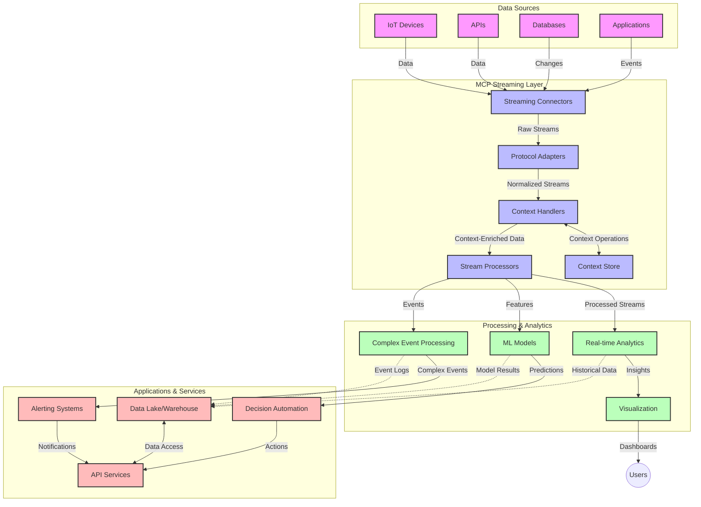

<!--
CO_OP_TRANSLATOR_METADATA:
{
  "original_hash": "195f7287638b77a549acadd96c8f981c",
  "translation_date": "2025-07-14T01:53:05+00:00",
  "source_file": "05-AdvancedTopics/mcp-realtimestreaming/README.md",
  "language_code": "sr"
}
-->
# Протокол контекста модела за стримовање података у реалном времену

## Преглед

Стримовање података у реалном времену постало је кључно у данашњем свету вођеном подацима, где послови и апликације захтевају тренутан приступ информацијама како би доносили правовремене одлуке. Протокол контекста модела (MCP) представља значајан напредак у оптимизацији ових процеса стримовања у реалном времену, побољшавајући ефикасност обраде података, одржавајући контекстуалну интегритет и унапређујући укупне перформансе система.

Овај модул истражује како MCP трансформише стримовање података у реалном времену пружајући стандардизован приступ управљању контекстом између AI модела, платформи за стримовање и апликација.

## Увод у стримовање података у реалном времену

Стримовање података у реалном времену је технолошки концепт који омогућава континуирани пренос, обраду и анализу података у тренутку њиховог настанка, омогућавајући системима да одмах реагују на нове информације. За разлику од традиционалне обраде у пакетима која ради са статичким скупом података, стримовање обрађује податке у покрету, пружајући увиде и акције са минималним закашњењем.

### Основни појмови стримовања података у реалном времену:

- **Континуирани ток података**: Податци се обрађују као непрекидан, бесконачан ток догађаја или записа.
- **Обрада са ниском латенцијом**: Системи су дизајнирани да минимизирају време између настанка и обраде података.
- **Скалабилност**: Архитектуре за стримовање морају да поднесу променљиве количине и брзине података.
- **Отпорност на грешке**: Системи морају бити отпорни на кварове како би обезбедили непрекидан ток података.
- **Обрада са стањем**: Одржавање контекста кроз догађаје је кључно за смислену анализу.

### Протокол контекста модела и стримовање у реалном времену

Протокол контекста модела (MCP) решава неколико кључних изазова у окружењима за стримовање у реалном времену:

1. **Контекстуална континуитет**: MCP стандардизује начин на који се контекст одржава кроз дистрибуиране компоненте за стримовање, обезбеђујући да AI модели и чворови за обраду имају приступ релевантном историјском и окружењском контексту.

2. **Ефикасно управљање стањем**: Пружајући структуиране механизме за пренос контекста, MCP смањује оптерећење управљања стањем у стримовањима.

3. **Интероперабилност**: MCP ствара заједнички језик за дељење контекста између различитих технологија за стримовање и AI модела, омогућавајући флексибилније и прошириве архитектуре.

4. **Контекст оптимизован за стримовање**: Имплементације MCP-а могу приоритетизовати који елементи контекста су најрелевантнији за доношење одлука у реалном времену, оптимизујући и перформансе и прецизност.

5. **Адаптивна обрада**: Уз правилно управљање контекстом кроз MCP, системи за стримовање могу динамички прилагођавати обраду на основу развоја услова и образаца у подацима.

У савременим апликацијама, од IoT мрежа сензора до платформи за финансијско трговање, интеграција MCP-а са технологијама за стримовање омогућава интелигентнију, контекстуално свесну обраду која може адекватно реаговати на сложене, променљиве ситуације у реалном времену.

## Циљеви учења

На крају ове лекције, моћи ћете да:

- Разумете основе стримовања података у реалном времену и његове изазове
- Објасните како Протокол контекста модела (MCP) унапређује стримовање података у реалном времену
- Имплементирате решења за стримовање заснована на MCP користећи популарне оквире као што су Kafka и Pulsar
- Дизајнирате и имплементирате архитектуре за стримовање отпорне на грешке и високе перформансе са MCP
- Примените концепте MCP-а у случајевима коришћења као што су IoT, финансијско трговање и аналитика вођена AI-јем
- Процените нове трендове и будуће иновације у технологијама за стримовање заснованим на MCP-у

### Дефиниција и значај

Стримовање података у реалном времену подразумева континуирано генерисање, обраду и испоруку података са минималним закашњењем. За разлику од обраде у пакетима, где се подаци прикупљају и обрађују у групама, стримовање података се обрађује инкрементално по доласку, омогућавајући тренутне увиде и акције.

Кључне карактеристике стримовања података у реалном времену укључују:

- **Ниска латенција**: Обрада и анализа података у року од милисекунди до секунди
- **Континуирани ток**: Непрекидни токови података из различитих извора
- **Одмах обрада**: Анализа података по доласку, а не у пакетима
- **Архитектура вођена догађајима**: Реаговање на догађаје у тренутку њиховог настанка

### Изазови у традиционалном стримовању података

Традиционални приступи стримовању података суочавају се са неколико ограничења:

1. **Губитак контекста**: Тешкоће у одржавању контекста кроз дистрибуиране системе
2. **Проблеми са скалабилношћу**: Изазови у прилагођавању за обраду великих количина и брзина података
3. **Комплексност интеграције**: Проблеми са интероперабилношћу између различитих система
4. **Управљање латенцијом**: Балансирање између пропусног опсега и времена обраде
5. **Конзистентност података**: Обезбеђивање тачности и потпуности података кроз цео ток

## Разумевање Протокола контекста модела (MCP)

### Шта је MCP?

Протокол контекста модела (MCP) је стандардизовани комуникациони протокол дизајниран да омогући ефикасну интеракцију између AI модела и апликација. У контексту стримовања података у реалном времену, MCP пружа оквир за:

- Очување контекста кроз целу обраду података
- Стандардизацију формата размене података
- Оптимизацију преноса великих скупова података
- Побољшање комуникације између модела и између модела и апликација

### Основне компоненте и архитектура

Архитектура MCP-а за стримовање у реалном времену састоји се од неколико кључних компоненти:

1. **Управљачи контекстом**: Управљају и одржавају контекстуалне информације кроз стримовање
2. **Процесори стримова**: Обрађују долазне токове података користећи технике свесне контекста
3. **Протоколски адаптери**: Претварају између различитих протокола за стримовање уз очување контекста
4. **Складиште контекста**: Ефикасно чува и преузима контекстуалне информације
5. **Конектори за стримовање**: Повезују се са различитим платформама за стримовање (Kafka, Pulsar, Kinesis и др.)



### Како MCP побољшава обраду података у реалном времену

MCP решава традиционалне изазове стримовања кроз:

- **Контекстуални интегритет**: Одржавање веза између података кроз целу обраду
- **Оптимизован пренос**: Смањење вишка у размени података интелигентним управљањем контекстом
- **Стандардизовани интерфејси**: Обезбеђивање конзистентних API-ја за компоненте стримовања
- **Смањење латенције**: Минимално оптерећење обрадом кроз ефикасно руковање контекстом
- **Побољшана скалабилност**: Подршка хоризонталном скалирању уз очување контекста

## Интеграција и имплементација

Системи за стримовање података у реалном времену захтевају пажљив дизајн архитектуре и имплементацију како би одржали и перформансе и контекстуални интегритет. Протокол контекста модела нуди стандардизован приступ интеграцији AI модела и технологија за стримовање, омогућавајући софистицираније, контекстуално свесне цевоводе за обраду.

### Преглед интеграције MCP-а у архитектуре за стримовање

Имплементација MCP-а у окружењима за стримовање у реалном времену укључује неколико кључних аспеката:

1. **Серијализација и транспорт контекста**: MCP пружа ефикасне механизме за кодирање контекстуалних информација у пакете података за стримовање, обезбеђујући да суштински контекст прати податке кроз целу обраду. Ово укључује стандардизоване формате серијализације оптимизоване за транспорт у стримовању.

2. **Обрада стримова са стањем**: MCP омогућава интелигентнију обраду са стањем одржавајући конзистентну репрезентацију контекста кроз чворове за обраду. Ово је посебно вредно у дистрибуираним архитектурама где је управљање стањем традиционално изазов.

3. **Време догађаја у односу на време обраде**: Имплементације MCP-а у системима за стримовање морају решавати уобичајени изазов разликовања када су догађаји настали и када се обрађују. Протокол може укључити временски контекст који чува семантику времена догађаја.

4. **Управљање притиском (backpressure)**: Стандардизовањем руковања контекстом, MCP помаже у управљању притиском у системима за стримовање, омогућавајући компонентама да комуницирају своје капацитете обраде и прилагођавају проток.

5. **Виндоусинг и агрегирање контекста**: MCP олакшава софистицираније операције прозоровања пружајући структуиране репрезентације временског и релативног контекста, омогућавајући смисленије агрегате кроз токове догађаја.

6. **Обрада тачно једном (exactly-once)**: У системима који захтевају тачно једном семантику, MCP може укључити метаподатке обраде који помажу у праћењу и верификацији статуса обраде кроз дистрибуиране компоненте.

Имплементација MCP-а у различитим технологијама за стримовање ствара уједињен приступ управљању контекстом, смањујући потребу за прилагођеним интеграционим кодом и унапређујући способност система да одржи смислен контекст током протока података.

### MCP у различитим оквирима за стримовање података

Ови примери прате тренутну MCP спецификацију која се базира на JSON-RPC протоколу са различитим транспортним механизмима. Код показује како можете имплементирати прилагођене транспорте који интегришу платформе за стримовање као што су Kafka и Pulsar уз потпуну компатибилност са MCP протоколом.

Примери су осмишљени да илуструју како платформе за стримовање могу бити интегрисане са MCP-ом како би пружиле обраду података у реалном времену уз очување контекстуалне свести која је централна за MCP. Овај приступ осигурава да узорци кода тачно одражавају тренутно стање MCP спецификације од јуна 2025.

MCP се може интегрисати са популарним оквирима за стримовање укључујући:

#### Интеграција Apache Kafka

```python
import asyncio
import json
from typing import Dict, Any, Optional
from confluent_kafka import Consumer, Producer, KafkaError
from mcp.client import Client, ClientCapabilities
from mcp.core.message import JsonRpcMessage
from mcp.core.transports import Transport

# Custom transport class to bridge MCP with Kafka
class KafkaMCPTransport(Transport):
    def __init__(self, bootstrap_servers: str, input_topic: str, output_topic: str):
        self.bootstrap_servers = bootstrap_servers
        self.input_topic = input_topic
        self.output_topic = output_topic
        self.producer = Producer({'bootstrap.servers': bootstrap_servers})
        self.consumer = Consumer({
            'bootstrap.servers': bootstrap_servers,
            'group.id': 'mcp-client-group',
            'auto.offset.reset': 'earliest'
        })
        self.message_queue = asyncio.Queue()
        self.running = False
        self.consumer_task = None
        
    async def connect(self):
        """Connect to Kafka and start consuming messages"""
        self.consumer.subscribe([self.input_topic])
        self.running = True
        self.consumer_task = asyncio.create_task(self._consume_messages())
        return self
        
    async def _consume_messages(self):
        """Background task to consume messages from Kafka and queue them for processing"""
        while self.running:
            try:
                msg = self.consumer.poll(1.0)
                if msg is None:
                    await asyncio.sleep(0.1)
                    continue
                
                if msg.error():
                    if msg.error().code() == KafkaError._PARTITION_EOF:
                        continue
                    print(f"Consumer error: {msg.error()}")
                    continue
                
                # Parse the message value as JSON-RPC
                try:
                    message_str = msg.value().decode('utf-8')
                    message_data = json.loads(message_str)
                    mcp_message = JsonRpcMessage.from_dict(message_data)
                    await self.message_queue.put(mcp_message)
                except Exception as e:
                    print(f"Error parsing message: {e}")
            except Exception as e:
                print(f"Error in consumer loop: {e}")
                await asyncio.sleep(1)
    
    async def read(self) -> Optional[JsonRpcMessage]:
        """Read the next message from the queue"""
        try:
            message = await self.message_queue.get()
            return message
        except Exception as e:
            print(f"Error reading message: {e}")
            return None
    
    async def write(self, message: JsonRpcMessage) -> None:
        """Write a message to the Kafka output topic"""
        try:
            message_json = json.dumps(message.to_dict())
            self.producer.produce(
                self.output_topic,
                message_json.encode('utf-8'),
                callback=self._delivery_report
            )
            self.producer.poll(0)  # Trigger callbacks
        except Exception as e:
            print(f"Error writing message: {e}")
    
    def _delivery_report(self, err, msg):
        """Kafka producer delivery callback"""
        if err is not None:
            print(f'Message delivery failed: {err}')
        else:
            print(f'Message delivered to {msg.topic()} [{msg.partition()}]')
    
    async def close(self) -> None:
        """Close the transport"""
        self.running = False
        if self.consumer_task:
            self.consumer_task.cancel()
            try:
                await self.consumer_task
            except asyncio.CancelledError:
                pass
        self.consumer.close()
        self.producer.flush()

# Example usage of the Kafka MCP transport
async def kafka_mcp_example():
    # Create MCP client with Kafka transport
    client = Client(
        {"name": "kafka-mcp-client", "version": "1.0.0"},
        ClientCapabilities({})
    )
    
    # Create and connect the Kafka transport
    transport = KafkaMCPTransport(
        bootstrap_servers="localhost:9092",
        input_topic="mcp-responses",
        output_topic="mcp-requests"
    )
    
    await client.connect(transport)
    
    try:
        # Initialize the MCP session
        await client.initialize()
        
        # Example of executing a tool via MCP
        response = await client.execute_tool(
            "process_data",
            {
                "data": "sample data",
                "metadata": {
                    "source": "sensor-1",
                    "timestamp": "2025-06-12T10:30:00Z"
                }
            }
        )
        
        print(f"Tool execution response: {response}")
        
        # Clean shutdown
        await client.shutdown()
    finally:
        await transport.close()

# Run the example
if __name__ == "__main__":
    asyncio.run(kafka_mcp_example())
```

#### Имплементација Apache Pulsar

```python
import asyncio
import json
import pulsar
from typing import Dict, Any, Optional
from mcp.core.message import JsonRpcMessage
from mcp.core.transports import Transport
from mcp.server import Server, ServerOptions
from mcp.server.tools import Tool, ToolExecutionContext, ToolMetadata

# Create a custom MCP transport that uses Pulsar
class PulsarMCPTransport(Transport):
    def __init__(self, service_url: str, request_topic: str, response_topic: str):
        self.service_url = service_url
        self.request_topic = request_topic
        self.response_topic = response_topic
        self.client = pulsar.Client(service_url)
        self.producer = self.client.create_producer(response_topic)
        self.consumer = self.client.subscribe(
            request_topic,
            "mcp-server-subscription",
            consumer_type=pulsar.ConsumerType.Shared
        )
        self.message_queue = asyncio.Queue()
        self.running = False
        self.consumer_task = None
    
    async def connect(self):
        """Connect to Pulsar and start consuming messages"""
        self.running = True
        self.consumer_task = asyncio.create_task(self._consume_messages())
        return self
    
    async def _consume_messages(self):
        """Background task to consume messages from Pulsar and queue them for processing"""
        while self.running:
            try:
                # Non-blocking receive with timeout
                msg = self.consumer.receive(timeout_millis=500)
                
                # Process the message
                try:
                    message_str = msg.data().decode('utf-8')
                    message_data = json.loads(message_str)
                    mcp_message = JsonRpcMessage.from_dict(message_data)
                    await self.message_queue.put(mcp_message)
                    
                    # Acknowledge the message
                    self.consumer.acknowledge(msg)
                except Exception as e:
                    print(f"Error processing message: {e}")
                    # Negative acknowledge if there was an error
                    self.consumer.negative_acknowledge(msg)
            except Exception as e:
                # Handle timeout or other exceptions
                await asyncio.sleep(0.1)
    
    async def read(self) -> Optional[JsonRpcMessage]:
        """Read the next message from the queue"""
        try:
            message = await self.message_queue.get()
            return message
        except Exception as e:
            print(f"Error reading message: {e}")
            return None
    
    async def write(self, message: JsonRpcMessage) -> None:
        """Write a message to the Pulsar output topic"""
        try:
            message_json = json.dumps(message.to_dict())
            self.producer.send(message_json.encode('utf-8'))
        except Exception as e:
            print(f"Error writing message: {e}")
    
    async def close(self) -> None:
        """Close the transport"""
        self.running = False
        if self.consumer_task:
            self.consumer_task.cancel()
            try:
                await self.consumer_task
            except asyncio.CancelledError:
                pass
        self.consumer.close()
        self.producer.close()
        self.client.close()

# Define a sample MCP tool that processes streaming data
@Tool(
    name="process_streaming_data",
    description="Process streaming data with context preservation",
    metadata=ToolMetadata(
        required_capabilities=["streaming"]
    )
)
async def process_streaming_data(
    ctx: ToolExecutionContext,
    data: str,
    source: str,
    priority: str = "medium"
) -> Dict[str, Any]:
    """
    Process streaming data while preserving context
    
    Args:
        ctx: Tool execution context
        data: The data to process
        source: The source of the data
        priority: Priority level (low, medium, high)
        
    Returns:
        Dict containing processed results and context information
    """
    # Example processing that leverages MCP context
    print(f"Processing data from {source} with priority {priority}")
    
    # Access conversation context from MCP
    conversation_id = ctx.conversation_id if hasattr(ctx, 'conversation_id') else "unknown"
    
    # Return results with enhanced context
    return {
        "processed_data": f"Processed: {data}",
        "context": {
            "conversation_id": conversation_id,
            "source": source,
            "priority": priority,
            "processing_timestamp": ctx.get_current_time_iso()
        }
    }

# Example MCP server implementation using Pulsar transport
async def run_mcp_server_with_pulsar():
    # Create MCP server
    server = Server(
        {"name": "pulsar-mcp-server", "version": "1.0.0"},
        ServerOptions(
            capabilities={"streaming": True}
        )
    )
    
    # Register our tool
    server.register_tool(process_streaming_data)
    
    # Create and connect Pulsar transport
    transport = PulsarMCPTransport(
        service_url="pulsar://localhost:6650",
        request_topic="mcp-requests",
        response_topic="mcp-responses"
    )
    
    try:
        # Start the server with the Pulsar transport
        await server.run(transport)
    finally:
        await transport.close()

# Run the server
if __name__ == "__main__":
    asyncio.run(run_mcp_server_with_pulsar())
```

### Најбоље праксе за имплементацију

При имплементацији MCP-а за стримовање у реалном времену:

1. **Дизајнирајте за отпорност на грешке**:
   - Имплементирајте правилно руковање грешкама
   - Користите dead-letter queue за неуспеле поруке
   - Дизајнирајте идемпотентне процесоре

2. **Оптимизујте перформансе**:
   - Конфигуришите одговарајуће величине бафера
   - Користите батцхинг где је прикладно
   - Имплементирајте механизме за backpressure

3. **Пратите и посматрајте**:
   - Пратите метрике обраде стримова
   - Надгледајте пропагацију контекста
   - Поставите аларме за аномалије

4. **Обезбедите своје токове**:
   - Имплементирајте енкрипцију за осетљиве податке
   - Користите аутентификацију и ауторизацију
   - Примените одговарајуће контроле приступа

### MCP у IoT и Edge рачунарству

MCP унапређује IoT стримовање кроз:

- Очување контекста уређаја кроз цевовод обраде
- Омогућавање ефикасног стримовања података са ивице ка облаку
- Подршку за анализу у реалном времену на IoT токовима података
- Олакшавање комуникације уређај-уређај уз контекст

Пример: Мреже сензора у паметним градовима  
```
Sensors → Edge Gateways → MCP Stream Processors → Real-time Analytics → Automated Responses
```

### Улога у финансијским трансакцијама и трговању високом фреквенцијом

MCP пружа значајне предности за финансијско стримовање података:

- Ултра-ниска латенција обраде за трговинске одлуке
- Одржавање контекста трансакција током обраде
- Подршка сложеној обради догађаја са контекстуалном свешћу
- Обезбеђивање конзистентности података у дистрибуираним трговинским системима

### Унапређење аналитике вођене AI-јем

MCP отвара нове могућности за стриминг аналитику:

- Тренирање и извођење модела у реалном времен

**Одрицање од одговорности**:  
Овај документ је преведен коришћењем AI услуге за превођење [Co-op Translator](https://github.com/Azure/co-op-translator). Иако се трудимо да превод буде тачан, молимо вас да имате у виду да аутоматски преводи могу садржати грешке или нетачности. Оригинални документ на његовом изворном језику треба сматрати ауторитетним извором. За критичне информације препоручује се професионални људски превод. Нисмо одговорни за било каква неспоразума или погрешна тумачења која произилазе из коришћења овог превода.