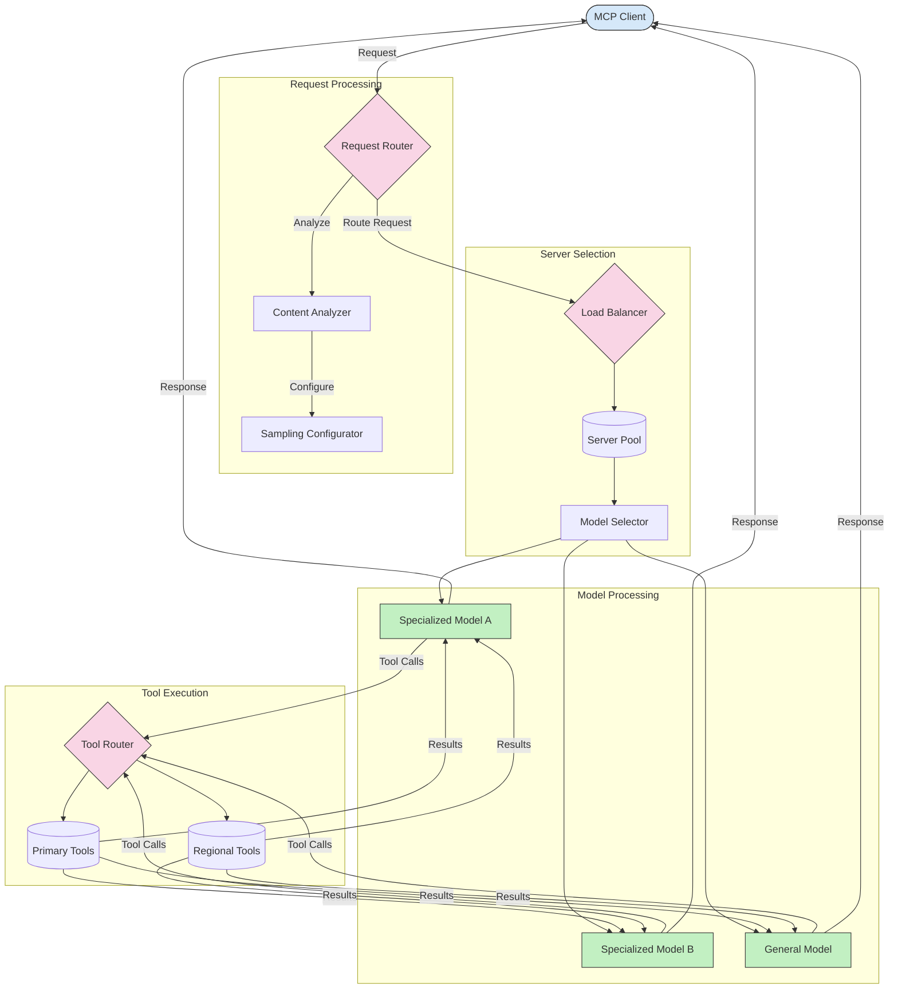

<!--
CO_OP_TRANSLATOR_METADATA:
{
  "original_hash": "a621fc52c7daec552eb8b3b48c0361dd",
  "translation_date": "2025-06-02T19:49:51+00:00",
  "source_file": "05-AdvancedTopics/mcp-routing/README.md",
  "language_code": "sr"
}
-->
## Dinamično usmeravanje alata

Usmeravanje alata osigurava da se pozivi alata šalju najprikladnijoj usluzi na osnovu konteksta. Na primer, poziv alata za vremensku prognozu može biti usmeren ka regionalnoj tački pristupa u zavisnosti od lokacije korisnika, ili alat za kalkulator može koristiti specifičnu verziju API-ja.

Pogledajmo primer implementacije koji prikazuje dinamično usmeravanje alata zasnovano na analizi zahteva, regionalnim tačkama pristupa i podršci za verzionisanje.

## Arhitektura uzorkovanja i usmeravanja u MCP

Uzorkovanje je ključna komponenta Model Context Protocol (MCP) koja omogućava efikasnu obradu i usmeravanje zahteva. Uključuje analizu dolaznih zahteva kako bi se odredio najprikladniji model ili usluga za njihovo rukovanje, na osnovu različitih kriterijuma kao što su tip sadržaja, kontekst korisnika i opterećenje sistema.

Uzorkovanje i usmeravanje se mogu kombinovati da bi se kreirala robusna arhitektura koja optimizuje korišćenje resursa i obezbeđuje visoku dostupnost. Proces uzorkovanja može se koristiti za klasifikaciju zahteva, dok ih usmeravanje vodi ka odgovarajućim modelima ili uslugama.

Dijagram ispod ilustruje kako uzorkovanje i usmeravanje funkcionišu zajedno u sveobuhvatnoj MCP arhitekturi:

## Šta sledi

- [Sampling](../mcp-sampling/README.md)

**Одрицање од одговорности**:  
Овај документ је преведен коришћењем AI преводилачке услуге [Co-op Translator](https://github.com/Azure/co-op-translator). Иако се трудимо да превод буде тачан, имајте у виду да аутоматски преводи могу садржати грешке или нетачности. Оригинални документ на његовом изворном језику треба сматрати ауторитетним извором. За критичне информације препоручује се професионални људски превод. Нисмо одговорни за било каква неспоразума или погрешна тумачења настала употребом овог превода.