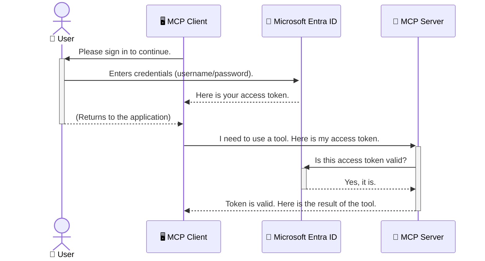

<!--
CO_OP_TRANSLATOR_METADATA:
{
  "original_hash": "6e562d7e5a77c8982da4aa8f762ad1d8",
  "translation_date": "2025-07-14T03:17:30+00:00",
  "source_file": "05-AdvancedTopics/mcp-security-entra/README.md",
  "language_code": "sr"
}
-->
# Осигурање AI радних токова: Entra ID аутентификација за Model Context Protocol сервере

## Увод  
Осигурање вашег Model Context Protocol (MCP) сервера је подједнако важно као и закључавање улазних врата куће. Остављање MCP сервера отвореним излаже ваше алате и податке неовлашћеном приступу, што може довести до безбедносних пропуста. Microsoft Entra ID пружа поуздано решење за управљање идентитетом и приступом у облаку, помажући да само овлашћени корисници и апликације могу да комуницирају са вашим MCP сервером. У овом делу научићете како да заштитите своје AI радне токове користећи Entra ID аутентификацију.

## Циљеви учења  
До краја овог дела моћи ћете да:

- Разумете значај осигурања MCP сервера.  
- Објасните основе Microsoft Entra ID и OAuth 2.0 аутентификације.  
- Препознате разлику између јавних и поверљивих клијената.  
- Имплементирате Entra ID аутентификацију у локалним (јавни клијент) и удаљеним (поверљиви клијент) MCP сервер сценаријима.  
- Примените најбоље безбедносне праксе приликом развоја AI радних токова.

## Безбедност и MCP  

Баш као што не бисте оставили улазна врата куће откључана, тако не треба да остављате MCP сервер отвореним за приступ свима. Осигурање ваших AI радних токова је кључно за изградњу робусних, поузданих и безбедних апликација. Ово поглавље ће вас упознати са коришћењем Microsoft Entra ID за заштиту ваших MCP сервера, осигуравајући да само овлашћени корисници и апликације могу да приступе вашим алатима и подацима.

## Зашто је безбедност важна за MCP сервере  

Замислите да ваш MCP сервер има алат који може да шаље имејлове или приступа бази података клијената. Несигуран сервер значи да било ко може потенцијално да користи тај алат, што може довести до неовлашћеног приступа подацима, слања спама или других злонамерних активности.

Имплементирањем аутентификације осигуравате да сваки захтев ка вашем серверу буде проверен, потврђујући идентитет корисника или апликације која шаље захтев. Ово је први и најважнији корак у осигурању ваших AI радних токова.

## Увод у Microsoft Entra ID  

[**Microsoft Entra ID**](https://adoption.microsoft.com/microsoft-security/entra/) је услуга за управљање идентитетом и приступом у облаку. Можете га замислити као универзалног чувара безбедности за ваше апликације. Он обрађује сложен процес верификације идентитета корисника (аутентификацију) и одређивања шта им је дозвољено да раде (ауторацију).

Коришћењем Entra ID можете:

- Омогућити безбедан пријављивање корисника.  
- Заштитити API-је и сервисе.  
- Управљати политикама приступа са централизоване локације.

За MCP сервере, Entra ID пружа поуздано и широко прихваћено решење за управљање тиме ко може да приступи могућностима вашег сервера.

---

## Разумевање магије: Како функционише Entra ID аутентификација  

Entra ID користи отворене стандарде као што је **OAuth 2.0** за обраду аутентификације. Иако детаљи могу бити сложени, основна идеја је једноставна и може се разумети кроз аналогни пример.

### Нежан увод у OAuth 2.0: Кључ за паркирање  

Замислите OAuth 2.0 као услугу паркирања вашег аутомобила. Када стигнете у ресторан, не дајете паркирачу главни кључ. Уместо тога, дајете **кључ за паркирање** који има ограничена овлашћења — може да упали ауто и закључа врата, али не може да отвори пртљажник или рукавaц.

У овој аналогији:

- **Ви** сте **Корисник**.  
- **Ваш ауто** је **MCP сервер** са вредним алатима и подацима.  
- **Паркирач** је **Microsoft Entra ID**.  
- **Парклирајући радник** је **MCP клијент** (апликација која покушава да приступи серверу).  
- **Кључ за паркирање** је **Access Token**.

Access token је безбедан низ текста који MCP клијент добија од Entra ID након што се пријавите. Клијент затим представља овај токен MCP серверу при сваком захтеву. Сервер може да провери токен како би се уверио да је захтев легитиман и да клијент има потребна овлашћења, све то без потребе да рукује вашим стварним акредитивима (као што је лозинка).

### Ток аутентификације  

Ево како процес функционише у пракси:



### Упознавање са Microsoft Authentication Library (MSAL)  

Пре него што пређемо на код, важно је упознати се са кључном компонентом коју ћете видети у примерима: **Microsoft Authentication Library (MSAL)**.

MSAL је библиотека коју је развио Microsoft и која програмерима знатно олакшава руковање аутентификацијом. Уместо да ви пишете сав сложени код за руковање безбедносним токенима, управљање пријавама и освежавање сесија, MSAL обавља тај тежак посао.

Коришћење библиотеке као што је MSAL се топло препоручује јер:

- **Безбедна је:** Имплементира индустријске стандарде и најбоље безбедносне праксе, смањујући ризик од рањивости у вашем коду.  
- **Поједностављује развој:** Апстрахује сложеност OAuth 2.0 и OpenID Connect протокола, омогућавајући вам да додате робусну аутентификацију у апликацију са само неколико редова кода.  
- **Одржава се:** Microsoft активно одржава и ажурира MSAL како би одговорио на нове безбедносне претње и промене платформи.

MSAL подржава широк спектар језика и оквира за апликације, укључујући .NET, JavaScript/TypeScript, Python, Java, Go и мобилне платформе као што су iOS и Android. То значи да можете користити исте конзистентне обрасце аутентификације у целокупном технолошком стеку.

За више информација о MSAL, можете погледати званичну [MSAL overview документацију](https://learn.microsoft.com/entra/identity-platform/msal-overview).

---

## Осигурање вашег MCP сервера са Entra ID: корак по корак  

Сада ћемо проћи кроз процес осигурања локалног MCP сервера (који комуницира преко `stdio`) користећи Entra ID. Овај пример користи **јавног клијента**, што је прикладно за апликације које раде на корисниковом рачунару, као што су десктоп апликације или локални развојни сервер.

### Сценарио 1: Осигурање локалног MCP сервера (са јавним клијентом)  

У овом сценарију, погледаћемо MCP сервер који ради локално, комуницира преко `stdio` и користи Entra ID за аутентификацију корисника пре него што му дозволи приступ алатима. Сервер ће имати један алат који преузима информације о корисничком профилу са Microsoft Graph API-ја.

#### 1. Подешавање апликације у Entra ID  

Пре него што почнете са писањем кода, потребно је да региструјете своју апликацију у Microsoft Entra ID. Ово обавештава Entra ID о вашој апликацији и даје јој дозволу да користи услугу аутентификације.

1. Идите на **[Microsoft Entra портал](https://entra.microsoft.com/)**.  
2. Отворите **App registrations** и кликните на **New registration**.  
3. Дајте апликацији име (нпр. "My Local MCP Server").  
4. За **Supported account types** изаберите **Accounts in this organizational directory only**.  
5. За овај пример можете оставити **Redirect URI** празан.  
6. Кликните **Register**.

Након регистрације, запамтите **Application (client) ID** и **Directory (tenant) ID**. Биће вам потребни у коду.

#### 2. Код: Преглед  

Погледајмо кључне делове кода који обрађују аутентификацију. Цео код за овај пример доступан је у фасцикли [Entra ID - Local - WAM](https://github.com/Azure-Samples/mcp-auth-servers/tree/main/src/entra-id-local-wam) у [mcp-auth-servers GitHub репозиторијуму](https://github.com/Azure-Samples/mcp-auth-servers).

**`AuthenticationService.cs`**

Ова класа је одговорна за интеракцију са Entra ID.

- **`CreateAsync`**: Ова метода иницијализује `PublicClientApplication` из MSAL-а. Конфигурисана је са `clientId` и `tenantId` ваше апликације.  
- **`WithBroker`**: Омогућава коришћење брокера (нпр. Windows Web Account Manager), који пружа безбедније и глатко искуство једнократне пријаве.  
- **`AcquireTokenAsync`**: Ово је кључна метода. Прво покушава да тихо добије токен (корисник не мора поново да се пријављује ако већ има валидну сесију). Ако тихи приступ није могућ, интерактивно ће тражити од корисника да се пријави.

```csharp
// Simplified for clarity
public static async Task<AuthenticationService> CreateAsync(ILogger<AuthenticationService> logger)
{
    var msalClient = PublicClientApplicationBuilder
        .Create(_clientId) // Your Application (client) ID
        .WithAuthority(AadAuthorityAudience.AzureAdMyOrg)
        .WithTenantId(_tenantId) // Your Directory (tenant) ID
        .WithBroker(new BrokerOptions(BrokerOptions.OperatingSystems.Windows))
        .Build();

    // ... cache registration ...

    return new AuthenticationService(logger, msalClient);
}

public async Task<string> AcquireTokenAsync()
{
    try
    {
        // Try silent authentication first
        var accounts = await _msalClient.GetAccountsAsync();
        var account = accounts.FirstOrDefault();

        AuthenticationResult? result = null;

        if (account != null)
        {
            result = await _msalClient.AcquireTokenSilent(_scopes, account).ExecuteAsync();
        }
        else
        {
            // If no account, or silent fails, go interactive
            result = await _msalClient.AcquireTokenInteractive(_scopes).ExecuteAsync();
        }

        return result.AccessToken;
    }
    catch (Exception ex)
    {
        _logger.LogError(ex, "An error occurred while acquiring the token.");
        throw; // Optionally rethrow the exception for higher-level handling
    }
}
```

**`Program.cs`**

Овде се подешава MCP сервер и интегрише сервис аутентификације.

- **`AddSingleton<AuthenticationService>`**: Региструје `AuthenticationService` у dependency injection контејнеру, тако да га могу користити други делови апликације (нпр. наш алат).  
- **`GetUserDetailsFromGraph` алат**: Овај алат захтева инстанцу `AuthenticationService`. Пре него што било шта уради, позива `authService.AcquireTokenAsync()` да добије валидан access token. Ако је аутентификација успешна, користи токен да позове Microsoft Graph API и преузме корисничке податке.

```csharp
// Simplified for clarity
[McpServerTool(Name = "GetUserDetailsFromGraph")]
public static async Task<string> GetUserDetailsFromGraph(
    AuthenticationService authService)
{
    try
    {
        // This will trigger the authentication flow
        var accessToken = await authService.AcquireTokenAsync();

        // Use the token to create a GraphServiceClient
        var graphClient = new GraphServiceClient(
            new BaseBearerTokenAuthenticationProvider(new TokenProvider(authService)));

        var user = await graphClient.Me.GetAsync();

        return System.Text.Json.JsonSerializer.Serialize(user);
    }
    catch (Exception ex)
    {
        return $"Error: {ex.Message}";
    }
}
```

#### 3. Како све функционише заједно  

1. Када MCP клијент покуша да користи алат `GetUserDetailsFromGraph`, алат прво позива `AcquireTokenAsync`.  
2. `AcquireTokenAsync` покреће MSAL библиотеку да провери да ли постоји валидан токен.  
3. Ако токен није пронађен, MSAL преко брокера тражи од корисника да се пријави са својим Entra ID налогом.  
4. Када се корисник пријави, Entra ID издаје access token.  
5. Алат добија токен и користи га за безбедан позив Microsoft Graph API-ју.  
6. Кориснички подаци се враћају MCP клијенту.

Овај процес осигурава да само аутентификовани корисници могу да користе алат, ефикасно штитећи ваш локални MCP сервер.

### Сценарио 2: Осигурање удаљеног MCP сервера (са поверљивим клијентом)  

Када ваш MCP сервер ради на удаљеној машини (нпр. cloud серверу) и комуницира преко протокола као што је HTTP Streaming, безбедносни захтеви су другачији. У овом случају треба да користите **поверљивог клијента** и **Authorization Code Flow**. Ово је безбеднија метода јер се тајне апликације никада не излажу прегледачу.

Овај пример користи TypeScript базиран MCP сервер који користи Express.js за руковање HTTP захтевима.

#### 1. Подешавање апликације у Entra ID  

Подешавање у Entra ID је слично као код јавног клијента, али са једном кључном разликом: потребно је да креирате **client secret**.

1. Идите на **[Microsoft Entra портал](https://entra.microsoft.com/)**.  
2. У регистрацији апликације идите на таб **Certificates & secrets**.  
3. Кликните **New client secret**, дајте опис и кликните **Add**.  
4. **Важно:** Одмах копирајте вредност тајне. Након тога нећете моћи поново да је видите.  
5. Такође морате да конфигуришете **Redirect URI**. Идите на таб **Authentication**, кликните **Add a platform**, изаберите **Web** и унесите redirect URI за вашу апликацију (нпр. `http://localhost:3001/auth/callback`).

> **⚠️ Важна безбедносна напомена:** За продукционе апликације, Microsoft снажно препоручује коришћење метода аутентификације без тајни као што су **Managed Identity** или **Workload Identity Federation** уместо client secrets. Client secrets носе безбедносне ризике јер могу бити изложени или компромитовани. Managed identities пружају безбеднији приступ елиминишући потребу за чувањем акредитива у коду или конфигурацији.  
>  
> За више информација о managed identities и како их имплементирати, погледајте [Managed identities for Azure resources overview](https://learn.microsoft.com/entra/identity/managed-identities-azure-resources/overview).

#### 2. Код: Преглед  

Овај пример користи приступ заснован на сесијама. Када се корисник аутентификује, сервер чува access token и refresh token у сесији и даје кориснику session token. Овај session token се затим користи за наредне захтеве. Цео код за овај пример доступан је у фасцикли [Entra ID - Confidential client](https://github.com/Azure-Samples/mcp-auth-servers/tree/main/src/entra-id-cca-session) у [mcp-auth-servers GitHub репозиторијуму](https://github.com/Azure-Samples/mcp-auth-servers).

**`Server.ts`**

Овај фајл подешава Express сервер и MCP transport layer.

- **`requireBearerAuth`**: Ово је middleware који штити `/sse` и `/message` крајње тачке. Проверава валидан bearer token у `Authorization` заглављу захтева.  
- **`EntraIdServerAuthProvider`**: Ово је прилагођена класа која имплементира интерфејс `McpServerAuthorizationProvider`. Одговорна је за руковање OAuth 2.0 током.  
- **`/auth/callback`**: Ова крајња тачка обрађује редирект са Entra ID након што се корисник аутентификује. Размењује authorization code за access token и refresh token.

```typescript
// Simplified for clarity
const app = express();
const { server } = createServer();
const provider = new EntraIdServerAuthProvider();

// Protect the SSE endpoint
app.get("/sse", requireBearerAuth({
  provider,
  requiredScopes: ["User.Read"]
}), async (req, res) => {
  // ... connect to the transport ...
});

// Protect the message endpoint
app.post("/message", requireBearerAuth({
  provider,
  requiredScopes: ["User.Read"]
}), async (req, res) => {
  // ... handle the message ...
});

// Handle the OAuth 2.0 callback
app.get("/auth/callback", (req, res) => {
  provider.handleCallback(req.query.code, req.query.state)
    .then(result => {
      // ... handle success or failure ...
    });
});
```

**`Tools.ts`**

Овај фајл дефинише алате које MCP сервер пружа. Алат `getUserDetails` је сличан оном из претходног примера, али добија access token из сесије.

```typescript
// Simplified for clarity
server.setRequestHandler(CallToolRequestSchema, async (request) => {
  const { name } = request.params;
  const context = request.params?.context as { token?: string } | undefined;
  const sessionToken = context?.token;

  if (name === ToolName.GET_USER_DETAILS) {
    if (!sessionToken) {
      throw new AuthenticationError("Authentication token is missing or invalid. Ensure the token is provided in the request context.");
    }

    // Get the Entra ID token from the session store
    const tokenData = tokenStore.getToken(sessionToken);
    const entraIdToken = tokenData.accessToken;

    const graphClient = Client.init({
      authProvider: (done) => {
        done(null, entraIdToken);
      }
    });

    const user = await graphClient.api('/me').get();

    // ... return user details ...
  }
});
```

**`auth/EntraIdServerAuthProvider.ts`**

Ова класа обрађује логику за:

- Редиректовање корисника на Entra ID страницу за пријаву.  
- Размену authorization code за access token.  
- Чување токена у `tokenStore`.  
- Освежавање access token-а када истекне.

#### 3. Како све функционише заједно  

1. Када корисник први пут покуша да се повеже на MCP сервер, `requireBearerAuth` middleware ће уочити да нема валидну сесију и преусмериће га на Entra ID страницу за пријаву.  
2. Корисник се пријављује са својим Entra ID налогом.  
3. Entra ID преусмерава корисника назад на `/auth/callback`
4. Сервер размењује код за access token и refresh token, чува их и креира session token који се шаље клијенту.  
5. Клијент сада може да користи овај session token у `Authorization` заглављу за све будуће захтеве ка MCP серверу.  
6. Када се позове алат `getUserDetails`, он користи session token да пронађе Entra ID access token, а затим га користи за позив Microsoft Graph API-ја.

Овај ток је сложенији од public client тока, али је неопходан за endpoint-ове који су изложени интернету. Пошто су удаљени MCP сервери доступни преко јавног интернета, потребне су јаче безбедносне мере како би се заштитили од неовлашћеног приступа и потенцијалних напада.


## Најбоље безбедносне праксе

- **Увек користите HTTPS**: Енкриптујте комуникацију између клијента и сервера како бисте заштитили токене од пресретања.  
- **Имплементирајте контролу приступа засновану на улогама (RBAC)**: Не проверавајте само *да ли* је корисник аутентификован, већ и *шта* му је дозвољено да ради. Можете дефинисати улоге у Entra ID-у и проверавати их на вашем MCP серверу.  
- **Пратите и ревидирајте**: Логовајте све догађаје аутентификације како бисте могли да откријете и реагујете на сумњиве активности.  
- **Обрадите ограничења броја захтева и успоравање (rate limiting и throttling)**: Microsoft Graph и други API-ји примењују rate limiting да спрече злоупотребу. Имплементирајте експоненцијално одлагање и логику поновног покушаја у вашем MCP серверу како бисте лепо обрадили HTTP 429 (Too Many Requests) одговоре. Размотрите кеширање често приступаних података да бисте смањили број API позива.  
- **Безбедно чување токена**: Чувајте access и refresh токене на безбедан начин. За локалне апликације користите системске механизме за безбедно складиштење. За серверске апликације размислите о коришћењу енкриптованог складишта или сервиса за управљање кључевима као што је Azure Key Vault.  
- **Обрада истека токена**: Access токени имају ограничен рок трајања. Имплементирајте аутоматско освежавање токена коришћењем refresh токена како бисте обезбедили непрекидан кориснички доживљај без потребе за поновном аутентификацијом.  
- **Размотрите коришћење Azure API Management-а**: Иако имплементација безбедности директно у вашем MCP серверу пружа фину контролу, API Gateway-ји као што је Azure API Management могу аутоматски решавати многе безбедносне изазове, укључујући аутентификацију, ауторизацију, rate limiting и праћење. Они пружају централизиран слој безбедности између ваших клијената и MCP сервера. За више детаља о коришћењу API Gateway-ја са MCP, погледајте наш [Azure API Management Your Auth Gateway For MCP Servers](https://techcommunity.microsoft.com/blog/integrationsonazureblog/azure-api-management-your-auth-gateway-for-mcp-servers/4402690).


## Кључне поуке

- Заштита вашег MCP сервера је кључна за безбедност ваших података и алата.  
- Microsoft Entra ID пружа робусно и скалабилно решење за аутентификацију и ауторизацију.  
- Користите **public client** за локалне апликације и **confidential client** за удаљене сервере.  
- **Authorization Code Flow** је најсигурнија опција за веб апликације.


## Вежба

1. Размислите о MCP серверу који бисте могли направити. Да ли би то био локални или удаљени сервер?  
2. На основу одговора, да ли бисте користили public или confidential client?  
3. Које дозволе би ваш MCP сервер тражио за извршавање радњи према Microsoft Graph-у?


## Практичне вежбе

### Вежба 1: Региструјте апликацију у Entra ID  
Идите на Microsoft Entra портал.  
Региструјте нову апликацију за ваш MCP сервер.  
Забележите Application (client) ID и Directory (tenant) ID.

### Вежба 2: Осигурајте локални MCP сервер (Public Client)  
- Пратите пример кода за интеграцију MSAL (Microsoft Authentication Library) за аутентификацију корисника.  
- Тестирајте ток аутентификације позивајући MCP алат који преузима детаље корисника из Microsoft Graph-а.

### Вежба 3: Осигурајте удаљени MCP сервер (Confidential Client)  
- Региструјте confidential client у Entra ID-у и креирајте client secret.  
- Конфигуришите ваш Express.js MCP сервер да користи Authorization Code Flow.  
- Тестирајте заштићене endpoint-ове и потврдите приступ заснован на токену.

### Вежба 4: Примените најбоље безбедносне праксе  
- Омогућите HTTPS за ваш локални или удаљени сервер.  
- Имплементирајте контролу приступа засновану на улогама (RBAC) у логици сервера.  
- Додајте обраду истека токена и безбедно чување токена.

## Ресурси

1. **MSAL Overview Documentation**  
   Сазнајте како Microsoft Authentication Library (MSAL) омогућава безбедно добијање токена на различитим платформама:  
   [MSAL Overview on Microsoft Learn](https://learn.microsoft.com/en-gb/entra/msal/overview)

2. **Azure-Samples/mcp-auth-servers GitHub Repository**  
   Примери имплементација MCP сервера који демонстрирају токове аутентификације:  
   [Azure-Samples/mcp-auth-servers on GitHub](https://github.com/Azure-Samples/mcp-auth-servers)

3. **Managed Identities for Azure Resources Overview**  
   Сазнајте како елиминисати тајне коришћењем системски или кориснички додељених managed identities:  
   [Managed Identities Overview on Microsoft Learn](https://learn.microsoft.com/en-us/entra/identity/managed-identities-azure-resources/)

4. **Azure API Management: Your Auth Gateway for MCP Servers**  
   Детаљан преглед коришћења APIM као безбедног OAuth2 gateway-а за MCP сервере:  
   [Azure API Management Your Auth Gateway For MCP Servers](https://techcommunity.microsoft.com/blog/integrationsonazureblog/azure-api-management-your-auth-gateway-for-mcp-servers/4402690)

5. **Microsoft Graph Permissions Reference**  
   Комплетна листа делегираних и апликацијских дозвола за Microsoft Graph:  
   [Microsoft Graph Permissions Reference](https://learn.microsoft.com/zh-tw/graph/permissions-reference)


## Резултати учења  
Након завршетка овог дела, моћи ћете да:

- Објасните зашто је аутентификација критична за MCP сервере и AI токове рада.  
- Подесите и конфигуришете Entra ID аутентификацију за локалне и удаљене MCP сервере.  
- Изаберете одговарајући тип клијента (public или confidential) у зависности од окружења сервера.  
- Имплементирате безбедне праксе програмирања, укључујући чување токена и ауторизацију засновану на улогама.  
- Са сигурношћу заштитите ваш MCP сервер и његове алате од неовлашћеног приступа.

## Шта следи

- [5.13 Model Context Protocol (MCP) Integration with Azure AI Foundry](../mcp-foundry-agent-integration/README.md)

**Одрицање од одговорности**:  
Овај документ је преведен коришћењем AI преводилачке услуге [Co-op Translator](https://github.com/Azure/co-op-translator). Иако се трудимо да превод буде тачан, молимо вас да имате у виду да аутоматски преводи могу садржати грешке или нетачности. Оригинални документ на његовом изворном језику треба сматрати ауторитетним извором. За критичне информације препоручује се професионални људски превод. Нисмо одговорни за било каква неспоразума или погрешна тумачења која произилазе из коришћења овог превода.