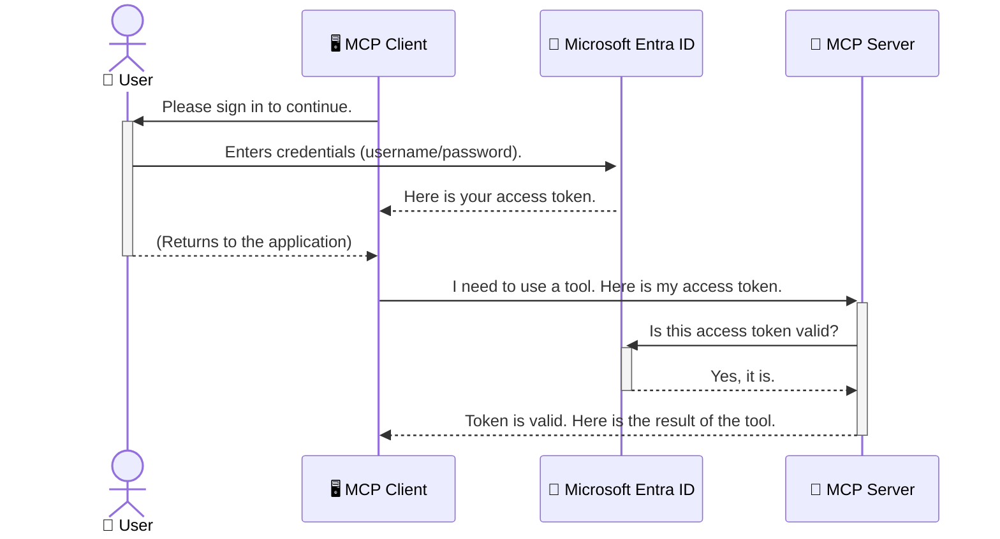

<!--
CO_OP_TRANSLATOR_METADATA:
{
  "original_hash": "6e562d7e5a77c8982da4aa8f762ad1d8",
  "translation_date": "2025-07-02T09:59:10+00:00",
  "source_file": "05-AdvancedTopics/mcp-security-entra/README.md",
  "language_code": "sr"
}
-->
# Заштита AI радних токова: Entra ID аутентификација за Model Context Protocol сервере

## Увод  
Заштита вашег Model Context Protocol (MCP) сервера је подједнако важна као и закључавање улазних врата куће. Остављање MCP сервера отвореним излаже ваше алате и податке неовлашћеном приступу, што може довести до безбедносних пропуста. Microsoft Entra ID пружа поуздано решење за управљање идентитетима и приступом у облаку, помажући да само овлашћени корисници и апликације могу да комуницирају са вашим MCP сервером. У овом делу ћете научити како да заштитите своје AI радне токове коришћењем Entra ID аутентификације.

## Циљеви учења  
До краја овог дела, моћи ћете да:

- Разумете значај заштите MCP сервера.  
- Објасните основе Microsoft Entra ID и OAuth 2.0 аутентификације.  
- Препознате разлику између јавних и поверљивих клијената.  
- Имплементирате Entra ID аутентификацију у локалним (јавни клијент) и удаљеним (поверљиви клијент) MCP сервер сценаријима.  
- Примените најбоље безбедносне праксе приликом развоја AI радних токова.

## Безбедност и MCP

Као што не бисте оставили улазна врата куће откључана, тако не би требало да остављате MCP сервер отвореним за приступ свима. Заштита ваших AI радних токова је кључна за изградњу робусних, поузданих и безбедних апликација. Ово поглавље ће вас упознати са коришћењем Microsoft Entra ID за заштиту ваших MCP сервера, осигуравајући да само овлашћени корисници и апликације могу приступити вашим алатима и подацима.

## Зашто је безбедност важна за MCP сервере

Замислите да ваш MCP сервер има алат који може слати имејлове или приступати бази података клијената. Несигуран сервер би значио да било ко може користити тај алат, што може довести до неовлашћеног приступа подацима, слања спама или других злонамерних активности.

Увођењем аутентификације осигуравате да сваки захтев ка вашем серверу буде верификован, потврђујући идентитет корисника или апликације која шаље захтев. Ово је први и најважнији корак у заштити ваших AI радних токова.

## Увод у Microsoft Entra ID

[**Microsoft Entra ID**](https://adoption.microsoft.com/microsoft-security/entra/) је сервис за управљање идентитетима и приступом базиран на облаку. Можете га посматрати као универзалног чувара безбедности за ваше апликације. Он управља сложеним процесом верификације идентитета корисника (аутентификација) и одређивањем шта им је дозвољено (овлашћење).

Коришћењем Entra ID можете:

- Омогућити безбедан пријављивање корисника.  
- Заштитити API-је и сервисе.  
- Управљати политикама приступа са централизоване локације.

За MCP сервере, Entra ID пружа поуздано и широко прихваћено решење за контролу ко може приступити могућностима вашег сервера.

---

## Разумевање магије: како функционише Entra ID аутентификација

Entra ID користи отворене стандарде као што је **OAuth 2.0** за управљање аутентификацијом. Иако детаљи могу бити сложени, основна идеја је једноставна и може се разумети кроз аналогију.

### Нежан увод у OAuth 2.0: Кључ за парковача

Замислите OAuth 2.0 као услугу парковача за ваш ауто. Када стигнете у ресторан, не дајете парковачу свој главни кључ. Уместо тога, дајете **кључ за парковача** који има ограничене дозволе — може да упали ауто и закључа врата, али не може да отвори пртљажник или рукавицу.

У овој аналогији:

- **Ви** сте **корисник**.  
- **Ваш ауто** је **MCP сервер** са својим вредним алатима и подацима.  
- **Парковач** је **Microsoft Entra ID**.  
- **Паркинг службеник** је **MCP клијент** (апликација која покушава да приступи серверу).  
- **Кључ за парковача** је **Access Token**.

Access token је сигуран низ текста који MCP клијент добија од Entra ID након што се пријавите. Клијент потом шаље овај токен серверу са сваким захтевом. Сервер може проверити токен да би осигурао да је захтев легитиман и да клијент има потребне дозволе, све без потребе да руковође вашим стварним подацима за пријаву (као што је лозинка).

### Ток аутентификације

Процес функционише овако у пракси:



### Увод у Microsoft Authentication Library (MSAL)

Пре него што пређемо на код, важно је представити кључну компоненту коју ћете видети у примерима: **Microsoft Authentication Library (MSAL)**.

MSAL је библиотека коју је развио Microsoft и која програмерима знатно олакшава руковање аутентификацијом. Уместо да ви пишете компликован код за руковање безбедносним токенима, управљање пријавама и освежавање сесија, MSAL то обавља уместо вас.

Коришћење библиотеке као што је MSAL је препоручљиво јер:

- **Безбедна је:** Имплементира индустријске стандарде и најбоље безбедносне праксе, смањујући ризик од рањивости у вашем коду.  
- **Поједностављује развој:** Апстрахује сложеност OAuth 2.0 и OpenID Connect протокола, омогућавајући вам да додате робусну аутентификацију у апликацију са само неколико редова кода.  
- **Одржава се:** Microsoft активно одржава и ажурира MSAL како би се суочио са новим безбедносним претњама и променама платформи.

MSAL подржава велики број језика и оквира апликација, укључујући .NET, JavaScript/TypeScript, Python, Java, Go, као и мобилне платформе као што су iOS и Android. Ово значи да можете користити исте аутентификационе шаблоне у целом технолошком стеку.

За више информација о MSAL, можете погледати званичну [MSAL overview документацију](https://learn.microsoft.com/entra/identity-platform/msal-overview).

---

## Заштита вашег MCP сервера са Entra ID: корак по корак

Хајде сада да прођемо кроз процес заштите локалног MCP сервера (који комуницира преко `stdio`) using Entra ID. This example uses a **public client**, which is suitable for applications running on a user's machine, like a desktop app or a local development server.

### Scenario 1: Securing a Local MCP Server (with a Public Client)

In this scenario, we'll look at an MCP server that runs locally, communicates over `stdio`, and uses Entra ID to authenticate the user before allowing access to its tools. The server will have a single tool that fetches the user's profile information from the Microsoft Graph API.

#### 1. Setting Up the Application in Entra ID

Before writing any code, you need to register your application in Microsoft Entra ID. This tells Entra ID about your application and grants it permission to use the authentication service.

1. Navigate to the **[Microsoft Entra portal](https://entra.microsoft.com/)**.
2. Go to **App registrations** and click **New registration**.
3. Give your application a name (e.g., "My Local MCP Server").
4. For **Supported account types**, select **Accounts in this organizational directory only**.
5. You can leave the **Redirect URI** blank for this example.
6. Click **Register**.

Once registered, take note of the **Application (client) ID** and **Directory (tenant) ID**. You'll need these in your code.

#### 2. The Code: A Breakdown

Let's look at the key parts of the code that handle authentication. The full code for this example is available in the [Entra ID - Local - WAM](https://github.com/Azure-Samples/mcp-auth-servers/tree/main/src/entra-id-local-wam) folder of the [mcp-auth-servers GitHub repository](https://github.com/Azure-Samples/mcp-auth-servers).

**`AuthenticationService.cs`**

This class is responsible for handling the interaction with Entra ID.

- **`CreateAsync`**: This method initializes the `PublicClientApplication` from the MSAL (Microsoft Authentication Library). It's configured with your application's `clientId` and `tenantId`.
- **`WithBroker`**: This enables the use of a broker (like the Windows Web Account Manager), which provides a more secure and seamless single sign-on experience.
- **`AcquireTokenAsync`**: Ово је основна метода. Прво покушава да тихо добије токен (што значи да корисник не мора поново да се пријављује ако већ има валидну сесију). Ако тихи приступ није могућ, корисник ће бити интерактивно затражен да се пријави.

```csharp
// Simplified for clarity
public static async Task<AuthenticationService> CreateAsync(ILogger<AuthenticationService> logger)
{
    var msalClient = PublicClientApplicationBuilder
        .Create(_clientId) // Your Application (client) ID
        .WithAuthority(AadAuthorityAudience.AzureAdMyOrg)
        .WithTenantId(_tenantId) // Your Directory (tenant) ID
        .WithBroker(new BrokerOptions(BrokerOptions.OperatingSystems.Windows))
        .Build();

    // ... cache registration ...

    return new AuthenticationService(logger, msalClient);
}

public async Task<string> AcquireTokenAsync()
{
    try
    {
        // Try silent authentication first
        var accounts = await _msalClient.GetAccountsAsync();
        var account = accounts.FirstOrDefault();

        AuthenticationResult? result = null;

        if (account != null)
        {
            result = await _msalClient.AcquireTokenSilent(_scopes, account).ExecuteAsync();
        }
        else
        {
            // If no account, or silent fails, go interactive
            result = await _msalClient.AcquireTokenInteractive(_scopes).ExecuteAsync();
        }

        return result.AccessToken;
    }
    catch (Exception ex)
    {
        _logger.LogError(ex, "An error occurred while acquiring the token.");
        throw; // Optionally rethrow the exception for higher-level handling
    }
}
```

**`Program.cs`**

This is where the MCP server is set up and the authentication service is integrated.

- **`AddSingleton<AuthenticationService>`**: This registers the `AuthenticationService` with the dependency injection container, so it can be used by other parts of the application (like our tool).
- **`GetUserDetailsFromGraph` tool**: This tool requires an instance of `AuthenticationService`. Before it does anything, it calls `authService.AcquireTokenAsync()` користи за добијање валидан access токен. Ако је аутентификација успешна, користи тај токен за позив Microsoft Graph API и преузима детаље о кориснику.

```csharp
// Simplified for clarity
[McpServerTool(Name = "GetUserDetailsFromGraph")]
public static async Task<string> GetUserDetailsFromGraph(
    AuthenticationService authService)
{
    try
    {
        // This will trigger the authentication flow
        var accessToken = await authService.AcquireTokenAsync();

        // Use the token to create a GraphServiceClient
        var graphClient = new GraphServiceClient(
            new BaseBearerTokenAuthenticationProvider(new TokenProvider(authService)));

        var user = await graphClient.Me.GetAsync();

        return System.Text.Json.JsonSerializer.Serialize(user);
    }
    catch (Exception ex)
    {
        return $"Error: {ex.Message}";
    }
}
```

#### 3. Како све функционише заједно

1. Када MCP клијент покуша да користи `GetUserDetailsFromGraph` tool, the tool first calls `AcquireTokenAsync`.
2. `AcquireTokenAsync` triggers the MSAL library to check for a valid token.
3. If no token is found, MSAL, through the broker, will prompt the user to sign in with their Entra ID account.
4. Once the user signs in, Entra ID issues an access token.
5. The tool receives the token and uses it to make a secure call to the Microsoft Graph API.
6. The user's details are returned to the MCP client.

This process ensures that only authenticated users can use the tool, effectively securing your local MCP server.

### Scenario 2: Securing a Remote MCP Server (with a Confidential Client)

When your MCP server is running on a remote machine (like a cloud server) and communicates over a protocol like HTTP Streaming, the security requirements are different. In this case, you should use a **confidential client** and the **Authorization Code Flow**. This is a more secure method because the application's secrets are never exposed to the browser.

This example uses a TypeScript-based MCP server that uses Express.js to handle HTTP requests.

#### 1. Setting Up the Application in Entra ID

The setup in Entra ID is similar to the public client, but with one key difference: you need to create a **client secret**.

1. Navigate to the **[Microsoft Entra portal](https://entra.microsoft.com/)**.
2. In your app registration, go to the **Certificates & secrets** tab.
3. Click **New client secret**, give it a description, and click **Add**.
4. **Important:** Copy the secret value immediately. You will not be able to see it again.
5. You also need to configure a **Redirect URI**. Go to the **Authentication** tab, click **Add a platform**, select **Web**, and enter the redirect URI for your application (e.g., `http://localhost:3001/auth/callback`).

> **⚠️ Important Security Note:** For production applications, Microsoft strongly recommends using **secretless authentication** methods such as **Managed Identity** or **Workload Identity Federation** instead of client secrets. Client secrets pose security risks as they can be exposed or compromised. Managed identities provide a more secure approach by eliminating the need to store credentials in your code or configuration.
>
> For more information about managed identities and how to implement them, see the [Managed identities for Azure resources overview](https://learn.microsoft.com/entra/identity/managed-identities-azure-resources/overview).

#### 2. The Code: A Breakdown

This example uses a session-based approach. When the user authenticates, the server stores the access token and refresh token in a session and gives the user a session token. This session token is then used for subsequent requests. The full code for this example is available in the [Entra ID - Confidential client](https://github.com/Azure-Samples/mcp-auth-servers/tree/main/src/entra-id-cca-session) folder of the [mcp-auth-servers GitHub repository](https://github.com/Azure-Samples/mcp-auth-servers).

**`Server.ts`**

This file sets up the Express server and the MCP transport layer.

- **`requireBearerAuth`**: This is middleware that protects the `/sse` and `/message` endpoints. It checks for a valid bearer token in the `Authorization` header of the request.
- **`EntraIdServerAuthProvider`**: This is a custom class that implements the `McpServerAuthorizationProvider` interface. It's responsible for handling the OAuth 2.0 flow.
- **`/auth/callback`**: Овај endpoint обрађује преусмеравање са Entra ID након што се корисник аутентификује. Он размењује authorization code за access токен и refresh токен.

```typescript
// Simplified for clarity
const app = express();
const { server } = createServer();
const provider = new EntraIdServerAuthProvider();

// Protect the SSE endpoint
app.get("/sse", requireBearerAuth({
  provider,
  requiredScopes: ["User.Read"]
}), async (req, res) => {
  // ... connect to the transport ...
});

// Protect the message endpoint
app.post("/message", requireBearerAuth({
  provider,
  requiredScopes: ["User.Read"]
}), async (req, res) => {
  // ... handle the message ...
});

// Handle the OAuth 2.0 callback
app.get("/auth/callback", (req, res) => {
  provider.handleCallback(req.query.code, req.query.state)
    .then(result => {
      // ... handle success or failure ...
    });
});
```

**`Tools.ts`**

This file defines the tools that the MCP server provides. The `getUserDetails` алат је сличан оном из претходног примера, али добија access токен из сесије.

```typescript
// Simplified for clarity
server.setRequestHandler(CallToolRequestSchema, async (request) => {
  const { name } = request.params;
  const context = request.params?.context as { token?: string } | undefined;
  const sessionToken = context?.token;

  if (name === ToolName.GET_USER_DETAILS) {
    if (!sessionToken) {
      throw new AuthenticationError("Authentication token is missing or invalid. Ensure the token is provided in the request context.");
    }

    // Get the Entra ID token from the session store
    const tokenData = tokenStore.getToken(sessionToken);
    const entraIdToken = tokenData.accessToken;

    const graphClient = Client.init({
      authProvider: (done) => {
        done(null, entraIdToken);
      }
    });

    const user = await graphClient.api('/me').get();

    // ... return user details ...
  }
});
```

**`auth/EntraIdServerAuthProvider.ts`**

This class handles the logic for:

- Redirecting the user to the Entra ID sign-in page.
- Exchanging the authorization code for an access token.
- Storing the tokens in the `tokenStore`.
- Refreshing the access token when it expires.

#### 3. How It All Works Together

1. When a user first tries to connect to the MCP server, the `requireBearerAuth` middleware will see that they don't have a valid session and will redirect them to the Entra ID sign-in page.
2. The user signs in with their Entra ID account.
3. Entra ID redirects the user back to the `/auth/callback` endpoint with an authorization code.
4. The server exchanges the code for an access token and a refresh token, stores them, and creates a session token which is sent to the client.
5. The client can now use this session token in the `Authorization` header for all future requests to the MCP server.
6. When the `getUserDetails` алат се позива користећи session токен за проналажење Entra ID access токена, а затим користи тај токен за позив Microsoft Graph API.

Овај ток је сложенији од токена за јавне клијенте, али је неопходан за endpoint-ове доступне преко интернета. Пошто удаљени MCP сервери могу бити приступачни преко јавног интернета, потребне су јаче безбедносне мере за заштиту од неовлашћеног приступа и потенцијалних напада.

## Најбоље безбедносне праксе

- **Увек користите HTTPS**: Шифрујте комуникацију између клијента и сервера како бисте спречили пресретање токена.  
- **Имплементирајте контролу приступа засновану на улогама (RBAC)**: Не проверавајте само *да ли* је корисник аутентификован, већ и *шта* му је дозвољено да ради. Можете дефинисати улоге у Entra ID и проверавати их у вашем MCP серверу.  
- **Пратите и ревидирајте**: Логујте све аутентификационе догађаје како бисте могли да откријете и реагујете на сумњиве активности.  
- **Руководите ограничењем броја захтева и успоравањем**: Microsoft Graph и други API-ји примењују rate limiting како би спречили злоупотребу. Имплементирајте експоненцијално одлагање и логику поновног покушаја у вашем MCP серверу за лепо руковање HTTP 429 (Превише захтева) одговорима. Размислите о кеширању често приступаних података како бисте смањили број API позива.  
- **Безбедно складиштење токена**: Чувајте access и refresh токене безбедно. За локалне апликације користите системе безбедне меморије платформе. За серверске апликације размислите о коришћењу шифрованог складишта или сервиса за управљање кључевима као што је Azure Key Vault.  
- **Руковање истеком токена**: Access токени имају ограничен рок трајања. Имплементирајте аутоматско освежавање токена помоћу refresh токена како бисте обезбедили непрекидан кориснички доживљај без поновне аутентификације.  
- **Размотрите коришћење Azure API Management**: Иако имплементирање безбедности директно у вашем MCP серверу пружа фину контролу, API Gateway-ји као што је Azure API Management могу аутоматски управљати многим безбедносним аспектима, укључујући аутентификацију, овлашћење, ограничење броја захтева и праћење. Они пружају централизовани безбедносни слој између ваших клијената и MCP сервера. За више детаља о коришћењу API Gateway-ја са MCP, погледајте наш [Azure API Management Your Auth Gateway For MCP Servers](https://techcommunity.microsoft.com/blog/integrationsonazureblog/azure-api-management-your-auth-gateway-for-mcp-servers/4402690).

## Кључне поуке

- Заштита вашег MCP сервера је од суштинског значаја за заштиту ваших података и алата.  
- Microsoft Entra ID пружа поуздано и скалабилно решење за аутентификацију и овлашћење.  
- Користите **јавног клијента** за локалне апликације и **поверљивог клијента** за удаљене сервере.  
- **Authorization Code Flow** је најсигурнија опција за веб апликације.

## Вежба

1. Размислите о MCP серверу који бисте могли направити. Да ли би то био локални или удаљени сервер?  
2. На основу одговора, да ли бисте користили јавног или поверљивог клијента?  
3. Које дозволе би ваш MCP сервер тражио за извршавање радњи према Microsoft Graph?

## Практичне вежбе

### Вежба 1: Региструјте апликацију у Entra ID  
Идите на Microsoft Entra портал.  
Региструјте нову апликацију за ваш MCP сервер.  
Запишите Application (client) ID и Directory (tenant) ID.

### Вежба 2: Заштитите локални MCP сервер (јавни клијент)  
- Пратите пример кода за интеграцију MSAL (Microsoft Authentication Library) за аутентификацију корисника.  
- Тестирајте ток аутентификације позивајући MCP алат који преузима детаље корисника из Microsoft Graph.

### Вежба 3: Заштитите удаљени MCP сервер (поверљиви клијент)  
- Региструјте поверљивог клијента у Entra ID и креирајте client secret.  
- Конфигуришите ваш Express.js MCP сервер да користи Authorization Code Flow.  
- Тестирајте заштићене endpoint-ове и потврдите приступ заснован на токенима.

### Вежба 4: Примените најбоље безбедносне праксе  
- Омогућите HTTPS за ваш локални или удаљени сервер.  
- Имплементирајте контролу приступа засновану на улогама (RBAC) у логици сервера.  
- Додајте руковање истеком токена и безбедно складиштење токена.

## Ресурси

1. **MSAL Overview Documentation**  
   Сазнајте како Microsoft Authentication Library (MSAL) омогућава безбедно добијање токена на различитим платформама:  
   [MSAL Overview on Microsoft Learn](https://learn.microsoft.com/en-gb/entra/msal/overview)

2. **Azure-Samples/mcp-auth-servers GitHub репозиторијум**  
   Примери имплементације MCP сервера који демонстрирају токове аутентификације:  
   [Azure-Samples/mcp-auth-servers on GitHub](https://github.com/Azure-Samples/mcp-auth-servers)

3. **Managed Identities for Azure Resources Overview**  
   Разумите како елиминисати тајне коришћењем системских или кориснички додељених управљаних идентитета:  
   [Managed Identities Overview on Microsoft Learn](https://learn.microsoft.com/en-us/entra/identity/managed-identities-azure-resources/)

4. **Azure API Management: Your Auth Gateway for MCP Servers**  
   Детаљан увид у коришћење APIM као безбедног OAuth2 gateway-а за MCP сервере:  
   [Azure API Management Your Auth Gateway For MCP Servers](https://techcommunity.microsoft.com/blog/integrationsonazureblog/azure-api-management-your-auth-gateway-for-mcp-servers/4402690)

5. **Microsoft Graph Permissions Reference**  
   Комплетна листа делегираних и апликацијских дозвола за Microsoft Graph:  
   [Microsoft Graph Permissions Reference](https://learn.microsoft.com/zh-tw/graph/permissions-reference)

## Резултати уч

**Одрицање од одговорности**:  
Овај документ је преведен помоћу АИ преводилачке услуге [Co-op Translator](https://github.com/Azure/co-op-translator). Иако се трудимо да превод буде тачан, молимо имајте у виду да аутоматски преводи могу садржати грешке или нетачности. Оригинални документ на његовом изворном језику треба сматрати ауторитетним извором. За критичне информације препоручује се професионални превод од стране људског преводиоца. Нисмо одговорни за било каква неспоразума или погрешна тумачења која произилазе из употребе овог превода.