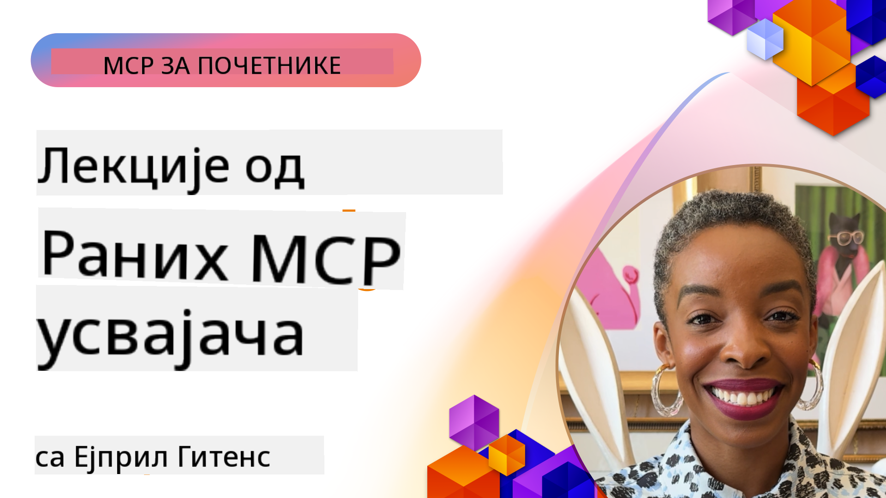

<!--
CO_OP_TRANSLATOR_METADATA:
{
  "original_hash": "41f16dac486d2086a53bc644a01cbe42",
  "translation_date": "2025-08-18T21:31:22+00:00",
  "source_file": "07-LessonsfromEarlyAdoption/README.md",
  "language_code": "sr"
}
-->
# 🌟 Лекције од раних усвојилаца

[](https://youtu.be/jds7dSmNptE)

_(Кликните на слику изнад да бисте погледали видео о овој лекцији)_

## 🎯 Шта овај модул обухвата

Овај модул истражује како стварне организације и програмери користе Model Context Protocol (MCP) за решавање стварних изазова и подстицање иновација. Кроз детаљне студије случаја и практичне пројекте, открићете како MCP омогућава сигурну и скалабилну интеграцију вештачке интелигенције која повезује језичке моделе, алате и корпоративне податке.

### 📚 Погледајте MCP у акцији

Желите да видите како се ови принципи примењују на алате спремне за производњу? Погледајте наш [**Водич кроз 10 Microsoft MCP сервера који трансформишу продуктивност програмера**](microsoft-mcp-servers.md), који приказује стварне Microsoft MCP сервере које можете користити већ данас.

## Преглед

Ова лекција истражује како су рани усвојиоци искористили Model Context Protocol (MCP) за решавање стварних изазова и подстицање иновација у различитим индустријама. Кроз детаљне студије случаја и практичне пројекте, видећете како MCP омогућава стандардизовану, сигурну и скалабилну интеграцију вештачке интелигенције—повезујући велике језичке моделе, алате и корпоративне податке у јединствени оквир. Стећи ћете практично искуство у дизајнирању и изградњи решења заснованих на MCP-у, учити из доказаних образаца имплементације и открити најбоље праксе за примену MCP-а у производним окружењима. Лекција такође истиче нове трендове, будуће правце и ресурсе отвореног кода како бисте остали на челу MCP технологије и њеног еволуирајућег екосистема.

## Циљеви учења

- Анализирати стварне имплементације MCP-а у различитим индустријама  
- Дизајнирати и изградити комплетне апликације засноване на MCP-у  
- Истражити нове трендове и будуће правце у MCP технологији  
- Применити најбоље праксе у стварним развојним сценаријима  

## Стварне имплементације MCP-а

### Студија случаја 1: Аутоматизација корисничке подршке у предузећима

Мултинационална корпорација је имплементирала решење засновано на MCP-у како би стандардизовала AI интеракције у својим системима корисничке подршке. Ово им је омогућило да:  

- Креирају јединствени интерфејс за више LLM провајдера  
- Одржавају конзистентно управљање упитима у различитим одељењима  
- Применe робусне безбедносне и контроле усклађености  
- Лако прелазе између различитих AI модела у зависности од специфичних потреба  

**Техничка имплементација:**  

```python
# Python MCP server implementation for customer support
import logging
import asyncio
from modelcontextprotocol import create_server, ServerConfig
from modelcontextprotocol.server import MCPServer
from modelcontextprotocol.transports import create_http_transport
from modelcontextprotocol.resources import ResourceDefinition
from modelcontextprotocol.prompts import PromptDefinition
from modelcontextprotocol.tool import ToolDefinition

# Configure logging
logging.basicConfig(level=logging.INFO)

async def main():
    # Create server configuration
    config = ServerConfig(
        name="Enterprise Customer Support Server",
        version="1.0.0",
        description="MCP server for handling customer support inquiries"
    )
    
    # Initialize MCP server
    server = create_server(config)
    
    # Register knowledge base resources
    server.resources.register(
        ResourceDefinition(
            name="customer_kb",
            description="Customer knowledge base documentation"
        ),
        lambda params: get_customer_documentation(params)
    )
    
    # Register prompt templates
    server.prompts.register(
        PromptDefinition(
            name="support_template",
            description="Templates for customer support responses"
        ),
        lambda params: get_support_templates(params)
    )
    
    # Register support tools
    server.tools.register(
        ToolDefinition(
            name="ticketing",
            description="Create and update support tickets"
        ),
        handle_ticketing_operations
    )
    
    # Start server with HTTP transport
    transport = create_http_transport(port=8080)
    await server.run(transport)

if __name__ == "__main__":
    asyncio.run(main())
```  

**Резултати:** 30% смањење трошкова модела, 45% побољшање у конзистентности одговора и побољшана усклађеност у глобалним операцијама.  

### Студија случаја 2: Асистент за дијагностику у здравству

Пружалац здравствених услуга развио је MCP инфраструктуру за интеграцију више специјализованих медицинских AI модела, уз осигурање заштите осетљивих података пацијената:  

- Беспрекорно пребацивање између општих и специјализованих медицинских модела  
- Строге контроле приватности и евиденција активности  
- Интеграција са постојећим системима електронских здравствених картона (EHR)  
- Конзистентно управљање упитима за медицинску терминологију  

**Техничка имплементација:**  

```csharp
// C# MCP host application implementation in healthcare application
using Microsoft.Extensions.DependencyInjection;
using ModelContextProtocol.SDK.Client;
using ModelContextProtocol.SDK.Security;
using ModelContextProtocol.SDK.Resources;

public class DiagnosticAssistant
{
    private readonly MCPHostClient _mcpClient;
    private readonly PatientContext _patientContext;
    
    public DiagnosticAssistant(PatientContext patientContext)
    {
        _patientContext = patientContext;
        
        // Configure MCP client with healthcare-specific settings
        var clientOptions = new ClientOptions
        {
            Name = "Healthcare Diagnostic Assistant",
            Version = "1.0.0",
            Security = new SecurityOptions
            {
                Encryption = EncryptionLevel.Medical,
                AuditEnabled = true
            }
        };
        
        _mcpClient = new MCPHostClientBuilder()
            .WithOptions(clientOptions)
            .WithTransport(new HttpTransport("https://healthcare-mcp.example.org"))
            .WithAuthentication(new HIPAACompliantAuthProvider())
            .Build();
    }
    
    public async Task<DiagnosticSuggestion> GetDiagnosticAssistance(
        string symptoms, string patientHistory)
    {
        // Create request with appropriate resources and tool access
        var resourceRequest = new ResourceRequest
        {
            Name = "patient_records",
            Parameters = new Dictionary<string, object>
            {
                ["patientId"] = _patientContext.PatientId,
                ["requestingProvider"] = _patientContext.ProviderId
            }
        };
        
        // Request diagnostic assistance using appropriate prompt
        var response = await _mcpClient.SendPromptRequestAsync(
            promptName: "diagnostic_assistance",
            parameters: new Dictionary<string, object>
            {
                ["symptoms"] = symptoms,
                patientHistory = patientHistory,
                relevantGuidelines = _patientContext.GetRelevantGuidelines()
            });
            
        return DiagnosticSuggestion.FromMCPResponse(response);
    }
}
```  

**Резултати:** Побољшане дијагностичке препоруке за лекаре уз потпуну усклађеност са HIPAA и значајно смањење пребацивања између система.  

### Студија случаја 3: Анализа ризика у финансијским услугама

Финансијска институција је имплементирала MCP како би стандардизовала своје процесе анализе ризика у различитим одељењима:  

- Креирали су јединствени интерфејс за моделе кредитног ризика, откривања превара и инвестиционих ризика  
- Применили строге контроле приступа и верзионисање модела  
- Осигурали могућност ревизије свих AI препорука  
- Одржали конзистентно форматирање података у различитим системима  

**Техничка имплементација:**  

```java
// Java MCP server for financial risk assessment
import org.mcp.server.*;
import org.mcp.security.*;

public class FinancialRiskMCPServer {
    public static void main(String[] args) {
        // Create MCP server with financial compliance features
        MCPServer server = new MCPServerBuilder()
            .withModelProviders(
                new ModelProvider("risk-assessment-primary", new AzureOpenAIProvider()),
                new ModelProvider("risk-assessment-audit", new LocalLlamaProvider())
            )
            .withPromptTemplateDirectory("./compliance/templates")
            .withAccessControls(new SOCCompliantAccessControl())
            .withDataEncryption(EncryptionStandard.FINANCIAL_GRADE)
            .withVersionControl(true)
            .withAuditLogging(new DatabaseAuditLogger())
            .build();
            
        server.addRequestValidator(new FinancialDataValidator());
        server.addResponseFilter(new PII_RedactionFilter());
        
        server.start(9000);
        
        System.out.println("Financial Risk MCP Server running on port 9000");
    }
}
```  

**Резултати:** Побољшана регулаторна усклађеност, 40% бржи циклуси примене модела и побољшана конзистентност процене ризика у одељењима.  

### Студија случаја 4: Microsoft Playwright MCP сервер за аутоматизацију прегледача

Microsoft је развио [Playwright MCP сервер](https://github.com/microsoft/playwright-mcp) како би омогућио сигурну и стандардизовану аутоматизацију прегледача кроз Model Context Protocol. Овај сервер спреман за производњу омогућава AI агентима и LLM-овима да комуницирају са веб прегледачима на контролисан, ревизибилан и проширив начин—омогућавајући случајеве употребе као што су аутоматизовано тестирање веба, екстракција података и енд-то-енд радни токови.  

> **🎯 Алат спреман за производњу**  
> 
> Ова студија случаја приказује стварни MCP сервер који можете користити већ данас! Сазнајте више о Playwright MCP серверу и 9 других MCP сервера у нашем [**Водичу кроз Microsoft MCP сервере**](microsoft-mcp-servers.md#8--playwright-mcp-server).  

**Кључне карактеристике:**  
- Омогућава могућности аутоматизације прегледача (навигација, попуњавање формулара, снимање екрана итд.) као MCP алате  
- Примењује строге контроле приступа и изоловање како би спречио неовлашћене радње  
- Обезбеђује детаљне евиденције активности за све интеракције са прегледачем  
- Подржава интеграцију са Azure OpenAI и другим LLM провајдерима за аутоматизацију вођену агентима  
- Омогућава GitHub Copilot-у могућности прегледања веба  

**Техничка имплементација:**  

```typescript
// TypeScript: Registering Playwright browser automation tools in an MCP server
import { createServer, ToolDefinition } from 'modelcontextprotocol';
import { launch } from 'playwright';

const server = createServer({
  name: 'Playwright MCP Server',
  version: '1.0.0',
  description: 'MCP server for browser automation using Playwright'
});

// Register a tool for navigating to a URL and capturing a screenshot
server.tools.register(
  new ToolDefinition({
    name: 'navigate_and_screenshot',
    description: 'Navigate to a URL and capture a screenshot',
    parameters: {
      url: { type: 'string', description: 'The URL to visit' }
    }
  }),
  async ({ url }) => {
    const browser = await launch();
    const page = await browser.newPage();
    await page.goto(url);
    const screenshot = await page.screenshot();
    await browser.close();
    return { screenshot };
  }
);

// Start the MCP server
server.listen(8080);
```  

**Резултати:**  

- Омогућена сигурна, програмска аутоматизација прегледача за AI агенте и LLM-ове  
- Смањен ручни напор у тестирању и побољшана покривеност тестова за веб апликације  
- Обезбеђен поново употребљив, проширив оквир за интеграцију алата заснованих на прегледачу у корпоративним окружењима  
- Омогућене могућности прегледања веба за GitHub Copilot  

**Референце:**  

- [Playwright MCP Server GitHub репозиторијум](https://github.com/microsoft/playwright-mcp)  
- [Microsoft AI и решења за аутоматизацију](https://azure.microsoft.com/en-us/products/ai-services/)  

...  

(Наставак текста следи истим стилом за остале студије случаја.)  
> **🎯 Алат спреман за продукцију**  
>  
> Ово је прави MCP сервер који можете користити већ данас! Сазнајте више о MCP серверу у Microsoft Learn документацији у нашем [**Водичу за Microsoft MCP сервере**](microsoft-mcp-servers.md#1--microsoft-learn-docs-mcp-server).
**Кључне карактеристике:**
- Приступ у реалном времену званичној Microsoft документацији, Azure документима и Microsoft 365 документацији
- Напредне семантичке могућности претраге које разумеју контекст и намеру
- Увек ажуриране информације како се садржај Microsoft Learn-а објављује
- Свеобухватна покривеност кроз Microsoft Learn, Azure документацију и Microsoft 365 изворе
- Враћа до 10 висококвалитетних делова садржаја са насловима чланака и URL адресама

**Зашто је важно:**
- Решава проблем „застарелог AI знања“ за Microsoft технологије
- Осигурава да AI асистенти имају приступ најновијим .NET, C#, Azure и Microsoft 365 функцијама
- Пружа ауторитативне, првокласне информације за тачно генерисање кода
- Кључно за програмере који раде са брзо развијајућим Microsoft технологијама

**Резултати:**
- Драматично побољшана тачност AI-генерисаног кода за Microsoft технологије
- Смањено време проведено у претрази за актуелном документацијом и најбољим праксама
- Повећана продуктивност програмера уз документацију која разуме контекст
- Беспрекорна интеграција у радне токове развоја без напуштања IDE-а

**Референце:**
- [Microsoft Learn Docs MCP Server GitHub Repository](https://github.com/MicrosoftDocs/mcp)
- [Microsoft Learn Documentation](https://learn.microsoft.com/)

## Практични пројекти

### Пројекат 1: Изградња MCP сервера са више провајдера

**Циљ:** Направити MCP сервер који може усмеравати захтеве ка више провајдера AI модела на основу специфичних критеријума.

**Захтеви:**

- Подршка за најмање три различита провајдера модела (нпр. OpenAI, Anthropic, локални модели)
- Имплементација механизма за усмеравање на основу метаподатака захтева
- Креирање система конфигурације за управљање акредитивима провајдера
- Додавање кеширања ради оптимизације перформанси и трошкова
- Изградња једноставне контролне табле за праћење употребе

**Кораци имплементације:**

1. Постављање основне инфраструктуре MCP сервера
2. Имплементација адаптера провајдера за сваку AI услугу модела
3. Креирање логике усмеравања на основу атрибута захтева
4. Додавање механизама кеширања за честе захтеве
5. Развој контролне табле за праћење
6. Тестирање са различитим обрасцима захтева

**Технологије:** Изаберите Python (.NET/Java/Python у зависности од ваших преференција), Redis за кеширање и једноставан веб оквир за контролну таблу.

### Пројекат 2: Систем за управљање предлошцима у предузећу

**Циљ:** Развити MCP-базирани систем за управљање, верзионисање и примену предлошка упита унутар организације.

**Захтеви:**

- Креирање централизованог репозиторијума за предлошке упита
- Имплементација система за верзионисање и одобравање
- Развој могућности тестирања предлошка са узорцима уноса
- Успостављање контроле приступа засноване на улогама
- Креирање API-ја за преузимање и примену предлошка

**Кораци имплементације:**

1. Дизајн шеме базе података за складиштење предлошка
2. Креирање основног API-ја за CRUD операције предлошка
3. Имплементација система за верзионисање
4. Развој система за одобравање
5. Изградња оквира за тестирање
6. Креирање једноставног веб интерфејса за управљање
7. Интеграција са MCP сервером

**Технологије:** Ваш избор оквира за позадину, SQL или NoSQL базе података и фронтенд оквира за интерфејс за управљање.

### Пројекат 3: Платформа за генерисање садржаја заснована на MCP-у

**Циљ:** Направити платформу за генерисање садржаја која користи MCP за пружање конзистентних резултата за различите типове садржаја.

**Захтеви:**

- Подршка за више формата садржаја (блог постови, друштвене мреже, маркетиншки текстови)
- Имплементација генерисања заснованог на предлошцима са опцијама за прилагођавање
- Креирање система за преглед и повратне информације о садржају
- Праћење метрика перформанси садржаја
- Подршка за верзионисање и итерацију садржаја

**Кораци имплементације:**

1. Постављање инфраструктуре MCP клијента
2. Креирање предлошка за различите типове садржаја
3. Изградња цевовода за генерисање садржаја
4. Имплементација система за преглед
5. Развој система за праћење метрика
6. Креирање корисничког интерфејса за управљање предлошцима и генерисање садржаја

**Технологије:** Ваш омиљени програмски језик, веб оквир и систем базе података.

## Будући правци за MCP технологију

### Нови трендови

1. **Мултимодални MCP**
   - Проширење MCP-а за стандардизацију интеракција са моделима за слике, аудио и видео
   - Развој способности за резоновање између различитих модалитета
   - Стандардизовани формати упита за различите модалитете

2. **Федеративна MCP инфраструктура**
   - Дистрибуиране MCP мреже које могу делити ресурсе између организација
   - Стандардизовани протоколи за сигурно дељење модела
   - Технике заштите приватности у рачунању

3. **MCP тржишта**
   - Екосистеми за дељење и монетизацију MCP предлошка и додатака
   - Процеси осигурања квалитета и сертификације
   - Интеграција са тржиштима модела

4. **MCP за рачунарство на ивици**
   - Адаптација MCP стандарда за уређаје са ограниченим ресурсима
   - Оптимизовани протоколи за окружења са малом пропусношћу
   - Специјализоване MCP имплементације за IoT екосистеме

5. **Регулаторни оквири**
   - Развој MCP проширења за регулаторну усаглашеност
   - Стандардизовани трагови ревизије и интерфејси за објашњивост
   - Интеграција са новим оквирима за управљање AI-јем

### MCP решења од Microsoft-а

Microsoft и Azure су развили неколико open-source репозиторијума који помажу програмерима да имплементирају MCP у различитим сценаријима:

#### Microsoft организација

1. [playwright-mcp](https://github.com/microsoft/playwright-mcp) - Playwright MCP сервер за аутоматизацију и тестирање прегледача
2. [files-mcp-server](https://github.com/microsoft/files-mcp-server) - OneDrive MCP сервер имплементација за локално тестирање и допринос заједнице
3. [NLWeb](https://github.com/microsoft/NlWeb) - NLWeb је колекција отворених протокола и алата за AI Web

#### Azure-Samples организација

1. [mcp](https://github.com/Azure-Samples/mcp) - Линкови ка примерима, алатима и ресурсима за изградњу и интеграцију MCP сервера на Azure-у
2. [mcp-auth-servers](https://github.com/Azure-Samples/mcp-auth-servers) - Референтни MCP сервери који демонстрирају аутентификацију са тренутном спецификацијом Model Context Protocol-а
3. [remote-mcp-functions](https://github.com/Azure-Samples/remote-mcp-functions) - Ландинг страница за имплементације Remote MCP сервера у Azure Functions
4. [remote-mcp-functions-python](https://github.com/Azure-Samples/remote-mcp-functions-python) - Брзи шаблон за изградњу и примену прилагођених Remote MCP сервера користећи Azure Functions са Python-ом
5. [remote-mcp-functions-dotnet](https://github.com/Azure-Samples/remote-mcp-functions-dotnet) - Брзи шаблон за изградњу и примену прилагођених Remote MCP сервера користећи Azure Functions са .NET/C#
6. [remote-mcp-functions-typescript](https://github.com/Azure-Samples/remote-mcp-functions-typescript) - Брзи шаблон за изградњу и примену прилагођених Remote MCP сервера користећи Azure Functions са TypeScript-ом
7. [remote-mcp-apim-functions-python](https://github.com/Azure-Samples/remote-mcp-apim-functions-python) - Azure API Management као AI Gateway за Remote MCP сервере користећи Python
8. [AI-Gateway](https://github.com/Azure-Samples/AI-Gateway) - APIM ❤️ AI експерименти укључујући MCP могућности, интеграцију са Azure OpenAI и AI Foundry

Ови репозиторијуми пружају различите имплементације, шаблоне и ресурсе за рад са Model Context Protocol-ом у различитим програмским језицима и Azure услугама. Они покривају низ случајева употребе од основних имплементација сервера до аутентификације, примене у облаку и интеграције у предузећима.

#### MCP директоријум ресурса

[MCP директоријум ресурса](https://github.com/microsoft/mcp/tree/main/Resources) у званичном Microsoft MCP репозиторијуму пружа курирану колекцију узорака ресурса, предлошка упита и дефиниција алата за употребу са Model Context Protocol серверима. Овај директоријум је дизајниран да помогне програмерима да брзо започну рад са MCP-ом нудећи поново употребљиве грађевинске блокове и примере најбољих пракси за:

- **Предлошке упита:** Спремни за употребу предлошци упита за уобичајене AI задатке и сценарије, који се могу прилагодити за ваше MCP сервере.
- **Дефиниције алата:** Пример шема алата и метаподатака за стандардизацију интеграције и позивања алата на различитим MCP серверима.
- **Узорци ресурса:** Пример дефиниција ресурса за повезивање са изворима података, API-јима и спољним услугама у оквиру MCP оквира.
- **Референтне имплементације:** Практични примери који показују како структуирати и организовати ресурсе, упите и алате у реалним MCP пројектима.

Ови ресурси убрзавају развој, промовишу стандардизацију и помажу у осигурању најбољих пракси приликом изградње и примене решења заснованих на MCP-у.

#### MCP директоријум ресурса

- [MCP ресурси (узорци упита, алата и дефиниција ресурса)](https://github.com/microsoft/mcp/tree/main/Resources)

### Истраживачке могућности

- Ефикасне технике оптимизације упита у MCP оквирима
- Модели безбедности за MCP имплементације са више корисника
- Бенчмаркинг перформанси различитих MCP имплементација
- Формалне методе верификације за MCP сервере

## Закључак

Model Context Protocol (MCP) брзо обликује будућност стандардизоване, сигурне и интероперабилне AI интеграције у различитим индустријама. Кроз студије случаја и практичне пројекте у овом лекцији, видели сте како рани усвајачи—укључујући Microsoft и Azure—користе MCP за решавање стварних изазова, убрзавање усвајања AI-а и осигурање усаглашености, безбедности и скалабилности. MCP-ов модуларни приступ омогућава организацијама да повежу велике језичке моделе, алате и предузетничке податке у јединственом, ревизибилном оквиру. Како MCP наставља да се развија, ангажовање са заједницом, истраживање open-source ресурса и примена најбољих пракси биће кључни за изградњу робусних, будућности спремних AI решења.

## Додатни ресурси

- [MCP Foundry GitHub Repository](https://github.com/azure-ai-foundry/mcp-foundry)
- [Foundry MCP Playground](https://github.com/azure-ai-foundry/foundry-mcp-playground)
- [Интеграција Azure AI агената са MCP-ом (Microsoft Foundry Blog)](https://devblogs.microsoft.com/foundry/integrating-azure-ai-agents-mcp/)
- [MCP GitHub Repository (Microsoft)](https://github.com/microsoft/mcp)
- [MCP Resources Directory (узорци упита, алата и дефиниција ресурса)](https://github.com/microsoft/mcp/tree/main/Resources)
- [MCP заједница и документација](https://modelcontextprotocol.io/introduction)
- [Azure MCP документација](https://aka.ms/azmcp)
- [Playwright MCP Server GitHub Repository](https://github.com/microsoft/playwright-mcp)
- [Files MCP Server (OneDrive)](https://github.com/microsoft/files-mcp-server)
- [Azure-Samples MCP](https://github.com/Azure-Samples/mcp)
- [MCP Auth Servers (Azure-Samples)](https://github.com/Azure-Samples/mcp-auth-servers)
- [Remote MCP Functions (Azure-Samples)](https://github.com/Azure-Samples/remote-mcp-functions)
- [Remote MCP Functions Python (Azure-Samples)](https://github.com/Azure-Samples/remote-mcp-functions-python)
- [Remote MCP Functions .NET (Azure-Samples)](https://github.com/Azure-Samples/remote-mcp-functions-dotnet)
- [Remote MCP Functions TypeScript (Azure-Samples)](https://github.com/Azure-Samples/remote-mcp-functions-typescript)
- [Remote MCP APIM Functions Python (Azure-Samples)](https://github.com/Azure-Samples/remote-mcp-apim-functions-python)
- [AI-Gateway (Azure-Samples)](https://github.com/Azure-Samples/AI-Gateway)
- [Microsoft AI и решења за аутоматизацију](https://azure.microsoft.com/en-us/products/ai-services/)

## Вежбе

1. Анализирајте једну од студија случаја и предложите алтернативни приступ имплементацији.
2. Изаберите једну од идеја за пројекат и направите детаљну техничку спецификацију.
3. Истражите индустрију која није покривена у студијама случаја и опишите како MCP може решити њене специфичне изазове.
4. Истражите један од будућих праваца и креирајте концепт за ново MCP проширење које га подржава.

Следеће: [Microsoft MCP Server](../07-LessonsfromEarlyAdoption/microsoft-mcp-servers.md)

**Одрицање од одговорности**:  
Овај документ је преведен коришћењем услуге за превођење помоћу вештачке интелигенције [Co-op Translator](https://github.com/Azure/co-op-translator). Иако тежимо тачности, молимо вас да имате у виду да аутоматски преводи могу садржати грешке или нетачности. Оригинални документ на свом изворном језику треба сматрати ауторитативним извором. За критичне информације препоручује се професионални превод од стране људи. Не сносимо одговорност за било каква погрешна тумачења или неспоразуме који могу произаћи из коришћења овог превода.