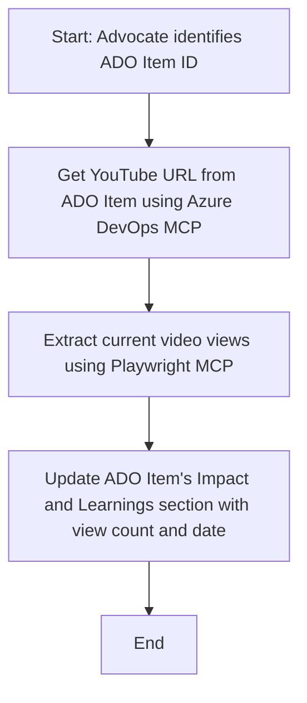

<!--
CO_OP_TRANSLATOR_METADATA:
{
  "original_hash": "14a2dfbea55ef735660a06bd6bdfe5f3",
  "translation_date": "2025-07-14T06:15:51+00:00",
  "source_file": "09-CaseStudy/UpdateADOItemsFromYT.md",
  "language_code": "sr"
}
-->
# Студија случаја: Ажурирање Azure DevOps ставки са YouTube подацима помоћу MCP

> **Одрицање од одговорности:** Постоје алати и извештаји на мрежи који могу аутоматизовати процес ажурирања Azure DevOps ставки подацима са платформи као што је YouTube. Следећи сценарио је дат искључиво као пример употребе да илуструје како се MCP алати могу применити за аутоматизацију и интеграционе задатке.

## Преглед

Ова студија случаја показује један пример како се Model Context Protocol (MCP) и његови алати могу користити за аутоматизацију процеса ажурирања Azure DevOps (ADO) радних ставки информацијама преузетим са онлајн платформи, као што је YouTube. Описани сценарио је само једна илустрација ширих могућности ових алата, који се могу прилагодити многим сличним потребама аутоматизације.

У овом примеру, Advocate прати онлајн сесије користећи ADO ставке, где свака ставка садржи URL YouTube видеа. Користећи MCP алате, Advocate може одржавати ADO ставке ажурним са најновијим метрикама видеа, као што су број прегледа, на понављан и аутоматизован начин. Овај приступ се може генерално применити и на друге случајеве где је потребно интегрисати информације са онлајн извора у ADO или друге системе.

## Сценарио

Advocate је задужен за праћење утицаја онлајн сесија и ангажмана заједнице. Свака сесија се евидентира као ADO радна ставка у пројекту 'DevRel', а радна ставка садржи поље за URL YouTube видеа. Да би прецизно пријавио досег сесије, Advocate треба да ажурира ADO ставку са тренутним бројем прегледа видеа и датумом када су ови подаци преузети.

## Коришћени алати

- [Azure DevOps MCP](https://github.com/microsoft/azure-devops-mcp): Омогућава програмски приступ и ажурирање ADO радних ставки преко MCP.
- [Playwright MCP](https://github.com/microsoft/playwright-mcp): Аутоматизује радње у прегледачу како би извлачио живе податке са веб страница, као што су статистике YouTube видеа.

## Корак по корак радни ток

1. **Идентификовати ADO ставку**: Почети са ID-јем ADO радне ставке (нпр. 1234) у пројекту 'DevRel'.
2. **Преузети YouTube URL**: Користити Azure DevOps MCP алат да се добије YouTube URL из радне ставке.
3. **Извући број прегледа видеа**: Користити Playwright MCP алат да се отвори YouTube URL и извуче тренутни број прегледа.
4. **Ажурирати ADO ставку**: Унети најновији број прегледа и датум преузимања у одељак 'Impact and Learnings' ADO радне ставке користећи Azure DevOps MCP алат.

## Пример упита

```bash
- Work with the ADO Item ID: 1234
- The project is '2025-Awesome'
- Get the YouTube URL for the ADO item
- Use Playwright to get the current views from the YouTube video
- Update the ADO item with the current video views and the updated date of the information
```

## Mermaid дијаграм тока



## Техничка имплементација

- **MCP оркестрација**: Радни ток координише MCP сервер, који управља коришћењем оба алата, Azure DevOps MCP и Playwright MCP.
- **Аутоматизација**: Процес се може покренути ручно или заказати да се извршава у редовним интервалима како би ADO ставке биле увек ажурне.
- **Проширивост**: Исти образац се може проширити за ажурирање ADO ставки са другим онлајн метрикама (нпр. лајкови, коментари) или са других платформи.

## Резултати и утицај

- **Ефикасност**: Смањује ручни рад Advocates-а аутоматизујући преузимање и ажурирање видео метрика.
- **Тачност**: Осигурава да ADO ставке одражавају најсвежије податке доступне са онлајн извора.
- **Понављивост**: Обезбеђује поновљив радни ток за сличне сценарије који укључују друге изворе података или метрике.

## Референце

- [Azure DevOps MCP](https://github.com/microsoft/azure-devops-mcp)
- [Playwright MCP](https://github.com/microsoft/playwright-mcp)
- [Model Context Protocol (MCP)](https://modelcontextprotocol.io/)

**Одрицање од одговорности**:  
Овај документ је преведен коришћењем AI услуге за превођење [Co-op Translator](https://github.com/Azure/co-op-translator). Иако се трудимо да превод буде тачан, молимо вас да имате у виду да аутоматски преводи могу садржати грешке или нетачности. Оригинални документ на његовом изворном језику треба сматрати ауторитетним извором. За критичне информације препоручује се професионални људски превод. Нисмо одговорни за било каква неспоразума или погрешна тумачења која произилазе из коришћења овог превода.