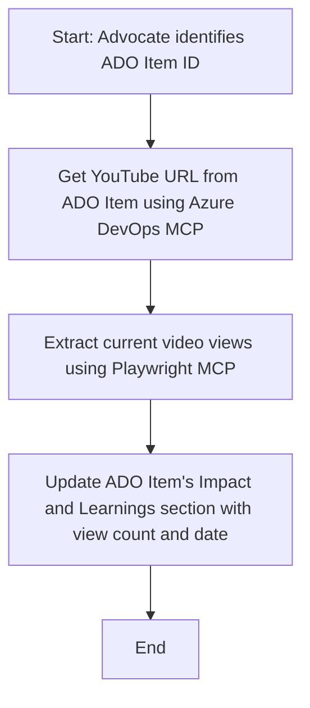

<!--
CO_OP_TRANSLATOR_METADATA:
{
  "original_hash": "14a2dfbea55ef735660a06bd6bdfe5f3",
  "translation_date": "2025-06-13T21:39:06+00:00",
  "source_file": "09-CaseStudy/UpdateADOItemsFromYT.md",
  "language_code": "sr"
}
-->
# Studija slučaja: Ažuriranje Azure DevOps stavki podacima sa YouTube-a pomoću MCP

> **Odricanje od odgovornosti:** Postoje postojeći online alati i izveštaji koji mogu automatizovati proces ažuriranja Azure DevOps stavki podacima sa platformi kao što je YouTube. Sledeći scenario je dat isključivo kao primer kako se MCP alati mogu primeniti za zadatke automatizacije i integracije.

## Pregled

Ova studija slučaja prikazuje jedan primer kako se Model Context Protocol (MCP) i njegovi alati mogu koristiti za automatizaciju procesa ažuriranja Azure DevOps (ADO) radnih stavki informacijama preuzetim sa online platformi, kao što je YouTube. Opisani scenario je samo ilustracija šireg spektra mogućnosti ovih alata, koji se mogu prilagoditi mnogim sličnim potrebama automatizacije.

U ovom primeru, Advocate prati online sesije koristeći ADO stavke, gde svaka stavka sadrži URL YouTube videa. Korišćenjem MCP alata, Advocate može da održava ADO stavke ažurnim sa najnovijim video metrima, poput broja pregleda, na ponovljiv i automatizovan način. Ovaj pristup se može generalizovati i na druge slučajeve gde je potrebno integrisati informacije sa online izvora u ADO ili druge sisteme.

## Scenario

Advocate je odgovoran za praćenje uticaja online sesija i angažmana zajednice. Svaka sesija je zabeležena kao ADO radna stavka u projektu 'DevRel', a radna stavka sadrži polje za URL YouTube videa. Da bi precizno izvestio o dometu sesije, Advocate treba da ažurira ADO stavku sa trenutnim brojem pregleda videa i datumom kada su ove informacije preuzete.

## Korišćeni alati

- [Azure DevOps MCP](https://github.com/microsoft/azure-devops-mcp): Omogućava programski pristup i ažuriranje ADO radnih stavki preko MCP.
- [Playwright MCP](https://github.com/microsoft/playwright-mcp): Automatizuje radnje u pregledaču kako bi izvukao aktuelne podatke sa web stranica, poput statistike YouTube videa.

## Korak-po-korak tok rada

1. **Identifikuj ADO stavku**: Počni sa ID-jem ADO radne stavke (npr. 1234) u projektu 'DevRel'.
2. **Preuzmi YouTube URL**: Koristi Azure DevOps MCP alat da dobiješ YouTube URL iz radne stavke.
3. **Izvuci broj pregleda videa**: Koristi Playwright MCP alat da otvoriš YouTube URL i izvučeš trenutni broj pregleda.
4. **Ažuriraj ADO stavku**: Upisi najnoviji broj pregleda i datum preuzimanja u sekciju 'Impact and Learnings' ADO radne stavke koristeći Azure DevOps MCP alat.

## Primer prompta

```bash
- Work with the ADO Item ID: 1234
- The project is '2025-Awesome'
- Get the YouTube URL for the ADO item
- Use Playwright to get the current views from the YouTube video
- Update the ADO item with the current video views and the updated date of the information
```

## Mermaid dijagram toka



## Tehnička implementacija

- **MCP orkestracija**: Tok rada koordinira MCP server koji upravlja korišćenjem oba alata, Azure DevOps MCP i Playwright MCP.
- **Automatizacija**: Proces može biti pokrenut ručno ili zakazan da se izvršava u redovnim intervalima kako bi ADO stavke bile stalno ažurirane.
- **Proširivost**: Isti model se može proširiti za ažuriranje ADO stavki drugim online metrima (npr. lajkovi, komentari) ili sa drugih platformi.

## Rezultati i uticaj

- **Efikasnost**: Smanjuje ručni rad Advocata automatizacijom preuzimanja i ažuriranja video metrika.
- **Tačnost**: Osigurava da ADO stavke odražavaju najnovije dostupne podatke sa online izvora.
- **Ponovljivost**: Pruža ponovljiv tok rada za slične scenarije koji uključuju druge izvore podataka ili metrike.

## Reference

- [Azure DevOps MCP](https://github.com/microsoft/azure-devops-mcp)
- [Playwright MCP](https://github.com/microsoft/playwright-mcp)
- [Model Context Protocol (MCP)](https://modelcontextprotocol.io/)

**Ограничење одговорности**:  
Овај документ је преведен помоћу AI сервиса за превођење [Co-op Translator](https://github.com/Azure/co-op-translator). Иако тежимо прецизности, имајте у виду да аутоматски преводи могу садржати грешке или нетачности. Оригинални документ на његовом изворном језику треба сматрати ауторитетним извором. За критичне информације препоручује се професионални људски превод. Нисмо одговорни за било каква неспоразума или погрешне интерпретације настале коришћењем овог превода.