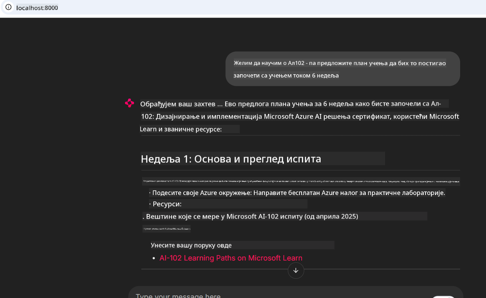

<!--
CO_OP_TRANSLATOR_METADATA:
{
  "original_hash": "4319d291c9d124ecafea52b3d04bfa0e",
  "translation_date": "2025-07-14T06:29:58+00:00",
  "source_file": "09-CaseStudy/docs-mcp/README.md",
  "language_code": "sr"
}
-->
# Студија случаја: Повезивање на Microsoft Learn Docs MCP сервер са клијента

Да ли сте се икада нашли у ситуацији да истовремено прелиставате документацију, Stack Overflow и бескрајне табове претраживача, док покушавате да решите проблем у свом коду? Можда имате други монитор само за документацију, или стално пребацујете између IDE-а и прегледача. Зар не би било боље да документацију имате директно у свом радном току — интегрисану у апликације, IDE или чак у своје прилагођене алате? У овој студији случаја показаћемо како да то урадите тако што ћете се директно повезати на Microsoft Learn Docs MCP сервер из своје клијент апликације.

## Преглед

Модерни развој није само писање кода — ради се о проналажењу правих информација у правом тренутку. Документација је свуда, али ретко тамо где вам је најпотребнија: унутар ваших алата и радних токова. Интеграцијом приступа документацији директно у апликације можете уштедети време, смањити пребацивање између контекста и повећати продуктивност. У овом делу ћемо вам показати како да повежете клијента са Microsoft Learn Docs MCP сервером, како бисте приступили документацији у реалном времену, прилагођеној контексту, без напуштања апликације.

Проћи ћемо кроз процес успостављања везе, слања захтева и ефикасног руковања стриминг одговорима. Овај приступ не само да поједностављује ваш радни ток, већ отвара и могућност за прављење паметнијих и кориснијих алата за програмере.

## Циљеви учења

Зашто ово радимо? Јер најбоља искуства за програмере су она која уклањају препреке. Замислите свет у коме ваш уређивач кода, чатбот или веб апликација могу одмах да одговоре на питања о документацији, користећи најновији садржај са Microsoft Learn. На крају овог поглавља знаћете како да:

- Разумете основе комуникације између MCP сервера и клијента за документацију
- Имплементирате конзолну или веб апликацију која се повезује на Microsoft Learn Docs MCP сервер
- Користите стриминг HTTP клијенте за приступ документацији у реалном времену
- Логујете и тумачите одговоре документације у својој апликацији

Видећете како вам ове вештине могу помоћи да направите алате који нису само реактивни, већ и заиста интерактивни и прилагођени контексту.

## Сценарио 1 - Приступ документацији у реалном времену са MCP

У овом сценарију показаћемо вам како да повежете клијента са Microsoft Learn Docs MCP сервером, како бисте приступили документацији у реалном времену, прилагођеној контексту, без напуштања апликације.

Хајде да ово применимо у пракси. Ваш задатак је да напишете апликацију која се повезује на Microsoft Learn Docs MCP сервер, позива алат `microsoft_docs_search` и бележи стриминг одговор у конзолу.

### Зашто овај приступ?
Зато што је то основа за прављење напреднијих интеграција — било да желите да покренете чатбот, проширење за IDE или веб контролну таблу.

Код и упутства за овај сценарио налазе се у фасцикли [`solution`](./solution/README.md) у оквиру ове студије случаја. Кораци ће вас провести кроз подешавање везе:
- Користите званични MCP SDK и стриминг HTTP клијент за повезивање
- Позовите алат `microsoft_docs_search` са параметром упита за преузимање документације
- Имплементирајте правилно логовање и руковање грешкама
- Направите интерактивни конзолни интерфејс који омогућава корисницима да уносе више упита за претрагу

Овај сценарио показује како да:
- Повежете се на Docs MCP сервер
- Пошаљете упит
- Парсирате и испишете резултате

Ево како би покретање решења могло изгледати:

```
Prompt> What is Azure Key Vault?
Answer> Azure Key Vault is a cloud service for securely storing and accessing secrets. ...
```

Испод је минималан пример решења. Комплетан код и детаљи доступни су у фасцикли решења.

<details>
<summary>Python</summary>

```python
import asyncio
from mcp.client.streamable_http import streamablehttp_client
from mcp import ClientSession

async def main():
    async with streamablehttp_client("https://learn.microsoft.com/api/mcp") as (read_stream, write_stream, _):
        async with ClientSession(read_stream, write_stream) as session:
            await session.initialize()
            result = await session.call_tool("microsoft_docs_search", {"query": "Azure Functions best practices"})
            print(result.content)

if __name__ == "__main__":
    asyncio.run(main())
```

- За комплетну имплементацију и логовање, погледајте [`scenario1.py`](../../../../09-CaseStudy/docs-mcp/solution/python/scenario1.py).
- За упутства о инсталацији и коришћењу, погледајте [`README.md`](./solution/python/README.md) у истој фасцикли.
</details>

## Сценарио 2 - Веб апликација за интерактивни генератор студијског плана са MCP

У овом сценарију научићете како да интегришете Docs MCP у веб пројекат. Циљ је да корисници могу да претражују Microsoft Learn документацију директно из веб интерфејса, чинећи документацију тренутно доступном у вашој апликацији или сајту.

Видећете како да:
- Подесите веб апликацију
- Повежете се на Docs MCP сервер
- Обрадите кориснички унос и прикажете резултате

Ево како би покретање решења могло изгледати:

```
User> I want to learn about AI102 - so suggest the roadmap to get it started from learn for 6 weeks

Assistant> Here’s a detailed 6-week roadmap to start your preparation for the AI-102: Designing and Implementing a Microsoft Azure AI Solution certification, using official Microsoft resources and focusing on exam skills areas:

---
## Week 1: Introduction & Fundamentals
- **Understand the Exam**: Review the [AI-102 exam skills outline](https://learn.microsoft.com/en-us/credentials/certifications/exams/ai-102/).
- **Set up Azure**: Sign up for a free Azure account if you don't have one.
- **Learning Path**: [Introduction to Azure AI services](https://learn.microsoft.com/en-us/training/modules/intro-to-azure-ai/)
- **Focus**: Get familiar with Azure portal, AI capabilities, and necessary tools.

....more weeks of the roadmap...

Let me know if you want module-specific recommendations or need more customized weekly tasks!
```

Испод је минималан пример решења. Комплетан код и детаљи доступни су у фасцикли решења.



<details>
<summary>Python (Chainlit)</summary>

Chainlit је фрејмворк за прављење веб апликација са конверзационим AI. Омогућава лако креирање интерактивних чатботова и асистената који могу позивати MCP алате и приказивати резултате у реалном времену. Идеалан је за брзо прототиписање и кориснички пријатне интерфејсе.

```python
import chainlit as cl
import requests

MCP_URL = "https://learn.microsoft.com/api/mcp"

@cl.on_message
def handle_message(message):
    query = {"question": message}
    response = requests.post(MCP_URL, json=query)
    if response.ok:
        result = response.json()
        cl.Message(content=result.get("answer", "No answer found.")).send()
    else:
        cl.Message(content="Error: " + response.text).send()
```

- За комплетну имплементацију, погледајте [`scenario2.py`](../../../../09-CaseStudy/docs-mcp/solution/python/scenario2.py).
- За упутства о подешавању и покретању, погледајте [`README.md`](./solution/python/README.md).
</details>

## Сценарио 3: Документација у уређивачу са MCP сервером у VS Code

Ако желите да добијете Microsoft Learn Docs директно унутар VS Code-а (уместо да пребацујете табове прегледача), можете користити MCP сервер у свом уређивачу. Ово вам омогућава да:
- Претражујете и читате документацију у VS Code-у без напуштања окружења за кодирање.
- Референцирате документацију и убацујете линкове директно у README или курсне фајлове.
- Користите GitHub Copilot и MCP заједно за беспрекорни, AI-подржани радни ток са документацијом.

**Видећете како да:**
- Додате валидан `.vscode/mcp.json` фајл у корен радног простора (погледајте пример испод).
- Отворите MCP панел или користите командну палету у VS Code-у за претрагу и убацивање документације.
- Референцирате документацију директно у markdown фајловима док радите.
- Комбинујете овај радни ток са GitHub Copilot-ом за још већу продуктивност.

Ево примера како да подесите MCP сервер у VS Code-у:

```json
{
  "servers": {
    "LearnDocsMCP": {
      "url": "https://learn.microsoft.com/api/mcp"
    }
  }
}
```

</details>

> За детаљан водич са снимцима екрана и корак по корак упутствима, погледајте [`README.md`](./solution/scenario3/README.md).


Овај приступ је идеалан за све који праве техничке курсеве, пишу документацију или развијају код са честим потребама за референцама.

## Кључне поуке

Интеграција документације директно у ваше алате није само погодност — то је револуција у продуктивности. Повезивањем на Microsoft Learn Docs MCP сервер из вашег клијента можете:

- Уклонити потребу за пребацивањем између кода и документације
- Преузимати ажуриране, контекстуално прилагођене документе у реалном времену
- Правити паметније, интерактивније алате за програмере

Ове вештине ће вам помоћи да направите решења која нису само ефикасна, већ и пријатна за коришћење.

## Додатни ресурси

Да бисте продубили разумевање, истражите ове званичне ресурсе:

- [Microsoft Learn Docs MCP Server (GitHub)](https://github.com/MicrosoftDocs/mcp)
- [Започните са Azure MCP Server (mcp-python)](https://learn.microsoft.com/en-us/azure/developer/azure-mcp-server/get-started#create-the-python-app)
- [Шта је Azure MCP Server?](https://learn.microsoft.com/en-us/azure/developer/azure-mcp-server/)
- [Увод у Model Context Protocol (MCP)](https://modelcontextprotocol.io/introduction)
- [Додавање плагина са MCP сервера (Python)](https://learn.microsoft.com/en-us/semantic-kernel/concepts/plugins/adding-mcp-plugins)

**Одрицање од одговорности**:  
Овај документ је преведен коришћењем AI услуге за превођење [Co-op Translator](https://github.com/Azure/co-op-translator). Иако се трудимо да превод буде тачан, молимо вас да имате у виду да аутоматски преводи могу садржати грешке или нетачности. Оригинални документ на његовом изворном језику треба сматрати ауторитетним извором. За критичне информације препоручује се професионални људски превод. Нисмо одговорни за било каква неспоразума или погрешна тумачења која произилазе из коришћења овог превода.