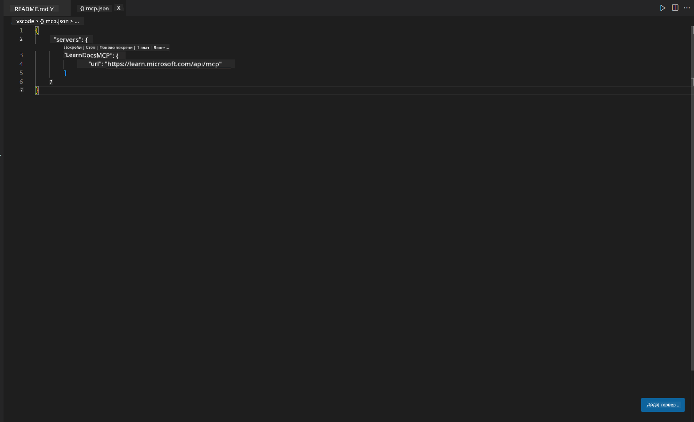
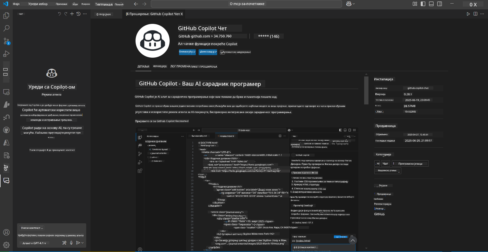
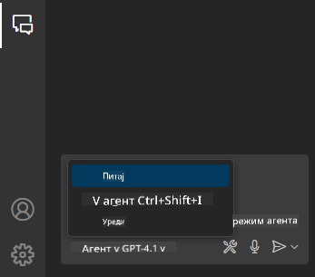
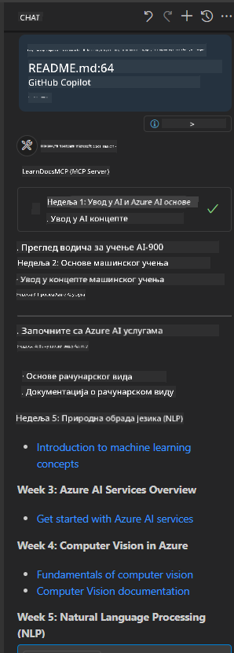
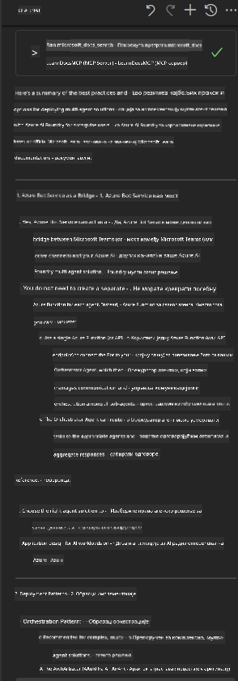

<!--
CO_OP_TRANSLATOR_METADATA:
{
  "original_hash": "db532b1ec386c9ce38c791653dc3c881",
  "translation_date": "2025-07-14T06:56:26+00:00",
  "source_file": "09-CaseStudy/docs-mcp/solution/scenario3/README.md",
  "language_code": "sr"
}
-->
# Сценарио 3: Документација у уређивачу уз MCP сервер у VS Code

## Преглед

У овом сценарију ћете научити како да доведете Microsoft Learn документацију директно у ваше Visual Studio Code окружење користећи MCP сервер. Уместо да стално мењате табове у прегледачу да бисте тражили документацију, можете приступити, претраживати и позивати званичну документацију право у вашем уређивачу. Овај приступ поједностављује ваш радни ток, помаже вам да останете фокусирани и омогућава беспрекорну интеграцију са алатима као што је GitHub Copilot.

- Претражујте и читајте документацију унутар VS Code без напуштања окружења за кодирање.
- Позивајте документацију и убацујте линкове директно у README или фајлове курса.
- Користите GitHub Copilot и MCP заједно за глатак, AI-подржан рад са документацијом.

## Циљеви учења

До краја овог поглавља, разумећете како да подесите и користите MCP сервер унутар VS Code да бисте унапредили свој рад са документацијом и развојни процес. Бићете у могућности да:

- Конфигуришете радни простор за коришћење MCP сервера за претрагу документације.
- Претражујете и убацујете документацију директно из VS Code-а.
- Комбинујете снагу GitHub Copilot-а и MCP-а за продуктивнији, AI-подржан радни ток.

Ове вештине ће вам помоћи да останете фокусирани, побољшате квалитет документације и повећате продуктивност као програмер или технички писац.

## Решење

Да бисте омогућили приступ документацији у уређивачу, пратићете низ корака који интегришу MCP сервер са VS Code-ом и GitHub Copilot-ом. Ово решење је идеално за ауторе курсева, писце документације и програмере који желе да остану фокусирани у уређивачу док раде са документацијом и Copilot-ом.

- Брзо додајте референтне линкове у README док пишете документацију за курс или пројекат.
- Користите Copilot за генерисање кода и MCP за тренутно проналажење и цитирање релевантне документације.
- Останите фокусирани у уређивачу и повећајте продуктивност.

### Водич корак по корак

За почетак, пратите ове кораке. За сваки корак можете додати снимак екрана из фасцикле assets да визуелно прикажете процес.

1. **Додајте MCP конфигурацију:**
   У корену вашег пројекта направите фајл `.vscode/mcp.json` и додајте следећу конфигурацију:
   ```json
   {
     "servers": {
       "LearnDocsMCP": {
         "url": "https://learn.microsoft.com/api/mcp"
       }
     }
   }
   ```
   Ова конфигурација говори VS Code-у како да се повеже са [`Microsoft Learn Docs MCP сервером`](https://github.com/MicrosoftDocs/mcp).
   
   
    
2. **Отворите GitHub Copilot Chat панел:**
   Ако већ немате инсталиран GitHub Copilot екстензију, идите у преглед екстензија у VS Code-у и инсталирајте је. Можете је преузети директно са [Visual Studio Code Marketplace](https://marketplace.visualstudio.com/items?itemName=GitHub.copilot-chat). Затим отворите Copilot Chat панел са бочне траке.

   

3. **Омогућите agent mode и проверите алате:**
   У Copilot Chat панелу укључите agent mode.

   

   Након укључивања agent mode, проверите да ли је MCP сервер наведен као један од доступних алата. Ово осигурава да Copilot агент може приступити серверу документације и преузимати релевантне информације.
   
   
4. **Покрените нови разговор и упутите агента:**
   Отворите нови разговор у Copilot Chat панелу. Сада можете упутити агента са вашим питањима у вези документације. Агент ће користити MCP сервер да преузме и прикаже релевантну Microsoft Learn документацију директно у вашем уређивачу.

   - *"Покушавам да направим план учења за тему X. Планирам да је учим 8 недеља, за сваку недељу предложи садржај који треба да обрадим."*

   

5. **Жива претрага:**

   > Узмимо пример живе претраге из секције [#get-help](https://discord.gg/D6cRhjHWSC) у Azure AI Foundry Discord-у ([погледај оригиналну поруку](https://discord.com/channels/1113626258182504448/1385498306720829572)):
   
   *"Тражим одговоре како да имплементирам мулти-агентско решење са AI агентима развијеним на Azure AI Foundry. Видим да не постоји директан метод деплоја као што су Copilot Studio канали. Који су различити начини да се ово решење имплементира за корпоративне кориснике да могу да сарађују и заврше посао?
Постоји много чланака и блогова који кажу да можемо користити Azure Bot сервис као мост између MS Teams и Azure AI Foundry агената, али да ли ће ово функционисати ако подесим Azure бота који се повезује са Orchestrator агентом на Azure AI Foundry преко Azure функције за оркестрацију, или треба да направим Azure функцију за сваког AI агента у мулти-агентском решењу да би се оркестрација обављала на Bot framework-у? Све друге препоруке су добродошле."*

   

   Агент ће одговорити са релевантним линковима и резимеима документације, које затим можете директно убацити у markdown фајлове или користити као референце у коду.
   
### Примери упита

Ево неколико примера упита које можете испробати. Ови упити показују како MCP сервер и Copilot могу заједно да обезбеде тренутну, контекстуално релевантну документацију и референце без напуштања VS Code-а:

- "Покажи ми како да користим Azure Functions тригере."
- "Убаци линк ка званичној документацији за Azure Key Vault."
- "Које су најбоље праксе за обезбеђивање Azure ресурса?"
- "Пронађи quickstart за Azure AI сервисе."

Ови упити показују како MCP сервер и Copilot могу заједно да обезбеде тренутну, контекстуално релевантну документацију и референце без напуштања VS Code-а.

---

**Одрицање од одговорности**:  
Овај документ је преведен коришћењем AI услуге за превођење [Co-op Translator](https://github.com/Azure/co-op-translator). Иако се трудимо да превод буде тачан, молимо вас да имате у виду да аутоматски преводи могу садржати грешке или нетачности. Оригинални документ на његовом изворном језику треба сматрати ауторитетним извором. За критичне информације препоручује се професионални људски превод. Нисмо одговорни за било каква неспоразума или погрешна тумачења која произилазе из коришћења овог превода.