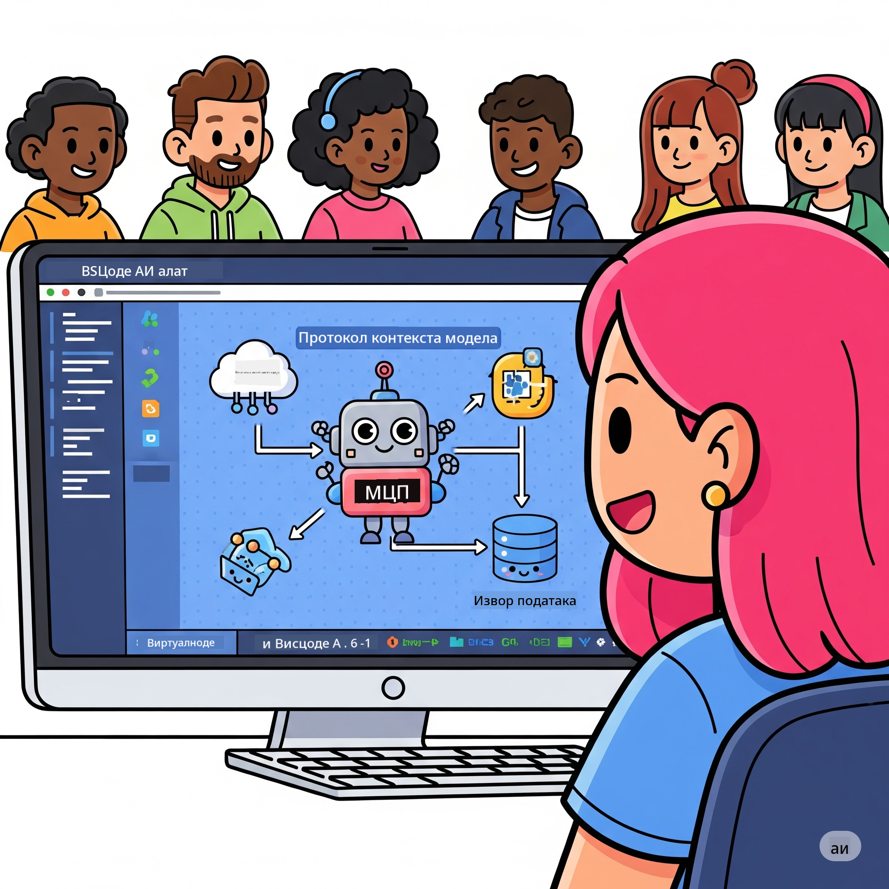
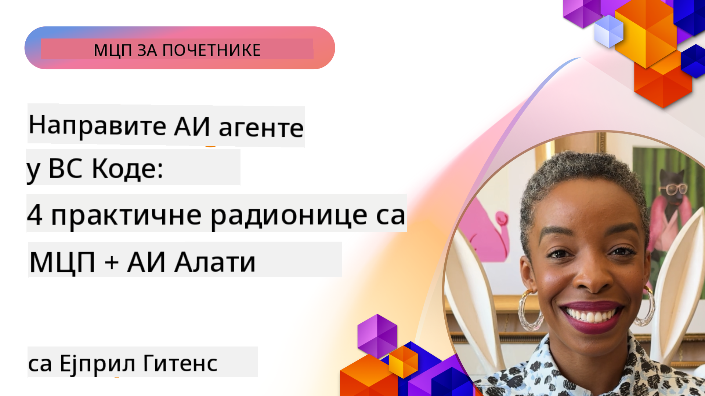

<!--
CO_OP_TRANSLATOR_METADATA:
{
  "original_hash": "1b000fd6e1b04c047578bfc5d07d54eb",
  "translation_date": "2025-08-19T17:36:50+00:00",
  "source_file": "10-StreamliningAIWorkflowsBuildingAnMCPServerWithAIToolkit/README.md",
  "language_code": "sr"
}
-->
# Унапређивање AI Радних Токова: Изградња MCP Сервера са AI Алатима

## 🎯 Преглед

_(Кликните на слику изнад да бисте погледали видео овог часа)_

Добродошли на **Радионицу о Model Context Protocol (MCP)**! Ова свеобухватна практична радионица комбинује две најсавременије технологије како би револуционисала развој AI апликација:

- **🔗 Model Context Protocol (MCP)**: Отворени стандард за беспрекорну интеграцију AI алата
- **🛠️ AI Алат за Visual Studio Code (AITK)**: Моћан Microsoft-ов додатак за развој AI апликација

### 🎓 Шта ћете научити

До краја ове радионице, овладаћете вештином изградње интелигентних апликација које повезују AI моделе са стварним алатима и услугама. Од аутоматизованог тестирања до прилагођених API интеграција, стекнућете практичне вештине за решавање сложених пословних изазова.

## 🏗️ Технолошки Стек

### 🔌 Model Context Protocol (MCP)

MCP је **"USB-C за AI"** - универзални стандард који повезује AI моделе са спољним алатима и изворима података.

**✨ Кључне Карактеристике:**

- 🔄 **Стандардизована Интеграција**: Универзални интерфејс за повезивање AI алата
- 🏛️ **Флексибилна Архитектура**: Локални и удаљени сервери преко stdio/SSE транспорта
- 🧰 **Богат Екосистем**: Алатке, упутства и ресурси у једном протоколу
- 🔒 **Спреман за Предузећа**: Уграђена безбедност и поузданост

**🎯 Зашто је MCP важан:**
Као што је USB-C елиминисао хаос са кабловима, MCP елиминише сложеност AI интеграција. Један протокол, бесконачне могућности.

### 🤖 AI Алат за Visual Studio Code (AITK)

Microsoft-ов водећи додатак за развој AI апликација који претвара VS Code у AI платформу.

**🚀 Основне Могућности:**

- 📦 **Каталог Модела**: Приступ моделима са Azure AI, GitHub-а, Hugging Face-а, Ollama
- ⚡ **Локална Инференција**: ONNX-оптимизовано извршавање на CPU/GPU/NPU
- 🏗️ **Градитељ Агената**: Визуелни развој AI агената са MCP интеграцијом
- 🎭 **Мултимодалност**: Подршка за текст, визију и структурисане излазе

**💡 Предности Развоја:**

- Размештање модела без конфигурације
- Визуелно креирање упутстава
- Тестирање у реалном времену
- Беспрекорна интеграција MCP сервера

## 📚 Пут Учења

### [🚀 Модул 1: Основе AI Алатке](./lab1/README.md)

**Трајање**: 15 минута

- 🛠️ Инсталирајте и конфигуришите AI Алат за VS Code
- 🗂️ Истражите Каталог Модела (100+ модела са GitHub-а, ONNX-а, OpenAI-а, Anthropic-а, Google-а)
- 🎮 Овладајте Интерактивним Игралиштем за тестирање модела у реалном времену
- 🤖 Направите свог првог AI агента помоћу Градитеља Агената
- 📊 Процените перформансе модела помоћу уграђених метрика (F1, релевантност, сличност, кохерентност)
- ⚡ Научите могућности обраде у серијама и мултимодалне подршке

**🎯 Исход Учења**: Направите функционалног AI агента са свеобухватним разумевањем могућности AITK-а

### [🌐 Модул 2: Основе MCP са AI Алатком](./lab2/README.md)

**Трајање**: 20 минута

- 🧠 Овладајте архитектуром и концептима Model Context Protocol-а (MCP)
- 🌐 Истражите Microsoft-ов MCP серверски екосистем
- 🤖 Направите агента за аутоматизацију прегледача користећи Playwright MCP сервер
- 🔧 Интегришите MCP сервере са Градитељем Агената AI Алатке
- 📊 Конфигуришите и тестирајте MCP алате унутар својих агената
- 🚀 Извезите и распоредите агенте са MCP подршком за продукцијску употребу

**🎯 Исход Учења**: Распоредите AI агента ојачаног спољним алатима преко MCP-а

### [🔧 Модул 3: Напредни MCP Развој са AI Алатком](./lab3/README.md)

**Трајање**: 20 минута

- 💻 Направите прилагођене MCP сервере користећи AI Алат
- 🐍 Конфигуришите и користите најновији MCP Python SDK (v1.9.3)
- 🔍 Подесите и користите MCP Inspector за отклањање грешака
- 🛠️ Направите MCP сервер за временску прогнозу са професионалним радним токовима за отклањање грешака
- 🧪 Отклањајте грешке MCP сервера у окружењима Градитеља Агената и Inspector-а

**🎯 Исход Учења**: Развијте и отклањајте грешке прилагођених MCP сервера са модерним алатима

### [🐙 Модул 4: Практични MCP Развој - Прилагођени GitHub Clone Сервер](./lab4/README.md)

**Трајање**: 30 минута

- 🏗️ Направите реални GitHub Clone MCP сервер за развојне радне токове
- 🔄 Имплементирајте паметно клонирање репозиторијума са валидацијом и руковањем грешкама
- 📁 Креирајте интелигентно управљање директоријумима и интеграцију са VS Code-ом
- 🤖 Користите GitHub Copilot Agent Mode са прилагођеним MCP алатима
- 🛡️ Примените продукцијску поузданост и компатибилност на више платформи

**🎯 Исход Учења**: Распоредите MCP сервер спреман за продукцију који унапређује стварне развојне радне токове

## 💡 Примена у Реалном Свету и Утицај

### 🏢 Коришћење у Предузећима

#### 🔄 Аутоматизација DevOps-а

Трансформишите свој развојни радни ток интелигентном аутоматизацијом:

- **Паметно Управљање Репозиторијумима**: AI-ом вођена ревизија кода и одлуке о спајању
- **Интелигентни CI/CD**: Аутоматизована оптимизација цевовода на основу промена у коду
- **Класификација Проблема**: Аутоматско класификовање и додељивање грешака

#### 🧪 Револуција у Контроли Квалитета

Унапредите тестирање помоћу AI-а:

- **Интелигентно Генерисање Тестова**: Аутоматско креирање свеобухватних тестних скупова
- **Визуелно Регресијско Тестирање**: AI-ом вођено откривање промена у корисничком интерфејсу
- **Праћење Перформанси**: Проактивно идентификовање и решавање проблема

#### 📊 Интелигенција у Обради Података

Изградите паметније радне токове за обраду података:

- **Адаптивни ETL Процеси**: Самооптимизујуће трансформације података
- **Откривање Аномалија**: Надгледање квалитета података у реалном времену
- **Интелигентно Рутање**: Паметно управљање токовима података

#### 🎧 Унапређење Корисничког Искуства

Креирајте изузетне интеракције са корисницима:

- **Подршка Свесна Контекста**: AI агенти са приступом историји корисника
- **Проактивно Решавање Проблема**: Предиктивна корисничка подршка
- **Мулти-Канална Интеграција**: Јединствено AI искуство на свим платформама

## 🛠️ Предуслови и Подешавање

### 💻 Системски Захтеви

| Компонента | Захтев | Напомене |
|------------|--------|----------|
| **Оперативни Систем** | Windows 10+, macOS 10.15+, Linux | Било који модерни ОС |
| **Visual Studio Code** | Најновија стабилна верзија | Потребно за AITK |
| **Node.js** | v18.0+ и npm | За развој MCP сервера |
| **Python** | 3.10+ | Опционо за Python MCP сервере |
| **Меморија** | Минимум 8GB RAM | Препоручено 16GB за локалне моделе |

### 🔧 Развојно Окружење

#### Препоручени Додаци за VS Code

- **AI Toolkit** (ms-windows-ai-studio.windows-ai-studio)
- **Python** (ms-python.python)
- **Python Debugger** (ms-python.debugpy)
- **GitHub Copilot** (GitHub.copilot) - Опционо, али корисно

#### Опциона Алатка

- **uv**: Модеран Python менаџер пакета
- **MCP Inspector**: Визуелни алат за отклањање грешака MCP сервера
- **Playwright**: За примере веб аутоматизације

## 🎖️ Исходи Учења и Сертификациони Пут

### 🏆 Контролна Листа Вештина

Завршетком ове радионице, постићи ћете мајсторство у:

#### 🎯 Основне Компетенције

- [ ] **Мајсторство MCP Протокола**: Дубоко разумевање архитектуре и образаца имплементације
- [ ] **AITK Вештине**: Експертско коришћење AI Алатке за брз развој
- [ ] **Развој Прилагођених Сервера**: Изградња, распоређивање и одржавање продукцијских MCP сервера
- [ ] **Изврсност у Интеграцији Алатки**: Беспрекорно повезивање AI-а са постојећим радним токовима
- [ ] **Примена у Решавању Проблема**: Примена научених вештина на стварне пословне изазове

#### 🔧 Техничке Вештине

- [ ] Подешавање и конфигурација AI Алатке у VS Code-у
- [ ] Дизајн и имплементација прилагођених MCP сервера
- [ ] Интеграција GitHub модела са MCP архитектуром
- [ ] Изградња аутоматизованих радних токова тестирања са Playwright-ом
- [ ] Распоређивање AI агената за продукцијску употребу
- [ ] Отклањање грешака и оптимизација MCP сервера

#### 🚀 Напредне Способности

- [ ] Архитектура AI интеграција у предузећима
- [ ] Имплементација најбољих безбедносних пракси за AI апликације
- [ ] Дизајн скалабилних MCP серверских архитектура
- [ ] Креирање прилагођених алатских ланаца за специфичне домене
- [ ] Менторисање других у развоју заснованом на AI-у

## 📖 Додатни Ресурси

- [MCP Спецификација](https://modelcontextprotocol.io/docs)
- [AI Toolkit GitHub Репозиторијум](https://github.com/microsoft/vscode-ai-toolkit)
- [Збирка Пример MCP Сервера](https://github.com/modelcontextprotocol/servers)
- [Водич за Најбоље Праксе](https://modelcontextprotocol.io/docs/best-practices)

---

**🚀 Спремни да револуционишете свој AI развојни ток?**

Хајде да заједно изградимо будућност интелигентних апликација са MCP-ом и AI Алатком!

**Одрицање од одговорности**:  
Овај документ је преведен коришћењем услуге за превођење помоћу вештачке интелигенције [Co-op Translator](https://github.com/Azure/co-op-translator). Иако тежимо тачности, молимо вас да имате у виду да аутоматизовани преводи могу садржати грешке или нетачности. Оригинални документ на свом изворном језику треба сматрати ауторитативним извором. За критичне информације препоручује се професионални превод од стране људи. Не сносимо одговорност за било каква неспоразумевања или погрешна тумачења која могу произаћи из коришћења овог превода.