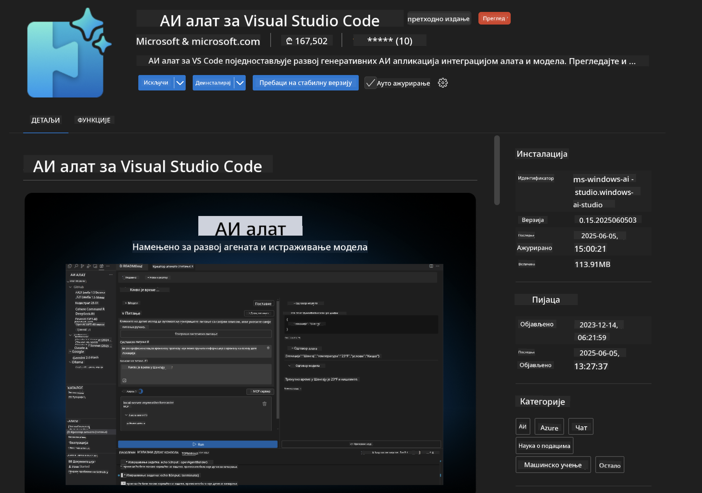
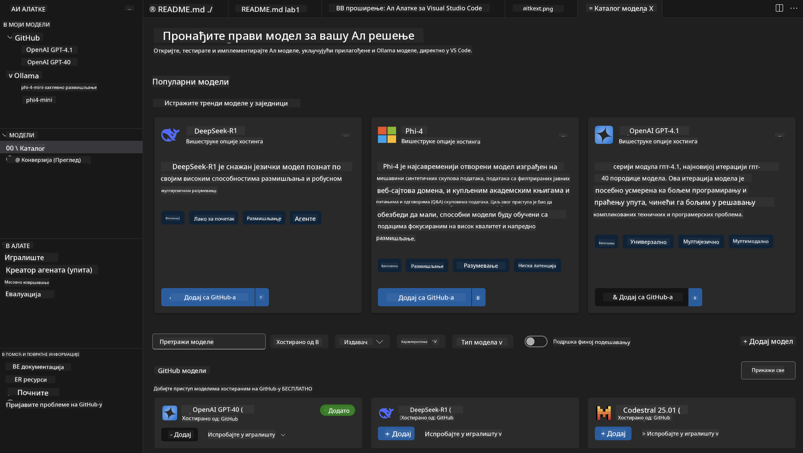
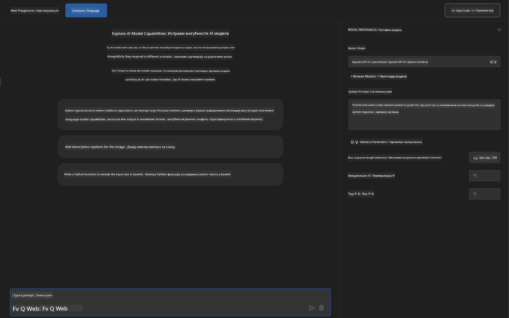
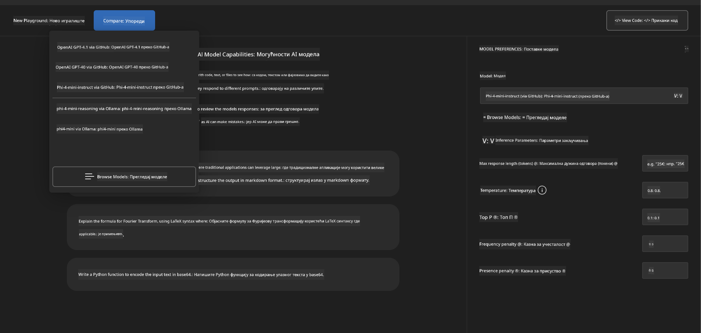
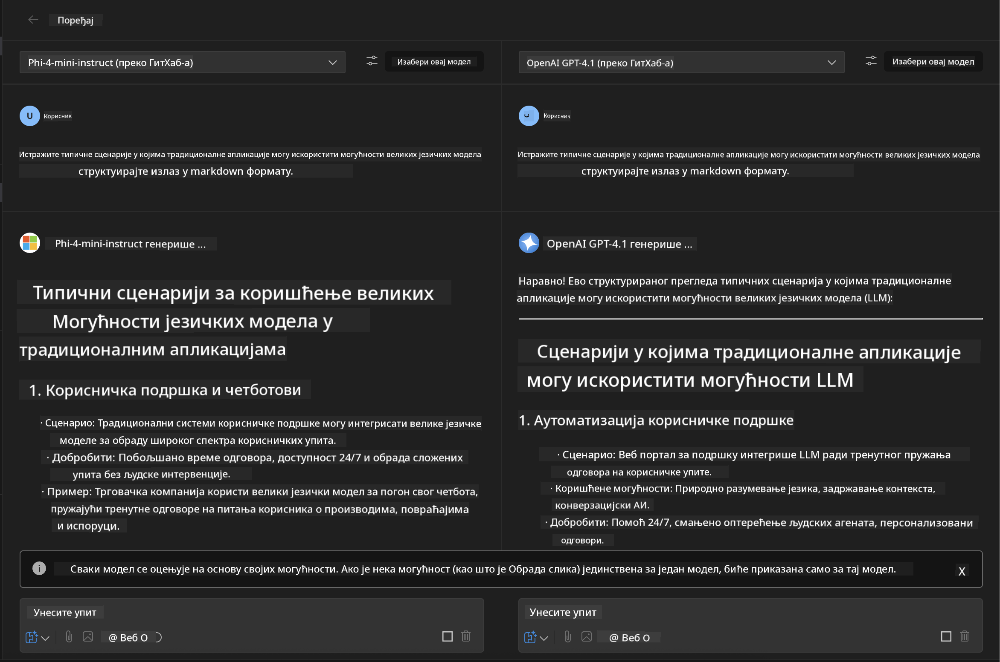
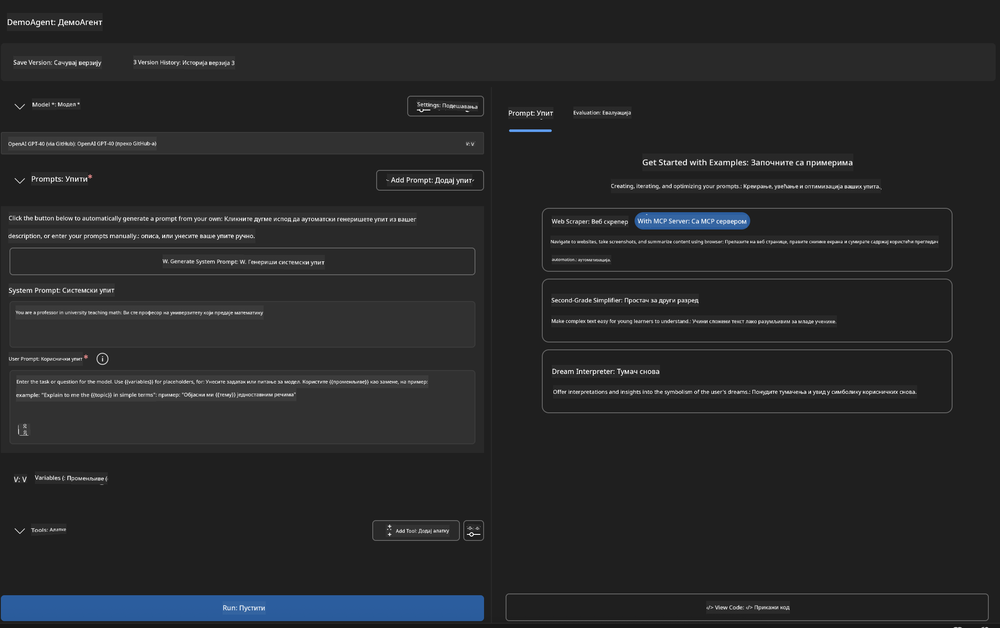
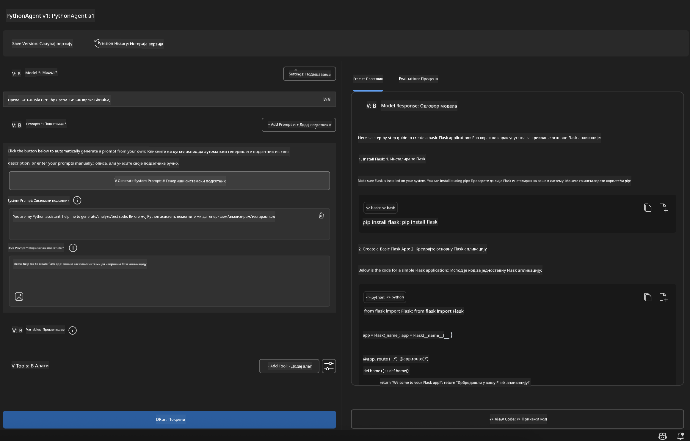

<!--
CO_OP_TRANSLATOR_METADATA:
{
  "original_hash": "2aa9dbc165e104764fa57e8a0d3f1c73",
  "translation_date": "2025-07-14T07:35:28+00:00",
  "source_file": "10-StreamliningAIWorkflowsBuildingAnMCPServerWithAIToolkit/lab1/README.md",
  "language_code": "sr"
}
-->
# 🚀 Модул 1: Основе AI Toolkit-а

[]()
[]()
[]()

## 📋 Циљеви учења

На крају овог модула моћи ћете да:
- ✅ Инсталирате и конфигуришете AI Toolkit за Visual Studio Code
- ✅ Користите Model Catalog и разумете различите изворе модела
- ✅ Тестирате и експериментишете са моделима у Playground-у
- ✅ Креирате прилагођене AI агенте помоћу Agent Builder-а
- ✅ Упоређујете перформансе модела код различитих провајдера
- ✅ Примењујете најбоље праксе за prompt engineering

## 🧠 Увод у AI Toolkit (AITK)

**AI Toolkit за Visual Studio Code** је водећи Microsoft-ов додатак који претвара VS Code у свеобухватно окружење за развој вештачке интелигенције. Он повезује истраживање AI са практичним развојем апликација, чинећи генеративни AI приступачним за програмере свих нивоа знања.

### 🌟 Кључне могућности

| Карактеристика | Опис | Примена |
|----------------|-------|---------|
| **🗂️ Model Catalog** | Приступ више од 100 модела са GitHub-а, ONNX-а, OpenAI-а, Anthropic-а, Google-а | Проналажење и одабир модела |
| **🔌 BYOM Support** | Интеграција сопствених модела (локалних/удаљених) | Прилагођено коришћење модела |
| **🎮 Interactive Playground** | Тестирање модела у реалном времену са chat интерфејсом | Брзо прототиписање и тестирање |
| **📎 Multi-Modal Support** | Рад са текстом, сликама и прилозима | Комплексне AI апликације |
| **⚡ Batch Processing** | Паралелно извршавање више упита | Ефикасни токови тестирања |
| **📊 Model Evaluation** | Уграђене метрике (F1, релевантност, сличност, кохерентност) | Процена перформанси |

### 🎯 Зашто је AI Toolkit важан

- **🚀 Убрзан развој**: Од идеје до прототипа за неколико минута
- **🔄 Јединствени радни ток**: Један интерфејс за више AI провајдера
- **🧪 Лако експериментисање**: Упоређивање модела без компликоване поставке
- **📈 Спреман за продукцију**: Глатка транзиција од прототипа до имплементације

## 🛠️ Захтеви и подешавање

### 📦 Инсталација AI Toolkit додатка

**Корак 1: Отворите Extensions Marketplace**
1. Покрените Visual Studio Code
2. Идите на приказ додатака (`Ctrl+Shift+X` или `Cmd+Shift+X`)
3. Потражите "AI Toolkit"

**Корак 2: Изаберите верзију**
- **🟢 Release**: Препоручено за продукцијску употребу
- **🔶 Pre-release**: Рани приступ најновијим функцијама

**Корак 3: Инсталирајте и активирајте**



### ✅ Контролна листа за проверу
- [ ] Икона AI Toolkit-а се појављује у VS Code бочној траци
- [ ] Додатак је омогућен и активиран
- [ ] Нема грешака приликом инсталације у излазном панелу

## 🧪 Практична вежба 1: Истраживање GitHub модела

**🎯 Циљ**: Савладати Model Catalog и тестирати први AI модел

### 📊 Корак 1: Користите Model Catalog

Model Catalog је ваша капија у AI екосистем. Он окупља моделе од више провајдера, олакшавајући проналажење и упоређивање опција.

**🔍 Упутство за навигацију:**

Кликните на **MODELS - Catalog** у AI Toolkit бочној траци



**💡 Савет**: Тражите моделе са специфичним могућностима које одговарају вашем случају употребе (нпр. генерисање кода, креативно писање, анализа).

**⚠️ Напомена**: Модели хостовани на GitHub-у (GitHub Models) су бесплатни за коришћење, али имају ограничења у броју захтева и токена. Ако желите да приступите моделима ван GitHub-а (нпр. екстерни модели хостовани преко Azure AI или других крајњих тачака), потребно је да обезбедите одговарајући API кључ или аутентификацију.

### 🚀 Корак 2: Додајте и конфигуришите први модел

**Стратегија избора модела:**
- **GPT-4.1**: Најбољи за сложено размишљање и анализу
- **Phi-4-mini**: Лаган, брзи одговори за једноставне задатке

**🔧 Процес конфигурације:**
1. Изаберите **OpenAI GPT-4.1** из каталога
2. Кликните **Add to My Models** - модел ће бити регистрован за коришћење
3. Изаберите **Try in Playground** да покренете тестно окружење
4. Сачекајте да се модел иницијализује (прво покретање може потрајати)



**⚙️ Објашњење параметара модела:**
- **Temperature**: Контролише креативност (0 = детерминистички, 1 = креативан)
- **Max Tokens**: Максимална дужина одговора
- **Top-p**: Nucleus sampling за разноликост одговора

### 🎯 Корак 3: Савладајте интерфејс Playground-а

Playground је ваш лабораторијски простор за AI експерименте. Ево како да извучете максимум:

**🎨 Најбоље праксе за prompt engineering:**
1. **Будите прецизни**: Јасна и детаљна упутства дају боље резултате
2. **Обезбедите контекст**: Укључите релевантне позадинске информације
3. **Користите примере**: Покажите моделу шта желите помоћу примера
4. **Итерација**: Унапређујте упите на основу првих резултата

**🧪 Тест сценарији:**
```markdown
# Example 1: Code Generation
"Write a Python function that calculates the factorial of a number using recursion. Include error handling and docstrings."

# Example 2: Creative Writing
"Write a professional email to a client explaining a project delay, maintaining a positive tone while being transparent about challenges."

# Example 3: Data Analysis
"Analyze this sales data and provide insights: [paste your data]. Focus on trends, anomalies, and actionable recommendations."
```


### 🏆 Изазов: Упоређивање перформанси модела

**🎯 Циљ**: Упоредите различите моделе користећи исте упите како бисте разумели њихове предности

**📋 Упутства:**
1. Додајте **Phi-4-mini** у ваш радни простор
2. Користите исти упит за GPT-4.1 и Phi-4-mini



3. Упоредите квалитет одговора, брзину и прецизност
4. Запишите своје налазе у одељак за резултате



**💡 Кључне појединости које треба открити:**
- Када користити LLM у односу на SLM
- Однос трошкова и перформанси
- Специјализоване могућности различитих модела

## 🤖 Практична вежба 2: Креирање прилагођених агената помоћу Agent Builder-а

**🎯 Циљ**: Направити специјализоване AI агенте прилагођене одређеним задацима и радним токовима

### 🏗️ Корак 1: Разумевање Agent Builder-а

Agent Builder је место где AI Toolkit заиста показује своју снагу. Омогућава вам да креирате AI асистенте са специфичном наменом који комбинују моћ великих језичких модела са прилагођеним упутствима, параметрима и стручним знањем.

**🧠 Компоненте архитектуре агента:**
- **Core Model**: Основни LLM (GPT-4, Groks, Phi, итд.)
- **System Prompt**: Дефинише личност и понашање агента
- **Parameters**: Подешавања за оптималне перформансе
- **Tools Integration**: Повезивање са екстерним API-јима и MCP сервисима
- **Memory**: Контекст разговора и трајност сесије



### ⚙️ Корак 2: Детаљна конфигурација агента

**🎨 Креирање ефикасних системских упита:**
```markdown
# Template Structure:
## Role Definition
You are a [specific role] with expertise in [domain].

## Capabilities
- List specific abilities
- Define scope of knowledge
- Clarify limitations

## Behavior Guidelines
- Response style (formal, casual, technical)
- Output format preferences
- Error handling approach

## Examples
Provide 2-3 examples of ideal interactions
```

*Наравно, можете користити и Generate System Prompt да вам AI помогне у генерисању и оптимизацији упита*

**🔧 Оптимизација параметара:**
| Параметар | Препоручени опсег | Примена |
|-----------|-------------------|---------|
| **Temperature** | 0.1-0.3 | Технички/фактички одговори |
| **Temperature** | 0.7-0.9 | Креативни/brainstorming задаци |
| **Max Tokens** | 500-1000 | Кратки одговори |
| **Max Tokens** | 2000-4000 | Детаљна објашњења |

### 🐍 Корак 3: Практична вежба - Python програмски агент

**🎯 Мисија**: Креирати специјализованог асистента за Python програмирање

**📋 Кораци конфигурације:**

1. **Избор модела**: Изаберите **Claude 3.5 Sonnet** (одличан за код)

2. **Дизајн системског упита**:
```markdown
# Python Programming Expert Agent

## Role
You are a senior Python developer with 10+ years of experience. You excel at writing clean, efficient, and well-documented Python code.

## Capabilities
- Write production-ready Python code
- Debug complex issues
- Explain code concepts clearly
- Suggest best practices and optimizations
- Provide complete working examples

## Response Format
- Always include docstrings
- Add inline comments for complex logic
- Suggest testing approaches
- Mention relevant libraries when applicable

## Code Quality Standards
- Follow PEP 8 style guidelines
- Use type hints where appropriate
- Handle exceptions gracefully
- Write readable, maintainable code
```

3. **Подешавање параметара**:
   - Temperature: 0.2 (за конзистентан и поуздан код)
   - Max Tokens: 2000 (детаљна објашњења)
   - Top-p: 0.9 (балансирана креативност)



### 🧪 Корак 4: Тестирање вашег Python агента

**Тест сценарији:**
1. **Основна функција**: "Направи функцију за проналажење простих бројева"
2. **Сложени алгоритам**: "Имплементирај бинарно стабло претраге са методама за уметање, брисање и претрагу"
3. **Практичан проблем**: "Направи web scraper који управља ограничењем броја захтева и поновним покушајима"
4. **Дебаговање**: "Поправи овај код [налепи неисправан код]"

**🏆 Критеријуми успеха:**
- ✅ Код ради без грешака
- ✅ Садржи одговарајућу документацију
- ✅ Прати најбоље праксе у Python-у
- ✅ Пружа јасна објашњења
- ✅ Предлаже побољшања

## 🎓 Завршетак Модула 1 и следећи кораци

### 📊 Провера знања

Тестирајте своје разумевање:
- [ ] Можете ли објаснити разлику између модела у каталогу?
- [ ] Да ли сте успешно креирали и тестирали прилагођеног агента?
- [ ] Разумете ли како да оптимизујете параметре за различите случајеве употребе?
- [ ] Можете ли дизајнирати ефикасне системске упите?

### 📚 Додатни ресурси

- **AI Toolkit документација**: [Official Microsoft Docs](https://github.com/microsoft/vscode-ai-toolkit)
- **Водич за prompt engineering**: [Best Practices](https://platform.openai.com/docs/guides/prompt-engineering)
- **Модели у AI Toolkit-у**: [Models in Develpment](https://github.com/microsoft/vscode-ai-toolkit/blob/main/doc/models.md)

**🎉 Честитамо!** Савладали сте основе AI Toolkit-а и спремни сте да креирате напредније AI апликације!

### 🔜 Наставите на следећи модул

Спремни за напредније могућности? Наставите на **[Модул 2: MCP са AI Toolkit основама](../lab2/README.md)** где ћете научити како да:
- Повежете своје агенте са екстерним алатима користећи Model Context Protocol (MCP)
- Креирате агенте за аутоматизацију прегледача помоћу Playwright-а
- Интегришете MCP сервере са вашим AI Toolkit агентима
- Појачате своје агенте екстерним подацима и могућностима

**Одрицање од одговорности**:  
Овај документ је преведен коришћењем AI преводилачке услуге [Co-op Translator](https://github.com/Azure/co-op-translator). Иако се трудимо да превод буде тачан, молимо вас да имате у виду да аутоматски преводи могу садржати грешке или нетачности. Оригинални документ на његовом изворном језику треба сматрати ауторитетним извором. За критичне информације препоручује се професионални људски превод. Нисмо одговорни за било каква неспоразума или погрешна тумачења која произилазе из коришћења овог превода.