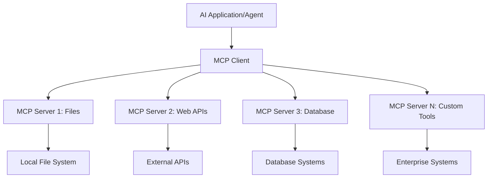

<!--
CO_OP_TRANSLATOR_METADATA:
{
  "original_hash": "a22b7dd11cd7690f99f9195877cafdc3",
  "translation_date": "2025-06-10T05:59:40+00:00",
  "source_file": "10-StreamliningAIWorkflowsBuildingAnMCPServerWithAIToolkit/lab2/README.md",
  "language_code": "sr"
}
-->
# 🌐 Modul 2: Osnove MCP sa AI Toolkit-om

[]()
[]()
[]()

## 📋 Ciljevi učenja

Na kraju ovog modula bićete u stanju da:
- ✅ Razumete arhitekturu i prednosti Model Context Protocol-a (MCP)
- ✅ Istražite Microsoftov MCP server ekosistem
- ✅ Integrirate MCP servere sa AI Toolkit Agent Builder-om
- ✅ Napravite funkcionalnog agenta za automatizaciju pretraživača koristeći Playwright MCP
- ✅ Konfigurišete i testirate MCP alate unutar vaših agenata
- ✅ Izvezete i implementirate agente koji koriste MCP za produkciju

## 🎯 Nastavak na Modul 1

U Modulu 1 smo savladali osnove AI Toolkita i kreirali našeg prvog Python agenta. Sada ćemo **osnažiti** vaše agente povezivanjem sa spoljnim alatima i servisima putem revolucionarnog **Model Context Protocol-a (MCP)**.

Zamislite to kao prelazak sa običnog kalkulatora na pravi računar – vaši AI agenti će dobiti mogućnosti da:
- 🌐 Pregledaju i interaguju sa veb sajtovima
- 📁 Pristupaju i manipulišu fajlovima
- 🔧 Integrisu se sa poslovnim sistemima
- 📊 Procesuiraju podatke u realnom vremenu sa API-ja

## 🧠 Razumevanje Model Context Protocol-a (MCP)

### 🔍 Šta je MCP?

Model Context Protocol (MCP) je **"USB-C za AI aplikacije"** – revolucionarni otvoreni standard koji povezuje velike jezičke modele (LLM) sa spoljnim alatima, izvorima podataka i servisima. Baš kao što je USB-C rešio haos sa kablovima jedinstvenim konektorom, MCP uklanja složenost integracije AI sa jednim standardizovanim protokolom.

### 🎯 Problem koji MCP rešava

**Pre MCP-a:**
- 🔧 Specifične integracije za svaki alat
- 🔄 Zaključavanje kod dobavljača sa vlasničkim rešenjima  
- 🔒 Bezbednosni propusti usled ad-hoc veza
- ⏱️ Mesece razvoja za osnovne integracije

**Sa MCP-om:**
- ⚡ Plug-and-play integracija alata
- 🔄 Arhitektura nezavisna od dobavljača
- 🛡️ Ugrađene najbolje bezbednosne prakse
- 🚀 Dodavanje novih funkcionalnosti za nekoliko minuta

### 🏗️ Detaljna arhitektura MCP-a

MCP koristi **klijent-server arhitekturu** koja stvara siguran i skalabilan ekosistem:



**🔧 Glavne komponente:**

| Komponenta | Uloga | Primeri |
|------------|-------|---------|
| **MCP Hosts** | Aplikacije koje koriste MCP servise | Claude Desktop, VS Code, AI Toolkit |
| **MCP Clients** | Protokol handleri (1:1 sa serverima) | Ugrađeni u host aplikacije |
| **MCP Servers** | Izlažu funkcionalnosti preko standardnog protokola | Playwright, Files, Azure, GitHub |
| **Transport Layer** | Metode komunikacije | stdio, HTTP, WebSockets |


## 🏢 Microsoftov MCP Server Ekosistem

Microsoft predvodi MCP ekosistem sa sveobuhvatnim paketom enterprise servera koji rešavaju stvarne poslovne potrebe.

### 🌟 Istaknuti Microsoft MCP Serveri

#### 1. ☁️ Azure MCP Server  
**🔗 Repository**: [azure/azure-mcp](https://github.com/azure/azure-mcp)  
**🎯 Svrha**: Sveobuhvatno upravljanje Azure resursima sa AI integracijom

**✨ Ključne karakteristike:**
- Deklarativno upravljanje infrastrukturom
- Monitoring resursa u realnom vremenu
- Preporuke za optimizaciju troškova
- Provera usklađenosti bezbednosti

**🚀 Primeri upotrebe:**
- Infrastructure-as-Code sa AI podrškom
- Automatsko skaliranje resursa
- Optimizacija troškova u oblaku
- Automatizacija DevOps procesa

#### 2. 📊 Microsoft Dataverse MCP  
**📚 Dokumentacija**: [Microsoft Dataverse Integration](https://go.microsoft.com/fwlink/?linkid=2320176)  
**🎯 Svrha**: Prirodno jezičko sučelje za poslovne podatke

**✨ Ključne karakteristike:**
- Prirodno jezičke upite baze podataka
- Razumevanje poslovnog konteksta
- Prilagođeni predlošci za promptove
- Upravljanje podacima na enterprise nivou

**🚀 Primeri upotrebe:**
- Izveštavanje poslovne inteligencije
- Analiza podataka o kupcima
- Uvidi u prodajni pipeline
- Upiti vezani za usklađenost podataka

#### 3. 🌐 Playwright MCP Server  
**🔗 Repository**: [microsoft/playwright-mcp](https://github.com/microsoft/playwright-mcp)  
**🎯 Svrha**: Automatizacija pretraživača i interakcija sa webom

**✨ Ključne karakteristike:**
- Automatizacija na više pretraživača (Chrome, Firefox, Safari)
- Inteligentno prepoznavanje elemenata
- Pravljenje screenshot-ova i PDF-ova
- Praćenje mrežnog saobraćaja

**🚀 Primeri upotrebe:**
- Automatizovani testni tokovi
- Web scraping i ekstrakcija podataka
- Praćenje UI/UX performansi
- Automatizacija konkurentske analize

#### 4. 📁 Files MCP Server  
**🔗 Repository**: [microsoft/files-mcp-server](https://github.com/microsoft/files-mcp-server)  
**🎯 Svrha**: Inteligentne operacije nad fajl sistemom

**✨ Ključne karakteristike:**
- Deklarativno upravljanje fajlovima
- Sinhronizacija sadržaja
- Integracija sa verzionim sistemima
- Ekstrakcija metapodataka

**🚀 Primeri upotrebe:**
- Upravljanje dokumentacijom
- Organizacija kodnih repozitorijuma
- Tokovi objavljivanja sadržaja
- Rukovanje fajlovima u data pipeline-u

#### 5. 📝 MarkItDown MCP Server  
**🔗 Repository**: [microsoft/markitdown](https://github.com/microsoft/markitdown)  
**🎯 Svrha**: Napredna obrada i manipulacija Markdown fajlova

**✨ Ključne karakteristike:**
- Detaljno parsiranje Markdown-a
- Konverzija formata (MD ↔ HTML ↔ PDF)
- Analiza strukture sadržaja
- Obrada šablona

**🚀 Primeri upotrebe:**
- Tokovi tehničke dokumentacije
- Sistemi za upravljanje sadržajem
- Generisanje izveštaja
- Automatizacija baza znanja

#### 6. 📈 Clarity MCP Server  
**📦 Paket**: [@microsoft/clarity-mcp-server](https://www.npmjs.com/package/@microsoft/clarity-mcp-server)  
**🎯 Svrha**: Web analitika i uvidi u ponašanje korisnika

**✨ Ključne karakteristike:**
- Analiza podataka toplinskih mapa
- Snimci korisničkih sesija
- Merenje performansi
- Analiza konverzionih tokova

**🚀 Primeri upotrebe:**
- Optimizacija veb sajtova
- Istraživanje korisničkog iskustva
- A/B testiranje
- Dashboard-i za poslovnu inteligenciju

### 🌍 Zajednički ekosistem

Pored Microsoftovih servera, MCP ekosistem uključuje:  
- **🐙 GitHub MCP**: Upravljanje repozitorijumima i analiza koda  
- **🗄️ Database MCPs**: Integracije za PostgreSQL, MySQL, MongoDB  
- **☁️ Cloud Provider MCPs**: Alati za AWS, GCP, Digital Ocean  
- **📧 Communication MCPs**: Integracije sa Slack, Teams, Email

## 🛠️ Praktična vežba: Kreiranje agenta za automatizaciju pretraživača

**🎯 Cilj projekta**: Napraviti inteligentnog agenta za automatizaciju pretraživača koristeći Playwright MCP server, koji može da pretražuje sajtove, izvlači informacije i izvodi složene web interakcije.

### 🚀 Faza 1: Postavljanje osnove agenta

#### Korak 1: Inicijalizujte svog agenta
1. **Otvorite AI Toolkit Agent Builder**
2. **Kreirajte novog agenta** sa sledećom konfiguracijom:
   - **Ime**: `BrowserAgent`
   - **Model**: Choose GPT-4o 


### 🔧 Phase 2: MCP Integration Workflow

#### Step 3: Add MCP Server Integration
1. **Navigate to Tools Section** in Agent Builder
2. **Click "Add Tool"** to open the integration menu
3. **Select "MCP Server"** from available options


**🔍 Understanding Tool Types:**
- **Built-in Tools**: Pre-configured AI Toolkit functions
- **MCP Servers**: External service integrations
- **Custom APIs**: Your own service endpoints
- **Function Calling**: Direct model function access

#### Step 4: MCP Server Selection
1. **Choose "MCP Server"** option to proceed


2. **Browse MCP Catalog** to explore available integrations


### 🎮 Phase 3: Playwright MCP Configuration

#### Step 5: Select and Configure Playwright
1. **Click "Use Featured MCP Servers"** to access Microsoft's verified servers
2. **Select "Playwright"** from the featured list
3. **Accept Default MCP ID** or customize for your environment


#### Step 6: Enable Playwright Capabilities
**🔑 Critical Step**: Select **ALL** available Playwright methods for maximum functionality


**🛠️ Essential Playwright Tools:**
- **Navigation**: `goto`, `goBack`, `goForward`, `reload`
- **Interaction**: `click`, `fill`, `press`, `hover`, `drag`
- **Extraction**: `textContent`, `innerHTML`, `getAttribute`
- **Validation**: `isVisible`, `isEnabled`, `waitForSelector`
- **Capture**: `screenshot`, `pdf`, `video`
- **Network**: `setExtraHTTPHeaders`, `route`, `waitForResponse`

#### Korak 7: Proverite uspešnost integracije  
**✅ Indikatori uspeha:**  
- Svi alati su vidljivi u Agent Builder interfejsu  
- Nema poruka o greškama u panelu za integraciju  
- Status Playwright servera pokazuje "Connected"


**🔧 Rešavanje čestih problema:**  
- **Veza nije uspostavljena**: Proverite internet konekciju i podešavanja firewall-a  
- **Nedostaju alati**: Proverite da li su sve funkcionalnosti izabrane prilikom podešavanja  
- **Greške sa dozvolama**: Proverite da li VS Code ima neophodne sistemske dozvole

### 🎯 Faza 4: Napredno kreiranje promptova

#### Korak 8: Dizajnirajte inteligentne sistemske promptove  
Napravite složene promptove koji koriste sve mogućnosti Playwright-a:

```markdown
# Web Automation Expert System Prompt

## Core Identity
You are an advanced web automation specialist with deep expertise in browser automation, web scraping, and user experience analysis. You have access to Playwright tools for comprehensive browser control.

## Capabilities & Approach
### Navigation Strategy
- Always start with screenshots to understand page layout
- Use semantic selectors (text content, labels) when possible
- Implement wait strategies for dynamic content
- Handle single-page applications (SPAs) effectively

### Error Handling
- Retry failed operations with exponential backoff
- Provide clear error descriptions and solutions
- Suggest alternative approaches when primary methods fail
- Always capture diagnostic screenshots on errors

### Data Extraction
- Extract structured data in JSON format when possible
- Provide confidence scores for extracted information
- Validate data completeness and accuracy
- Handle pagination and infinite scroll scenarios

### Reporting
- Include step-by-step execution logs
- Provide before/after screenshots for verification
- Suggest optimizations and alternative approaches
- Document any limitations or edge cases encountered

## Ethical Guidelines
- Respect robots.txt and rate limiting
- Avoid overloading target servers
- Only extract publicly available information
- Follow website terms of service
```

#### Korak 9: Kreirajte dinamične korisničke promptove  
Dizajnirajte promptove koji demonstriraju različite funkcionalnosti:

**🌐 Primer web analize:**  
```markdown
Navigate to github.com/kinfey and provide a comprehensive analysis including:
1. Repository structure and organization
2. Recent activity and contribution patterns  
3. Documentation quality assessment
4. Technology stack identification
5. Community engagement metrics
6. Notable projects and their purposes

Include screenshots at key steps and provide actionable insights.
```


### 🚀 Faza 5: Izvršenje i testiranje

#### Korak 10: Pokrenite prvu automatizaciju  
1. **Kliknite "Run"** da pokrenete sekvencu automatizacije  
2. **Pratite izvršenje u realnom vremenu**:  
   - Chrome pretraživač se automatski pokreće  
   - Agent posećuje ciljanu veb stranicu  
   - Screenshot-ovi se prave za svaki važan korak  
   - Rezultati analize se prikazuju uživo


#### Korak 11: Analizirajte rezultate i uvide  
Pregledajte detaljnu analizu u Agent Builder interfejsu:


### 🌟 Faza 6: Napredne mogućnosti i implementacija

#### Korak 12: Izvoz i produkciona implementacija  
Agent Builder podržava različite opcije implementacije:


## 🎓 Sažetak Modula 2 i naredni koraci

### 🏆 Postignuće otključano: Majstor MCP integracije

**✅ Savladane veštine:**  
- [ ] Razumevanje arhitekture i prednosti MCP-a  
- [ ] Snalaženje u Microsoftovom MCP server ekosistemu  
- [ ] Integracija Playwright MCP-a sa AI Toolkit-om  
- [ ] Izgradnja naprednih agenata za automatizaciju pretraživača  
- [ ] Napredno kreiranje promptova za web automatizaciju

### 📚 Dodatni resursi

- **🔗 MCP specifikacija**: [Zvanična dokumentacija protokola](https://modelcontextprotocol.io/)  
- **🛠️ Playwright API**: [Kompletna referenca metoda](https://playwright.dev/docs/api/class-playwright)  
- **🏢 Microsoft MCP serveri**: [Vodič za enterprise integraciju](https://github.com/microsoft/mcp-servers)  
- **🌍 Primeri zajednice**: [Galerija MCP servera](https://github.com/modelcontextprotocol/servers)

**🎉 Čestitamo!** Uspešno ste savladali MCP integraciju i sada možete da pravite produkciono spremne AI agente sa mogućnostima spoljnjih alata!

### 🔜 Nastavite na sledeći modul

Spremni da podignete svoje MCP veštine na viši nivo? Pređite na **[Modul 3: Napredni MCP razvoj sa AI Toolkit-om](../lab3/README.md)** gde ćete naučiti kako da:  
- Kreirate sopstvene prilagođene MCP servere  
- Konfigurišete i koristite najnoviji MCP Python SDK  
- Postavite MCP Inspector za debagovanje  
- Savladate napredne tokove razvoja MCP servera  
- Izgradite Weather MCP Server od nule

**Одрицање од одговорности**:  
Овај документ је преведен коришћењем АИ преводилачке услуге [Co-op Translator](https://github.com/Azure/co-op-translator). Иако настојимо да превод буде тачан, имајте у виду да аутоматизовани преводи могу садржати грешке или нетачности. Оригинални документ на његовом изворном језику треба сматрати ауторитетним извором. За критичне информације препоручује се професионални људски превод. Нисмо одговорни за било каква неспоразума или погрешна тумачења настала коришћењем овог превода.