<!--
CO_OP_TRANSLATOR_METADATA:
{
  "original_hash": "a22b7dd11cd7690f99f9195877cafdc3",
  "translation_date": "2025-07-14T08:02:33+00:00",
  "source_file": "10-StreamliningAIWorkflowsBuildingAnMCPServerWithAIToolkit/lab2/README.md",
  "language_code": "sr"
}
-->
# 🌐 Модул 2: Основе MCP са AI Toolkit-ом

[]()
[]()
[]()

## 📋 Циљеви учења

До краја овог модула ћете моћи да:
- ✅ Разумете архитектуру и предности Model Context Protocol (MCP)
- ✅ Истражите Microsoft-ов MCP серверски екосистем
- ✅ Интегришете MCP сервере са AI Toolkit Agent Builder-ом
- ✅ Направите функционалног агента за аутоматизацију прегледача користећи Playwright MCP
- ✅ Конфигуришете и тестирате MCP алате унутар својих агената
- ✅ Извезете и имплементирате агенте покретане MCP-ом за производну употребу

## 🎯 Наставак рада из Модула 1

У Модулу 1 смо савладали основе AI Toolkit-а и направили првог Python агента. Сада ћемо **појачати** ваше агенте повезивањем са спољним алатима и сервисима кроз револуционарни **Model Context Protocol (MCP)**.

Замислите ово као надоградњу са обичног калкулатора на комплетан рачунар – ваши AI агенти ће добити могућност да:
- 🌐 Прегледају и интерагују са веб сајтовима
- 📁 Приступају и управљају фајловима
- 🔧 Интегришу се са корпоративним системима
- 📊 Обрађују податке у реалном времену са API-ја

## 🧠 Разумевање Model Context Protocol (MCP)

### 🔍 Шта је MCP?

Model Context Protocol (MCP) је **„USB-C за AI апликације“** – револуционарни отворени стандард који повезује велике језичке моделе (LLM) са спољним алатима, изворима података и сервисима. Као што је USB-C елиминисао неред са кабловима пружајући један универзални конектор, тако MCP поједностављује интеграцију AI-а једним стандардизованим протоколом.

### 🎯 Проблем који MCP решава

**Пре MCP-а:**
- 🔧 Прилагођене интеграције за сваки алат
- 🔄 Закључавање код добављача са сопственим решењима  
- 🔒 Безбедносне рањивости услед ad-hoc веза
- ⏱️ Месеци развоја за основне интеграције

**Са MCP-ом:**
- ⚡ Интеграција алата спремна за коришћење
- 🔄 Архитектура без зависности од добављача
- 🛡️ Уграђене најбоље безбедносне праксе
- 🚀 Додавање нових могућности за неколико минута

### 🏗️ Детаљна архитектура MCP-а

MCP прати **клијент-сервер архитектуру** која ствара безбедан и скалабилан екосистем:

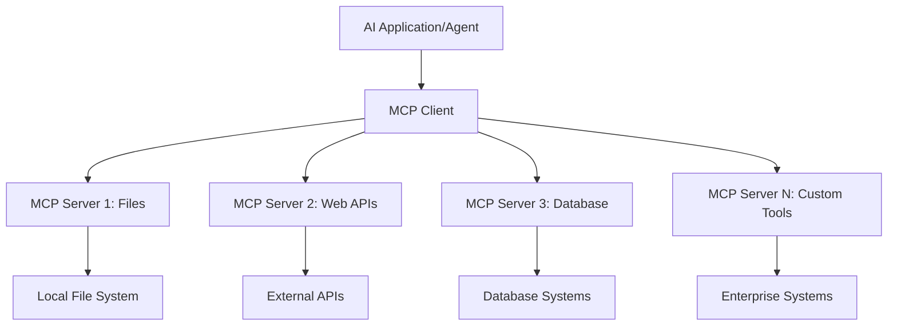

**🔧 Основне компоненте:**

| Компонента | Улога | Примери |
|------------|-------|---------|
| **MCP Hosts** | Апликације које користе MCP сервисе | Claude Desktop, VS Code, AI Toolkit |
| **MCP Clients** | Обрађивачи протокола (1:1 са серверима) | Уграђени у хост апликације |
| **MCP Servers** | Излажу могућности преко стандардног протокола | Playwright, Files, Azure, GitHub |
| **Transport Layer** | Начини комуникације | stdio, HTTP, WebSockets |


## 🏢 Microsoft-ов MCP серверски екосистем

Microsoft предводи MCP екосистем са свеобухватним скупом корпоративних сервера који решавају стварне пословне потребе.

### 🌟 Истакнути Microsoft MCP сервери

#### 1. ☁️ Azure MCP Server
**🔗 Репозиторијум**: [azure/azure-mcp](https://github.com/azure/azure-mcp)
**🎯 Намена**: Комплетно управљање Azure ресурсима са AI интеграцијом

**✨ Кључне карактеристике:**
- Декларативно обезбеђивање инфраструктуре
- Праћење ресурса у реалном времену
- Препоруке за оптимизацију трошкова
- Провера усаглашености са безбедносним стандардима

**🚀 Примена:**
- Infrastructure-as-Code са AI подршком
- Аутоматско скалирање ресурса
- Оптимизација трошкова у облаку
- Аутоматизација DevOps процеса

#### 2. 📊 Microsoft Dataverse MCP
**📚 Документација**: [Microsoft Dataverse Integration](https://go.microsoft.com/fwlink/?linkid=2320176)
**🎯 Намена**: Природни језички интерфејс за пословне податке

**✨ Кључне карактеристике:**
- Природне језичке упите базе података
- Разумевање пословног контекста
- Прилагођени шаблони упита
- Управљање корпоративним подацима

**🚀 Примена:**
- Извештавање пословне интелигенције
- Анализа података о клијентима
- Увид у продајни ток
- Упити за усаглашеност података

#### 3. 🌐 Playwright MCP Server
**🔗 Репозиторијум**: [microsoft/playwright-mcp](https://github.com/microsoft/playwright-mcp)
**🎯 Намена**: Аутоматизација прегледача и веб интеракција

**✨ Кључне карактеристике:**
- Аутоматизација на више прегледача (Chrome, Firefox, Safari)
- Интелигентно препознавање елемената
- Генерисање снимака екрана и PDF-ова
- Праћење мрежног саобраћаја

**🚀 Примена:**
- Аутоматизовани тестни токови
- Веб скрејпинг и екстракција података
- Праћење UI/UX перформанси
- Аутоматизација конкурентске анализе

#### 4. 📁 Files MCP Server
**🔗 Репозиторијум**: [microsoft/files-mcp-server](https://github.com/microsoft/files-mcp-server)
**🎯 Намена**: Интелигентне операције са фајл системом

**✨ Кључне карактеристике:**
- Декларативно управљање фајловима
- Синхронизација садржаја
- Интеграција контроле верзија
- Извлачење метаподатака

**🚀 Примена:**
- Управљање документацијом
- Организација кода у репозиторијуму
- Токови објављивања садржаја
- Обрада фајлова у подацима

#### 5. 📝 MarkItDown MCP Server
**🔗 Репозиторијум**: [microsoft/markitdown](https://github.com/microsoft/markitdown)
**🎯 Намена**: Напредна обрада и манипулација Markdown-ом

**✨ Кључне карактеристике:**
- Напредно парсирање Markdown-а
- Конверзија формата (MD ↔ HTML ↔ PDF)
- Анализа структуре садржаја
- Обрада шаблона

**🚀 Примена:**
- Токови техничке документације
- Системи за управљање садржајем
- Генерисање извештаја
- Аутоматизација базе знања

#### 6. 📈 Clarity MCP Server
**📦 Пакет**: [@microsoft/clarity-mcp-server](https://www.npmjs.com/package/@microsoft/clarity-mcp-server)
**🎯 Намена**: Веб аналитика и увиди у понашање корисника

**✨ Кључне карактеристике:**
- Анализа топлотних мапа
- Снимање корисничких сесија
- Метрике перформанси
- Анализа конверзијских токова

**🚀 Примена:**
- Оптимизација веб сајтова
- Истраживање корисничког искуства
- Анализа A/B тестирања
- Пословни интелигентни панели

### 🌍 Заједнички екосистем

Поред Microsoft-ових сервера, MCP екосистем укључује:
- **🐙 GitHub MCP**: Управљање репозиторијумима и анализа кода
- **🗄️ Database MCPs**: Интеграције за PostgreSQL, MySQL, MongoDB
- **☁️ Cloud Provider MCPs**: Алати за AWS, GCP, Digital Ocean
- **📧 Communication MCPs**: Интеграције за Slack, Teams, Email

## 🛠️ Практична вежба: Прављење агента за аутоматизацију прегледача

**🎯 Циљ пројекта**: Направити интелигентног агента за аутоматизацију прегледача користећи Playwright MCP сервер који може да прегледа веб сајтове, извлачи информације и изводи сложене веб интеракције.

### 🚀 Фаза 1: Постављање основе агента

#### Корак 1: Иницијализација вашег агента
1. **Отворите AI Toolkit Agent Builder**
2. **Креирајте новог агента** са следећом конфигурацијом:
   - **Име**: `BrowserAgent`
   - **Модел**: Изаберите GPT-4o

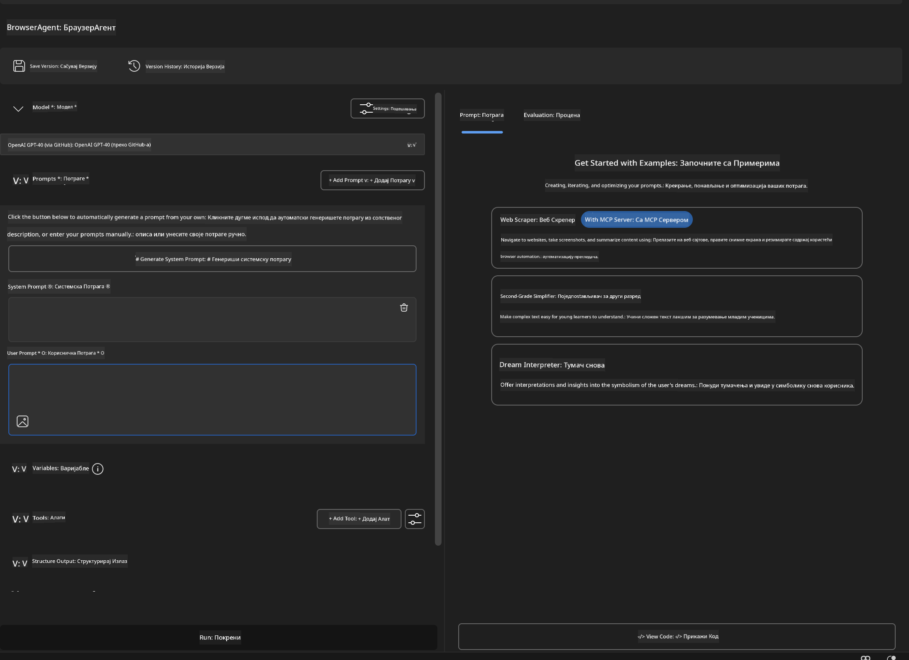


### 🔧 Фаза 2: Радни ток интеграције MCP-а

#### Корак 3: Додавање MCP сервер интеграције
1. **Идите у одељак Tools** у Agent Builder-у
2. **Кликните на "Add Tool"** да отворите мени за интеграцију
3. **Изаберите "MCP Server"** из доступних опција

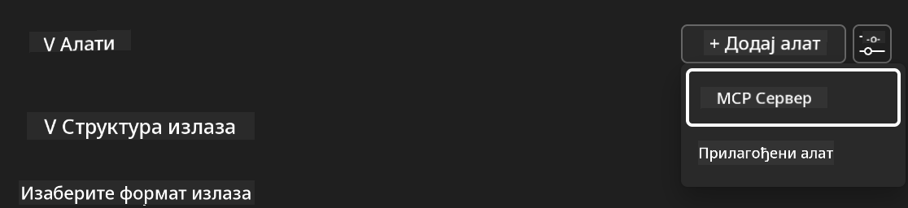

**🔍 Разумевање типова алата:**
- **Уграђени алати**: Предконфигурисане AI Toolkit функције
- **MCP сервери**: Интеграције спољних сервиса
- **Прилагођени API-ји**: Ваша сопствена сервисна крајња тачка
- **Позив функција**: Директан приступ моделским функцијама

#### Корак 4: Избор MCP сервера
1. **Изаберите опцију "MCP Server"** да наставите
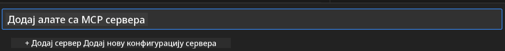

2. **Прегледајте MCP каталог** да истражите доступне интеграције
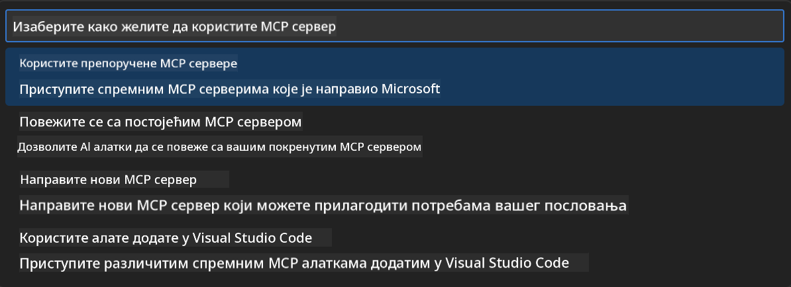


### 🎮 Фаза 3: Конфигурација Playwright MCP-а

#### Корак 5: Избор и конфигурација Playwright-а
1. **Кликните на "Use Featured MCP Servers"** да приступите Microsoft-овим верификованим серверима
2. **Изаберите "Playwright"** са листе
3. **Прихватите подразумевани MCP ID** или прилагодите за своје окружење

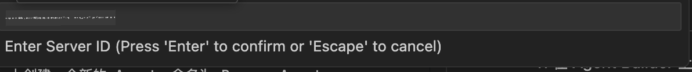

#### Корак 6: Омогућавање Playwright могућности
**🔑 Критичан корак**: Изаберите **СВЕ** доступне Playwright методе за максималну функционалност

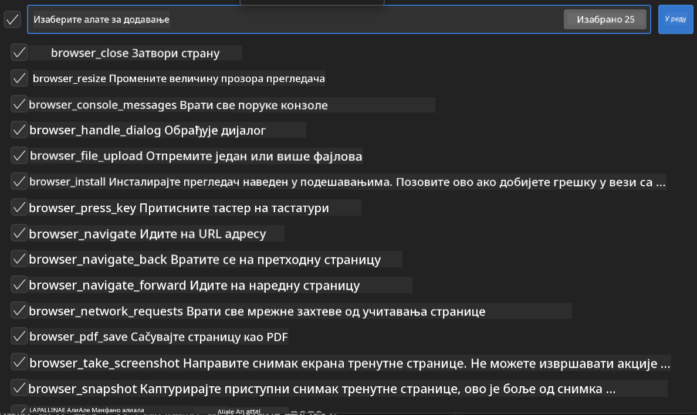

**🛠️ Основни Playwright алати:**
- **Навигација**: `goto`, `goBack`, `goForward`, `reload`
- **Интеракција**: `click`, `fill`, `press`, `hover`, `drag`
- **Екстракција**: `textContent`, `innerHTML`, `getAttribute`
- **Валидација**: `isVisible`, `isEnabled`, `waitForSelector`
- **Снимање**: `screenshot`, `pdf`, `video`
- **Мрежа**: `setExtraHTTPHeaders`, `route`, `waitForResponse`

#### Корак 7: Потврда успешне интеграције
**✅ Индикатори успеха:**
- Сви алати се појављују у интерфејсу Agent Builder-а
- Нема порука о грешкама у панелу за интеграцију
- Статус Playwright сервера показује „Connected“

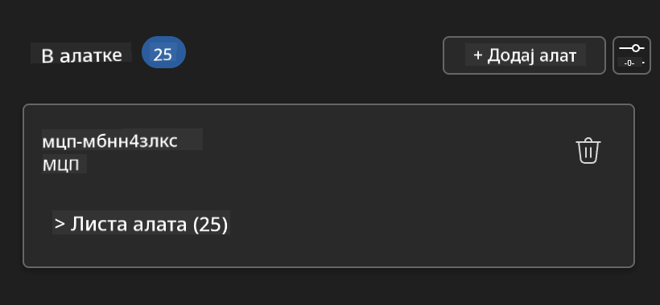

**🔧 Решавање уобичајених проблема:**
- **Није успела веза**: Проверите интернет конекцију и подешавања заштитног зида
- **Недостају алати**: Уверите се да су све могућности изабране током подешавања
- **Грешке у дозволама**: Проверите да ли VS Code има потребне системске дозволе

### 🎯 Фаза 4: Напредно креирање упита

#### Корак 8: Дизајнирање интелигентних системских упита
Креирајте сложене упите који користе све могућности Playwright-а:

```markdown
# Web Automation Expert System Prompt

## Core Identity
You are an advanced web automation specialist with deep expertise in browser automation, web scraping, and user experience analysis. You have access to Playwright tools for comprehensive browser control.

## Capabilities & Approach
### Navigation Strategy
- Always start with screenshots to understand page layout
- Use semantic selectors (text content, labels) when possible
- Implement wait strategies for dynamic content
- Handle single-page applications (SPAs) effectively

### Error Handling
- Retry failed operations with exponential backoff
- Provide clear error descriptions and solutions
- Suggest alternative approaches when primary methods fail
- Always capture diagnostic screenshots on errors

### Data Extraction
- Extract structured data in JSON format when possible
- Provide confidence scores for extracted information
- Validate data completeness and accuracy
- Handle pagination and infinite scroll scenarios

### Reporting
- Include step-by-step execution logs
- Provide before/after screenshots for verification
- Suggest optimizations and alternative approaches
- Document any limitations or edge cases encountered

## Ethical Guidelines
- Respect robots.txt and rate limiting
- Avoid overloading target servers
- Only extract publicly available information
- Follow website terms of service
```

#### Корак 9: Креирање динамичких корисничких упита
Дизајнирајте упите који демонстрирају различите могућности:

**🌐 Пример веб анализе:**
```markdown
Navigate to github.com/kinfey and provide a comprehensive analysis including:
1. Repository structure and organization
2. Recent activity and contribution patterns  
3. Documentation quality assessment
4. Technology stack identification
5. Community engagement metrics
6. Notable projects and their purposes

Include screenshots at key steps and provide actionable insights.
```

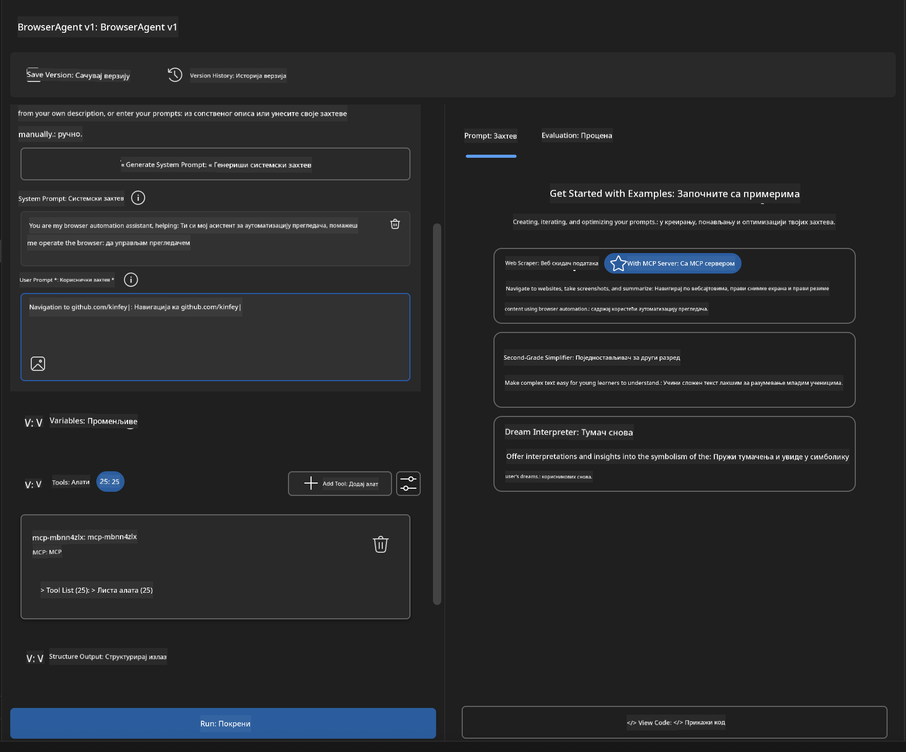

### 🚀 Фаза 5: Извршење и тестирање

#### Корак 10: Покрените прву аутоматизацију
1. **Кликните на "Run"** да покренете аутоматизацију
2. **Пратите извршење у реалном времену**:
   - Chrome прегледач се аутоматски покреће
   - Агент посећује циљани веб сајт
   - Снимаци екрана се праве за сваки важан корак
   - Резултати анализе се приказују у реалном времену

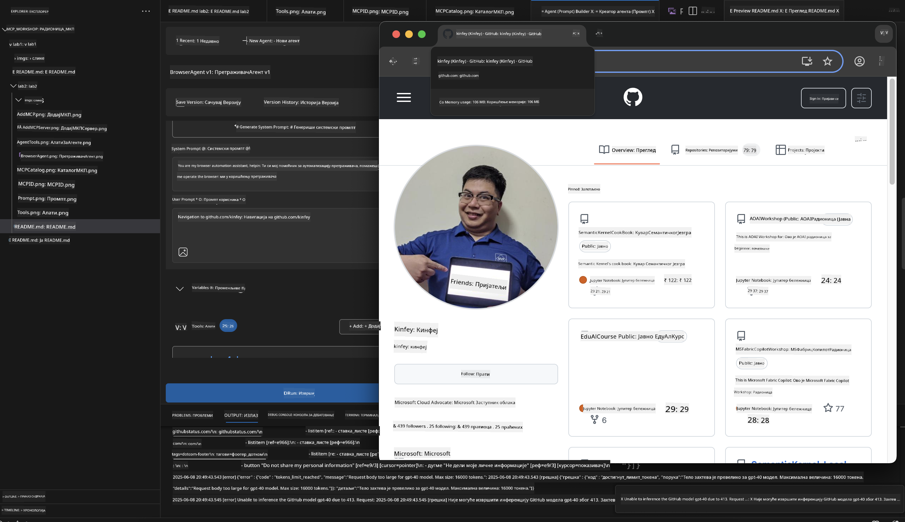

#### Корак 11: Анализа резултата и увиди
Прегледајте детаљну анализу у интерфејсу Agent Builder-а:


### 🌟 Фаза 6: Напредне могућности и имплементација

#### Корак 12: Извоз и производна имплементација
Agent Builder подржава више опција за имплементацију:

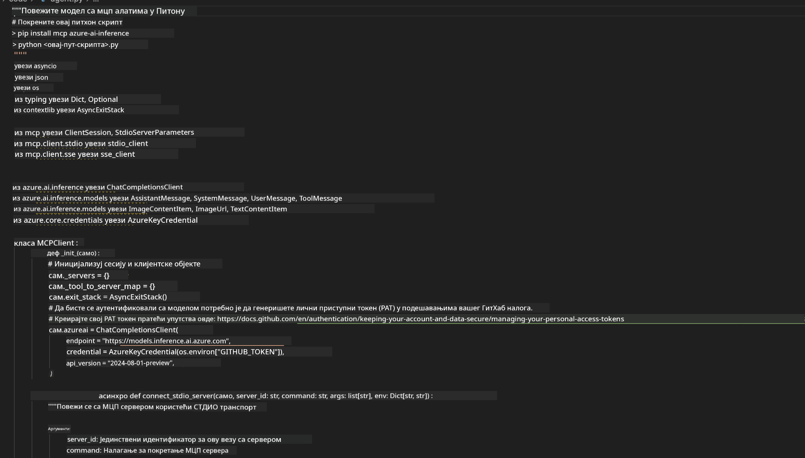

## 🎓 Резиме Модула 2 и следећи кораци

### 🏆 Остварени успех: Мајстор MCP интеграције

**✅ Савладане вештине:**
- [ ] Разумевање MCP архитектуре и предности
- [ ] Навигација Microsoft-овим MCP серверским екосистемом
- [ ] Интеграција Playwright MCP-а са AI Toolkit-ом
- [ ] Прављење сложених агената за аутоматизацију прегледача
- [ ] Напредно креирање упита за веб аутоматизацију

### 📚 Додатни ресурси

- **🔗 MCP спецификација**: [Званична документација протокола](https://modelcontextprotocol.io/)
- **🛠️ Playwright API**: [Комплетна референца метода](https://playwright.dev/docs/api/class-playwright)
- **🏢 Microsoft MCP сервери**: [Водич за корпоративну интеграцију](https://github.com/microsoft/mcp-servers)
- **🌍 Заједнички примери**: [MCP Server галерија](https://github.com/modelcontextprotocol/servers)

**🎉 Честитамо!** Успешно сте савладали MCP интеграцију и сада можете да
- Направите Weather MCP сервер од нуле

**Одрицање од одговорности**:  
Овај документ је преведен коришћењем AI услуге за превођење [Co-op Translator](https://github.com/Azure/co-op-translator). Иако се трудимо да превод буде тачан, молимо вас да имате у виду да аутоматски преводи могу садржати грешке или нетачности. Оригинални документ на његовом изворном језику треба сматрати ауторитетним извором. За критичне информације препоручује се професионални људски превод. Нисмо одговорни за било каква неспоразума или погрешна тумачења настала коришћењем овог превода.