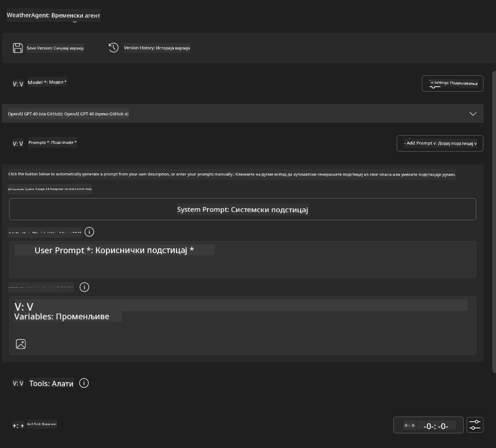
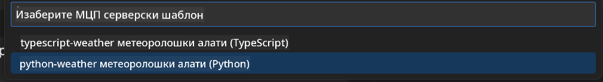
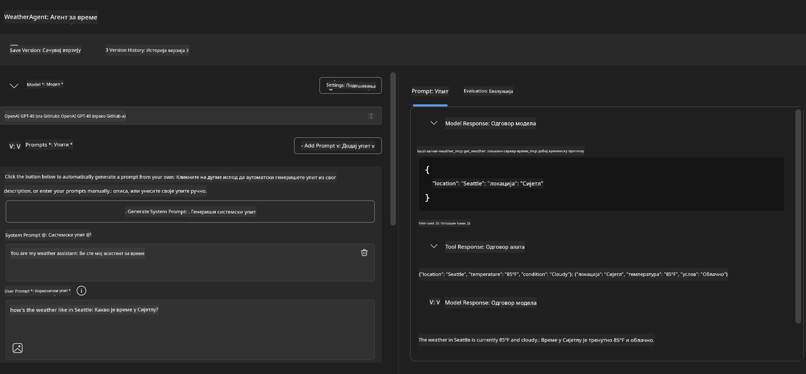
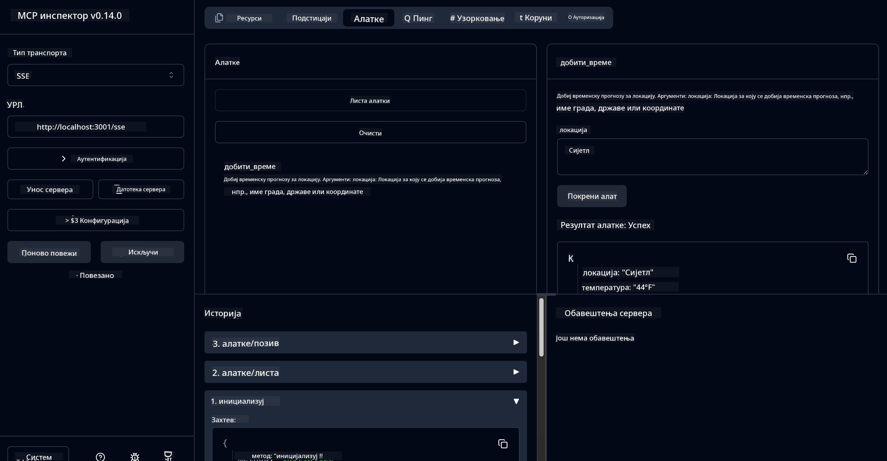

<!--
CO_OP_TRANSLATOR_METADATA:
{
  "original_hash": "dd8da3f75addcef453fe11f02a270217",
  "translation_date": "2025-07-14T08:20:09+00:00",
  "source_file": "10-StreamliningAIWorkflowsBuildingAnMCPServerWithAIToolkit/lab3/README.md",
  "language_code": "sr"
}
-->
# 🔧 Модул 3: Напредни развој MCP-а уз AI Toolkit


## 🎯 Циљеви учења

На крају овог лабораторијског задатка моћи ћете да:

- ✅ Креирате прилагођене MCP сервере користећи AI Toolkit
- ✅ Конфигуришете и користите најновији MCP Python SDK (в1.9.3)
- ✅ Подесите и користите MCP Inspector за отклањање грешака
- ✅ Откључавате грешке на MCP серверима у окружењима Agent Builder и Inspector
- ✅ Разумете напредне токове рада у развоју MCP сервера

## 📋 Предуслови

- Завршен Лаб 2 (Основе MCP-а)
- VS Code са инсталираним AI Toolkit екстензијом
- Python окружење верзије 3.10+
- Node.js и npm за подешавање Inspectora

## 🏗️ Шта ћете направити

У овом лабораторијском задатку направићете **Weather MCP Server** који демонстрира:
- Имплементацију прилагођеног MCP сервера
- Интеграцију са AI Toolkit Agent Builder-ом
- Професионалне токове рада за отклањање грешака
- Савремене обрасце коришћења MCP SDK-а

---

## 🔧 Преглед основних компоненти

### 🐍 MCP Python SDK  
Model Context Protocol Python SDK пружа основу за изградњу прилагођених MCP сервера. Користићете верзију 1.9.3 са побољшаним могућностима отклањања грешака.

### 🔍 MCP Inspector  
Снажан алат за отклањање грешака који пружа:  
- Праћење сервера у реалном времену  
- Визуелизацију извршавања алата  
- Инспекцију мрежних захтева/одговора  
- Интерактивно тестирање

---

## 📖 Корак по корак имплементација

### Корак 1: Креирајте WeatherAgent у Agent Builder-у

1. **Покрените Agent Builder** у VS Code преко AI Toolkit екстензије  
2. **Креирајте новог агента** са следећом конфигурацијом:  
   - Име агента: `WeatherAgent`



### Корак 2: Иницијализујте MCP Server пројекат

1. **Идите на Tools** → **Add Tool** у Agent Builder-у  
2. **Изаберите "MCP Server"** из понуђених опција  
3. **Одаберите "Create A new MCP Server"**  
4. **Изаберите `python-weather` шаблон**  
5. **Назовите свој сервер:** `weather_mcp`



### Корак 3: Отворите и прегледајте пројекат

1. **Отворите генерисани пројекат** у VS Code  
2. **Прегледајте структуру пројекта:**  
   ```
   weather_mcp/
   ├── src/
   │   ├── __init__.py
   │   └── server.py
   ├── inspector/
   │   ├── package.json
   │   └── package-lock.json
   ├── .vscode/
   │   ├── launch.json
   │   └── tasks.json
   ├── pyproject.toml
   └── README.md
   ```

### Корак 4: Надоградите на најновији MCP SDK

> **🔍 Зашто надоградити?** Желимо да користимо најновији MCP SDK (в1.9.3) и Inspector сервис (0.14.0) ради бољих функција и напреднијег отклањања грешака.

#### 4a. Ажурирајте Python зависности

**Измените `pyproject.toml`:** ажурирајте [./code/weather_mcp/pyproject.toml](../../../../10-StreamliningAIWorkflowsBuildingAnMCPServerWithAIToolkit/lab3/code/weather_mcp/pyproject.toml)

#### 4b. Ажурирајте Inspector конфигурацију

**Измените `inspector/package.json`:** ажурирајте [./code/weather_mcp/inspector/package.json](../../../../10-StreamliningAIWorkflowsBuildingAnMCPServerWithAIToolkit/lab3/code/weather_mcp/inspector/package.json)

#### 4c. Ажурирајте Inspector зависности

**Измените `inspector/package-lock.json`:** ажурирајте [./code/weather_mcp/inspector/package-lock.json](../../../../10-StreamliningAIWorkflowsBuildingAnMCPServerWithAIToolkit/lab3/code/weather_mcp/inspector/package-lock.json)

> **📝 Напомена:** Овај фајл садржи обимне дефиниције зависности. Испод је основна структура – цео садржај обезбеђује правилно решавање зависности.

> **⚡ Потпуни Package Lock:** Целокупни package-lock.json садржи око 3000 линија дефиниција зависности. Горњи приказ показује кључну структуру – користите приложени фајл за потпуно решавање зависности.

### Корак 5: Конфигуришите VS Code за отклањање грешака

*Напомена: Молимо копирајте фајл на назначену локацију да бисте заменили одговарајући локални фајл*

#### 5a. Ажурирајте Launch конфигурацију

**Измените `.vscode/launch.json`:**

```json
{
  "version": "0.2.0",
  "configurations": [
    {
      "name": "Attach to Local MCP",
      "type": "debugpy",
      "request": "attach",
      "connect": {
        "host": "localhost",
        "port": 5678
      },
      "presentation": {
        "hidden": true
      },
      "internalConsoleOptions": "neverOpen",
      "postDebugTask": "Terminate All Tasks"
    },
    {
      "name": "Launch Inspector (Edge)",
      "type": "msedge",
      "request": "launch",
      "url": "http://localhost:6274?timeout=60000&serverUrl=http://localhost:3001/sse#tools",
      "cascadeTerminateToConfigurations": [
        "Attach to Local MCP"
      ],
      "presentation": {
        "hidden": true
      },
      "internalConsoleOptions": "neverOpen"
    },
    {
      "name": "Launch Inspector (Chrome)",
      "type": "chrome",
      "request": "launch",
      "url": "http://localhost:6274?timeout=60000&serverUrl=http://localhost:3001/sse#tools",
      "cascadeTerminateToConfigurations": [
        "Attach to Local MCP"
      ],
      "presentation": {
        "hidden": true
      },
      "internalConsoleOptions": "neverOpen"
    }
  ],
  "compounds": [
    {
      "name": "Debug in Agent Builder",
      "configurations": [
        "Attach to Local MCP"
      ],
      "preLaunchTask": "Open Agent Builder",
    },
    {
      "name": "Debug in Inspector (Edge)",
      "configurations": [
        "Launch Inspector (Edge)",
        "Attach to Local MCP"
      ],
      "preLaunchTask": "Start MCP Inspector",
      "stopAll": true
    },
    {
      "name": "Debug in Inspector (Chrome)",
      "configurations": [
        "Launch Inspector (Chrome)",
        "Attach to Local MCP"
      ],
      "preLaunchTask": "Start MCP Inspector",
      "stopAll": true
    }
  ]
}
```

**Измените `.vscode/tasks.json`:**

```
{
  "version": "2.0.0",
  "tasks": [
    {
      "label": "Start MCP Server",
      "type": "shell",
      "command": "python -m debugpy --listen 127.0.0.1:5678 src/__init__.py sse",
      "isBackground": true,
      "options": {
        "cwd": "${workspaceFolder}",
        "env": {
          "PORT": "3001"
        }
      },
      "problemMatcher": {
        "pattern": [
          {
            "regexp": "^.*$",
            "file": 0,
            "location": 1,
            "message": 2
          }
        ],
        "background": {
          "activeOnStart": true,
          "beginsPattern": ".*",
          "endsPattern": "Application startup complete|running"
        }
      }
    },
    {
      "label": "Start MCP Inspector",
      "type": "shell",
      "command": "npm run dev:inspector",
      "isBackground": true,
      "options": {
        "cwd": "${workspaceFolder}/inspector",
        "env": {
          "CLIENT_PORT": "6274",
          "SERVER_PORT": "6277",
        }
      },
      "problemMatcher": {
        "pattern": [
          {
            "regexp": "^.*$",
            "file": 0,
            "location": 1,
            "message": 2
          }
        ],
        "background": {
          "activeOnStart": true,
          "beginsPattern": "Starting MCP inspector",
          "endsPattern": "Proxy server listening on port"
        }
      },
      "dependsOn": [
        "Start MCP Server"
      ]
    },
    {
      "label": "Open Agent Builder",
      "type": "shell",
      "command": "echo ${input:openAgentBuilder}",
      "presentation": {
        "reveal": "never"
      },
      "dependsOn": [
        "Start MCP Server"
      ],
    },
    {
      "label": "Terminate All Tasks",
      "command": "echo ${input:terminate}",
      "type": "shell",
      "problemMatcher": []
    }
  ],
  "inputs": [
    {
      "id": "openAgentBuilder",
      "type": "command",
      "command": "ai-mlstudio.agentBuilder",
      "args": {
        "initialMCPs": [ "local-server-weather_mcp" ],
        "triggeredFrom": "vsc-tasks"
      }
    },
    {
      "id": "terminate",
      "type": "command",
      "command": "workbench.action.tasks.terminate",
      "args": "terminateAll"
    }
  ]
}
```

---

## 🚀 Покретање и тестирање вашег MCP сервера

### Корак 6: Инсталирајте зависности

Након измена у конфигурацији, покрените следеће команде:

**Инсталирајте Python зависности:**  
```bash
uv sync
```

**Инсталирајте Inspector зависности:**  
```bash
cd inspector
npm install
```

### Корак 7: Откључавање грешака у Agent Builder-у

1. **Притисните F5** или користите конфигурацију **"Debug in Agent Builder"**  
2. **Изаберите compound конфигурацију** у debug панелу  
3. **Сачекајте да сервер почне са радом** и да се Agent Builder отвори  
4. **Тестирајте свој weather MCP сервер** са упитима на природном језику

Унесите упит као овај

SYSTEM_PROMPT

```
You are my weather assistant
```

USER_PROMPT

```
How's the weather like in Seattle
```



### Корак 8: Откључавање грешака уз MCP Inspector

1. **Користите конфигурацију "Debug in Inspector"** (Edge или Chrome)  
2. **Отворите Inspector интерфејс** на `http://localhost:6274`  
3. **Истражите интерактивно тестирачко окружење:**  
   - Погледајте доступне алате  
   - Тестирајте извршавање алата  
   - Пратите мрежне захтеве  
   - Откључавајте грешке у одговорима сервера



---

## 🎯 Кључни резултати учења

Завршетком овог лабораторијског задатка сте:

- [x] **Креирали прилагођени MCP сервер** користећи AI Toolkit шаблоне  
- [x] **Надоградили на најновији MCP SDK** (в1.9.3) ради боље функционалности  
- [x] **Конфигурисали професионалне токове рада за отклањање грешака** у Agent Builder-у и Inspector-у  
- [x] **Подесили MCP Inspector** за интерактивно тестирање сервера  
- [x] **Мастерирали VS Code конфигурације за отклањање грешака** у развоју MCP-а

## 🔧 Напредне истражене функције

| Функција | Опис | Примена |
|---------|-------------|----------|
| **MCP Python SDK в1.9.3** | Најновија имплементација протокола | Савремени развој сервера |
| **MCP Inspector 0.14.0** | Интерактивни алат за отклањање грешака | Тестирање сервера у реалном времену |
| **VS Code Debugging** | Интегрисано развојно окружење | Професионални ток рада за отклањање грешака |
| **Agent Builder интеграција** | Директна веза са AI Toolkit-ом | Комплетно тестирање агента |

## 📚 Додатни ресурси

- [MCP Python SDK документација](https://modelcontextprotocol.io/docs/sdk/python)  
- [AI Toolkit водич за екстензију](https://code.visualstudio.com/docs/ai/ai-toolkit)  
- [VS Code документација за отклањање грешака](https://code.visualstudio.com/docs/editor/debugging)  
- [Model Context Protocol спецификација](https://modelcontextprotocol.io/docs/concepts/architecture)

---

**🎉 Честитамо!** Успешно сте завршили Лаб 3 и сада можете да креирате, отклањате грешке и пуштате у рад прилагођене MCP сервере користећи професионалне токове развоја.

### 🔜 Наставите на следећи модул

Спремни да примените своје MCP вештине у стварном развојном окружењу? Наставите на **[Модул 4: Практични развој MCP-а - Прилагођени GitHub Clone Server](../lab4/README.md)** где ћете:  
- Изградити MCP сервер спреман за продукцију који аутоматизује операције GitHub репозиторијума  
- Имплементирати функционалност клонирања GitHub репозиторијума преко MCP-а  
- Интегрисати прилагођене MCP сервере са VS Code и GitHub Copilot Agent Mode-ом  
- Тестирати и пуштати у рад прилагођене MCP сервере у продукцијским окружењима  
- Научити практичну аутоматизацију токова рада за програмере

**Одрицање од одговорности**:  
Овај документ је преведен коришћењем AI сервиса за превођење [Co-op Translator](https://github.com/Azure/co-op-translator). Иако се трудимо да превод буде тачан, молимо вас да имате у виду да аутоматски преводи могу садржати грешке или нетачности. Оригинални документ на његовом изворном језику треба сматрати ауторитетним извором. За критичне информације препоручује се професионални људски превод. Нисмо одговорни за било каква неспоразума или погрешна тумачења настала коришћењем овог превода.