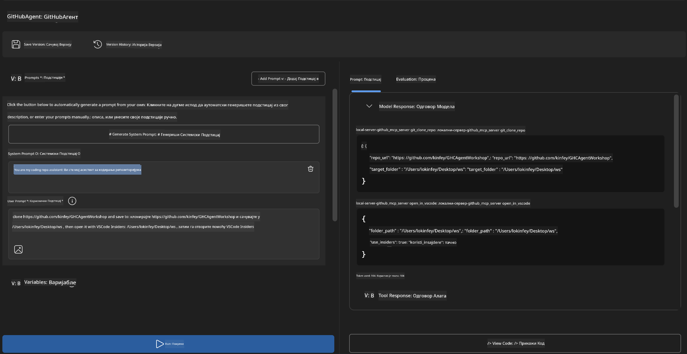

<!--
CO_OP_TRANSLATOR_METADATA:
{
  "original_hash": "f83bc722dc758efffd68667d6a1db470",
  "translation_date": "2025-07-14T08:48:09+00:00",
  "source_file": "10-StreamliningAIWorkflowsBuildingAnMCPServerWithAIToolkit/lab4/README.md",
  "language_code": "sr"
}
-->
# 🐙 Модул 4: Практични MCP развој - Прилагођени GitHub сервер за клонирање


> **⚡ Брзи почетак:** Направите MCP сервер спреман за продукцију који аутоматски клонира GitHub репозиторијуме и интегрише се са VS Code-ом за само 30 минута!

## 🎯 Циљеви учења

На крају овог лабораторијског рада моћи ћете да:

- ✅ Креирате прилагођени MCP сервер за стварне развојне токове рада
- ✅ Имплементирате функцију клонирања GitHub репозиторијума преко MCP-а
- ✅ Интегришете прилагођене MCP сервере са VS Code-ом и Agent Builder-ом
- ✅ Користите GitHub Copilot Agent Mode са прилагођеним MCP алатима
- ✅ Тестирате и деплојујете прилагођене MCP сервере у продукцијским окружењима

## 📋 Предуслови

- Завршени лабораторијски радови 1-3 (основе MCP-а и напредни развој)
- Претплата на GitHub Copilot ([доступна бесплатна регистрација](https://github.com/github-copilot/signup))
- VS Code са AI Toolkit и GitHub Copilot екстензијама
- Инсталиран и конфигурисан Git CLI

## 🏗️ Преглед пројекта

### **Изазов из стварног развоја**
Као програмери, често користимо GitHub за клонирање репозиторијума и отварање у VS Code-у или VS Code Insiders-у. Овај ручни процес подразумева:
1. Отварање терминала/командне линије
2. Навигацију до жељеног директоријума
3. Покретање `git clone` команде
4. Отварање VS Code-а у клонираном директоријуму

**Наш MCP сервер то поједностављује у једну паметну команду!**

### **Шта ћете направити**
**GitHub Clone MCP Server** (`git_mcp_server`) који пружа:

| Карактеристика | Опис | Предност |
|-----------------|-------|----------|
| 🔄 **Паметно клонирање репозиторијума** | Клонирање GitHub репоа са валидацијом | Аутоматска провера грешака |
| 📁 **Интелигентно управљање директоријумима** | Провера и безбедно креирање директоријума | Спрема од преписивања |
| 🚀 **Крос-платформска интеграција са VS Code-ом** | Отварање пројеката у VS Code/Insiders | Беспрекорна транзиција у раду |
| 🛡️ **Отпорно руковање грешкама** | Решавање мрежних, дозвола и путања | Поузданост спремна за продукцију |

---

## 📖 Корак по корак имплементација

### Корак 1: Креирање GitHub агента у Agent Builder-у

1. **Покрените Agent Builder** преко AI Toolkit екстензије
2. **Креирајте новог агента** са следећом конфигурацијом:
   ```
   Agent Name: GitHubAgent
   ```

3. **Иницијализујте прилагођени MCP сервер:**
   - Идите на **Tools** → **Add Tool** → **MCP Server**
   - Изаберите **"Create A new MCP Server"**
   - Одаберите **Python шаблон** за максималну флексибилност
   - **Име сервера:** `git_mcp_server`

### Корак 2: Конфигуришите GitHub Copilot Agent Mode

1. **Отворите GitHub Copilot** у VS Code-у (Ctrl/Cmd + Shift + P → "GitHub Copilot: Open")
2. **Изаберите Agent Model** у Copilot интерфејсу
3. **Одаберите Claude 3.7 модел** за побољшане способности резоновања
4. **Омогућите MCP интеграцију** за приступ алатима

> **💡 Корисни савет:** Claude 3.7 пружа боље разумевање развојних токова и образаца руковања грешкама.

### Корак 3: Имплементирајте основну функционалност MCP сервера

**Користите следећи детаљан упит са GitHub Copilot Agent Mode-ом:**

```
Create two MCP tools with the following comprehensive requirements:

🔧 TOOL A: clone_repository
Requirements:
- Clone any GitHub repository to a specified local folder
- Return the absolute path of the successfully cloned project
- Implement comprehensive validation:
  ✓ Check if target directory already exists (return error if exists)
  ✓ Validate GitHub URL format (https://github.com/user/repo)
  ✓ Verify git command availability (prompt installation if missing)
  ✓ Handle network connectivity issues
  ✓ Provide clear error messages for all failure scenarios

🚀 TOOL B: open_in_vscode
Requirements:
- Open specified folder in VS Code or VS Code Insiders
- Cross-platform compatibility (Windows/Linux/macOS)
- Use direct application launch (not terminal commands)
- Auto-detect available VS Code installations
- Handle cases where VS Code is not installed
- Provide user-friendly error messages

Additional Requirements:
- Follow MCP 1.9.3 best practices
- Include proper type hints and documentation
- Implement logging for debugging purposes
- Add input validation for all parameters
- Include comprehensive error handling
```

### Корак 4: Тестирајте свој MCP сервер

#### 4a. Тестирање у Agent Builder-у

1. **Покрените debug конфигурацију** за Agent Builder
2. **Конфигуришите свог агента са овим системским упитом:**

```
SYSTEM_PROMPT:
You are my intelligent coding repository assistant. You help developers efficiently clone GitHub repositories and set up their development environment. Always provide clear feedback about operations and handle errors gracefully.
```

3. **Тестирајте са реалистичним корисничким сценаријима:**

```
USER_PROMPT EXAMPLES:

Scenario : Basic Clone and Open
"Clone {Your GitHub Repo link such as https://github.com/kinfey/GHCAgentWorkshop
 } and save to {The global path you specify}, then open it with VS Code Insiders"
```



**Очекујени резултати:**
- ✅ Успешно клонирање са потврдом путање
- ✅ Аутоматско покретање VS Code-а
- ✅ Јасне поруке о грешкама за неважеће сценарије
- ✅ Правилно руковање ивичним случајевима

#### 4b. Тестирање у MCP Inspector-у


---

**🎉 Честитамо!** Успешно сте направили практичан MCP сервер спреман за продукцију који решава стварне изазове развојних токова. Ваш прилагођени GitHub clone сервер показује снагу MCP-а у аутоматизацији и унапређењу продуктивности програмера.

### 🏆 Остварени успех:
- ✅ **MCP Developer** - Креиран прилагођени MCP сервер
- ✅ **Workflow Automator** - Поједностављени развојни процеси  
- ✅ **Integration Expert** - Повезани бројни развојни алати
- ✅ **Production Ready** - Направљена решења спремна за деплој

---

## 🎓 Завршетак радионице: Ваш пут са Model Context Protocol-ом

**Поштовани учесниче радионице,**

Честитамо на завршетку свих четири модуле радионице Model Context Protocol! Прешли сте дуг пут од разумевања основа AI Toolkit-а до креирања MCP сервера спремних за продукцију који решавају стварне изазове развоја.

### 🚀 Преглед вашег пута учења:

**[Модул 1](../lab1/README.md)**: Започели сте истраживањем основа AI Toolkit-а, тестирањем модела и креирањем првог AI агента.

**[Модул 2](../lab2/README.md)**: Учили сте MCP архитектуру, интегрисали Playwright MCP и направили првог агента за аутоматизацију прегледача.

**[Модул 3](../lab3/README.md)**: Напредовали сте у развоју прилагођених MCP сервера са Weather MCP сервером и савладали алате за дебаговање.

**[Модул 4](../lab4/README.md)**: Сада сте применили све то да направите практичан алат за аутоматизацију GitHub репозиторијума.

### 🌟 Шта сте савладали:

- ✅ **AI Toolkit екосистем**: Модели, агенти и интеграциони обрасци
- ✅ **MCP архитектура**: Клијент-сервер дизајн, транспортни протоколи и безбедност
- ✅ **Развојни алати**: Од Playground-а до Inspector-а и продукцијског деплоја
- ✅ **Прилагођени развој**: Креирање, тестирање и деплој прилагођених MCP сервера
- ✅ **Практичне примене**: Решавање стварних изазова развојних токова уз помоћ AI-а

### 🔮 Ваши следећи кораци:

1. **Направите свој MCP сервер**: Примените ове вештине да аутоматизујете своје јединствене токове рада
2. **Придружите се MCP заједници**: Делите своје пројекте и учите од других
3. **Истражите напредну интеграцију**: Повежите MCP сервере са системима предузећа
4. **Доприносите Open Source-у**: Помозите у унапређењу MCP алата и документације

Запамтите, ова радионица је само почетак. Екосистем Model Context Protocol-а брзо се развија, а ви сте сада спремни да будете на челу алата за развој покретаних AI-ом.

**Хвала вам на учешћу и посвећености учењу!**

Надамо се да је ова радионица пробудила идеје које ће променити начин на који градите и користите AI алате у свом развојном путовању.

**Срећно кодирање!**

---

**Одрицање од одговорности**:  
Овај документ је преведен коришћењем AI сервиса за превођење [Co-op Translator](https://github.com/Azure/co-op-translator). Иако тежимо прецизности, молимо вас да имате у виду да аутоматски преводи могу садржати грешке или нетачности. Оригинални документ на његовом изворном језику треба сматрати ауторитетним извором. За критичне информације препоручује се професионални људски превод. Нисмо одговорни за било каква неспоразума или погрешна тумачења која произилазе из коришћења овог превода.