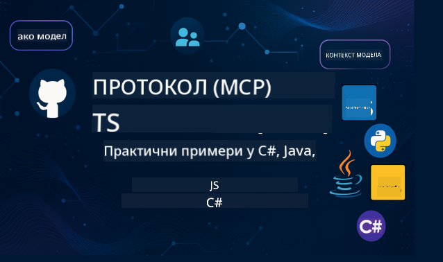

<!--
CO_OP_TRANSLATOR_METADATA:
{
  "original_hash": "866c8877136cb03e1efb9ad633a2f0a6",
  "translation_date": "2025-08-26T18:20:26+00:00",
  "source_file": "README.md",
  "language_code": "sr"
}
-->

  
  
  

  
  

Пратите ове кораке да бисте започели коришћење ових ресурса:  
1. **Forkujte repozitorijum**: Kliknite   
2. **Kloniрајте репозиторијум**: `git clone https://github.com/microsoft/mcp-for-beginners.git`  
3. [**Придружите се Azure AI Foundry Discord серверу и упознајте стручњаке и друге програмере**](https://discord.com/invite/ByRwuEEgH4)

### 🌐 Подршка за више језика

#### Подржано преко GitHub Action-а (аутоматски и увек ажурирано)

[Арапски](../ar/README.md) | [Бенгалски](../bn/README.md) | [Бугарски](../bg/README.md) | [Бирмански (Мјанмар)](../my/README.md) | [Кинески (поједностављени)](../zh/README.md) | [Кинески (традиционални, Хонг Конг)](../hk/README.md) | [Кинески (традиционални, Макао)](../mo/README.md) | [Кинески (традиционални, Тајван)](../tw/README.md) | [Хрватски](../hr/README.md) | [Чешки](../cs/README.md) | [Дански](../da/README.md) | [Холандски](../nl/README.md) | [Фински](../fi/README.md) | [Француски](../fr/README.md) | [Немачки](../de/README.md) | [Грчки](../el/README.md) | [Хебрејски](../he/README.md) | [Хинди](../hi/README.md) | [Мађарски](../hu/README.md) | [Индонежански](../id/README.md) | [Италијански](../it/README.md) | [Јапански](../ja/README.md) | [Корејски](../ko/README.md) | [Малајски](../ms/README.md) | [Марати](../mr/README.md) | [Непалски](../ne/README.md) | [Норвешки](../no/README.md) | [Персијски (фарси)](../fa/README.md) | [Пољски](../pl/README.md) | [Португалски (Бразил)](../br/README.md) | [Португалски (Португал)](../pt/README.md) | [Пунџаби (Гурмуки)](../pa/README.md) | [Румунски](../ro/README.md) | [Руски](../ru/README.md) | [Српски (ћирилица)](./README.md) | [Словачки](../sk/README.md) | [Словеначки](../sl/README.md) | [Шпански](../es/README.md) | [Свахили](../sw/README.md) | [Шведски](../sv/README.md) | [Тагалог (Филипински)](../tl/README.md) | [Тајландски](../th/README.md) | [Турски](../tr/README.md) | [Украјински](../uk/README.md) | [Урду](../ur/README.md) | [Вијетнамски](../vi/README.md)

# 🚀 Наставни план за Model Context Protocol (MCP) за почетнике

## **Научите MCP уз практичне примере кода у C#, Java, JavaScript, Rust, Python и TypeScript**

## 🧠 Преглед наставног плана за Model Context Protocol

**Model Context Protocol (MCP)** је напредни оквир дизајниран за стандардизацију интеракција између AI модела и клијентских апликација. Овај отворени наставни план нуди структуриран пут учења, уз практичне примере кода и примере из стварног света, у популарним програмским језицима као што су C#, Java, JavaScript, TypeScript и Python.

Без обзира да ли сте AI програмер, системски архитекта или софтверски инжењер, овај водич је ваш свеобухватни ресурс за савладавање основа MCP-а и стратегија имплементације.

## 🔗 Званични MCP ресурси

- 📘 [MCP документација](https://modelcontextprotocol.io/) – Детаљни туторијали и кориснички водичи  
- 📜 [MCP спецификација](https://modelcontextprotocol.io/docs/) – Архитектура протокола и техничке референце  
- 📜 [Оригинална MCP спецификација](https://spec.modelcontextprotocol.io/) – Легаси техничке референце (може садржати додатне детаље)  
- 🧑‍💻 [MCP GitHub репозиторијум](https://github.com/modelcontextprotocol) – SDK-ови, алати и примери кода отвореног кода  
- 🌐 [MCP заједница](https://github.com/orgs/modelcontextprotocol/discussions) – Придружите се дискусијама и допринесите заједници

## 🧭 Преглед наставног плана MCP-а

### 📚 Комплетна структура наставног плана

| Модул | Тема | Опис | Линк |
|-------|------|------|------|
| **Модул 1-3: Основе** | | | |
| 00 | Увод у MCP | Преглед Model Context Protocol-а и његов значај у AI процесима | [Прочитајте више](./00-Introduction/README.md) |
| 01 | Објашњење основних концепата | Детаљно истраживање основних MCP концепата | [Прочитајте више](./01-CoreConcepts/README.md) |
| 02 | Безбедност у MCP-у | Претње безбедности и најбоље праксе | [Прочитајте више](./02-Security/README.md) |
| 03 | Почетак рада са MCP-ом | Постављање окружења, основни сервери/клијенти, интеграција | [Прочитајте више](./03-GettingStarted/README.md) |
| **Модул 3: Изградња вашег првог сервера и клијента** | | | |
| 3.1 | Први сервер | Направите свој први MCP сервер | [Водич](./03-GettingStarted/01-first-server/README.md) |
| 3.2 | Први клијент | Развијте основни MCP клијент | [Водич](./03-GettingStarted/02-client/README.md) |
| 3.3 | Клијент са LLM | Интегришите велике језичке моделе | [Водич](./03-GettingStarted/03-llm-client/README.md) |
| 3.4 | Интеграција са VS Code | Конзумирајте MCP сервере у VS Code-у | [Водич](./03-GettingStarted/04-vscode/README.md) |
| 3.5 | stdio сервер | Направите сервере користећи stdio транспорт | [Водич](./03-GettingStarted/05-stdio-server/README.md) |
| 3.6 | HTTP стриминг | Имплементирајте HTTP стриминг у MCP-у | [Водич](./03-GettingStarted/06-http-streaming/README.md) |
| 3.7 | AI алат | Користите AI Toolkit са MCP-ом | [Водич](./03-GettingStarted/07-aitk/README.md) |
| 3.8 | Тестирање | Тестирајте своју имплементацију MCP сервера | [Водич](./03-GettingStarted/08-testing/README.md) |
| 3.9 | Деплојмент | Деплој MCP сервере у продукцију | [Водич](./03-GettingStarted/09-deployment/README.md) |
| **Модул 4-5: Практично и напредно** | | | |
| 04 | Практична имплементација | SDK-ови, дебаговање, тестирање, шаблони за поновну употребу | [Прочитајте више](./04-PracticalImplementation/README.md) |
| 05 | Напредне теме у MCP-у | Мултимодални AI, скалирање, употреба у предузећима | [Прочитајте више](./05-AdvancedTopics/README.md) |
| 5.1 | Интеграција са Azure-ом | MCP интеграција са Azure-ом | [Водич](./05-AdvancedTopics/mcp-integration/README.md) |
| 5.2 | Мултимодалност | Рад са више модалитета | [Водич](./05-AdvancedTopics/mcp-multi-modality/README.md) |
| 5.3 | OAuth2 демонстрација | Имплементирајте OAuth2 аутентификацију | [Водич](./05-AdvancedTopics/mcp-oauth2-demo/README.md) |
| 5.4 | Root Contexts | Разумевање и имплементација root контекста | [Водич](./05-AdvancedTopics/mcp-root-contexts/README.md) |
| 5.5 | Рутање | MCP стратегије рутања | [Водич](./05-AdvancedTopics/mcp-routing/README.md) |
| 5.6 | Узорковање | Технике узорковања у MCP-у | [Водич](./05-AdvancedTopics/mcp-sampling/README.md) |
| 5.7 | Скалирање | Скалирајте MCP имплементације | [Водич](./05-AdvancedTopics/mcp-scaling/README.md) |
| 5.8 | Безбедност | Напредна разматрања безбедности | [Водич](./05-AdvancedTopics/mcp-security/README.md) |
| 5.9 | Претрага на вебу | Имплементирајте могућности веб претраге | [Водич](./05-AdvancedTopics/web-search-mcp/README.md) |
| 5.10 | Стриминг у реалном времену | Направите функционалност стриминга у реалном времену | [Водич](./05-AdvancedTopics/mcp-realtimestreaming/README.md) |
| 5.11 | Претрага у реалном времену | Имплементирајте претрагу у реалном времену | [Водич](./05-AdvancedTopics/mcp-realtimesearch/README.md) |
| 5.12 | Entra ID аутентификација | Аутентификација са Microsoft Entra ID | [Водич](./05-AdvancedTopics/mcp-security-entra/README.md) |
| 5.13 | Интеграција са Foundry-јем | Интеграција са Azure AI Foundry | [Водич](./05-AdvancedTopics/mcp-foundry-agent-integration/README.md) |
| 5.14 | Инжењеринг контекста | Технике за ефикасан инжењеринг контекста | [Водич](./05-AdvancedTopics/mcp-contextengineering/README.md) |
| **Модул 6-10: Заједница и најбоље праксе** | | | |
| 06 | Доприноси заједнице | Како допринети MCP екосистему | [Водич](./06-CommunityContributions/README.md) |
| 07 | Увид из ране примене | Приче о имплементацији из стварног света | [Водич](./07-LessonsFromEarlyAdoption/README.md) |
| 08 | Најбоље праксе за MCP | Перформансе, толеранција на грешке, отпорност | [Водич](./08-BestPractices/README.md) |
| 09 | MCP студије случаја | Практични примери имплементације | [Водич](./09-CaseStudy/README.md) |
| 10 | Практична радионица | Изградња MCP сервера са AI Toolkit-ом | [Лабораторија](./10-StreamliningAIWorkflowsBuildingAnMCPServerWithAIToolkit/README.md) |

### 💻 Пример пројеката кода

#### Основни примери MCP калкулатора

| Језик | Опис | Линк |
|-------|------|------|
| C# | MCP пример сервера | [Погледајте код](./03-GettingStarted/samples/csharp/README.md) |
| Java | MCP калкулатор | [Погледајте код](./03-GettingStarted/samples/java/calculator/README.md) |
| JavaScript | MCP демонстрација | [Погледајте код](./03-GettingStarted/samples/javascript/README.md) |
| Python | MCP сервер | [Погледајте код](../../03-GettingStarted/samples/python/mcp_calculator_server.py) |
| TypeScript | MCP пример | [Погледајте код](./03-GettingStarted/samples/typescript/README.md) |
| Rust | MCP пример | [Погледајте код](./03-GettingStarted/samples/rust/README.md) |

#### Напредне MCP имплементације

| Језик | Опис | Линк |
|-------|------|------|
| C# | Напредни пример | [View Code](./04-PracticalImplementation/samples/csharp/README.md) |
| Java са Spring-ом | Пример апликације у контејнеру | [View Code](./04-PracticalImplementation/samples/java/containerapp/README.md) |
| JavaScript | Напредни пример | [View Code](./04-PracticalImplementation/samples/javascript/README.md) |
| Python | Комплексна имплементација | [View Code](../../04-PracticalImplementation/samples/python/READMEmd) |
| TypeScript | Пример у контејнеру | [View Code](./04-PracticalImplementation/samples/typescript/README.md) |

## 🎯 Предуслови за учење MCP-а

Да бисте максимално искористили овај курикулум, требало би да имате:

- Основно знање програмирања у бар једном од следећих језика: C#, Java, JavaScript, Python или TypeScript
- Разумевање модела клијент-сервер и API-ја
- Познавање концепата REST-а и HTTP-а
- (Опционо) Позадинско знање из области AI/ML концепата

- Придруживање нашим дискусијама у заједници ради подршке

## 📚 Водич за учење и ресурси

Овај репозиторијум садржи неколико ресурса који ће вам помоћи да се ефикасно крећете и учите:

### Водич за учење

Детаљан [Водич за учење](./study_guide.md) је доступан како би вам помогао да ефикасно користите овај репозиторијум. Водич укључује:

- Визуелну мапу курикулума са свим обрађеним темама
- Детаљан преглед сваког дела репозиторијума
- Упутства за коришћење узорних пројеката
- Препоручене путеве учења за различите нивое вештина
- Додатне ресурсе за допуну вашег процеса учења

### Дневник промена

Водимо детаљан [Дневник промена](./changelog.md) који прати све значајне измене у материјалима курикулума, укључујући:

- Додавање новог садржаја
- Структурне промене
- Побољшања функција
- Ажурирања документације

## 🛠️ Како ефикасно користити овај курикулум

Свака лекција у овом водичу укључује:

1. Јасна објашњења MCP концепата  
2. Примере кода уживо на више језика  
3. Вежбе за изградњу правих MCP апликација  
4. Додатне ресурсе за напредне кориснике

## Догађаји 

### [MCP Dev Days јул 2025](https://developer.microsoft.com/en-us/reactor/series/S-1563/)
#### [➡️Гледајте на захтев - MCP Dev Days](https://developer.microsoft.com/en-us/reactor/series/S-1563/)
Припремите се за два дана дубоких техничких увида, повезивања са заједницом и практичног учења на MCP Dev Days, виртуелном догађају посвећеном Model Context Protocol-у (MCP) — новом стандарду који повезује AI моделе и алате на које се ослањају.
Можете гледати MCP Dev Days тако што ћете се регистровати на нашој страници догађаја: https://aka.ms/mcpdevdays. 

#### [Дан 1: MCP продуктивност, алати за развој и заједница:](https://developer.microsoft.com/en-us/reactor/series/S-1563/)

Посвећен је оснаживању програмера да користе MCP у свом развојном процесу и прослави невероватне MCP заједнице. Придружиће нам се чланови заједнице и партнери као што су Arcade, Block, Okta и Neon како бисмо видели како сарађују са Microsoft-ом на обликовању отвореног, проширивог MCP екосистема. 
- Демонстрације из стварног света у VS Code-у, Visual Studio-у, GitHub Copilot-у и популарним алатима заједнице
- Практични, контекстуално вођени развојни процеси
- Сесије које воде чланови заједнице и њихови увиди
Без обзира да ли тек почињете са MCP-ом или већ радите са њим, Дан 1 ће поставити основу са инспирацијом и применљивим саветима.

#### [Дан 2: Изградња MCP сервера са самопоуздањем](https://developer.microsoft.com/en-us/reactor/series/S-1563/)

Посвећен је MCP програмерима. Детаљно ћемо истражити стратегије имплементације и најбоље праксе за креирање MCP сервера и интеграцију MCP-а у ваше AI токове рада.

#### Теме укључују:

- Изградња MCP сервера и њихова интеграција у агентска искуства
- Развој вођен упитима
- Најбоље праксе за безбедност
- Коришћење грађевинских блокова као што су Functions, ACA и API Management
- Усклађивање регистра и алати (1P + 3P)

Ако сте програмер, градитељ алата или стратег за AI производе, овај дан је препун увида који су вам потребни за изградњу скалабилних, безбедних и будућности спремних MCP решења.

### MCP Boot Camp август 2025
Научите кроз интензивне видео сесије како да креирате MCP сервере, интегришете их са VS Code-ом и професионално их распоредите на Azure-у на основу садржаја из MCP за почетнике курикулума. Стекните практичне вештине у технологији коју већ користе велике компаније.

#### [➡️Гледајте на захтев MCP Bootcamp | Енглески](https://developer.microsoft.com/en-us/reactor/series/s-1568/)
#### [➡️Гледајте на захтев MCP Bootcamp | Бразил](https://developer.microsoft.com/en-us/reactor/series/S-1566/)
#### [➡️Гледајте на захтев MCP Bootcamp | Шпански](https://developer.microsoft.com/en-us/reactor/series/S-1567/)

## 🌟 Захвалност заједници

Хвала Microsoft Valued Professional-у [Шиваму Гојалу](https://www.linkedin.com/in/shivam2003/) на доприносу важним примерима кода. 

## 📜 Информације о лиценци

Овај садржај је лиценциран под **MIT лиценцом**. За услове и одредбе, погледајте [LICENSE](../../LICENSE).

## 🤝 Упутства за допринос

Овај пројекат поздравља доприносе и предлоге. Већина доприноса захтева да се сложите са
Contributor License Agreement (CLA) који потврђује да имате право да нам дате права за коришћење вашег доприноса. За детаље, посетите 
<https://cla.opensource.microsoft.com>.

Када пошаљете pull request, CLA бот ће аутоматски утврдити да ли треба да обезбедите CLA и означити PR на одговарајући начин (нпр. статусна провера, коментар). Само пратите упутства која вам бот пружи. Ово ћете морати да урадите само једном за све репозиторијуме који користе наш CLA.

Овај пројекат је усвојио [Microsoft Open Source Code of Conduct](https://opensource.microsoft.com/codeofconduct/).
За више информација погледајте [Code of Conduct FAQ](https://opensource.microsoft.com/codeofconduct/faq/) или
контактирајте [opencode@microsoft.com](mailto:opencode@microsoft.com) за додатна питања или коментаре.

## 📂 Структура репозиторијума

Репозиторијум је организован на следећи начин:

- **Основни курикулум (00-10)**: Главни садржај организован у десет секвенцијалних модула
- **images/**: Дијаграми и илустрације коришћени кроз курикулум
- **translations/**: Подршка за више језика са аутоматизованим преводима
- **translated_images/**: Локализоване верзије дијаграма и илустрација
- **study_guide.md**: Свеобухватан водич за навигацију кроз репозиторијум
- **changelog.md**: Запис свих значајних промена у материјалима курикулума
- **mcp.json**: Конфигурациона датотека за MCP спецификацију
- **CODE_OF_CONDUCT.md, LICENSE, SECURITY.md, SUPPORT.md**: Документи о управљању пројектом

## 🎒 Остали курсеви
Наш тим производи и друге курсеве! Погледајте:

- [AI Agents For Beginners](https://github.com/microsoft/ai-agents-for-beginners?WT.mc_id=academic-105485-koreyst)
- [Generative AI for Beginners using .NET](https://github.com/microsoft/Generative-AI-for-beginners-dotnet?WT.mc_id=academic-105485-koreyst)
- [Generative AI for Beginners using JavaScript](https://github.com/microsoft/generative-ai-with-javascript?WT.mc_id=academic-105485-koreyst)
- [Generative AI for Beginners](https://github.com/microsoft/generative-ai-for-beginners?WT.mc_id=academic-105485-koreyst)
- [Generative AI for Beginners using Java](https://github.com/microsoft/generative-ai-for-beginners-java?WT.mc_id=academic-105485-koreyst)
- [ML for Beginners](https://aka.ms/ml-beginners?WT.mc_id=academic-105485-koreyst)
- [Data Science for Beginners](https://aka.ms/datascience-beginners?WT.mc_id=academic-105485-koreyst)
- [AI for Beginners](https://aka.ms/ai-beginners?WT.mc_id=academic-105485-koreyst)
- [Cybersecurity for Beginners](https://github.com/microsoft/Security-101?WT.mc_id=academic-96948-sayoung)
- [Web Dev for Beginners](https://aka.ms/webdev-beginners?WT.mc_id=academic-105485-koreyst)
- [IoT for Beginners](https://aka.ms/iot-beginners?WT.mc_id=academic-105485-koreyst)
- [XR Development for Beginners](https://github.com/microsoft/xr-development-for-beginners?WT.mc_id=academic-105485-koreyst)
- [Mastering GitHub Copilot for AI Paired Programming](https://aka.ms/GitHubCopilotAI?WT.mc_id=academic-105485-koreyst)
- [Mastering GitHub Copilot for C#/.NET Developers](https://github.com/microsoft/mastering-github-copilot-for-dotnet-csharp-developers?WT.mc_id=academic-105485-koreyst)
- [Choose Your Own Copilot Adventure](https://github.com/microsoft/CopilotAdventures?WT.mc_id=academic-105485-koreyst)

## ™️ Обавештење о заштитним знаковима

Овај пројекат може садржати заштитне знакове или логотипе за пројекте, производе или услуге. Овлашћена употреба Microsoft-ових
заштитних знакова или логотипа подлеже и мора пратити
[Microsoft-ове смернице за заштитне знакове и брендове](https://www.microsoft.com/legal/intellectualproperty/trademarks/usage/general).
Употреба Microsoft-ових заштитних знакова или логотипа у измењеним верзијама овог пројекта не сме изазвати забуну или имплицирати Microsoft-ово спонзорство.
Свака употреба заштитних знакова или логотипа трећих страна подлеже политикама тих трећих страна.

---

**Одрицање од одговорности**:  
Овај документ је преведен коришћењем услуге за превођење помоћу вештачке интелигенције [Co-op Translator](https://github.com/Azure/co-op-translator). Иако се трудимо да обезбедимо тачност, молимо вас да имате у виду да аутоматски преводи могу садржати грешке или нетачности. Оригинални документ на његовом изворном језику треба сматрати меродавним извором. За критичне информације препоручује се професионални превод од стране људи. Не преузимамо одговорност за било каква погрешна тумачења или неспоразуме који могу настати услед коришћења овог превода.