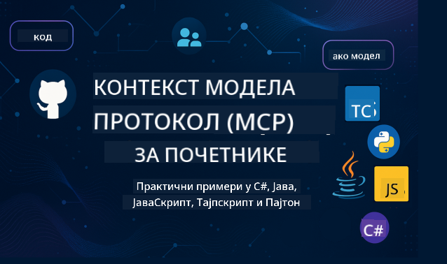

<!--
CO_OP_TRANSLATOR_METADATA:
{
  "original_hash": "2a21391378c12ecfef50f866329dfde0",
  "translation_date": "2025-05-17T05:35:36+00:00",
  "source_file": "README.md",
  "language_code": "sr"
}
-->

Pratite ove korake da biste počeli sa korišćenjem ovih resursa:
1. **Forkujte Repozitorijum**: Kliknite 
2. **Klonirajte Repozitorijum**: `git clone https://github.com/microsoft/mcp-for-beginners.git`
3. [**Pridružite se Microsoft Azure AI Foundry Discord serveru i upoznajte stručnjake i kolege programere**](https://discord.com/invite/ByRwuEEgH4)

### 🌐 Podrška za Više Jezika

#### Podržano putem GitHub Action (Automatski i Uvek Ažurirano)
[Француски](../fr/README.md) | [Шпански](../es/README.md) | [Немачки](../de/README.md) | [Руски](../ru/README.md) | [Арапски](../ar/README.md) | [Персијски (Фарси)](../fa/README.md) | [Урду](../ur/README.md) | [Кинески (поједностављени)](../zh/README.md) | [Кинески (традиционални, Макао)](../mo/README.md) | [Кинески (традиционални, Хонг Конг)](../hk/README.md) | [Кинески (традиционални, Тајван)](../tw/README.md) | [Јапански](../ja/README.md) | [Корејски](../ko/README.md) | [Хинди](../hi/README.md) | [Бенгалски](../bn/README.md) | [Марати](../mr/README.md) | [Непалски](../ne/README.md) | [Пенџабски (Гурмуки)](../pa/README.md) | [Португалски (Португал)](../pt/README.md) | [Португалски (Бразил)](../br/README.md) | [Италијански](../it/README.md) | [Пољски](../pl/README.md) | [Турски](../tr/README.md) | [Грчки](../el/README.md) | [Тајландски](../th/README.md) | [Шведски](../sv/README.md) | [Дански](../da/README.md) | [Норвешки](../no/README.md) | [Фински](../fi/README.md) | [Холандски](../nl/README.md) | [Хебрејски](../he/README.md) | [Вијетнамски](../vi/README.md) | [Индонежански](../id/README.md) | [Малајски](../ms/README.md) | [Тагалог (Филипински)](../tl/README.md) | [Свахили](../sw/README.md) | [Мађарски](../hu/README.md) | [Чешки](../cs/README.md) | [Словачки](../sk/README.md) | [Румунски](../ro/README.md) | [Бугарски](../bg/README.md) | [Српски (ћирилица)](./README.md) | [Хрватски](../hr/README.md) | [Словеначки](../sl/README.md)
# 🚀 Ultimativni vodič za kurikulum Model Context Protocol (MCP) za početnike

## **Učite MCP uz praktične primere koda u C#, Java, JavaScript, Python i TypeScript**

## 🧠 Pregled kurikuluma Model Context Protocol

**Model Context Protocol (MCP)** je napredni okvir dizajniran da standardizuje interakcije između AI modela i klijentskih aplikacija. Ovaj open-source kurikulum nudi strukturirani put učenja, sa praktičnim primerima koda i stvarnim slučajevima upotrebe, u popularnim programskim jezicima uključujući C#, Java, JavaScript, TypeScript i Python.

Bilo da ste AI developer, sistemski arhitekta ili softverski inženjer, ovaj vodič je vaš sveobuhvatni resurs za savladavanje MCP osnova i strategija implementacije.

## 🔗 Zvanični MCP resursi

- 📘 [MCP Dokumentacija](https://modelcontextprotocol.io/) – Detaljni tutorijali i korisnički vodiči  
- 📜 [MCP Specifikacija](https://spec.modelcontextprotocol.io/) – Arhitektura protokola i tehničke reference  
- 🧑‍💻 [MCP GitHub Repozitorijum](https://github.com/modelcontextprotocol) – Open-source SDK-ovi, alati i primeri koda  

## 🧭 Kompletna struktura kurikuluma MCP

### 📌 [Uvod u MCP](./00-Introduction/README.md)

- Šta je Model Context Protocol?
- Zašto je standardizacija važna u AI procesima
- Praktični slučajevi upotrebe i prednosti MCP

### 🧩 [Objašnjenje osnovnih pojmova](./01-CoreConcepts/README.md)

- Razumevanje klijent-server arhitekture u MCP
- Ključne komponente protokola: zahtevi, odgovori i šeme
- MCP poruke i obrasci razmene podataka

### 🔐 [Sigurnost u MCP](./02-Security/readme.md)

- Identifikacija sigurnosnih pretnji unutar MCP sistema
- Tehnike i najbolje prakse za obezbeđivanje implementacija

### 🚀 [Početak rada sa MCP](./03-GettingStarted/README.md)

- Podešavanje okruženja i konfiguracija
- Kreiranje osnovnih MCP servera i klijenata
- Integracija MCP sa postojećim aplikacijama

#### 🧮 MCP Kalkulator Projekti:

  
<strong>Istražite implementacije koda po jeziku</strong>

  - [C# MCP Server Primer](./03-GettingStarted/samples/csharp/README.md)
  - [Java MCP Kalkulator](./03-GettingStarted/samples/java/calculator/README.md)
  - [JavaScript MCP Demo](./03-GettingStarted/samples/javascript/README.md)
  - [Python MCP Server](../../03-GettingStarted/samples/python/mcp_calculator_server.py)
  - [TypeScript MCP Primer](./03-GettingStarted/samples/typescript/README.md)

### 🛠️ [Praktična implementacija](./04-PracticalImplementation/README.md)

- Korišćenje SDK-ova u različitim jezicima
- Debugging, testiranje i validacija
- Izrada ponovljivih šablona upita i tokova rada

#### 💡 MCP Napredni Kalkulator Projekti:

  
<strong>Istražite napredne primere</strong>

  - [Napredni C# Primer](./04-PracticalImplementation/samples/csharp/README.md)
  - [Java Container App Primer](./04-PracticalImplementation/samples/java/containerapp/README.md)
  - [JavaScript Napredni Primer](./04-PracticalImplementation/samples/javascript/README.md)
  - [Python Kompleksna Implementacija](../../04-PracticalImplementation/samples/python/mcp_sample.py)
  - [TypeScript Container Primer](./04-PracticalImplementation/samples/typescript/README.md)

### 🎓 [Napredne teme u MCP](./05-AdvancedTopics/README.md)

- Multimodalni AI tokovi rada i proširivost
- Sigurne strategije skaliranja
- MCP u korporativnim ekosistemima

### 🌍 [Doprinosi zajednice](./06-CommunityContributions/README.md)

- Kako doprineti kodu i dokumentaciji
- Saradnja putem GitHub-a
- Poboljšanja vođena zajednicom i povratne informacije

### 📈 [Uvidi iz ranog usvajanja](./07-CaseStudies/README.md)

- Stvarne implementacije i šta je radilo
- Izgradnja i postavljanje MCP baziranih rešenja
- Trendovi i budući planovi

### 📏 [Najbolje prakse za MCP](./08-BestPractices/README.md)

- Podešavanje performansi i optimizacija
- Dizajniranje MCP sistema otpornog na greške
- Strategije testiranja i otpornosti

### 📊 [MCP Studije slučaja](./09-CaseStudy/Readme.md)

- Detaljni uvidi u arhitekture MCP rešenja
- Plani postavljanja i saveti za integraciju
- Anotirani dijagrami i pregled projekata

## 🎯 Preduslovi za učenje MCP

Da biste izvukli maksimum iz ovog kurikuluma, trebalo bi da imate:

- Osnovno znanje C#, Java ili Python
- Razumevanje klijent-server modela i API-ja
- (Opcionalno) Poznavanje koncepata mašinskog učenja

## 🛠️ Kako efikasno koristiti ovaj kurikulum

Svaka lekcija u ovom vodiču uključuje:

1. Jasna objašnjenja MCP pojmova  
2. Primere koda uživo u više jezika  
3. Vežbe za izgradnju stvarnih MCP aplikacija  
4. Dodatne resurse za napredne učenike  

## 📜 Informacije o licenci

Ovaj sadržaj je licenciran pod **MIT Licencom**. Za uslove i odredbe, pogledajte [LICENSE](../../LICENSE).

## 🤝 Smernice za doprinos

Ovaj projekat pozdravlja doprinose i sugestije. Većina doprinosa zahteva da se složite sa
Sporazumom o licenci za doprinos (CLA) koji izjavljuje da imate pravo da, i zapravo, dajete nam
prava da koristimo vaš doprinos. Za detalje, posetite <https://cla.opensource.microsoft.com>.

Kada pošaljete pull request, CLA bot će automatski utvrditi da li treba da obezbedite
CLA i odgovarajuće označiti PR (npr. provera statusa, komentar). Jednostavno pratite uputstva
koja vam bot pruži. Ovo ćete morati da uradite samo jednom za sve repo koji koriste naš CLA.

Ovaj projekat je usvojio [Microsoft Open Source Code of Conduct](https://opensource.microsoft.com/codeofconduct/).
Za više informacija pogledajte [Code of Conduct FAQ](https://opensource.microsoft.com/codeofconduct/faq/) ili
kontaktirajte [opencode@microsoft.com](mailto:opencode@microsoft.com) sa dodatnim pitanjima ili komentarima.

## ™️ Obaveštenje o zaštitnim znakovima

Ovaj projekat može sadržati zaštitne znakove ili logotipe za projekte, proizvode ili usluge. Ovlašćena upotreba Microsoft
zaštitnih znakova ili logotipa podložna je i mora pratiti
[Microsoft-ove Smernice za upotrebu zaštitnih znakova i brendova](https://www.microsoft.com/legal/intellectualproperty/trademarks/usage/general).
Upotreba Microsoft-ovih zaštitnih znakova ili logotipa u modifikovanim verzijama ovog projekta ne sme izazvati zabunu ili implicirati Microsoft-ovo pokroviteljstvo.
Svaka upotreba zaštitnih znakova ili logotipa trećih strana podložna je politikama tih trećih strana.

**Одрицање од одговорности**:  
Овај документ је преведен коришћењем услуге за превођење помоћу вештачке интелигенције [Co-op Translator](https://github.com/Azure/co-op-translator). Иако се трудимо да обезбедимо тачност, молимо вас да будете свесни да аутоматизовани преводи могу садржати грешке или нетачности. Оригинални документ на његовом изворном језику треба сматрати меродавним извором. За критичне информације, препоручује се професионални људски превод. Нисмо одговорни за било какве неспоразуме или погрешна тумачења која могу настати коришћењем овог превода.