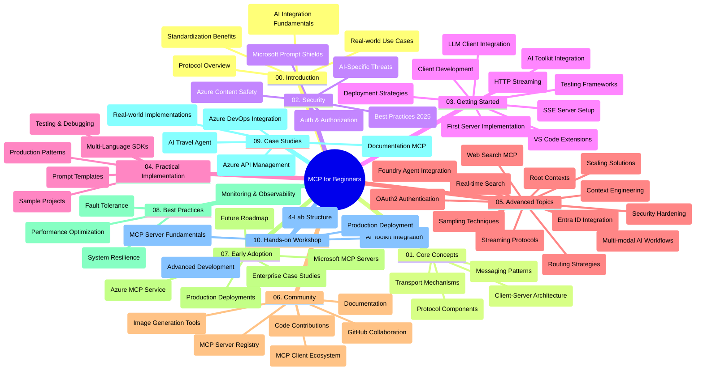

<!--
CO_OP_TRANSLATOR_METADATA:
{
  "original_hash": "e2c6ed897fa98fa08e0146101776c7ff",
  "translation_date": "2025-07-18T10:27:26+00:00",
  "source_file": "study_guide.md",
  "language_code": "sr"
}
-->
# Протокол контекста модела (MCP) за почетнике - Водич за учење

Овај водич пружа преглед структуре и садржаја репозиторијума за курс „Протокол контекста модела (MCP) за почетнике“. Користите овај водич за ефикасно сналажење у репозиторијуму и максимално коришћење доступних ресурса.

## Преглед репозиторијума

Протокол контекста модела (MCP) је стандардизован оквир за интеракције између AI модела и клијент апликација. Првобитно га је креирала компанија Anthropic, а сада га одржава ширa заједница MCP кроз званичну GitHub организацију. Овај репозиторијум нуди свеобухватан курс са практичним примерима кода у C#, Java, JavaScript, Python и TypeScript, намењен AI програмерима, системским архитектама и софтверским инжењерима.

## Визуелна мапа курса

## Структура репозиторијума

Репозиторијум је организован у десет главних секција, од којих се свака бави различитим аспектима MCP:

1. **Увод (00-Introduction/)**
   - Преглед Протокола контекста модела
   - Зашто је стандардизација важна у AI процесима
   - Практични примери и предности

2. **Основни појмови (01-CoreConcepts/)**
   - Клијент-сервер архитектура
   - Кључне компоненте протокола
   - Обрасци размене порука у MCP

3. **Безбедност (02-Security/)**
   - Безбедносне претње у системима заснованим на MCP
   - Најбоље праксе за обезбеђење имплементација
   - Стратегије аутентификације и ауторизације
   - **Свеобухватна безбедносна документација**:
     - MCP Безбедносне најбоље праксе 2025
     - Водич за имплементацију Azure Content Safety
     - MCP безбедносне контроле и технике
     - Брзи преглед најбољих пракси MCP
   - **Кључне теме безбедности**:
     - Напади убацивања упита и тровања алата
     - Отмица сесија и проблеми „збуњеног заменика“
     - Ранљивости у преносу токена
     - Прекомерне дозволе и контролa приступа
     - Безбедност ланца снабдевања AI компоненти
     - Интеграција Microsoft Prompt Shields

4. **Почетак рада (03-GettingStarted/)**
   - Подешавање и конфигурација окружења
   - Креирање основних MCP сервера и клијената
   - Интеграција са постојећим апликацијама
   - Обухвата одељке за:
     - Прву имплементацију сервера
     - Развој клијента
     - Интеграцију LLM клијента
     - Интеграцију у VS Code
     - Сервер-сент догађаје (SSE) сервер
     - HTTP стриминг
     - Интеграцију AI Toolkit-а
     - Стратегије тестирања
     - Упутства за деплојмент

5. **Практична имплементација (04-PracticalImplementation/)**
   - Коришћење SDK-ова у различитим програмским језицима
   - Технике дебаговања, тестирања и валидације
   - Креирање поновљивих шаблона упита и радних токова
   - Пример пројеката са примерима имплементације

6. **Напредне теме (05-AdvancedTopics/)**
   - Технике инжењеринга контекста
   - Интеграција Foundry агента
   - Мултимодални AI радни токови
   - Демонстрације OAuth2 аутентификације
   - Могућности претраге у реалном времену
   - Стриминг у реалном времену
   - Имплементација коренских контекста
   - Стратегије рутирања
   - Технике узорковања
   - Приступи скалирању
   - Безбедносне разматрања
   - Интеграција Entra ID безбедности
   - Интеграција веб претраге

7. **Заједнички доприноси (06-CommunityContributions/)**
   - Како допринети кодом и документацијом
   - Сарадња преко GitHub-а
   - Побољшања и повратне информације од заједнице
   - Коришћење различитих MCP клијената (Claude Desktop, Cline, VSCode)
   - Рад са популарним MCP серверима укључујући генерисање слика

8. **Усвојене лекције (07-LessonsfromEarlyAdoption/)**
   - Имплементације из стварног света и успешне приче
   - Изградња и деплојмент решења заснованих на MCP
   - Трендови и будућа мапа пута
   - **Водич за Microsoft MCP сервере**: Свеобухватан водич за 10 продукцијски спремних Microsoft MCP сервера укључујући:
     - Microsoft Learn Docs MCP Server
     - Azure MCP Server (15+ специјализованих конектора)
     - GitHub MCP Server
     - Azure DevOps MCP Server
     - MarkItDown MCP Server
     - SQL Server MCP Server
     - Playwright MCP Server
     - Dev Box MCP Server
     - Azure AI Foundry MCP Server
     - Microsoft 365 Agents Toolkit MCP Server

9. **Најбоље праксе (08-BestPractices/)**
   - Подешавање перформанси и оптимизација
   - Дизајн отпорних MCP система
   - Стратегије тестирања и отпорности

10. **Студије случаја (09-CaseStudy/)**
    - Пример интеграције Azure API Management
    - Пример имплементације туристичког агента
    - Интеграција Azure DevOps са YouTube ажурирањима
    - Примери имплементације MCP документације
    - Примери имплементације са детаљном документацијом

11. **Практична радионица (10-StreamliningAIWorkflowsBuildingAnMCPServerWithAIToolkit/)**
    - Свеобухватна практична радионица која комбинује MCP са AI Toolkit-ом
    - Изградња интелигентних апликација које повезују AI моделе са стварним алатима
    - Практични модули који покривају основе, развој прилагођених сервера и стратегије продукцијског деплојмента
    - **Структура лабораторије**:
      - Лабораторија 1: Основе MCP сервера
      - Лабораторија 2: Напредни развој MCP сервера
      - Лабораторија 3: Интеграција AI Toolkit-а
      - Лабораторија 4: Продукцијски деплојмент и скалирање
    - Приступ учењу заснован на лабораторијама са корак по корак упутствима

## Додатни ресурси

Репозиторијум укључује пратеће ресурсе:

- **Фолдер са сликама**: Садржи дијаграме и илустрације коришћене кроз цео курс
- **Преводи**: Подршка за више језика са аутоматским преводима документације
- **Званични MCP ресурси**:
  - [MCP документација](https://modelcontextprotocol.io/)
  - [MCP спецификација](https://spec.modelcontextprotocol.io/)
  - [MCP GitHub репозиторијум](https://github.com/modelcontextprotocol)

## Како користити овај репозиторијум

1. **Секвенцијално учење**: Пратите поглавља по реду (од 00 до 10) за структуриран процес учења.
2. **Фокус на одређени језик**: Ако вас занима одређени програмски језик, истражите директоријуме са примерима за имплементације на жељеном језику.
3. **Практична имплементација**: Почните са одељком „Почетак рада“ да подесите окружење и направите први MCP сервер и клијента.
4. **Напредна истраживања**: Када савладате основе, пређите на напредне теме да проширите своје знање.
5. **Укључивање у заједницу**: Придружите се MCP заједници преко GitHub дискусија и Discord канала да бисте се повезали са стручњацима и другим програмерима.

## MCP клијенти и алати

Курс обухвата различите MCP клијенте и алате:

1. **Званични клијенти**:
   - Visual Studio Code
   - MCP у Visual Studio Code-у
   - Claude Desktop
   - Claude у VSCode-у
   - Claude API

2. **Заједнички клијенти**:
   - Cline (терминалски)
   - Cursor (уређивач кода)
   - ChatMCP
   - Windsurf

3. **MCP алати за управљање**:
   - MCP CLI
   - MCP Manager
   - MCP Linker
   - MCP Router

## Популарни MCP сервери

Репозиторијум представља различите MCP сервере, укључујући:

1. **Званични Microsoft MCP сервери**:
   - Microsoft Learn Docs MCP Server
   - Azure MCP Server (15+ специјализованих конектора)
   - GitHub MCP Server
   - Azure DevOps MCP Server
   - MarkItDown MCP Server
   - SQL Server MCP Server
   - Playwright MCP Server
   - Dev Box MCP Server
   - Azure AI Foundry MCP Server
   - Microsoft 365 Agents Toolkit MCP Server

2. **Званични референтни сервери**:
   - Filesystem
   - Fetch
   - Memory
   - Sequential Thinking

3. **Генерисање слика**:
   - Azure OpenAI DALL-E 3
   - Stable Diffusion WebUI
   - Replicate

4. **Алатке за развој**:
   - Git MCP
   - Terminal Control
   - Code Assistant

5. **Специјализовани сервери**:
   - Salesforce
   - Microsoft Teams
   - Jira & Confluence

## Доприноси

Овај репозиторијум поздравља доприносе заједнице. Погледајте одељак Заједнички доприноси за смернице како ефикасно допринети MCP екосистему.

## Историја измена

| Датум | Измене |
|-------|---------|
| 18. јул 2025. | - Ажурирана структура репозиторијума са водичем за Microsoft MCP сервере - Додат свеобухватан списак 10 продукцијски спремних Microsoft MCP сервера - Побољшан одељак Популарни MCP сервери са званичним Microsoft MCP серверима - Ажуриране Студије случаја са стварним примерима фајлова - Додати детаљи о структури лабораторије за Практичну радионицу |
| 16. јул 2025. | - Ажурирана структура репозиторијума да одражава тренутни садржај - Додат одељак MCP клијенти и алати - Додат одељак Популарни MCP сервери - Ажурирана Визуелна мапа курса са свим тренутним темама - Побољшан одељак Напредне теме са свим специјализованим областима - Ажуриране Студије случаја са стварним примерима - Појашњен MCP порекло као креиран од стране Anthropic |
| 11. јун 2025. | - Почетно креирање водича за учење - Додата Визуелна мапа курса - Наглашена структура репозиторијума - Укључени пример пројеката и додатни ресурси |

---

*Овај водич за учење је ажуриран 18. јула 2025. и пружа преглед репозиторијума стања на тај датум. Садржај репозиторијума може бити ажуриран и након тог датума.*

**Одрицање од одговорности**:  
Овај документ је преведен коришћењем AI сервиса за превођење [Co-op Translator](https://github.com/Azure/co-op-translator). Иако се трудимо да превод буде тачан, молимо вас да имате у виду да аутоматски преводи могу садржати грешке или нетачности. Оригинални документ на његовом изворном језику треба сматрати ауторитетним извором. За критичне информације препоручује се професионални људски превод. Нисмо одговорни за било каква неспоразума или погрешна тумачења која произилазе из коришћења овог превода.