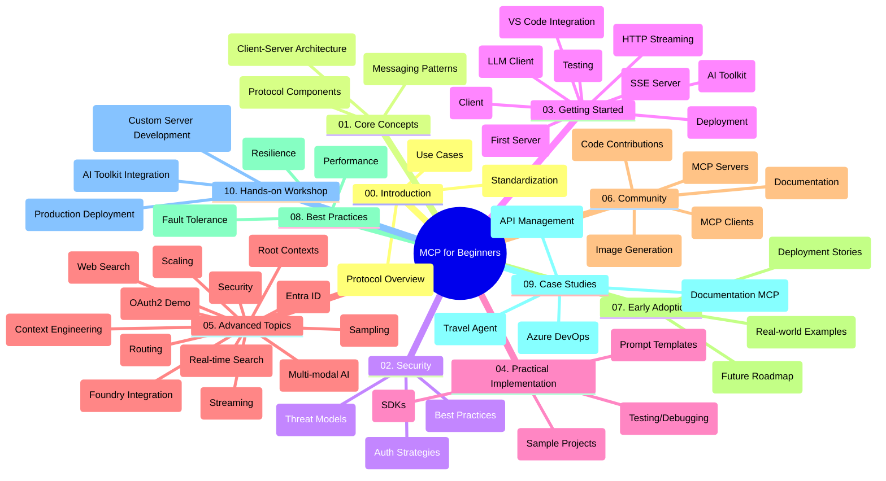

<!--
CO_OP_TRANSLATOR_METADATA:
{
  "original_hash": "5f321ea583cf087a94e47ee74c62b504",
  "translation_date": "2025-07-17T11:41:02+00:00",
  "source_file": "study_guide.md",
  "language_code": "sr"
}
-->
# Model Context Protocol (MCP) за почетнике - Водич за учење

Овај водич пружа преглед структуре и садржаја репозиторијума за курс "Model Context Protocol (MCP) за почетнике". Користите овај водич за ефикасну навигацију кроз репозиторијум и максимално коришћење доступних ресурса.

## Преглед репозиторијума

Model Context Protocol (MCP) је стандардизован оквир за интеракције између AI модела и клијент апликација. Првобитно креиран од стране Anthropic-а, MCP сада одржава ширa заједница MCP-а кроз званичну GitHub организацију. Овај репозиторијум нуди свеобухватан курс са практичним примерима кода у C#, Java, JavaScript, Python и TypeScript, намењен AI програмерима, системским архитекта и софтверским инжењерима.

## Визуелна мапа курса

## Структура репозиторијума

Репозиторијум је организован у десет главних секција, од којих се свака бави различитим аспектима MCP-а:

1. **Увод (00-Introduction/)**
   - Преглед Model Context Protocol-а
   - Зашто је стандардизација важна у AI процесима
   - Практични примери и предности

2. **Основни појмови (01-CoreConcepts/)**
   - Клијент-сервер архитектура
   - Кључне компоненте протокола
   - Обрасци размене порука у MCP-у

3. **Безбедност (02-Security/)**
   - Безбедносне претње у системима заснованим на MCP-у
   - Најбоље праксе за обезбеђење имплементација
   - Стратегије аутентификације и ауторизације

4. **Почетак рада (03-GettingStarted/)**
   - Подешавање окружења и конфигурација
   - Креирање основних MCP сервера и клијената
   - Интеграција са постојећим апликацијама
   - Укључује одељке за:
     - Прву имплементацију сервера
     - Развој клијента
     - Интеграцију LLM клијента
     - Интеграцију у VS Code
     - Server-Sent Events (SSE) сервер
     - HTTP стриминг
     - Интеграцију AI Toolkit-а
     - Стратегије тестирања
     - Упутства за деплојмент

5. **Практична имплементација (04-PracticalImplementation/)**
   - Коришћење SDK-ова у различитим програмским језицима
   - Технике дебаговања, тестирања и валидације
   - Креирање поновљивих шаблона упита и радних токова
   - Пример пројеката са примерима имплементације

6. **Напредне теме (05-AdvancedTopics/)**
   - Технике инжењеринга контекста
   - Интеграција Foundry агента
   - Мултимодални AI радни токови
   - Демонстрације OAuth2 аутентификације
   - Реал-тайм претрага
   - Реал-тайм стриминг
   - Имплементација root контекста
   - Стратегије рутирања
   - Технике узорковања
   - Приступи скалирању
   - Безбедносне разматрања
   - Интеграција Entra ID безбедности
   - Интеграција веб претраге

7. **Заједнички доприноси (06-CommunityContributions/)**
   - Како допринети кодом и документацијом
   - Сарадња преко GitHub-а
   - Побољшања и повратне информације од заједнице
   - Коришћење различитих MCP клијената (Claude Desktop, Cline, VSCode)
   - Рад са популарним MCP серверима укључујући генерисање слика

8. **Усвојене лекције (07-LessonsfromEarlyAdoption/)**
   - Имплементације из стварног света и успешне приче
   - Изградња и деплојмент решења заснованих на MCP-у
   - Трендови и будући планови

9. **Најбоље праксе (08-BestPractices/)**
   - Подешавање перформанси и оптимизација
   - Дизајн отпорних MCP система
   - Стратегије тестирања и отпорности

10. **Студије случаја (09-CaseStudy/)**
    - Студија случаја: интеграција Azure API Management-а
    - Студија случаја: имплементација туристичког агента
    - Студија случаја: интеграција Azure DevOps-а са YouTube-ом
    - Примери имплементације са детаљном документацијом

11. **Практична радионица (10-StreamliningAIWorkflowsBuildingAnMCPServerWithAIToolkit/)**
    - Свеобухватна практична радионица која комбинује MCP са AI Toolkit-ом
    - Изградња интелигентних апликација које повезују AI моделе са алатима из стварног света
    - Практични модули који покривају основе, развој прилагођених сервера и стратегије продукционог деплојмента
    - Лабораторијски приступ учењу са корак по корак упутствима

## Додатни ресурси

Репозиторијум садржи пратеће ресурсе:

- **Фолдер са сликама**: Садржи дијаграме и илустрације коришћене кроз цео курс
- **Преводи**: Подршка за више језика са аутоматизованим преводима документације
- **Званични MCP ресурси**:
  - [MCP Documentation](https://modelcontextprotocol.io/)
  - [MCP Specification](https://spec.modelcontextprotocol.io/)
  - [MCP GitHub Repository](https://github.com/modelcontextprotocol)

## Како користити овај репозиторијум

1. **Секвенцијално учење**: Пратите поглавља по реду (од 00 до 10) за структуриран процес учења.
2. **Фокус на одређени језик**: Ако вас занима одређени програмски језик, истражите директоријуме са примерима за имплементације на жељеном језику.
3. **Практична имплементација**: Почните са одељком "Почетак рада" да подесите окружење и направите први MCP сервер и клијента.
4. **Напредна истраживања**: Када савладате основе, пређите на напредне теме да проширите своје знање.
5. **Укључивање у заједницу**: Придружите се MCP заједници преко GitHub дискусија и Discord канала да бисте се повезали са стручњацима и другим програмерима.

## MCP клијенти и алати

Курс обухвата различите MCP клијенте и алате:

1. **Званични клијенти**:
   - Visual Studio Code
   - MCP у Visual Studio Code-у
   - Claude Desktop
   - Claude у VSCode-у
   - Claude API

2. **Заједнички клијенти**:
   - Cline (терминалски)
   - Cursor (уређивач кода)
   - ChatMCP
   - Windsurf

3. **Алатке за управљање MCP-ом**:
   - MCP CLI
   - MCP Manager
   - MCP Linker
   - MCP Router

## Популарни MCP сервери

Репозиторијум представља различите MCP сервере, укључујући:

1. **Званични референтни сервери**:
   - Filesystem
   - Fetch
   - Memory
   - Sequential Thinking

2. **Генерисање слика**:
   - Azure OpenAI DALL-E 3
   - Stable Diffusion WebUI
   - Replicate

3. **Развојни алати**:
   - Git MCP
   - Terminal Control
   - Code Assistant

4. **Специјализовани сервери**:
   - Salesforce
   - Microsoft Teams
   - Jira & Confluence

## Доприноси

Овај репозиторијум поздравља доприносе заједнице. Погледајте одељак Заједнички доприноси за смернице како ефикасно допринети MCP екосистему.

## Историја измена

| Датум | Измене |
|-------|---------|
| 16. јул 2025. | - Ажурирана структура репозиторијума да одражава тренутни садржај - Додат одељак MCP клијенти и алати - Додат одељак Популарни MCP сервери - Ажурирана Визуелна мапа курса са свим актуелним темама - Побољшан одељак Напредне теме са свим специјализованим областима - Ажуриране студије случаја са стварним примерима - Појашњен MCP као протокол који је креирао Anthropic |
| 11. јун 2025. | - Првобитно креирање водича за учење - Додата Визуелна мапа курса - Описана структура репозиторијума - Укључени пример пројекти и додатни ресурси |

---

*Овај водич за учење је ажуриран 16. јула 2025. и пружа преглед репозиторијума стања на тај датум. Садржај репозиторијума може бити ажуриран и након тог датума.*

**Одрицање од одговорности**:  
Овај документ је преведен коришћењем AI услуге за превођење [Co-op Translator](https://github.com/Azure/co-op-translator). Иако се трудимо да превод буде тачан, молимо вас да имате у виду да аутоматски преводи могу садржати грешке или нетачности. Оригинални документ на његовом изворном језику треба сматрати ауторитетним извором. За критичне информације препоручује се професионални људски превод. Нисмо одговорни за било каква неспоразума или погрешна тумачења која произилазе из коришћења овог превода.