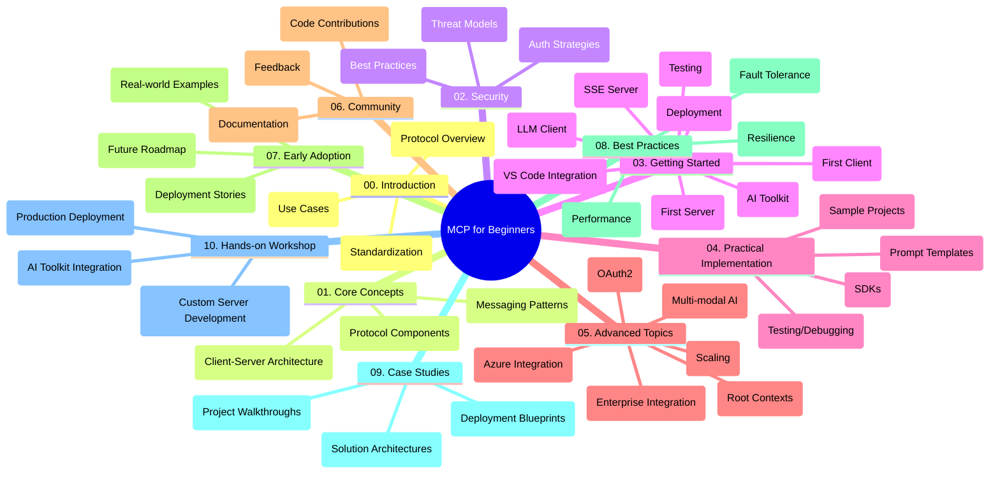

<!--
CO_OP_TRANSLATOR_METADATA:
{
  "original_hash": "a607d4febc94caee9a12b77795f7fc9a",
  "translation_date": "2025-07-13T15:18:47+00:00",
  "source_file": "study_guide.md",
  "language_code": "sr"
}
-->
# Model Context Protocol (MCP) за почетнике - Водич за учење

Овај водич пружа преглед структуре и садржаја репозиторијума за курс "Model Context Protocol (MCP) за почетнике". Користите овај водич да бисте ефикасно проналазили потребне материјале и максимално искористили расположиве ресурсе.

## Преглед репозиторијума

Model Context Protocol (MCP) је стандардизован оквир за интеракцију између AI модела и клијент апликација. Овај репозиторијум нуди свеобухватан курс са практичним примерима кода у C#, Java, JavaScript, Python и TypeScript, намењен AI програмерима, системским архитектама и софтверским инжењерима.

## Визуелна мапа курса

## Структура репозиторијума

Репозиторијум је организован у десет главних секција, од којих се свака бави различитим аспектима MCP:

1. **Увод (00-Introduction/)**
   - Преглед Model Context Protocol-а
   - Зашто је стандардизација важна у AI процесима
   - Практичне примене и предности

2. **Основни појмови (01-CoreConcepts/)**
   - Клијент-сервер архитектура
   - Кључне компоненте протокола
   - Обрасци размене порука у MCP

3. **Безбедност (02-Security/)**
   - Безбедносне претње у системима заснованим на MCP-у
   - Најбоље праксе за обезбеђење имплементација
   - Стратегије аутентификације и ауторизације

4. **Почетак рада (03-GettingStarted/)**
   - Подешавање окружења и конфигурација
   - Креирање основних MCP сервера и клијената
   - Интеграција са постојећим апликацијама
   - Подсекције за први сервер, првог клијента, LLM клијента, интеграцију са VS Code, SSE сервер, AI Toolkit, тестирање и деплојмент

5. **Практична имплементација (04-PracticalImplementation/)**
   - Коришћење SDK-ова у различитим програмским језицима
   - Технике дебаговања, тестирања и валидације
   - Креирање поновљивих шаблона упита и радних токова
   - Пример пројеката са примерима имплементације

6. **Напредне теме (05-AdvancedTopics/)**
   - Мултимодални AI радни токови и проширивост
   - Стратегије безбедног скалирања
   - MCP у корпоративним екосистемима
   - Специјализоване теме укључујући Azure интеграцију, мултимодалност, OAuth2, root context-ове, рутирање, узорковање, скалирање, безбедност, интеграцију веб претраге и стриминг.

7. **Заједнички доприноси (06-CommunityContributions/)**
   - Како допринети кодом и документацијом
   - Сарадња преко GitHub-а
   - Побољшања и повратне информације од заједнице

8. **Усвојене лекције (07-LessonsfromEarlyAdoption/)**
   - Реалне имплементације и успешне приче
   - Изградња и деплојмент решења заснованих на MCP-у
   - Трендови и будући планови

9. **Најбоље праксе (08-BestPractices/)**
   - Подешавање перформанси и оптимизација
   - Дизајн отпорних MCP система
   - Стратегије тестирања и отпорности

10. **Студије случаја (09-CaseStudy/)**
    - Детаљне анализе архитектура MCP решења
    - Планови за деплојмент и савети за интеграцију
    - Аннотовани дијаграми и вођење кроз пројекте

11. **Практична радионица (10-StreamliningAIWorkflowsBuildingAnMCPServerWithAIToolkit/)**
    - Свеобухватна радионица која комбинује MCP са Microsoft-овим AI Toolkit-ом за VS Code
    - Изградња интелигентних апликација које повезују AI моделе са стварним алатима
    - Практични модули који покривају основе, развој прилагођених сервера и стратегије за продукцијски деплојмент

## Пример пројеката

Репозиторијум садржи више пример пројеката који показују имплементацију MCP-а у различитим програмским језицима:

### Основни MCP калкулатор примери
- C# MCP сервер пример
- Java MCP калкулатор
- JavaScript MCP демо
- Python MCP сервер
- TypeScript MCP пример

### Напредни MCP калкулатор пројекти
- Напредни C# пример
- Java контејнер апликација пример
- JavaScript напредни пример
- Python комплексна имплементација
- TypeScript контејнер пример

## Додатни ресурси

Репозиторијум укључује пратеће ресурсе:

- **Фолдер са сликама**: Садржи дијаграме и илустрације коришћене кроз цео курс
- **Преводи**: Подршка за више језика са аутоматским преводима документације
- **Званични MCP ресурси**:
  - [MCP документација](https://modelcontextprotocol.io/)
  - [MCP спецификација](https://spec.modelcontextprotocol.io/)
  - [MCP GitHub репозиторијум](https://github.com/modelcontextprotocol)

## Како користити овај репозиторијум

1. **Секвенцијално учење**: Пратите поглавља по реду (од 00 до 10) за структуриран процес учења.
2. **Фокус на језик**: Ако вас занима одређени програмски језик, истражите директоријуме са примерима за имплементације на том језику.
3. **Практична имплементација**: Почните са одељком "Почетак рада" да подесите окружење и направите први MCP сервер и клијента.
4. **Напредна истраживања**: Када савладате основе, пређите на напредне теме да бисте проширили знање.
5. **Укључивање у заједницу**: Придружите се [Azure AI Foundry Discord](https://discord.com/invite/ByRwuEEgH4) да бисте се повезали са стручњацима и другим програмерима.

## Доприноси

Овај репозиторијум је отворен за доприносе заједнице. Погледајте одељак Заједнички доприноси за упутства како да учествујете.

---

*Овај водич за учење је креиран 11. јуна 2025. и пружа преглед репозиторијума стања на тај датум. Садржај репозиторијума могао је бити ажуриран од тада.*

**Одрицање од одговорности**:  
Овај документ је преведен коришћењем AI сервиса за превођење [Co-op Translator](https://github.com/Azure/co-op-translator). Иако се трудимо да превод буде тачан, молимо вас да имате у виду да аутоматски преводи могу садржати грешке или нетачности. Оригинални документ на његовом изворном језику треба сматрати ауторитетним извором. За критичне информације препоручује се професионални људски превод. Нисмо одговорни за било каква неспоразума или погрешна тумачења настала коришћењем овог превода.