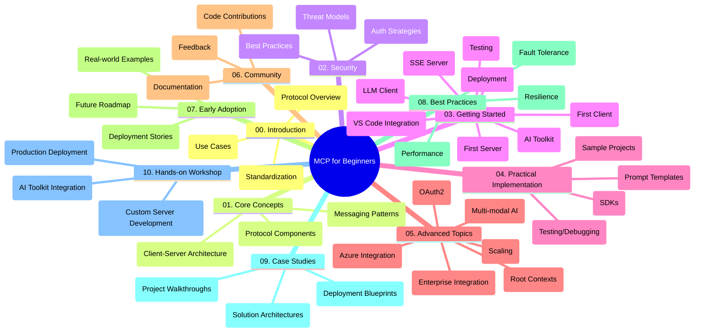

<!--
CO_OP_TRANSLATOR_METADATA:
{
  "original_hash": "a607d4febc94caee9a12b77795f7fc9a",
  "translation_date": "2025-06-11T16:51:31+00:00",
  "source_file": "study_guide.md",
  "language_code": "sr"
}
-->
# Model Context Protocol (MCP) za početnike - Vodič za učenje

Ovaj vodič pruža pregled strukture i sadržaja repozitorijuma za kurikulum "Model Context Protocol (MCP) za početnike". Koristite ovaj vodič da efikasno navigirate repozitorijumom i maksimalno iskoristite dostupne resurse.

## Pregled repozitorijuma

Model Context Protocol (MCP) je standardizovani okvir za interakciju između AI modela i klijentskih aplikacija. Ovaj repozitorijum nudi sveobuhvatan kurikulum sa praktičnim primerima koda u C#, Java, JavaScript, Python i TypeScript, namenjen AI developerima, sistemskim arhitektama i softverskim inženjerima.

## Vizuelna mapa kurikuluma

## Struktura repozitorijuma

Repozitorijum je organizovan u deset glavnih sekcija, od kojih se svaka fokusira na različite aspekte MCP-a:

1. **Uvod (00-Introduction/)**
   - Pregled Model Context Protocol-a
   - Zašto je standardizacija važna u AI procesima
   - Praktični primeri upotrebe i prednosti

2. **Osnovni koncepti (01-CoreConcepts/)**
   - Klijent-server arhitektura
   - Ključne komponente protokola
   - Obrasci razmene poruka u MCP-u

3. **Bezbednost (02-Security/)**
   - Bezbednosne pretnje u sistemima zasnovanim na MCP-u
   - Najbolje prakse za bezbednu implementaciju
   - Strategije autentifikacije i autorizacije

4. **Početak rada (03-GettingStarted/)**
   - Podešavanje okruženja i konfiguracija
   - Kreiranje osnovnih MCP servera i klijenata
   - Integracija sa postojećim aplikacijama
   - Podsekcije za prvi server, prvi klijent, LLM klijent, VS Code integraciju, SSE server, AI Toolkit, testiranje i deployment

5. **Praktična implementacija (04-PracticalImplementation/)**
   - Korišćenje SDK-ova u različitim programskim jezicima
   - Tehnike za debagovanje, testiranje i validaciju
   - Kreiranje ponovo upotrebljivih šablona za promptove i tokove rada
   - Primeri projekata sa implementacionim kodom

6. **Napredne teme (05-AdvancedTopics/)**
   - Višemodalni AI tokovi rada i proširivost
   - Strategije za bezbedno skaliranje
   - MCP u poslovnim ekosistemima
   - Specijalizovane teme uključujući Azure integraciju, multi-modalnost, OAuth2, root kontekste, rutiranje, uzorkovanje, skaliranje, bezbednost, integraciju web pretrage i streaming.

7. **Doprinosi zajednice (06-CommunityContributions/)**
   - Kako doprineti kodom i dokumentacijom
   - Saradnja preko GitHub-a
   - Poboljšanja i povratne informacije iz zajednice

8. **Lekcije iz ranog usvajanja (07-LessonsfromEarlyAdoption/)**
   - Implementacije iz stvarnog sveta i uspešne priče
   - Izgradnja i deployment rešenja zasnovanih na MCP-u
   - Trendovi i budući planovi razvoja

9. **Najbolje prakse (08-BestPractices/)**
   - Podešavanje performansi i optimizacija
   - Dizajniranje otpornog MCP sistema
   - Strategije testiranja i otpornosti

10. **Studije slučaja (09-CaseStudy/)**
    - Detaljna analiza arhitektura MCP rešenja
    - Šabloni za deployment i saveti za integraciju
    - Ilustrovani dijagrami i vođeni pregledi projekata

11. **Praktična radionica (10-StreamliningAIWorkflowsBuildingAnMCPServerWithAIToolkit/)**
    - Sveobuhvatna radionica koja kombinuje MCP sa Microsoft-ovim AI Toolkit-om za VS Code
    - Izgradnja inteligentnih aplikacija koje povezuju AI modele sa stvarnim alatima
    - Praktični moduli koji pokrivaju osnove, razvoj prilagođenih servera i strategije produkcijskog deploymenta

## Primeri projekata

Repozitorijum sadrži više primera projekata koji demonstriraju implementaciju MCP-a u različitim programskim jezicima:

### Osnovni MCP kalkulator primeri
- C# MCP Server primer
- Java MCP kalkulator
- JavaScript MCP demo
- Python MCP server
- TypeScript MCP primer

### Napredni MCP kalkulator projekti
- Napredni C# primer
- Java Container App primer
- JavaScript napredni primer
- Python kompleksna implementacija
- TypeScript Container primer

## Dodatni resursi

Repozitorijum sadrži prateće resurse:

- **Folder sa slikama**: Sadrži dijagrame i ilustracije korišćene kroz kurikulum
- **Prevodi**: Višejezična podrška sa automatskim prevodima dokumentacije
- **Zvanični MCP resursi**:
  - [MCP Dokumentacija](https://modelcontextprotocol.io/)
  - [MCP Specifikacija](https://spec.modelcontextprotocol.io/)
  - [MCP GitHub Repozitorijum](https://github.com/modelcontextprotocol)

## Kako koristiti ovaj repozitorijum

1. **Učenje po redosledu**: Pratite poglavlja redom (00 do 10) za strukturisano učenje.
2. **Fokus na određeni jezik**: Ako vas zanima određeni programski jezik, istražite direktorijume sa primerima za implementacije na željenom jeziku.
3. **Praktična implementacija**: Počnite sa sekcijom "Getting Started" da podesite okruženje i napravite prvi MCP server i klijent.
4. **Napredna istraživanja**: Kada savladate osnove, pređite na napredne teme da proširite svoje znanje.
5. **Uključenje u zajednicu**: Pridružite se [Azure AI Foundry Discord](https://discord.com/invite/ByRwuEEgH4) da se povežete sa stručnjacima i drugim developerima.

## Doprinos

Ovaj repozitorijum je otvoren za doprinose iz zajednice. Pogledajte sekciju Community Contributions za uputstva kako da doprinesete.

---

*Ovaj vodič za učenje je napravljen 11. juna 2025. i pruža pregled repozitorijuma do tog datuma. Sadržaj repozitorijuma mogao je biti ažuriran od tada.*

**Ограничење одговорности**:  
Овај документ је преведен помоћу AI услуге за превођење [Co-op Translator](https://github.com/Azure/co-op-translator). Иако настојимо да превод буде прецизан, имајте у виду да аутоматизовани преводи могу садржати грешке или нетачности. Оригинални документ на његовом изворном језику треба сматрати ауторитетним извором. За критичне информације препоручује се професионални људски превод. Нисмо одговорни за било какве неспоразуме или погрешне тумачења која могу настати коришћењем овог превода.