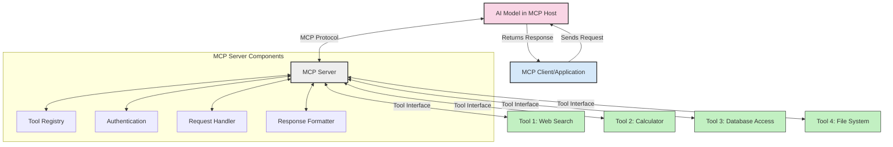
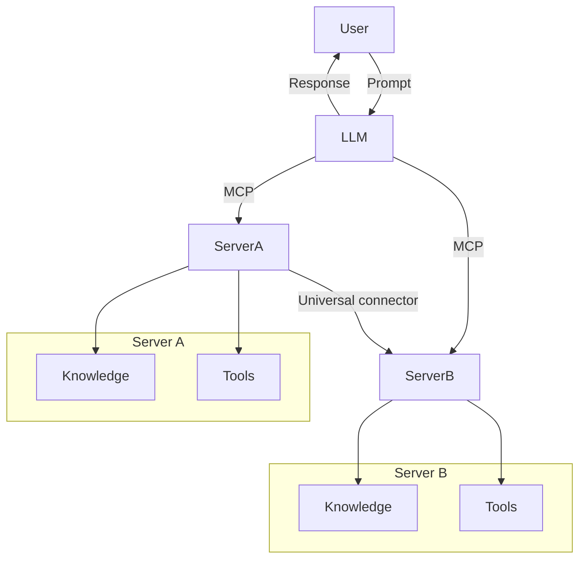

<!--
CO_OP_TRANSLATOR_METADATA:
{
  "original_hash": "1d88dee994dcbb3fa52c271d0c0817b5",
  "translation_date": "2025-05-20T21:39:15+00:00",
  "source_file": "00-Introduction/README.md",
  "language_code": "sv"
}
-->
# Introduktion till Model Context Protocol (MCP): Varför det är viktigt för skalbara AI-applikationer

Generativa AI-applikationer är ett stort steg framåt eftersom de ofta låter användaren interagera med appen via naturliga språkkommandon. Men när mer tid och resurser investeras i sådana appar vill du försäkra dig om att du enkelt kan integrera funktioner och resurser på ett sätt som gör det enkelt att bygga ut, att din app kan hantera mer än en modell samtidigt och hantera olika modellkomplexiteter. Kort sagt, att bygga Gen AI-appar är enkelt i början, men när de växer och blir mer komplexa behöver du börja definiera en arkitektur och kommer sannolikt att behöva förlita dig på en standard för att säkerställa att dina appar byggs på ett konsekvent sätt. Här kommer MCP in för att organisera saker och ge en standard.

---

## **🔍 Vad är Model Context Protocol (MCP)?**

**Model Context Protocol (MCP)** är ett **öppet, standardiserat gränssnitt** som gör det möjligt för Large Language Models (LLMs) att sömlöst interagera med externa verktyg, API:er och datakällor. Det erbjuder en konsekvent arkitektur för att förbättra AI-modellernas funktionalitet utöver deras träningsdata, vilket möjliggör smartare, skalbara och mer responsiva AI-system.

---

## **🎯 Varför standardisering inom AI är viktigt**

När generativa AI-applikationer blir mer komplexa är det avgörande att anta standarder som säkerställer **skalbarhet, utbyggbarhet** och **underhållbarhet**. MCP möter dessa behov genom att:

- Ena integrationen mellan modeller och verktyg
- Minska sköra, skräddarsydda lösningar
- Tillåta flera modeller att samexistera inom ett ekosystem

---

## **📚 Lärandemål**

I slutet av denna artikel kommer du att kunna:

- Definiera **Model Context Protocol (MCP)** och dess användningsområden
- Förstå hur MCP standardiserar kommunikationen mellan modell och verktyg
- Identifiera de centrala komponenterna i MCP-arkitekturen
- Utforska verkliga tillämpningar av MCP inom företag och utveckling

---

## **💡 Varför Model Context Protocol (MCP) är en spelväxlare**

### **🔗 MCP löser fragmentering i AI-interaktioner**

Innan MCP krävde integration av modeller med verktyg:

- Anpassad kod för varje verktyg-modell-par
- Icke-standardiserade API:er för varje leverantör
- Frekventa avbrott vid uppdateringar
- Dålig skalbarhet med fler verktyg

### **✅ Fördelar med MCP-standardisering**

| **Fördel**               | **Beskrivning**                                                                 |
|--------------------------|---------------------------------------------------------------------------------|
| Interoperabilitet        | LLMs fungerar sömlöst med verktyg från olika leverantörer                       |
| Konsistens               | Enhetligt beteende över plattformar och verktyg                                |
| Återanvändbarhet         | Verktyg som byggs en gång kan användas i flera projekt och system              |
| Accelererad utveckling   | Minska utvecklingstid genom att använda standardiserade, plug-and-play-gränssnitt |

---

## **🧱 Översikt av MCP-arkitektur på hög nivå**

MCP följer en **klient-server-modell**, där:

- **MCP Hosts** kör AI-modellerna
- **MCP Clients** initierar förfrågningar
- **MCP Servers** tillhandahåller kontext, verktyg och kapabiliteter

### **Nyckelkomponenter:**

- **Resources** – Statisk eller dynamisk data för modeller  
- **Prompts** – Fördefinierade arbetsflöden för styrd generering  
- **Tools** – Körbara funktioner som sökning, beräkningar  
- **Sampling** – Agentliknande beteende via rekursiva interaktioner

---

## Hur MCP-servrar fungerar

MCP-servrar fungerar på följande sätt:

- **Förfrågningsflöde**:  
    1. MCP Client skickar en förfrågan till AI-modellen som körs i en MCP Host.  
    2. AI-modellen identifierar när den behöver externa verktyg eller data.  
    3. Modellen kommunicerar med MCP Servern via det standardiserade protokollet.

- **MCP Servers funktionalitet**:  
    - Tool Registry: Underhåller en katalog över tillgängliga verktyg och deras kapabiliteter.  
    - Authentication: Verifierar behörigheter för verktygsåtkomst.  
    - Request Handler: Hanterar inkommande verktygsförfrågningar från modellen.  
    - Response Formatter: Strukturerar verktygsutdata i ett format som modellen kan förstå.

- **Verktygsexekvering**:  
    - Servern dirigerar förfrågningar till rätt externa verktyg  
    - Verktygen utför sina specialiserade funktioner (sökning, beräkning, databasfrågor, etc.)  
    - Resultaten returneras till modellen i ett konsekvent format.

- **Svarskomplettering**:  
    - AI-modellen integrerar verktygsutdata i sitt svar.  
    - Det slutgiltiga svaret skickas tillbaka till klientapplikationen.

## 👨‍💻 Hur man bygger en MCP-server (med exempel)

MCP-servrar låter dig utöka LLMs kapabiliteter genom att tillhandahålla data och funktionalitet.

Redo att prova? Här är exempel på hur man skapar en enkel MCP-server i olika språk:

- **Python-exempel**: https://github.com/modelcontextprotocol/python-sdk

- **TypeScript-exempel**: https://github.com/modelcontextprotocol/typescript-sdk

- **Java-exempel**: https://github.com/modelcontextprotocol/java-sdk

- **C#/.NET-exempel**: https://github.com/modelcontextprotocol/csharp-sdk

## 🌍 Verkliga användningsområden för MCP

MCP möjliggör en rad olika applikationer genom att utöka AI:s kapabiliteter:

| **Användning**               | **Beskrivning**                                                                |
|-----------------------------|--------------------------------------------------------------------------------|
| Enterprise Data Integration  | Koppla LLMs till databaser, CRM-system eller interna verktyg                   |
| Agentic AI Systems           | Möjliggör autonoma agenter med verktygsåtkomst och beslutsflöden              |
| Multi-modal Applications     | Kombinera text-, bild- och ljudverktyg i en enhetlig AI-app                    |
| Real-time Data Integration   | Integrera live-data i AI-interaktioner för mer precisa och aktuella svar      |

### 🧠 MCP = Universell standard för AI-interaktioner

Model Context Protocol (MCP) fungerar som en universell standard för AI-interaktioner, ungefär som USB-C standardiserade fysiska anslutningar för enheter. Inom AI-världen ger MCP ett konsekvent gränssnitt som gör det möjligt för modeller (klienter) att integrera sömlöst med externa verktyg och dataleverantörer (servrar). Detta eliminerar behovet av olika, anpassade protokoll för varje API eller datakälla.

Under MCP följer ett MCP-kompatibelt verktyg (kallat MCP-server) en enhetlig standard. Dessa servrar kan lista de verktyg eller åtgärder de erbjuder och utföra dessa när en AI-agent begär det. AI-agentplattformar som stödjer MCP kan upptäcka tillgängliga verktyg från servrarna och anropa dem via detta standardprotokoll.

### 💡 Underlättar tillgång till kunskap

Utöver att erbjuda verktyg underlättar MCP även tillgång till kunskap. Det gör det möjligt för applikationer att ge kontext till stora språkmodeller (LLMs) genom att koppla dem till olika datakällor. Till exempel kan en MCP-server representera ett företags dokumentarkiv, vilket gör att agenter kan hämta relevant information vid behov. En annan server kan hantera specifika åtgärder som att skicka e-post eller uppdatera poster. Ur agentens perspektiv är detta helt enkelt verktyg den kan använda—vissa verktyg returnerar data (kunskapskontext), medan andra utför åtgärder. MCP hanterar båda effektivt.

En agent som kopplar upp sig mot en MCP-server lär sig automatiskt serverns tillgängliga kapabiliteter och åtkomliga data via ett standardiserat format. Denna standardisering möjliggör dynamisk tillgång till verktyg. Till exempel, genom att lägga till en ny MCP-server i agentens system blir dess funktioner omedelbart tillgängliga utan att behöva anpassa agentens instruktioner ytterligare.

Denna smidiga integration följer flödet som visas i mermaid-diagrammet, där servrar tillhandahåller både verktyg och kunskap, vilket säkerställer sömlöst samarbete mellan system.

### 👉 Exempel: Skalbar agentlösning

## 🔐 Praktiska fördelar med MCP

Här är de praktiska fördelarna med att använda MCP:

- **Aktualitet**: Modeller kan få tillgång till uppdaterad information utöver sin träningsdata  
- **Kapabilitetsutvidgning**: Modeller kan använda specialiserade verktyg för uppgifter de inte tränats för  
- **Minskade hallucinationer**: Externa datakällor ger faktabaserad grund  
- **Sekretess**: Känslig data kan stanna inom säkra miljöer istället för att bäddas in i prompts

## 📌 Viktiga slutsatser

Följande är viktiga slutsatser för användning av MCP:

- **MCP** standardiserar hur AI-modeller interagerar med verktyg och data  
- Främjar **utbyggbarhet, konsistens och interoperabilitet**  
- MCP hjälper till att **förkorta utvecklingstid, förbättra tillförlitlighet och utöka modellernas kapabiliteter**  
- Klient-server-arkitekturen **möjliggör flexibla och utbyggbara AI-applikationer**

## 🧠 Övning

Tänk på en AI-applikation du är intresserad av att bygga.

- Vilka **externa verktyg eller data** skulle kunna förbättra dess kapabiliteter?  
- Hur kan MCP göra integrationen **enklare och mer pålitlig?**

## Ytterligare resurser

- [MCP GitHub Repository](https://github.com/modelcontextprotocol)

## Vad händer härnäst

Nästa: [Chapter 1: Core Concepts](/01-CoreConcepts/README.md)

**Ansvarsfriskrivning**:  
Detta dokument har översatts med hjälp av AI-översättningstjänsten [Co-op Translator](https://github.com/Azure/co-op-translator). Även om vi strävar efter noggrannhet, vänligen observera att automatiska översättningar kan innehålla fel eller brister. Det ursprungliga dokumentet på dess modersmål bör betraktas som den auktoritativa källan. För viktig information rekommenderas professionell mänsklig översättning. Vi ansvarar inte för eventuella missförstånd eller feltolkningar som uppstår vid användning av denna översättning.