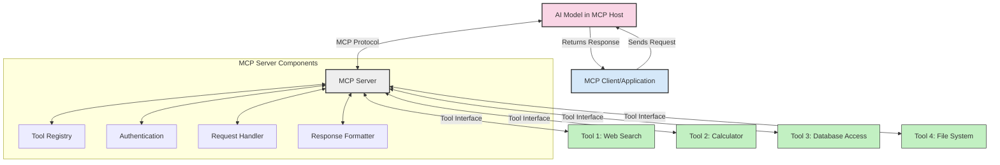
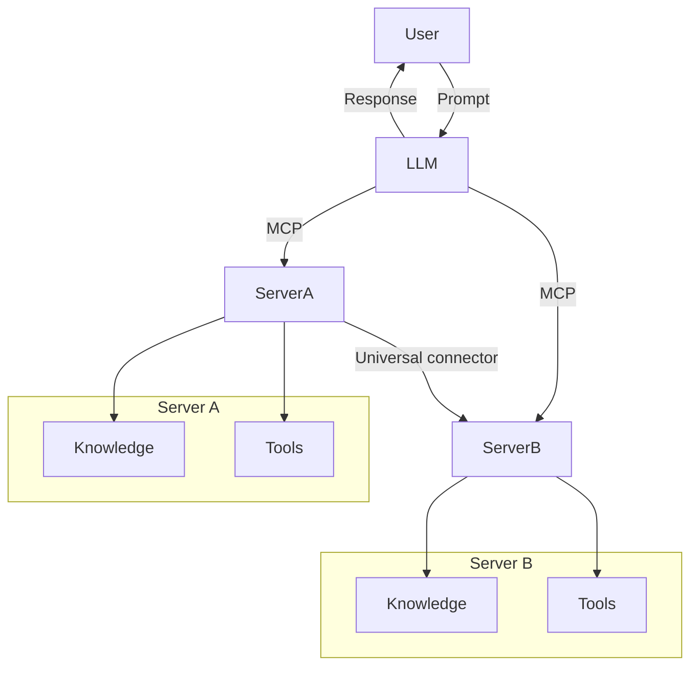

<!--
CO_OP_TRANSLATOR_METADATA:
{
  "original_hash": "cf84f987e1b771d2201408e110dfd2db",
  "translation_date": "2025-05-20T17:15:32+00:00",
  "source_file": "00-Introduction/README.md",
  "language_code": "sv"
}
-->
# Introduktion till Model Context Protocol (MCP): Varför det är viktigt för skalbara AI-applikationer

Generativa AI-applikationer är ett stort steg framåt eftersom de ofta låter användaren interagera med appen med naturliga språkkommandon. Men när mer tid och resurser investeras i sådana appar vill du försäkra dig om att du enkelt kan integrera funktioner och resurser på ett sätt som gör det lätt att bygga ut, att din app kan hantera mer än en modell och dess komplexiteter. Kort sagt, att bygga Gen AI-appar är enkelt i början, men när det växer och blir mer komplext behöver du börja definiera en arkitektur och troligen luta dig mot en standard för att säkerställa att dina appar byggs på ett konsekvent sätt. Här kommer MCP in för att organisera saker och ge en standard.

---

## **🔍 Vad är Model Context Protocol (MCP)?**

**Model Context Protocol (MCP)** är ett **öppet, standardiserat gränssnitt** som gör det möjligt för stora språkmodeller (LLM) att sömlöst interagera med externa verktyg, API:er och datakällor. Det erbjuder en konsekvent arkitektur för att förbättra AI-modellernas funktionalitet utöver deras träningsdata, vilket möjliggör smartare, skalbara och mer responsiva AI-system.

---

## **🎯 Varför standardisering inom AI är viktigt**

När generativa AI-applikationer blir mer komplexa är det avgörande att anta standarder som säkerställer **skalbarhet, utbyggbarhet** och **underhållbarhet**. MCP tar itu med dessa behov genom att:

- Enhetliggöra integrationer mellan modeller och verktyg
- Minska sköra, engångslösningar
- Möjliggöra att flera modeller kan samexistera i ett och samma ekosystem

---

## **📚 Lärandemål**

I slutet av denna artikel kommer du att kunna:

- Definiera **Model Context Protocol (MCP)** och dess användningsområden
- Förstå hur MCP standardiserar kommunikationen mellan modell och verktyg
- Identifiera de grundläggande komponenterna i MCP-arkitekturen
- Utforska verkliga användningsfall för MCP inom företag och utveckling

---

## **💡 Varför Model Context Protocol (MCP) är en game-changer**

### **🔗 MCP löser fragmentering i AI-interaktioner**

Före MCP krävde integration av modeller med verktyg:

- Anpassad kod för varje verktyg-modellpar
- Icke-standardiserade API:er för varje leverantör
- Frekventa avbrott vid uppdateringar
- Dålig skalbarhet med fler verktyg

### **✅ Fördelar med MCP-standardisering**

| **Fördel**               | **Beskrivning**                                                                |
|--------------------------|--------------------------------------------------------------------------------|
| Interoperabilitet        | LLM fungerar sömlöst med verktyg från olika leverantörer                      |
| Konsekvens               | Enhetligt beteende över plattformar och verktyg                               |
| Återanvändbarhet         | Verktyg som byggs en gång kan användas i flera projekt och system             |
| Accelererad utveckling   | Minska utvecklingstid genom att använda standardiserade, plug-and-play-gränssnitt |

---

## **🧱 Översikt över MCP-arkitektur på hög nivå**

MCP följer en **klient-server-modell**, där:

- **MCP Hosts** kör AI-modellerna
- **MCP Clients** initierar förfrågningar
- **MCP Servers** tillhandahåller kontext, verktyg och kapabiliteter

### **Nyckelkomponenter:**

- **Resources** – Statisk eller dynamisk data för modeller  
- **Prompts** – Fördefinierade arbetsflöden för styrd generering  
- **Tools** – Exekverbara funktioner som sökning, beräkningar  
- **Sampling** – Agentliknande beteende via rekursiva interaktioner

---

## Hur MCP-servrar fungerar

MCP-servrar fungerar på följande sätt:

- **Förfrågningsflöde**:  
    1. MCP Client skickar en förfrågan till AI-modellen som körs i en MCP Host.  
    2. AI-modellen identifierar när den behöver externa verktyg eller data.  
    3. Modellen kommunicerar med MCP Servern via det standardiserade protokollet.

- **MCP Servers funktionalitet**:  
    - Tool Registry: Underhåller en katalog över tillgängliga verktyg och deras kapabiliteter.  
    - Authentication: Verifierar behörigheter för verktygsåtkomst.  
    - Request Handler: Hanterar inkommande verktygsförfrågningar från modellen.  
    - Response Formatter: Strukturerar verktygsutdata i ett format modellen kan förstå.

- **Verktygsexekvering**:  
    - Servern dirigerar förfrågningar till rätt externa verktyg  
    - Verktygen utför sina specialiserade funktioner (sökning, beräkning, databasfrågor, etc.)  
    - Resultaten returneras till modellen i ett konsekvent format.

- **Slutförande av svar**:  
    - AI-modellen integrerar verktygsutdata i sitt svar.  
    - Det slutliga svaret skickas tillbaka till klientapplikationen.

## 👨‍💻 Hur man bygger en MCP-server (med exempel)

MCP-servrar låter dig utöka LLM-funktionalitet genom att tillhandahålla data och funktionalitet.

Redo att testa? Här är exempel på hur man skapar en enkel MCP-server i olika språk:

- **Python-exempel**: https://github.com/modelcontextprotocol/python-sdk

- **TypeScript-exempel**: https://github.com/modelcontextprotocol/typescript-sdk

- **Java-exempel**: https://github.com/modelcontextprotocol/java-sdk

- **C#/.NET-exempel**: https://github.com/modelcontextprotocol/csharp-sdk

## 🌍 Verkliga användningsfall för MCP

MCP möjliggör en rad olika applikationer genom att utöka AI:s kapabiliteter:

| **Applikation**             | **Beskrivning**                                                                |
|----------------------------|--------------------------------------------------------------------------------|
| Enterprise Data Integration | Koppla LLM till databaser, CRM-system eller interna verktyg                   |
| Agentic AI Systems          | Möjliggör autonoma agenter med verktygsåtkomst och beslutsflöden             |
| Multi-modala applikationer  | Kombinera text-, bild- och ljudverktyg i en enda enhetlig AI-app               |
| Realtidsdata-integration    | Ta in live-data i AI-interaktioner för mer korrekta och aktuella resultat     |

### 🧠 MCP = Universell standard för AI-interaktioner

Model Context Protocol (MCP) fungerar som en universell standard för AI-interaktioner, ungefär som USB-C standardiserade fysiska anslutningar för enheter. Inom AI-världen erbjuder MCP ett konsekvent gränssnitt som låter modeller (klienter) integreras sömlöst med externa verktyg och dataleverantörer (servrar). Detta eliminerar behovet av olika, specialanpassade protokoll för varje API eller datakälla.

Under MCP följer ett MCP-kompatibelt verktyg (kallat MCP-server) en enhetlig standard. Dessa servrar kan lista de verktyg eller åtgärder de erbjuder och utföra dessa när de anropas av en AI-agent. AI-agentplattformar som stöder MCP kan upptäcka tillgängliga verktyg från servrarna och anropa dem via detta standardprotokoll.

### 💡 Underlättar tillgång till kunskap

Utöver att erbjuda verktyg underlättar MCP även tillgång till kunskap. Det möjliggör att applikationer kan ge kontext till stora språkmodeller (LLM) genom att koppla dem till olika datakällor. Till exempel kan en MCP-server representera ett företags dokumentarkiv, vilket gör att agenter kan hämta relevant information vid behov. En annan server kan hantera specifika åtgärder som att skicka e-post eller uppdatera register. Ur agentens perspektiv är detta helt enkelt verktyg som kan användas – vissa verktyg returnerar data (kunskapskontext), medan andra utför handlingar. MCP hanterar båda effektivt.

En agent som ansluter till en MCP-server lär sig automatiskt serverns tillgängliga kapabiliteter och åtkomlig data genom ett standardformat. Denna standardisering möjliggör dynamisk verktygstillgänglighet. Till exempel gör tillägg av en ny MCP-server i en agents system dess funktioner omedelbart användbara utan att behöva anpassa agentens instruktioner.

Denna smidiga integration stämmer överens med flödet i mermaid-diagrammet, där servrar tillhandahåller både verktyg och kunskap, vilket säkerställer sömlöst samarbete mellan system.

### 👉 Exempel: Skalbar agentlösning

## 🔐 Praktiska fördelar med MCP

Här är de praktiska fördelarna med att använda MCP:

- **Aktualitet**: Modeller kan få tillgång till uppdaterad information utöver deras träningsdata  
- **Kapabilitetsutvidgning**: Modeller kan använda specialiserade verktyg för uppgifter de inte tränats för  
- **Minskade hallucinationer**: Externa datakällor ger faktabaserad grund  
- **Integritet**: Känslig data kan stanna inom säkra miljöer istället för att bäddas in i prompts

## 📌 Viktiga punkter att ta med sig

Följande är viktiga punkter vid användning av MCP:

- **MCP** standardiserar hur AI-modeller interagerar med verktyg och data  
- Främjar **utbyggbarhet, konsekvens och interoperabilitet**  
- MCP hjälper till att **minska utvecklingstid, förbättra pålitlighet och utöka modellkapabiliteter**  
- Klient-server-arkitekturen **möjliggör flexibla och utbyggbara AI-applikationer**

## 🧠 Övning

Tänk på en AI-applikation du är intresserad av att bygga.

- Vilka **externa verktyg eller data** skulle kunna förbättra dess kapabiliteter?  
- Hur skulle MCP kunna göra integrationen **enklare och mer pålitlig**?

## Ytterligare resurser

- [MCP GitHub Repository](https://github.com/modelcontextprotocol)

## Vad händer härnäst

Nästa: [Kapitel 1: Kärnkoncept](/01-CoreConcepts/README.md)

**Ansvarsfriskrivning**:  
Detta dokument har översatts med hjälp av AI-översättningstjänsten [Co-op Translator](https://github.com/Azure/co-op-translator). Även om vi strävar efter noggrannhet, vänligen observera att automatiska översättningar kan innehålla fel eller brister. Det ursprungliga dokumentet på dess modersmål bör betraktas som den auktoritativa källan. För kritisk information rekommenderas professionell mänsklig översättning. Vi ansvarar inte för några missförstånd eller feltolkningar som uppstår till följd av användningen av denna översättning.