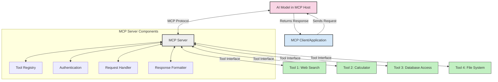
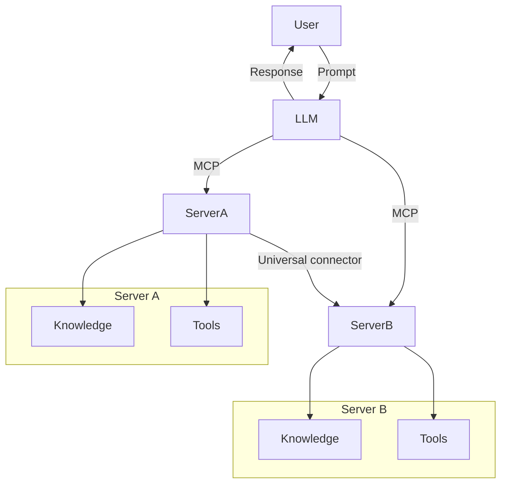

<!--
CO_OP_TRANSLATOR_METADATA:
{
  "original_hash": "02301140adbd807ecf0f17720fa307bc",
  "translation_date": "2025-05-17T06:01:57+00:00",
  "source_file": "00-Introduction/README.md",
  "language_code": "sv"
}
-->
# Introduktion till Model Context Protocol (MCP): Varför det är viktigt för skalbara AI-applikationer

Generativa AI-applikationer är ett stort framsteg eftersom de ofta låter användaren interagera med appen med hjälp av naturliga språk. Men när mer tid och resurser investeras i sådana appar vill du se till att du enkelt kan integrera funktioner och resurser på ett sätt som gör det enkelt att utöka, att din app kan hantera mer än en modell som används, och dess komplexitet. Kort sagt, det är enkelt att börja bygga Gen AI-appar, men när de växer och blir mer komplexa behöver du börja definiera en arkitektur och troligtvis kommer du att behöva förlita dig på en standard för att se till att dina appar byggs på ett konsekvent sätt. Det är här MCP kommer in för att organisera saker och ting, för att tillhandahålla en standard.

---

## **🔍 Vad är Model Context Protocol (MCP)?**

**Model Context Protocol (MCP)** är ett **öppet, standardiserat gränssnitt** som gör det möjligt för stora språkmodeller (LLMs) att interagera sömlöst med externa verktyg, API:er och datakällor. Det ger en konsekvent arkitektur för att förbättra AI-modellernas funktionalitet bortom deras träningsdata, vilket möjliggör smartare, skalbara och mer responsiva AI-system.

---

## **🎯 Varför standardisering inom AI är viktigt**

När generativa AI-applikationer blir mer komplexa är det viktigt att anta standarder som säkerställer **skalbarhet, utbyggbarhet** och **underhållbarhet**. MCP adresserar dessa behov genom att:

- Enhetliggöra modell-verktygsintegrationer
- Minska bräckliga, engångsanpassade lösningar
- Tillåta flera modeller att samexistera inom ett ekosystem

---

## **📚 Inlärningsmål**

I slutet av denna artikel kommer du att kunna:

- Definiera **Model Context Protocol (MCP)** och dess användningsområden
- Förstå hur MCP standardiserar kommunikation mellan modell och verktyg
- Identifiera kärnkomponenterna i MCP-arkitekturen
- Utforska verkliga tillämpningar av MCP inom företags- och utvecklingssammanhang

---

## **💡 Varför Model Context Protocol (MCP) är en revolutionerande förändring**

### **🔗 MCP löser fragmentering i AI-interaktioner**

Innan MCP krävde integration av modeller med verktyg:

- Anpassad kod för varje verktyg-modellpar
- Icke-standardiserade API:er för varje leverantör
- Frekventa avbrott på grund av uppdateringar
- Dålig skalbarhet med fler verktyg

### **✅ Fördelar med MCP-standardisering**

| **Fördel**                | **Beskrivning**                                                                 |
|---------------------------|---------------------------------------------------------------------------------|
| Interoperabilitet         | LLMs fungerar sömlöst med verktyg från olika leverantörer                       |
| Konsekvens                | Enhetligt beteende över plattformar och verktyg                                 |
| Återanvändbarhet          | Verktyg byggda en gång kan användas över projekt och system                     |
| Accelererad utveckling    | Minska utvecklingstid genom att använda standardiserade, plug-and-play-gränssnitt |

---

## **🧱 Översikt över MCP-arkitektur på hög nivå**

MCP följer en **klient-server-modell**, där:

- **MCP Hosts** kör AI-modellerna
- **MCP Clients** initierar förfrågningar
- **MCP Servers** tillhandahåller kontext, verktyg och funktioner

### **Nyckelkomponenter:**

- **Resurser** – Statisk eller dynamisk data för modeller  
- **Uppmaningar** – Fördefinierade arbetsflöden för guidad generering  
- **Verktyg** – Utförbara funktioner som sökning, beräkningar  
- **Sampling** – Agentiskt beteende genom rekursiva interaktioner

---

## Hur MCP-servrar fungerar

MCP-servrar fungerar på följande sätt:

- **Förfrågningsflöde**: 
    1. MCP-klienten skickar en förfrågan till AI-modellen som körs i en MCP-värd.
    2. AI-modellen identifierar när den behöver externa verktyg eller data.
    3. Modellen kommunicerar med MCP-servern med hjälp av det standardiserade protokollet.

- **MCP-serverns funktionalitet**:
    - Verktygsregister: Upprätthåller en katalog över tillgängliga verktyg och deras kapaciteter.
    - Autentisering: Verifierar behörigheter för verktygsåtkomst.
    - Förfrågningshanterare: Bearbetar inkommande verktygsförfrågningar från modellen.
    - Svarsformatterare: Strukturerar verktygsutdata i ett format som modellen kan förstå.

- **Verktygsutförande**: 
    - Servern dirigerar förfrågningar till lämpliga externa verktyg
    - Verktyg utför sina specialiserade funktioner (sökning, beräkning, databasfrågor, etc.)
    - Resultat returneras till modellen i ett konsekvent format.

- **Svarskomplettering**: 
    - AI-modellen integrerar verktygsutdata i sitt svar.
    - Det slutliga svaret skickas tillbaka till klientapplikationen.

## 👨‍💻 Hur man bygger en MCP-server (med exempel)

MCP-servrar gör det möjligt att utöka LLM-funktioner genom att tillhandahålla data och funktionalitet.

Redo att prova? Här är exempel på hur man skapar en enkel MCP-server i olika språk:

- **Python-exempel**: https://github.com/modelcontextprotocol/python-sdk

- **TypeScript-exempel**: https://github.com/modelcontextprotocol/typescript-sdk

- **Java-exempel**: https://github.com/modelcontextprotocol/java-sdk

- **C#/.NET-exempel**: https://github.com/modelcontextprotocol/csharp-sdk

## 🌍 Verkliga användningsfall för MCP

MCP möjliggör ett brett utbud av applikationer genom att utöka AI-funktioner:

| **Applikation**               | **Beskrivning**                                                                |
|-------------------------------|--------------------------------------------------------------------------------|
| Företagsdataintegration       | Anslut LLMs till databaser, CRM-system eller interna verktyg                   |
| Agentiska AI-system           | Möjliggör autonoma agenter med verktygsåtkomst och beslutsfattande arbetsflöden |
| Multimodala applikationer     | Kombinera text-, bild- och ljudverktyg inom en enda enhetlig AI-app            |
| Realtidsdataintegration       | Ta med live-data i AI-interaktioner för mer exakta, aktuella utdata            |

### 🧠 MCP = Universell standard för AI-interaktioner

Model Context Protocol (MCP) fungerar som en universell standard för AI-interaktioner, precis som USB-C standardiserade fysiska anslutningar för enheter. I AI-världen tillhandahåller MCP ett konsekvent gränssnitt, vilket möjliggör för modeller (klienter) att integrera sömlöst med externa verktyg och dataleverantörer (servrar). Detta eliminerar behovet av olika, anpassade protokoll för varje API eller datakälla.

Under MCP följer ett MCP-kompatibelt verktyg (kallat en MCP-server) en enhetlig standard. Dessa servrar kan lista de verktyg eller åtgärder de erbjuder och utföra dessa åtgärder när de begärs av en AI-agent. AI-agentplattformar som stödjer MCP är kapabla att upptäcka tillgängliga verktyg från servrarna och anropa dem genom detta standardprotokoll.

### 💡 Underlättar tillgång till kunskap

Förutom att erbjuda verktyg underlättar MCP också tillgång till kunskap. Det gör det möjligt för applikationer att ge kontext till stora språkmodeller (LLMs) genom att länka dem till olika datakällor. Till exempel kan en MCP-server representera ett företags dokumentarkiv och tillåta agenter att hämta relevant information vid behov. En annan server kan hantera specifika åtgärder som att skicka e-post eller uppdatera register. Ur agentens perspektiv är dessa helt enkelt verktyg den kan använda – vissa verktyg returnerar data (kunskapskontext), medan andra utför åtgärder. MCP hanterar båda effektivt.

En agent som ansluter till en MCP-server lär sig automatiskt serverns tillgängliga kapaciteter och tillgängliga data genom ett standardformat. Denna standardisering möjliggör dynamisk verktygstillgänglighet. Till exempel, genom att lägga till en ny MCP-server i agentens system blir dess funktioner omedelbart användbara utan att ytterligare anpassning av agentens instruktioner krävs.

Denna strömlinjeformade integration överensstämmer med flödet som visas i mermaid-diagrammet, där servrar tillhandahåller både verktyg och kunskap, vilket säkerställer sömlöst samarbete över system.

### 👉 Exempel: Skalbar agentlösning

## 🔐 Praktiska fördelar med MCP

Här är några praktiska fördelar med att använda MCP:

- **Färskhet**: Modeller kan få tillgång till aktuell information bortom deras träningsdata
- **Kapacitetsutvidgning**: Modeller kan utnyttja specialiserade verktyg för uppgifter de inte tränats för
- **Minskade hallucinationer**: Externa datakällor ger faktagrundning
- **Sekretess**: Känslig data kan stanna inom säkra miljöer istället för att bli inbäddad i uppmaningar

## 📌 Viktiga punkter

Följande är viktiga punkter för att använda MCP:

- **MCP** standardiserar hur AI-modeller interagerar med verktyg och data
- Främjar **utbyggbarhet, konsekvens och interoperabilitet**
- MCP hjälper till att **minska utvecklingstid, förbättra tillförlitlighet och utöka modellens kapaciteter**
- Klient-server-arkitekturen **möjliggör flexibla, utbyggbara AI-applikationer**

## 🧠 Övning

Tänk på en AI-applikation du är intresserad av att bygga.

- Vilka **externa verktyg eller data** skulle kunna förbättra dess kapaciteter?
- Hur skulle MCP kunna göra integrationen **enklare och mer pålitlig?**

## Ytterligare resurser

- [MCP GitHub Repository](https://github.com/modelcontextprotocol)

## Vad händer härnäst

Nästa: [Kapitel 1: Kärnkoncept](/01-CoreConcepts/README.md)

**Ansvarsfriskrivning**:  
Detta dokument har översatts med hjälp av AI-översättningstjänsten [Co-op Translator](https://github.com/Azure/co-op-translator). Vi strävar efter noggrannhet, men var medveten om att automatiska översättningar kan innehålla fel eller felaktigheter. Det ursprungliga dokumentet på dess modersmål bör betraktas som den auktoritativa källan. För kritisk information rekommenderas professionell mänsklig översättning. Vi ansvarar inte för eventuella missförstånd eller feltolkningar som uppstår från användningen av denna översättning.