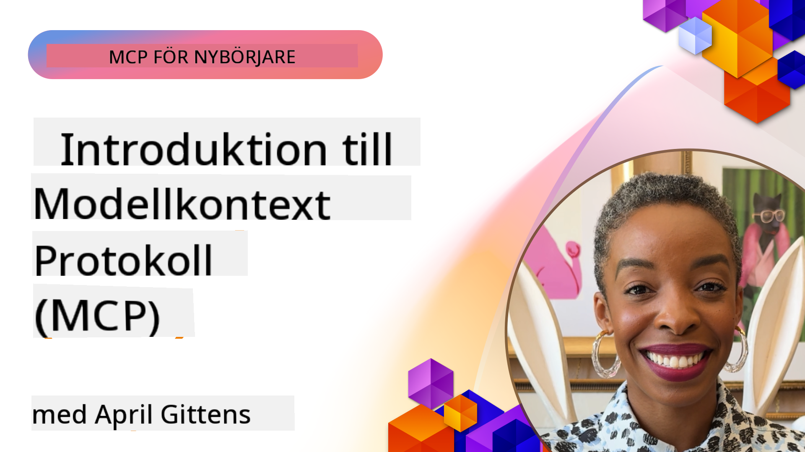
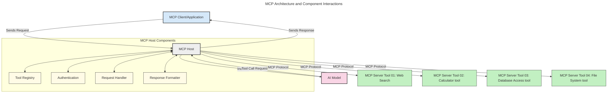
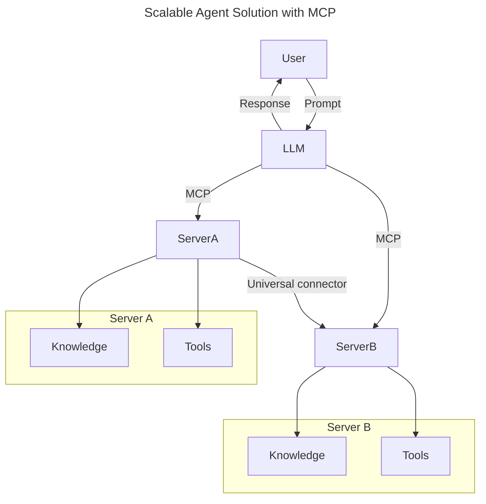
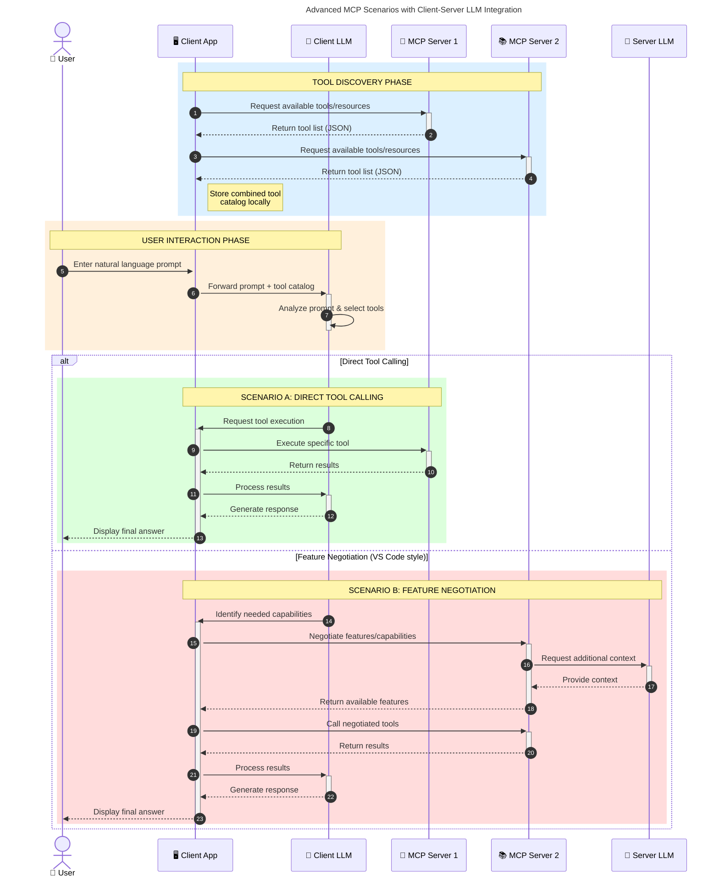

<!--
CO_OP_TRANSLATOR_METADATA:
{
  "original_hash": "0df1ee78a6dd8300f3a040ca5b411c2e",
  "translation_date": "2025-08-18T15:01:59+00:00",
  "source_file": "00-Introduction/README.md",
  "language_code": "sv"
}
-->
# Introduktion till Model Context Protocol (MCP): Varför det är viktigt för skalbara AI-applikationer

_(Klicka på bilden ovan för att se videon till denna lektion)_

Generativa AI-applikationer är ett stort framsteg eftersom de ofta låter användaren interagera med appen via naturliga språkkommandon. Men när mer tid och resurser investeras i sådana appar vill du säkerställa att du enkelt kan integrera funktioner och resurser på ett sätt som gör det enkelt att utöka, att din app kan hantera flera modeller och hantera olika modellkomplexiteter. Kort sagt, att bygga generativa AI-appar är enkelt att börja med, men när de växer och blir mer komplexa behöver du börja definiera en arkitektur och förmodligen förlita dig på en standard för att säkerställa att dina appar byggs på ett konsekvent sätt. Det är här MCP kommer in för att organisera saker och tillhandahålla en standard.

---

## **🔍 Vad är Model Context Protocol (MCP)?**

**Model Context Protocol (MCP)** är ett **öppet, standardiserat gränssnitt** som gör det möjligt för stora språkmodeller (LLMs) att interagera smidigt med externa verktyg, API:er och datakällor. Det erbjuder en konsekvent arkitektur för att förbättra AI-modellens funktionalitet bortom dess träningsdata, vilket möjliggör smartare, skalbara och mer responsiva AI-system.

---

## **🎯 Varför standardisering inom AI är viktigt**

När generativa AI-applikationer blir mer komplexa är det avgörande att anta standarder som säkerställer **skalbarhet, utbyggbarhet, underhållbarhet** och **undvikande av leverantörslåsning**. MCP adresserar dessa behov genom att:

- Enhetliggöra integrationer mellan modeller och verktyg
- Minska sköra, skräddarsydda lösningar
- Möjliggöra att flera modeller från olika leverantörer kan samexistera inom ett ekosystem

**Notera:** Även om MCP marknadsför sig som en öppen standard finns det inga planer på att standardisera MCP genom befintliga standardiseringsorgan som IEEE, IETF, W3C, ISO eller andra.

---

## **📚 Lärandemål**

Efter att ha läst denna artikel kommer du att kunna:

- Definiera **Model Context Protocol (MCP)** och dess användningsområden
- Förstå hur MCP standardiserar kommunikation mellan modeller och verktyg
- Identifiera de centrala komponenterna i MCP-arkitekturen
- Utforska verkliga tillämpningar av MCP inom företag och utvecklingssammanhang

---

## **💡 Varför Model Context Protocol (MCP) är en spelväxlare**

### **🔗 MCP löser fragmentering i AI-interaktioner**

Innan MCP krävde integrering av modeller med verktyg:

- Skräddarsydd kod för varje verktyg-modellpar
- Icke-standardiserade API:er för varje leverantör
- Frekventa avbrott på grund av uppdateringar
- Dålig skalbarhet med fler verktyg

### **✅ Fördelar med MCP-standardisering**

| **Fördel**                | **Beskrivning**                                                                 |
|---------------------------|---------------------------------------------------------------------------------|
| Interoperabilitet         | LLMs fungerar smidigt med verktyg från olika leverantörer                       |
| Konsekvens                | Enhetligt beteende över plattformar och verktyg                                 |
| Återanvändbarhet          | Verktyg byggda en gång kan användas i flera projekt och system                 |
| Snabbare utveckling       | Minska utvecklingstiden med standardiserade, plug-and-play-gränssnitt          |

---

## **🧱 Översikt över MCP-arkitektur på hög nivå**

MCP följer en **klient-server-modell**, där:

- **MCP Hosts** kör AI-modellerna
- **MCP Clients** initierar förfrågningar
- **MCP Servers** tillhandahåller kontext, verktyg och funktioner

### **Nyckelkomponenter:**

- **Resurser** – Statisk eller dynamisk data för modeller  
- **Prompter** – Fördefinierade arbetsflöden för styrd generering  
- **Verktyg** – Exekverbara funktioner som sökning, beräkningar  
- **Sampling** – Agentiskt beteende via rekursiva interaktioner

---

## Hur MCP-servrar fungerar

MCP-servrar fungerar på följande sätt:

- **Förfrågningsflöde**:
    1. En förfrågan initieras av en slutanvändare eller mjukvara som agerar på deras vägnar.
    2. **MCP Client** skickar förfrågan till en **MCP Host**, som hanterar AI-modellens runtime.
    3. **AI-modellen** tar emot användarens prompt och kan begära åtkomst till externa verktyg eller data via en eller flera verktygsanrop.
    4. **MCP Host**, inte modellen direkt, kommunicerar med lämpliga **MCP Server(s)** via det standardiserade protokollet.
- **MCP Hosts funktionalitet**:
    - **Verktygsregister**: Håller en katalog över tillgängliga verktyg och deras funktioner.
    - **Autentisering**: Verifierar behörigheter för verktygsåtkomst.
    - **Förfrågningshanterare**: Bearbetar inkommande verktygsförfrågningar från modellen.
    - **Svarformatterare**: Strukturerar verktygsutdata i ett format som modellen kan förstå.
- **MCP Server-exekvering**:
    - **MCP Host** dirigerar verktygsanrop till en eller flera **MCP Servers**, som exponerar specialiserade funktioner (t.ex. sökning, beräkningar, databasfrågor).
    - **MCP Servers** utför sina respektive operationer och returnerar resultat till **MCP Host** i ett konsekvent format.
    - **MCP Host** formaterar och vidarebefordrar dessa resultat till **AI-modellen**.
- **Slutförande av svar**:
    - **AI-modellen** integrerar verktygsutdata i ett slutgiltigt svar.
    - **MCP Host** skickar detta svar tillbaka till **MCP Client**, som levererar det till slutanvändaren eller den anropande mjukvaran.

## 👨‍💻 Hur man bygger en MCP-server (med exempel)

MCP-servrar gör det möjligt att utöka LLM-funktioner genom att tillhandahålla data och funktionalitet.

Redo att prova? Här är språk- och/eller stack-specifika SDK:er med exempel på hur man skapar enkla MCP-servrar i olika språk/stacks:

- **Python SDK**: https://github.com/modelcontextprotocol/python-sdk

- **TypeScript SDK**: https://github.com/modelcontextprotocol/typescript-sdk

- **Java SDK**: https://github.com/modelcontextprotocol/java-sdk

- **C#/.NET SDK**: https://github.com/modelcontextprotocol/csharp-sdk

---

## 🌍 Verkliga användningsområden för MCP

MCP möjliggör en mängd olika applikationer genom att utöka AI-funktioner:

| **Applikation**              | **Beskrivning**                                                                |
|------------------------------|--------------------------------------------------------------------------------|
| Företagsdataintegration      | Koppla LLMs till databaser, CRM-system eller interna verktyg                   |
| Agentiska AI-system          | Möjliggör autonoma agenter med verktygsåtkomst och arbetsflöden för beslutsfattande |
| Multimodala applikationer    | Kombinera text-, bild- och ljudverktyg inom en enda enhetlig AI-app            |
| Realtidsdataintegration      | Ta in live-data i AI-interaktioner för mer exakta och aktuella resultat        |

---

### 🧠 MCP = Universell standard för AI-interaktioner

Model Context Protocol (MCP) fungerar som en universell standard för AI-interaktioner, ungefär som USB-C standardiserade fysiska anslutningar för enheter. Inom AI-världen tillhandahåller MCP ett konsekvent gränssnitt som gör det möjligt för modeller (klienter) att integrera smidigt med externa verktyg och dataleverantörer (servrar). Detta eliminerar behovet av olika, skräddarsydda protokoll för varje API eller datakälla.

Under MCP följer ett MCP-kompatibelt verktyg (kallat MCP-server) en enhetlig standard. Dessa servrar kan lista de verktyg eller åtgärder de erbjuder och utföra dessa åtgärder när de begärs av en AI-agent. AI-agentplattformar som stöder MCP kan upptäcka tillgängliga verktyg från servrarna och anropa dem via detta standardprotokoll.

---

### 💡 Underlättar åtkomst till kunskap

Utöver att erbjuda verktyg underlättar MCP också åtkomst till kunskap. Det gör det möjligt för applikationer att ge kontext till stora språkmodeller (LLMs) genom att länka dem till olika datakällor. Till exempel kan en MCP-server representera ett företags dokumentarkiv, vilket gör det möjligt för agenter att hämta relevant information vid behov. En annan server kan hantera specifika åtgärder som att skicka e-post eller uppdatera register. Från agentens perspektiv är dessa helt enkelt verktyg den kan använda—vissa verktyg returnerar data (kunskapskontext), medan andra utför åtgärder. MCP hanterar båda effektivt.

En agent som ansluter till en MCP-server lär sig automatiskt serverns tillgängliga funktioner och åtkomlig data via ett standardformat. Denna standardisering möjliggör dynamisk verktygsåtkomst. Till exempel gör tillägget av en ny MCP-server till en agents system dess funktioner omedelbart användbara utan att kräva ytterligare anpassning av agentens instruktioner.

---

### 👉 Exempel: Skalbar agentlösning

---

### 🔄 Avancerade MCP-scenarier med klientbaserad LLM-integration

Utöver den grundläggande MCP-arkitekturen finns det avancerade scenarier där både klient och server innehåller LLMs, vilket möjliggör mer sofistikerade interaktioner. I följande diagram kan **Client App** vara en IDE med ett antal MCP-verktyg tillgängliga för användning av LLM:

---

## 🔐 Praktiska fördelar med MCP

Här är de praktiska fördelarna med att använda MCP:

- **Aktualitet**: Modeller kan få tillgång till uppdaterad information bortom deras träningsdata
- **Utökad funktionalitet**: Modeller kan använda specialiserade verktyg för uppgifter de inte tränats för
- **Minskade hallucinationer**: Externa datakällor ger faktagrund
- **Integritet**: Känslig data kan förbli inom säkra miljöer istället för att integreras i prompts

---

## 📌 Viktiga insikter

Följande är viktiga insikter för att använda MCP:

- **MCP** standardiserar hur AI-modeller interagerar med verktyg och data
- Främjar **utbyggbarhet, konsekvens och interoperabilitet**
- MCP hjälper till att **minska utvecklingstid, förbättra tillförlitlighet och utöka modellens funktioner**
- Klient-server-arkitekturen **möjliggör flexibla, utbyggbara AI-applikationer**

---

## 🧠 Övning

Tänk på en AI-applikation du är intresserad av att bygga.

- Vilka **externa verktyg eller data** skulle kunna förbättra dess funktioner?
- Hur kan MCP göra integrationen **enklare och mer tillförlitlig?**

---

## Ytterligare resurser

- [MCP GitHub Repository](https://github.com/modelcontextprotocol)

---

## Vad händer härnäst

Nästa: [Kapitel 1: Grundläggande koncept](../01-CoreConcepts/README.md)

**Ansvarsfriskrivning**:  
Detta dokument har översatts med hjälp av AI-översättningstjänsten [Co-op Translator](https://github.com/Azure/co-op-translator). Även om vi strävar efter noggrannhet, bör det noteras att automatiserade översättningar kan innehålla fel eller felaktigheter. Det ursprungliga dokumentet på dess originalspråk bör betraktas som den auktoritativa källan. För kritisk information rekommenderas professionell mänsklig översättning. Vi ansvarar inte för eventuella missförstånd eller feltolkningar som uppstår vid användning av denna översättning.