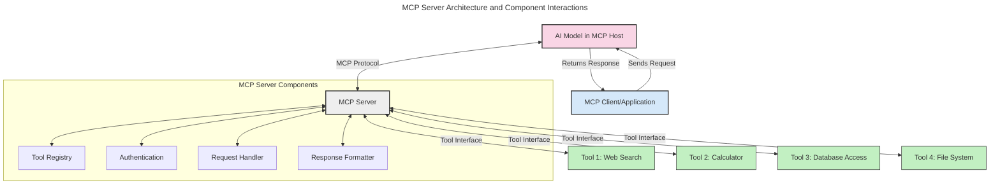
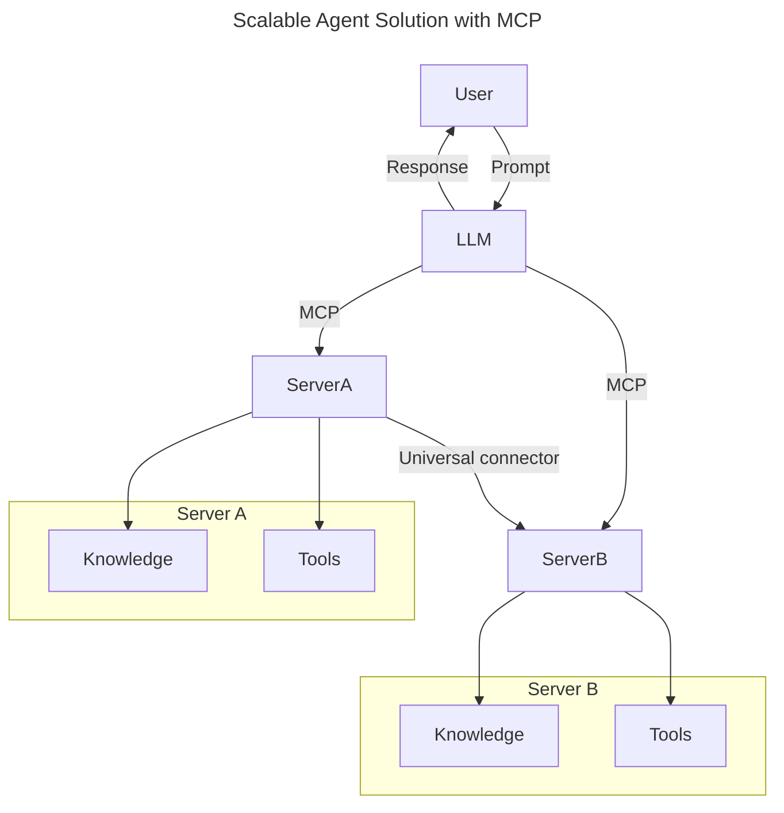
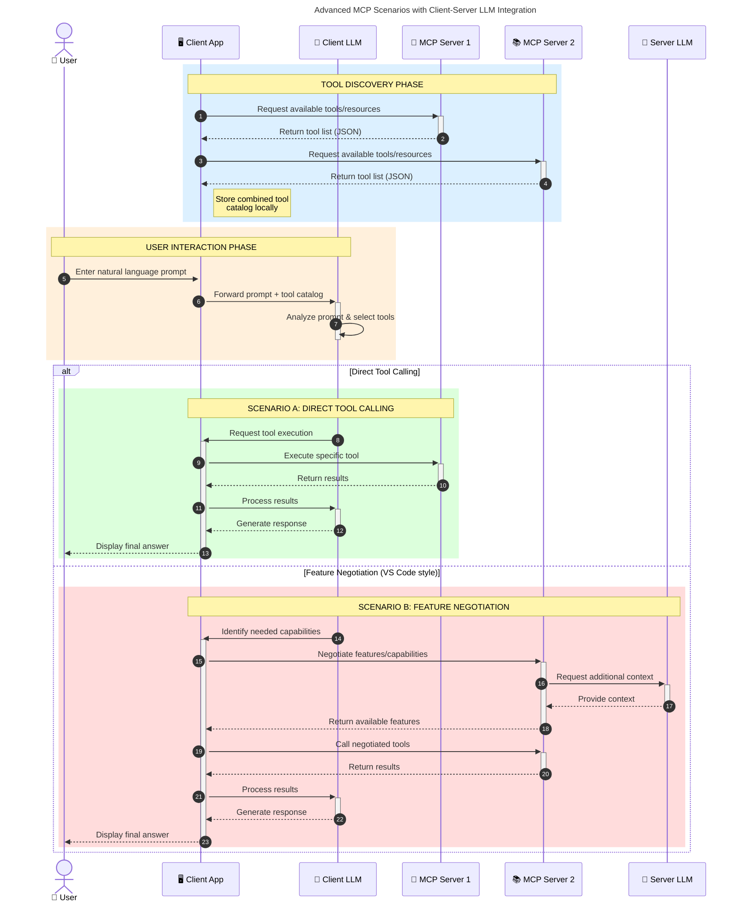

<!--
CO_OP_TRANSLATOR_METADATA:
{
  "original_hash": "1446979020432f512c883848d7eca144",
  "translation_date": "2025-05-29T21:49:07+00:00",
  "source_file": "00-Introduction/README.md",
  "language_code": "sv"
}
-->
# Introduktion till Model Context Protocol (MCP): Varför det är viktigt för skalbara AI-applikationer

Generativa AI-applikationer är ett stort steg framåt eftersom de ofta låter användaren interagera med appen via naturliga språkkommandon. Men när mer tid och resurser investeras i sådana appar vill du försäkra dig om att du enkelt kan integrera funktioner och resurser på ett sätt som gör det lätt att utöka, att din app kan hantera mer än en modell samtidigt och hantera olika modellkomplexiteter. Kort sagt, att bygga Gen AI-appar är enkelt till en början, men när de växer och blir mer komplexa behöver du börja definiera en arkitektur och troligtvis förlita dig på en standard för att säkerställa att dina appar byggs på ett konsekvent sätt. Här kommer MCP in för att organisera och erbjuda en standard.

---

## **🔍 Vad är Model Context Protocol (MCP)?**

**Model Context Protocol (MCP)** är ett **öppet, standardiserat gränssnitt** som tillåter stora språkmodeller (LLMs) att sömlöst interagera med externa verktyg, API:er och datakällor. Det erbjuder en konsekvent arkitektur för att förbättra AI-modellernas funktionalitet utöver deras träningsdata, vilket möjliggör smartare, skalbara och mer responsiva AI-system.

---

## **🎯 Varför standardisering inom AI är viktigt**

När generativa AI-applikationer blir mer komplexa är det avgörande att anta standarder som säkerställer **skalbarhet, utbyggbarhet** och **underhållbarhet**. MCP möter dessa behov genom att:

- Enhetliggöra integrationen mellan modeller och verktyg
- Minska sköra, engångslösningar
- Tillåta flera modeller att samexistera inom ett och samma ekosystem

---

## **📚 Lärandemål**

Efter att ha läst denna artikel kommer du att kunna:

- Definiera **Model Context Protocol (MCP)** och dess användningsområden
- Förstå hur MCP standardiserar kommunikationen mellan modell och verktyg
- Identifiera de centrala komponenterna i MCP-arkitekturen
- Utforska verkliga tillämpningar av MCP i företags- och utvecklingssammanhang

---

## **💡 Varför Model Context Protocol (MCP) är en spelväxlare**

### **🔗 MCP löser fragmenteringen i AI-interaktioner**

Innan MCP krävde integration av modeller med verktyg:

- Anpassad kod för varje verktyg-modell-par
- Icke-standardiserade API:er för varje leverantör
- Frekventa avbrott vid uppdateringar
- Dålig skalbarhet när fler verktyg tillkom

### **✅ Fördelar med MCP-standardisering**

| **Fördel**               | **Beskrivning**                                                                 |
|--------------------------|---------------------------------------------------------------------------------|
| Interoperabilitet        | LLMs fungerar sömlöst med verktyg från olika leverantörer                       |
| Konsistens               | Enhetligt beteende över plattformar och verktyg                                |
| Återanvändbarhet         | Verktyg som byggs en gång kan användas i flera projekt och system              |
| Snabbare utveckling      | Minska utvecklingstid genom standardiserade, plug-and-play-gränssnitt          |

---

## **🧱 Översikt av MCP:s hög-nivåarkitektur**

MCP följer en **klient-server-modell**, där:

- **MCP Hosts** kör AI-modellerna
- **MCP Clients** initierar förfrågningar
- **MCP Servers** tillhandahåller kontext, verktyg och kapabiliteter

### **Nyckelkomponenter:**

- **Resources** – Statisk eller dynamisk data för modeller  
- **Prompts** – Fördefinierade arbetsflöden för styrd generering  
- **Tools** – Exekverbara funktioner som sökning, beräkningar  
- **Sampling** – Agentlikt beteende via rekursiva interaktioner

---

## Hur MCP-servrar fungerar

MCP-servrar fungerar på följande sätt:

- **Förfrågningsflöde**:  
    1. MCP Client skickar en förfrågan till AI-modellen som körs i en MCP Host.  
    2. AI-modellen identifierar när den behöver externa verktyg eller data.  
    3. Modellen kommunicerar med MCP Servern via det standardiserade protokollet.

- **MCP Servers funktionalitet**:  
    - Tool Registry: Underhåller en katalog över tillgängliga verktyg och deras kapabiliteter.  
    - Authentication: Verifierar behörigheter för verktygsåtkomst.  
    - Request Handler: Hanterar inkommande verktygsförfrågningar från modellen.  
    - Response Formatter: Strukturerar verktygsutdata i ett format som modellen kan förstå.

- **Verktygsexekvering**:  
    - Servern vidarebefordrar förfrågningar till rätt externa verktyg  
    - Verktygen utför sina specialiserade funktioner (sökning, beräkning, databasfrågor etc.)  
    - Resultaten returneras till modellen i ett konsekvent format.

- **Svarskomplettering**:  
    - AI-modellen införlivar verktygens resultat i sitt svar.  
    - Det slutgiltiga svaret skickas tillbaka till klientapplikationen.

```mermaid
---
title: MCP Server Architecture and Component Interactions
description: A diagram showing how AI models interact with MCP servers and various tools, depicting the request flow and server components including Tool Registry, Authentication, Request Handler, and Response Formatter
---
graph TD
    A[AI Model in MCP Host] <-->|MCP Protocol| B[MCP Server]
    B <-->|Tool Interface| C[Tool 1: Web Search]
    B <-->|Tool Interface| D[Tool 2: Calculator]
    B <-->|Tool Interface| E[Tool 3: Database Access]
    B <-->|Tool Interface| F[Tool 4: File System]
    
    Client[MCP Client/Application] -->|Sends Request| A
    A -->|Returns Response| Client
    
    subgraph "MCP Server Components"
        B
        G[Tool Registry]
        H[Authentication]
        I[Request Handler]
        J[Response Formatter]
    end
    
    B <--> G
    B <--> H
    B <--> I
    B <--> J
    
    style A fill:#f9d5e5,stroke:#333,stroke-width:2px
    style B fill:#eeeeee,stroke:#333,stroke-width:2px
    style Client fill:#d5e8f9,stroke:#333,stroke-width:2px
    style C fill:#c2f0c2,stroke:#333,stroke-width:1px
    style D fill:#c2f0c2,stroke:#333,stroke-width:1px
    style E fill:#c2f0c2,stroke:#333,stroke-width:1px
    style F fill:#c2f0c2,stroke:#333,stroke-width:1px    
```

## 👨‍💻 Hur man bygger en MCP-server (med exempel)

MCP-servrar låter dig utöka LLM:s kapabiliteter genom att tillhandahålla data och funktionalitet.

Redo att testa? Här är exempel på hur man skapar en enkel MCP-server i olika språk:

- **Python-exempel**: https://github.com/modelcontextprotocol/python-sdk

- **TypeScript-exempel**: https://github.com/modelcontextprotocol/typescript-sdk

- **Java-exempel**: https://github.com/modelcontextprotocol/java-sdk

- **C#/.NET-exempel**: https://github.com/modelcontextprotocol/csharp-sdk

## 🌍 Verkliga användningsområden för MCP

MCP möjliggör en rad olika applikationer genom att utöka AI:s kapabiliteter:

| **Användningsområde**       | **Beskrivning**                                                                 |
|----------------------------|---------------------------------------------------------------------------------|
| Enterprise Data Integration | Koppla LLMs till databaser, CRM-system eller interna verktyg                    |
| Agentic AI Systems          | Möjliggör autonoma agenter med verktygsåtkomst och beslutsflöden               |
| Multi-modala applikationer  | Kombinera text-, bild- och ljudverktyg inom en enda enhetlig AI-app             |
| Realtidsdata-integration    | Ta in live-data i AI-interaktioner för mer precisa och aktuella resultat       |

### 🧠 MCP = Universell standard för AI-interaktioner

Model Context Protocol (MCP) fungerar som en universell standard för AI-interaktioner, ungefär som USB-C standardiserade fysiska anslutningar för enheter. Inom AI-världen erbjuder MCP ett konsekvent gränssnitt som låter modeller (klienter) integreras sömlöst med externa verktyg och dataleverantörer (servrar). Detta eliminerar behovet av olika, skräddarsydda protokoll för varje API eller datakälla.

Under MCP följer ett MCP-kompatibelt verktyg (kallat MCP-server) en enhetlig standard. Dessa servrar kan lista de verktyg eller åtgärder de erbjuder och utföra dessa när en AI-agent begär det. AI-agentplattformar som stödjer MCP kan upptäcka tillgängliga verktyg från servrarna och anropa dem via detta standardprotokoll.

### 💡 Underlättar tillgång till kunskap

Utöver att erbjuda verktyg underlättar MCP också tillgång till kunskap. Det möjliggör för applikationer att ge kontext till stora språkmodeller (LLMs) genom att koppla dem till olika datakällor. Till exempel kan en MCP-server representera ett företags dokumentarkiv och låta agenter hämta relevant information på begäran. En annan server kan hantera specifika åtgärder som att skicka e-post eller uppdatera register. Ur agentens perspektiv är detta bara verktyg den kan använda – vissa verktyg returnerar data (kunskapskontext), medan andra utför handlingar. MCP hanterar båda effektivt.

En agent som kopplar upp sig mot en MCP-server lär sig automatiskt serverns tillgängliga kapabiliteter och åtkomlig data via ett standardiserat format. Denna standardisering möjliggör dynamisk tillgänglighet av verktyg. Till exempel gör tillägget av en ny MCP-server i agentens system dess funktioner omedelbart användbara utan att agentens instruktioner behöver ändras.

Denna smidiga integration stämmer överens med flödet i mermaid-diagrammet, där servrar tillhandahåller både verktyg och kunskap, vilket säkerställer sömlöst samarbete mellan system.

### 👉 Exempel: Skalbar agentlösning

```mermaid
---
title: Scalable Agent Solution with MCP
description: A diagram illustrating how a user interacts with an LLM that connects to multiple MCP servers, with each server providing both knowledge and tools, creating a scalable AI system architecture
---
graph TD
    User -->|Prompt| LLM
    LLM -->|Response| User
    LLM -->|MCP| ServerA
    LLM -->|MCP| ServerB
    ServerA -->|Universal connector| ServerB
    ServerA --> KnowledgeA
    ServerA --> ToolsA
    ServerB --> KnowledgeB
    ServerB --> ToolsB

    subgraph Server A
        KnowledgeA[Knowledge]
        ToolsA[Tools]
    end

    subgraph Server B
        KnowledgeB[Knowledge]
        ToolsB[Tools]
    end
```

### 🔄 Avancerade MCP-scenarier med klientbaserad LLM-integration

Utöver grundläggande MCP-arkitektur finns avancerade scenarier där både klient och server innehåller LLM:er, vilket möjliggör mer sofistikerade interaktioner:

```mermaid
---
title: Advanced MCP Scenarios with Client-Server LLM Integration
description: A sequence diagram showing the detailed interaction flow between user, client application, client LLM, multiple MCP servers, and server LLM, illustrating tool discovery, user interaction, direct tool calling, and feature negotiation phases
---
sequenceDiagram
    autonumber
    actor User as 👤 User
    participant ClientApp as 🖥️ Client App
    participant ClientLLM as 🧠 Client LLM
    participant Server1 as 🔧 MCP Server 1
    participant Server2 as 📚 MCP Server 2
    participant ServerLLM as 🤖 Server LLM
    
    %% Discovery Phase
    rect rgb(220, 240, 255)
        Note over ClientApp, Server2: TOOL DISCOVERY PHASE
        ClientApp->>+Server1: Request available tools/resources
        Server1-->>-ClientApp: Return tool list (JSON)
        ClientApp->>+Server2: Request available tools/resources
        Server2-->>-ClientApp: Return tool list (JSON)
        Note right of ClientApp: Store combined tool<br/>catalog locally
    end
    
    %% User Interaction
    rect rgb(255, 240, 220)
        Note over User, ClientLLM: USER INTERACTION PHASE
        User->>+ClientApp: Enter natural language prompt
        ClientApp->>+ClientLLM: Forward prompt + tool catalog
        ClientLLM->>-ClientLLM: Analyze prompt & select tools
    end
    
    %% Scenario A: Direct Tool Calling
    alt Direct Tool Calling
        rect rgb(220, 255, 220)
            Note over ClientApp, Server1: SCENARIO A: DIRECT TOOL CALLING
            ClientLLM->>+ClientApp: Request tool execution
            ClientApp->>+Server1: Execute specific tool
            Server1-->>-ClientApp: Return results
            ClientApp->>+ClientLLM: Process results
            ClientLLM-->>-ClientApp: Generate response
            ClientApp-->>-User: Display final answer
        end
    
    %% Scenario B: Feature Negotiation (VS Code style)
    else Feature Negotiation (VS Code style)
        rect rgb(255, 220, 220)
            Note over ClientApp, ServerLLM: SCENARIO B: FEATURE NEGOTIATION
            ClientLLM->>+ClientApp: Identify needed capabilities
            ClientApp->>+Server2: Negotiate features/capabilities
            Server2->>+ServerLLM: Request additional context
            ServerLLM-->>-Server2: Provide context
            Server2-->>-ClientApp: Return available features
            ClientApp->>+Server2: Call negotiated tools
            Server2-->>-ClientApp: Return results
            ClientApp->>+ClientLLM: Process results
            ClientLLM-->>-ClientApp: Generate response
            ClientApp-->>-User: Display final answer
        end
    end
```

## 🔐 Praktiska fördelar med MCP

Här är de praktiska fördelarna med att använda MCP:

- **Aktualitet**: Modeller kan nå uppdaterad information utöver sin träningsdata  
- **Utökad kapabilitet**: Modeller kan använda specialiserade verktyg för uppgifter de inte tränats för  
- **Minskade hallucinationer**: Externa datakällor ger faktabaserad grund  
- **Sekretess**: Känslig data kan stanna i säkra miljöer istället för att bäddas in i prompts

## 📌 Viktiga slutsatser

Följande är viktiga punkter att ta med sig om MCP:

- **MCP** standardiserar hur AI-modeller interagerar med verktyg och data  
- Främjar **utbyggbarhet, konsistens och interoperabilitet**  
- MCP hjälper till att **minska utvecklingstid, öka tillförlitlighet och utöka modellernas kapabiliteter**  
- Klient-server-arkitekturen **möjliggör flexibla, utbyggbara AI-applikationer**

## 🧠 Övning

Tänk på en AI-applikation du är intresserad av att bygga.

- Vilka **externa verktyg eller data** skulle kunna förbättra dess kapabiliteter?  
- Hur skulle MCP kunna göra integrationen **enklare och mer pålitlig**?

## Ytterligare resurser

- [MCP GitHub Repository](https://github.com/modelcontextprotocol)

## Vad händer härnäst

Nästa: [Chapter 1: Core Concepts](/01-CoreConcepts/README.md)

**Ansvarsfriskrivning**:  
Detta dokument har översatts med hjälp av AI-översättningstjänsten [Co-op Translator](https://github.com/Azure/co-op-translator). Även om vi strävar efter noggrannhet, vänligen observera att automatiska översättningar kan innehålla fel eller brister. Det ursprungliga dokumentet på dess modersmål bör betraktas som den auktoritativa källan. För kritisk information rekommenderas professionell mänsklig översättning. Vi ansvarar inte för några missförstånd eller feltolkningar som uppstår vid användning av denna översättning.