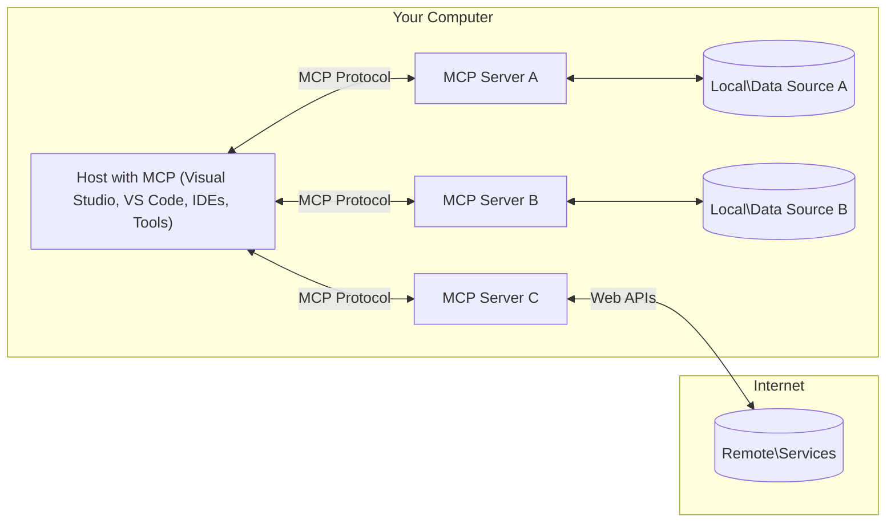

<!--
CO_OP_TRANSLATOR_METADATA:
{
  "original_hash": "0a6a7bcb289c024a91289e0444cb370b",
  "translation_date": "2025-08-18T14:44:05+00:00",
  "source_file": "01-CoreConcepts/README.md",
  "language_code": "sv"
}
-->
# MCP Kärnkoncept: Bemästra Model Context Protocol för AI-integration

[](https://youtu.be/earDzWGtE84)

_(Klicka på bilden ovan för att se videon till denna lektion)_

[Model Context Protocol (MCP)](https://gi- **Explicit User Consent**: All dataåtkomst och operationer kräver uttryckligt användargodkännande innan de utförs. Användare måste tydligt förstå vilken data som kommer att nås och vilka åtgärder som kommer att utföras, med detaljerad kontroll över behörigheter och auktoriseringar.

- **Skydd av Dataintegritet**: Användardata exponeras endast med uttryckligt samtycke och måste skyddas med robusta åtkomstkontroller under hela interaktionslivscykeln. Implementeringar måste förhindra obehörig dataöverföring och upprätthålla strikta integritetsgränser.

- **Säker Verktygsanvändning**: Varje verktygsanrop kräver uttryckligt användargodkännande med en klar förståelse för verktygets funktionalitet, parametrar och potentiell påverkan. Robust säkerhet måste förhindra oavsiktlig, osäker eller skadlig verktygsanvändning.

- **Transportlagersäkerhet**: Alla kommunikationskanaler bör använda lämplig kryptering och autentiseringsmekanismer. Fjärranslutningar bör implementera säkra transportprotokoll och korrekt hantering av autentiseringsuppgifter.

#### Riktlinjer för Implementering:

- **Behörighetshantering**: Implementera detaljerade behörighetssystem som tillåter användare att kontrollera vilka servrar, verktyg och resurser som är tillgängliga.
- **Autentisering & Auktorisering**: Använd säkra autentiseringsmetoder (OAuth, API-nycklar) med korrekt hantering av tokens och utgångsdatum.  
- **Validering av Inmatning**: Validera alla parametrar och datainmatningar enligt definierade scheman för att förhindra injektionsattacker.
- **Revisionsloggning**: Upprätthåll omfattande loggar över alla operationer för säkerhetsövervakning och efterlevnad.

## Översikt

Denna lektion utforskar den grundläggande arkitekturen och komponenterna som utgör Model Context Protocol (MCP)-ekosystemet. Du kommer att lära dig om klient-server-arkitekturen, nyckelkomponenter och kommunikationsmekanismer som driver MCP-interaktioner.

## Viktiga Lärandemål

Efter denna lektion kommer du att:

- Förstå MCP:s klient-server-arkitektur.
- Identifiera roller och ansvar för Hosts, Clients och Servers.
- Analysera kärnfunktionerna som gör MCP till ett flexibelt integrationslager.
- Lära dig hur information flödar inom MCP-ekosystemet.
- Få praktiska insikter genom kodexempel i .NET, Java, Python och JavaScript.

## MCP Arkitektur: En Djupare Inblick

MCP-ekosystemet är byggt på en klient-server-modell. Denna modulära struktur gör det möjligt för AI-applikationer att effektivt interagera med verktyg, databaser, API:er och kontextuella resurser. Låt oss bryta ner denna arkitektur i dess kärnkomponenter.

I grunden följer MCP en klient-server-arkitektur där en värdapplikation kan ansluta till flera servrar:



- **MCP Hosts**: Program som VSCode, Claude Desktop, IDE:er eller AI-verktyg som vill få åtkomst till data via MCP.
- **MCP Clients**: Protokollklienter som upprätthåller 1:1-anslutningar med servrar.
- **MCP Servers**: Lätta program som var och en exponerar specifika funktioner genom det standardiserade Model Context Protocol.
- **Lokala Datakällor**: Din dators filer, databaser och tjänster som MCP-servrar kan säkert komma åt.
- **Fjärrtjänster**: Externa system tillgängliga via internet som MCP-servrar kan ansluta till via API:er.

MCP-protokollet är en utvecklande standard som använder datum-baserad versionering (YYYY-MM-DD-format). Den aktuella protokollversionen är **2025-06-18**. Du kan se de senaste uppdateringarna till [protokollspecifikationen](https://modelcontextprotocol.io/specification/2025-06-18/).

### 1. Hosts

I Model Context Protocol (MCP) är **Hosts** AI-applikationer som fungerar som den primära gränssnittet genom vilket användare interagerar med protokollet. Hosts koordinerar och hanterar anslutningar till flera MCP-servrar genom att skapa dedikerade MCP-klienter för varje serveranslutning. Exempel på Hosts inkluderar:

- **AI-applikationer**: Claude Desktop, Visual Studio Code, Claude Code.
- **Utvecklingsmiljöer**: IDE:er och kodredigerare med MCP-integration.  
- **Anpassade Applikationer**: Specialbyggda AI-agenter och verktyg.

**Hosts** är applikationer som koordinerar AI-modellinteraktioner. De:

- **Orkestrerar AI-modeller**: Utför eller interagerar med LLM:er för att generera svar och koordinera AI-arbetsflöden.
- **Hantera Klientanslutningar**: Skapar och upprätthåller en MCP-klient per MCP-serveranslutning.
- **Kontrollerar Användargränssnitt**: Hanterar konversationsflöde, användarinteraktioner och presentation av svar.  
- **Upprätthåller Säkerhet**: Kontrollerar behörigheter, säkerhetsbegränsningar och autentisering.
- **Hantera Användarsamtycke**: Administrerar användargodkännande för datadelning och verktygsanvändning.

### 2. Clients

**Clients** är viktiga komponenter som upprätthåller dedikerade en-till-en-anslutningar mellan Hosts och MCP-servrar. Varje MCP-klient skapas av Host för att ansluta till en specifik MCP-server, vilket säkerställer organiserade och säkra kommunikationskanaler. Flera klienter gör det möjligt för Hosts att ansluta till flera servrar samtidigt.

**Clients** är anslutningskomponenter inom värdapplikationen. De:

- **Protokollkommunikation**: Skickar JSON-RPC 2.0-förfrågningar till servrar med uppmaningar och instruktioner.
- **Kapacitetsförhandling**: Förhandlar om stöd för funktioner och protokollversioner med servrar under initialisering.
- **Verktygsanvändning**: Hanterar verktygsanvändningsförfrågningar från modeller och bearbetar svar.
- **Uppdateringar i realtid**: Hanterar aviseringar och uppdateringar i realtid från servrar.
- **Svarshantering**: Bearbetar och formaterar serversvar för att visas för användare.

### 3. Servers

**Servers** är program som tillhandahåller kontext, verktyg och funktioner till MCP-klienter. De kan köras lokalt (på samma maskin som Host) eller fjärrstyrt (på externa plattformar) och ansvarar för att hantera klientförfrågningar och tillhandahålla strukturerade svar. Servrar exponerar specifik funktionalitet genom det standardiserade Model Context Protocol.

**Servers** är tjänster som tillhandahåller kontext och funktioner. De:

- **Funktionsregistrering**: Registrerar och exponerar tillgängliga primitiva funktioner (resurser, uppmaningar, verktyg) till klienter.
- **Förfrågningshantering**: Tar emot och utför verktygsanrop, resursförfrågningar och uppmaningsförfrågningar från klienter.
- **Kontexttillhandahållande**: Tillhandahåller kontextuell information och data för att förbättra modellsvar.
- **Tillståndshantering**: Upprätthåller sessionstillstånd och hanterar tillståndsbaserade interaktioner vid behov.
- **Aviseringar i realtid**: Skickar aviseringar om kapacitetsändringar och uppdateringar till anslutna klienter.

Servrar kan utvecklas av vem som helst för att utöka modellens kapaciteter med specialiserad funktionalitet och stödjer både lokala och fjärrbaserade distributionsscenarier.

### 4. Server Primitives

Servrar i Model Context Protocol (MCP) tillhandahåller tre kärn**primitiver** som definierar de grundläggande byggstenarna för rika interaktioner mellan klienter, Hosts och språkmodeller. Dessa primitiva funktioner specificerar typer av kontextuell information och åtgärder som är tillgängliga genom protokollet.

MCP-servrar kan exponera valfri kombination av följande tre kärnprimitiver:

#### Resurser

**Resurser** är datakällor som tillhandahåller kontextuell information till AI-applikationer. De representerar statiskt eller dynamiskt innehåll som kan förbättra modellens förståelse och beslutsfattande:

- **Kontextuell Data**: Strukturerad information och kontext för AI-modellens konsumtion.
- **Kunskapsbaser**: Dokumentarkiv, artiklar, manualer och forskningsrapporter.
- **Lokala Datakällor**: Filer, databaser och lokal systeminformation.  
- **Extern Data**: API-svar, webbtjänster och fjärrsystemdata.
- **Dynamiskt Innehåll**: Realtidsdata som uppdateras baserat på externa förhållanden.

Resurser identifieras med URI:er och stödjer upptäckt via `resources/list` och hämtning via `resources/read`-metoder:

```text
file://documents/project-spec.md
database://production/users/schema
api://weather/current
```

#### Uppmaningar

**Uppmaningar** är återanvändbara mallar som hjälper till att strukturera interaktioner med språkmodeller. De tillhandahåller standardiserade interaktionsmönster och mallade arbetsflöden:

- **Mallbaserade Interaktioner**: Förstrukturerade meddelanden och konversationsstartare.
- **Arbetsflödesmallar**: Standardiserade sekvenser för vanliga uppgifter och interaktioner.
- **Few-shot Exempel**: Exempelbaserade mallar för modellinstruktion.
- **Systemuppmaningar**: Grundläggande uppmaningar som definierar modellens beteende och kontext.
- **Dynamiska Mallar**: Parameteriserade uppmaningar som anpassar sig till specifika kontexter.

Uppmaningar stödjer variabelsubstitution och kan upptäckas via `prompts/list` och hämtas med `prompts/get`:

```markdown
Generate a {{task_type}} for {{product}} targeting {{audience}} with the following requirements: {{requirements}}
```

#### Verktyg

**Verktyg** är exekverbara funktioner som AI-modeller kan anropa för att utföra specifika åtgärder. De representerar "verben" i MCP-ekosystemet och möjliggör att modeller interagerar med externa system:

- **Exekverbara Funktioner**: Diskreta operationer som modeller kan anropa med specifika parametrar.
- **Integration med Externa System**: API-anrop, databasfrågor, filoperationer, beräkningar.
- **Unik Identitet**: Varje verktyg har ett distinkt namn, beskrivning och parameterschema.
- **Strukturerad I/O**: Verktyg accepterar validerade parametrar och returnerar strukturerade, typade svar.
- **Åtgärdskapaciteter**: Möjliggör att modeller utför verkliga åtgärder och hämtar live-data.

Verktyg definieras med JSON Schema för parametervalidering och upptäcks via `tools/list` och exekveras via `tools/call`:

```typescript
server.tool(
  "search_products", 
  {
    query: z.string().describe("Search query for products"),
    category: z.string().optional().describe("Product category filter"),
    max_results: z.number().default(10).describe("Maximum results to return")
  }, 
  async (params) => {
    // Execute search and return structured results
    return await productService.search(params);
  }
);
```

## Klientprimitiver

I Model Context Protocol (MCP) kan **klienter** exponera primitiva funktioner som gör det möjligt för servrar att begära ytterligare kapaciteter från värdapplikationen. Dessa klientbaserade primitiva funktioner möjliggör rikare och mer interaktiva serverimplementeringar som kan få åtkomst till AI-modellens kapaciteter och användarinteraktioner.

### Sampling

**Sampling** gör det möjligt för servrar att begära språkmodellens kompletteringar från klientens AI-applikation. Denna primitiva funktion gör det möjligt för servrar att få åtkomst till LLM-kapaciteter utan att inkludera egna modellberoenden:

- **Modelloberoende Åtkomst**: Servrar kan begära kompletteringar utan att inkludera LLM-SDK:er eller hantera modellåtkomst.
- **Serverinitierad AI**: Möjliggör att servrar autonomt genererar innehåll med hjälp av klientens AI-modell.
- **Rekursiva LLM-interaktioner**: Stödjer komplexa scenarier där servrar behöver AI-assistans för bearbetning.
- **Dynamisk Innehållsgenerering**: Gör det möjligt för servrar att skapa kontextuella svar med hjälp av värdens modell.

Sampling initieras genom `sampling/complete`-metoden, där servrar skickar kompletteringsförfrågningar till klienter.

### Elicitation  

**Elicitation** gör det möjligt för servrar att begära ytterligare information eller bekräftelse från användare via klientgränssnittet:

- **Användarinmatningsförfrågningar**: Servrar kan be om ytterligare information när det behövs för verktygsanvändning.
- **Bekräftelsedialoger**: Begär användargodkännande för känsliga eller betydande operationer.
- **Interaktiva Arbetsflöden**: Möjliggör att servrar skapar steg-för-steg-användarinteraktioner.
- **Dynamisk Parameterinsamling**: Samla in saknade eller valfria parametrar under verktygsanvändning.

Elicitation-förfrågningar görs med `elicitation/request`-metoden för att samla in användarinmatning via klientens gränssnitt.

### Logging

**Logging** gör det möjligt för servrar att skicka strukturerade loggmeddelanden till klienter för felsökning, övervakning och operativ insyn:

- **Felsökningsstöd**: Möjliggör att servrar tillhandahåller detaljerade exekveringsloggar för felsökning.
- **Operativ Övervakning**: Skicka statusuppdateringar och prestandamått till klienter.
- **Felrapportering**: Tillhandahåll detaljerad felkontext och diagnostisk information.
- **Revisionsspår**: Skapa omfattande loggar över serveroperationer och beslut.

Loggmeddelanden skickas till klienter för att ge insyn i serveroperationer och underlätta felsökning.

## Informationsflöde i MCP

Model Context Protocol (MCP) definierar ett strukturerat flöde av information mellan Hosts, Clients, Servers och modeller. Att förstå detta flöde hjälper till att klargöra hur användarförfrågningar bearbetas och hur externa verktyg och data integreras i modellsvar.

- **Host Initierar Anslutning**  
  Värdapplikationen (som en IDE eller chattgränssnitt) etablerar en anslutning till en MCP-server, vanligtvis via STDIO, WebSocket eller annat stödd transport.

- **Kapacitetsförhandling**  
  Klienten (inbäddad i värden) och servern utbyter information om sina stödda funktioner, verktyg, resurser och protokollversioner. Detta säkerställer att båda sidor förstår vilka kapaciteter som är tillgängliga för sessionen.

- **Användarförfrågan**  
  Användaren interagerar med värden (t.ex. skriver in en uppmaning eller kommando). Värden samlar in denna inmatning och skickar den till klienten för bearbetning.

- **Resurs- eller Verktygsanvändning**  
  - Klienten kan begära ytterligare kontext eller resurser från servern (som filer, databasposter eller kunskapsbasartiklar) för att berika modellens förståelse.
  - Om modellen avgör att ett verktyg behövs (t.ex. för att hämta data, utföra en beräkning eller anropa ett API), skickar klienten en verktygsanvändningsförfrågan till servern, med specifikation av verktygsnamn och parametrar.

- **Serverexekvering**  
  Servern tar emot resurs- eller verktygsförfrågan, utför nödvändiga operationer (som att köra en funktion, fråga en databas eller hämta en fil) och returnerar resultaten till klienten i ett strukturerat format.

- **Svarsgenerering**  
  Klienten integrerar serverns svar (resursdata, verktygsutgångar, etc.) i den pågående modellinteraktionen. Modellen använder denna information för att generera ett omfattande och kontextuellt relevant svar.

- **Resultatpresentation**  
  Värden tar emot det slutliga resultatet från klienten och presenterar det för användaren, ofta inklusive både modellens genererade text och eventuella resultat från verktygsanvändningar eller resursuppslag.

Detta flöde gör det möjligt för MCP att stödja avancerade, interaktiva och kontextmedvetna AI-applikationer genom att sömlöst ansluta modeller med externa verktyg och datakällor.

## Protokollarkitektur & Lager

MCP består av två distinkta arkitekturlager som samarbetar för att tillhandahålla en komplett kommunikationsram:

### Datalager

**D
- **Livscykelhantering**: Hanterar anslutningsinitiering, kapacitetsförhandling och sessionsterminering mellan klienter och servrar  
- **Serverprimitiver**: Gör det möjligt för servrar att tillhandahålla kärnfunktionalitet genom verktyg, resurser och uppmaningar  
- **Klientprimitiver**: Gör det möjligt för servrar att begära sampling från LLM:er, hämta användarinmatning och skicka loggmeddelanden  
- **Notifikationer i realtid**: Stödjer asynkrona notifikationer för dynamiska uppdateringar utan polling  

#### Nyckelfunktioner:

- **Protokollversionsförhandling**: Använder datum-baserad versionering (ÅÅÅÅ-MM-DD) för att säkerställa kompatibilitet  
- **Kapacitetsupptäckt**: Klienter och servrar utbyter information om stödda funktioner under initieringen  
- **Tillståndsbaserade sessioner**: Bibehåller anslutningens tillstånd över flera interaktioner för att säkerställa kontextkontinuitet  

### Transportlager

**Transportlagret** hanterar kommunikationskanaler, meddelanderamverk och autentisering mellan MCP-deltagare:

#### Stödda transportmekanismer:

1. **STDIO Transport**:  
   - Använder standard in-/utflöden för direkt processkommunikation  
   - Optimalt för lokala processer på samma maskin utan nätverkskostnad  
   - Vanligt för lokala MCP-serverimplementationer  

2. **Streambar HTTP Transport**:  
   - Använder HTTP POST för meddelanden från klient till server  
   - Valfria Server-Sent Events (SSE) för strömning från server till klient  
   - Möjliggör fjärrserverkommunikation över nätverk  
   - Stödjer standard HTTP-autentisering (bearertokens, API-nycklar, anpassade headers)  
   - MCP rekommenderar OAuth för säker tokenbaserad autentisering  

#### Transportabstraktion:

Transportlagret abstraherar kommunikationsdetaljer från datalagret, vilket möjliggör samma JSON-RPC 2.0-meddelandeformat över alla transportmekanismer. Denna abstraktion gör det möjligt för applikationer att smidigt växla mellan lokala och fjärrservrar.

### Säkerhetsöverväganden

MCP-implementationer måste följa flera kritiska säkerhetsprinciper för att säkerställa säkra, pålitliga och trygga interaktioner över alla protokolloperationer:

- **Användarkontroll och samtycke**: Användare måste ge uttryckligt samtycke innan någon data nås eller operationer utförs. De bör ha tydlig kontroll över vilken data som delas och vilka åtgärder som är godkända, med stöd av intuitiva gränssnitt för att granska och godkänna aktiviteter.  

- **Datasekretess**: Användardata ska endast exponeras med uttryckligt samtycke och måste skyddas med lämpliga åtkomstkontroller. MCP-implementationer måste skydda mot obehörig dataöverföring och säkerställa att sekretess upprätthålls under alla interaktioner.  

- **Verktygssäkerhet**: Innan något verktyg används krävs uttryckligt användarsamtycke. Användare bör ha en klar förståelse för varje verktygs funktionalitet, och robusta säkerhetsgränser måste upprätthållas för att förhindra oavsiktlig eller osäker verktygsanvändning.  

Genom att följa dessa säkerhetsprinciper säkerställer MCP att användarförtroende, sekretess och säkerhet upprätthålls över alla protokollinteraktioner samtidigt som kraftfulla AI-integrationer möjliggörs.

## Kodexempel: Nyckelkomponenter

Nedan finns kodexempel i flera populära programmeringsspråk som illustrerar hur man implementerar nyckelkomponenter och verktyg för MCP-servrar.

### .NET-exempel: Skapa en enkel MCP-server med verktyg

Här är ett praktiskt .NET-kodexempel som visar hur man implementerar en enkel MCP-server med anpassade verktyg. Exemplet visar hur man definierar och registrerar verktyg, hanterar förfrågningar och ansluter servern med Model Context Protocol.

```csharp
using System;
using System.Threading.Tasks;
using ModelContextProtocol.Server;
using ModelContextProtocol.Server.Transport;
using ModelContextProtocol.Server.Tools;

public class WeatherServer
{
    public static async Task Main(string[] args)
    {
        // Create an MCP server
        var server = new McpServer(
            name: "Weather MCP Server",
            version: "1.0.0"
        );
        
        // Register our custom weather tool
        server.AddTool<string, WeatherData>("weatherTool", 
            description: "Gets current weather for a location",
            execute: async (location) => {
                // Call weather API (simplified)
                var weatherData = await GetWeatherDataAsync(location);
                return weatherData;
            });
        
        // Connect the server using stdio transport
        var transport = new StdioServerTransport();
        await server.ConnectAsync(transport);
        
        Console.WriteLine("Weather MCP Server started");
        
        // Keep the server running until process is terminated
        await Task.Delay(-1);
    }
    
    private static async Task<WeatherData> GetWeatherDataAsync(string location)
    {
        // This would normally call a weather API
        // Simplified for demonstration
        await Task.Delay(100); // Simulate API call
        return new WeatherData { 
            Temperature = 72.5,
            Conditions = "Sunny",
            Location = location
        };
    }
}

public class WeatherData
{
    public double Temperature { get; set; }
    public string Conditions { get; set; }
    public string Location { get; set; }
}
```

### Java-exempel: MCP-serverkomponenter

Detta exempel demonstrerar samma MCP-server och verktygsregistrering som .NET-exemplet ovan, men implementerat i Java.

```java
import io.modelcontextprotocol.server.McpServer;
import io.modelcontextprotocol.server.McpToolDefinition;
import io.modelcontextprotocol.server.transport.StdioServerTransport;
import io.modelcontextprotocol.server.tool.ToolExecutionContext;
import io.modelcontextprotocol.server.tool.ToolResponse;

public class WeatherMcpServer {
    public static void main(String[] args) throws Exception {
        // Create an MCP server
        McpServer server = McpServer.builder()
            .name("Weather MCP Server")
            .version("1.0.0")
            .build();
            
        // Register a weather tool
        server.registerTool(McpToolDefinition.builder("weatherTool")
            .description("Gets current weather for a location")
            .parameter("location", String.class)
            .execute((ToolExecutionContext ctx) -> {
                String location = ctx.getParameter("location", String.class);
                
                // Get weather data (simplified)
                WeatherData data = getWeatherData(location);
                
                // Return formatted response
                return ToolResponse.content(
                    String.format("Temperature: %.1f°F, Conditions: %s, Location: %s", 
                    data.getTemperature(), 
                    data.getConditions(), 
                    data.getLocation())
                );
            })
            .build());
        
        // Connect the server using stdio transport
        try (StdioServerTransport transport = new StdioServerTransport()) {
            server.connect(transport);
            System.out.println("Weather MCP Server started");
            // Keep server running until process is terminated
            Thread.currentThread().join();
        }
    }
    
    private static WeatherData getWeatherData(String location) {
        // Implementation would call a weather API
        // Simplified for example purposes
        return new WeatherData(72.5, "Sunny", location);
    }
}

class WeatherData {
    private double temperature;
    private String conditions;
    private String location;
    
    public WeatherData(double temperature, String conditions, String location) {
        this.temperature = temperature;
        this.conditions = conditions;
        this.location = location;
    }
    
    public double getTemperature() {
        return temperature;
    }
    
    public String getConditions() {
        return conditions;
    }
    
    public String getLocation() {
        return location;
    }
}
```

### Python-exempel: Bygga en MCP-server

I detta exempel visar vi hur man bygger en MCP-server i Python. Du får också se två olika sätt att skapa verktyg.

```python
#!/usr/bin/env python3
import asyncio
from mcp.server.fastmcp import FastMCP
from mcp.server.transports.stdio import serve_stdio

# Create a FastMCP server
mcp = FastMCP(
    name="Weather MCP Server",
    version="1.0.0"
)

@mcp.tool()
def get_weather(location: str) -> dict:
    """Gets current weather for a location."""
    # This would normally call a weather API
    # Simplified for demonstration
    return {
        "temperature": 72.5,
        "conditions": "Sunny",
        "location": location
    }

# Alternative approach using a class
class WeatherTools:
    @mcp.tool()
    def forecast(self, location: str, days: int = 1) -> dict:
        """Gets weather forecast for a location for the specified number of days."""
        # This would normally call a weather API forecast endpoint
        # Simplified for demonstration
        return {
            "location": location,
            "forecast": [
                {"day": i+1, "temperature": 70 + i, "conditions": "Partly Cloudy"}
                for i in range(days)
            ]
        }

# Instantiate the class to register its tools
weather_tools = WeatherTools()

# Start the server using stdio transport
if __name__ == "__main__":
    asyncio.run(serve_stdio(mcp))
```

### JavaScript-exempel: Skapa en MCP-server

Detta exempel visar hur man skapar en MCP-server i JavaScript och hur man registrerar två väderrelaterade verktyg.

```javascript
// Using the official Model Context Protocol SDK
import { McpServer } from "@modelcontextprotocol/sdk/server/mcp.js";
import { StdioServerTransport } from "@modelcontextprotocol/sdk/server/stdio.js";
import { z } from "zod"; // For parameter validation

// Create an MCP server
const server = new McpServer({
  name: "Weather MCP Server",
  version: "1.0.0"
});

// Define a weather tool
server.tool(
  "weatherTool",
  {
    location: z.string().describe("The location to get weather for")
  },
  async ({ location }) => {
    // This would normally call a weather API
    // Simplified for demonstration
    const weatherData = await getWeatherData(location);
    
    return {
      content: [
        { 
          type: "text", 
          text: `Temperature: ${weatherData.temperature}°F, Conditions: ${weatherData.conditions}, Location: ${weatherData.location}` 
        }
      ]
    };
  }
);

// Define a forecast tool
server.tool(
  "forecastTool",
  {
    location: z.string(),
    days: z.number().default(3).describe("Number of days for forecast")
  },
  async ({ location, days }) => {
    // This would normally call a weather API
    // Simplified for demonstration
    const forecast = await getForecastData(location, days);
    
    return {
      content: [
        { 
          type: "text", 
          text: `${days}-day forecast for ${location}: ${JSON.stringify(forecast)}` 
        }
      ]
    };
  }
);

// Helper functions
async function getWeatherData(location) {
  // Simulate API call
  return {
    temperature: 72.5,
    conditions: "Sunny",
    location: location
  };
}

async function getForecastData(location, days) {
  // Simulate API call
  return Array.from({ length: days }, (_, i) => ({
    day: i + 1,
    temperature: 70 + Math.floor(Math.random() * 10),
    conditions: i % 2 === 0 ? "Sunny" : "Partly Cloudy"
  }));
}

// Connect the server using stdio transport
const transport = new StdioServerTransport();
server.connect(transport).catch(console.error);

console.log("Weather MCP Server started");
```

Detta JavaScript-exempel demonstrerar hur man skapar en MCP-klient som ansluter till en server, skickar en uppmaning och bearbetar svaret inklusive eventuella verktygsanrop som gjorts.

## Säkerhet och auktorisering

MCP inkluderar flera inbyggda koncept och mekanismer för att hantera säkerhet och auktorisering genom hela protokollet:

1. **Verktygsbehörighetskontroll**:  
   Klienter kan specificera vilka verktyg en modell får använda under en session. Detta säkerställer att endast uttryckligen auktoriserade verktyg är tillgängliga, vilket minskar risken för oavsiktliga eller osäkra operationer. Behörigheter kan konfigureras dynamiskt baserat på användarpreferenser, organisationspolicyer eller interaktionens kontext.  

2. **Autentisering**:  
   Servrar kan kräva autentisering innan åtkomst till verktyg, resurser eller känsliga operationer beviljas. Detta kan innefatta API-nycklar, OAuth-tokens eller andra autentiseringsmetoder. Korrekt autentisering säkerställer att endast betrodda klienter och användare kan använda serverfunktioner.  

3. **Validering**:  
   Parametervalidering tillämpas för alla verktygsanrop. Varje verktyg definierar de förväntade typerna, formaten och begränsningarna för sina parametrar, och servern validerar inkommande förfrågningar därefter. Detta förhindrar felaktig eller skadlig inmatning från att nå verktygsimplementationer och hjälper till att upprätthålla operationernas integritet.  

4. **Hastighetsbegränsning**:  
   För att förhindra missbruk och säkerställa rättvis användning av serverresurser kan MCP-servrar implementera hastighetsbegränsning för verktygsanrop och resursåtkomst. Hastighetsbegränsningar kan tillämpas per användare, per session eller globalt, och hjälper till att skydda mot överbelastningsattacker eller överdriven resursförbrukning.  

Genom att kombinera dessa mekanismer erbjuder MCP en säker grund för att integrera språkmodeller med externa verktyg och datakällor, samtidigt som användare och utvecklare får detaljerad kontroll över åtkomst och användning.

## Protokollmeddelanden och kommunikationsflöde

MCP-kommunikation använder strukturerade **JSON-RPC 2.0**-meddelanden för att underlätta tydliga och pålitliga interaktioner mellan värdar, klienter och servrar. Protokollet definierar specifika meddelandemönster för olika typer av operationer:

### Kärnmeddelandetyper:

#### **Initieringsmeddelanden**  
- **`initialize` Request**: Etablerar anslutning och förhandlar protokollversion och kapaciteter  
- **`initialize` Response**: Bekräftar stödda funktioner och serverinformation  
- **`notifications/initialized`**: Signaliserar att initieringen är klar och sessionen är redo  

#### **Upptäcktsmeddelanden**  
- **`tools/list` Request**: Upptäcker tillgängliga verktyg från servern  
- **`resources/list` Request**: Listar tillgängliga resurser (datakällor)  
- **`prompts/list` Request**: Hämtar tillgängliga uppmaningsmallar  

#### **Exekveringsmeddelanden**  
- **`tools/call` Request**: Utför ett specifikt verktyg med angivna parametrar  
- **`resources/read` Request**: Hämtar innehåll från en specifik resurs  
- **`prompts/get` Request**: Hämtar en uppmaningsmall med valfria parametrar  

#### **Klientmeddelanden**  
- **`sampling/complete` Request**: Servern begär LLM-slutförande från klienten  
- **`elicitation/request`**: Servern begär användarinmatning via klientgränssnittet  
- **Loggningsmeddelanden**: Servern skickar strukturerade loggmeddelanden till klienten  

#### **Notifikationsmeddelanden**  
- **`notifications/tools/list_changed`**: Servern notifierar klienten om verktygsändringar  
- **`notifications/resources/list_changed`**: Servern notifierar klienten om resursändringar  
- **`notifications/prompts/list_changed`**: Servern notifierar klienten om uppmaningsändringar  

### Meddelandestruktur:

Alla MCP-meddelanden följer JSON-RPC 2.0-format med:  
- **Förfrågningsmeddelanden**: Innehåller `id`, `method` och valfria `params`  
- **Svarmeddelanden**: Innehåller `id` och antingen `result` eller `error`  
- **Notifikationsmeddelanden**: Innehåller `method` och valfria `params` (ingen `id` eller svar förväntas)  

Denna strukturerade kommunikation säkerställer pålitliga, spårbara och utbyggbara interaktioner som stödjer avancerade scenarier som realtidsuppdateringar, verktygskedjor och robust felhantering.

## Viktiga insikter

- **Arkitektur**: MCP använder en klient-server-arkitektur där värdar hanterar flera klientanslutningar till servrar  
- **Deltagare**: Ekosystemet inkluderar värdar (AI-applikationer), klienter (protokollanslutningar) och servrar (kapacitetsleverantörer)  
- **Transportmekanismer**: Kommunikation stödjer STDIO (lokalt) och Streambar HTTP med valfri SSE (fjärr)  
- **Kärnprimitiver**: Servrar exponerar verktyg (exekverbara funktioner), resurser (datakällor) och uppmaningar (mallar)  
- **Klientprimitiver**: Servrar kan begära sampling (LLM-slutföranden), elicitation (användarinmatning) och loggning från klienter  
- **Protokollgrund**: Byggt på JSON-RPC 2.0 med datum-baserad versionering (nuvarande: 2025-06-18)  
- **Realtidsfunktioner**: Stödjer notifikationer för dynamiska uppdateringar och realtidssynkronisering  
- **Säkerhet först**: Uttryckligt användarsamtycke, skydd av datasekretess och säker transport är kärnkrav  

## Övning

Designa ett enkelt MCP-verktyg som skulle vara användbart inom ditt område. Definiera:  
1. Vad verktyget skulle heta  
2. Vilka parametrar det skulle acceptera  
3. Vilken output det skulle returnera  
4. Hur en modell skulle kunna använda detta verktyg för att lösa användarproblem  

---

## Vad händer härnäst

Nästa: [Kapitel 2: Säkerhet](../02-Security/README.md)  

**Ansvarsfriskrivning**:  
Detta dokument har översatts med hjälp av AI-översättningstjänsten [Co-op Translator](https://github.com/Azure/co-op-translator). Även om vi strävar efter noggrannhet, vänligen notera att automatiska översättningar kan innehålla fel eller felaktigheter. Det ursprungliga dokumentet på dess originalspråk bör betraktas som den auktoritativa källan. För kritisk information rekommenderas professionell mänsklig översättning. Vi ansvarar inte för eventuella missförstånd eller feltolkningar som uppstår vid användning av denna översättning.