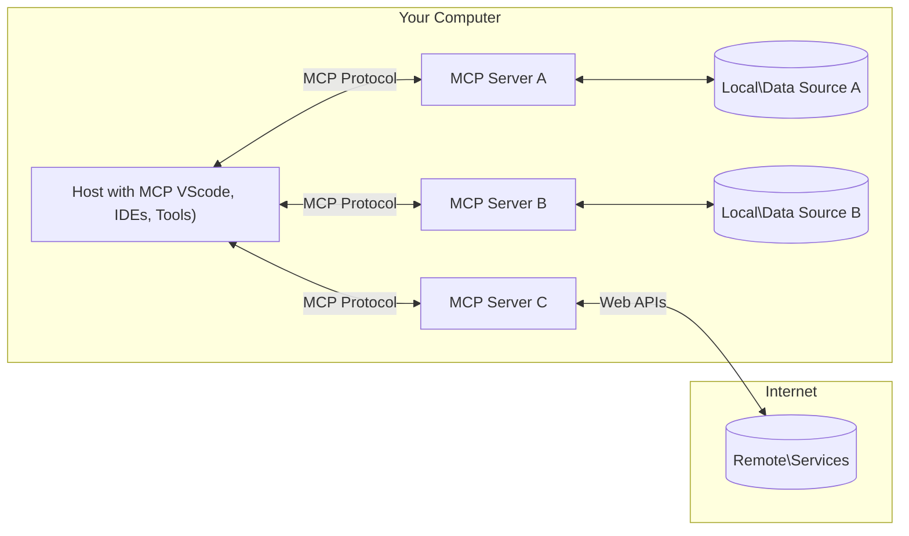

<!--
CO_OP_TRANSLATOR_METADATA:
{
  "original_hash": "b3b4a6ad10c3c0edbf7fa7cfa0ec496b",
  "translation_date": "2025-07-02T07:16:58+00:00",
  "source_file": "01-CoreConcepts/README.md",
  "language_code": "sv"
}
-->
# 📖 MCP Core Concepts: Bemästra Model Context Protocol för AI-integration

[Model Context Protocol (MCP)](https://github.com/modelcontextprotocol) är ett kraftfullt, standardiserat ramverk som optimerar kommunikationen mellan stora språkmodeller (LLMs) och externa verktyg, applikationer och datakällor. Denna SEO-optimerade guide tar dig igenom MCP:s kärnkoncept, så att du förstår dess klient-server-arkitektur, viktiga komponenter, kommunikationsmekanik och bästa implementeringspraxis.

## Översikt

Denna lektion utforskar den grundläggande arkitekturen och komponenterna som utgör Model Context Protocol (MCP)-ekosystemet. Du kommer att lära dig om klient-server-arkitekturen, nyckelkomponenterna och kommunikationsmekanismerna som driver MCP-interaktioner.

## 👩‍🎓 Viktiga lärandemål

I slutet av denna lektion kommer du att:

- Förstå MCP:s klient-server-arkitektur.
- Identifiera roller och ansvar för Hosts, Clients och Servers.
- Analysera kärnfunktioner som gör MCP till ett flexibelt integrationslager.
- Lära dig hur information flödar inom MCP-ekosystemet.
- Få praktiska insikter genom kodexempel i .NET, Java, Python och JavaScript.

## 🔎 MCP-arkitektur: En djupare titt

MCP-ekosystemet bygger på en klient-server-modell. Denna modulära struktur tillåter AI-applikationer att effektivt interagera med verktyg, databaser, API:er och kontextuella resurser. Låt oss bryta ner arkitekturen i dess kärnkomponenter.

I grunden följer MCP en klient-server-arkitektur där en värdapplikation kan ansluta till flera servrar:



- **MCP Hosts**: Program som VSCode, Claude Desktop, IDEs eller AI-verktyg som vill få tillgång till data via MCP
- **MCP Clients**: Protokollklienter som upprätthåller 1:1-anslutningar med servrar
- **MCP Servers**: Lättviktiga program som var och en exponerar specifika funktioner via det standardiserade Model Context Protocol
- **Lokala datakällor**: Din dators filer, databaser och tjänster som MCP-servrar kan komma åt på ett säkert sätt
- **Fjärrtjänster**: Externa system tillgängliga via internet som MCP-servrar kan ansluta till via API:er.

MCP-protokollet är en pågående standard. Du kan se de senaste uppdateringarna i [protokollspecificeringen](https://modelcontextprotocol.io/specification/2025-06-18/)

### 1. Hosts

I Model Context Protocol (MCP) spelar Hosts en avgörande roll som den primära gränssnittet genom vilket användare interagerar med protokollet. Hosts är applikationer eller miljöer som initierar anslutningar till MCP-servrar för att få tillgång till data, verktyg och prompts. Exempel på Hosts inkluderar integrerade utvecklingsmiljöer (IDEs) som Visual Studio Code, AI-verktyg som Claude Desktop eller skräddarsydda agenter designade för specifika uppgifter.

**Hosts** är LLM-applikationer som initierar anslutningar. De:

- Kör eller interagerar med AI-modeller för att generera svar.
- Initierar anslutningar till MCP-servrar.
- Hanterar samtalsflödet och användargränssnittet.
- Kontrollerar behörigheter och säkerhetsbegränsningar.
- Hanterar användarens samtycke för datadelning och verktygsexekvering.

### 2. Clients

Clients är viktiga komponenter som underlättar interaktionen mellan Hosts och MCP-servrar. Clients fungerar som mellanhänder och gör det möjligt för Hosts att få tillgång till och använda funktionaliteter som MCP-servrar tillhandahåller. De spelar en avgörande roll för att säkerställa smidig kommunikation och effektiv datautbyte inom MCP-arkitekturen.

**Clients** är kopplingar inom värdapplikationen. De:

- Skickar förfrågningar till servrar med prompts/instruktioner.
- Förhandlar funktioner med servrar.
- Hanterar verktygsexekveringsförfrågningar från modeller.
- Bearbetar och visar svar till användare.

### 3. Servers

Servers ansvarar för att hantera förfrågningar från MCP-klienter och ge lämpliga svar. De hanterar olika operationer som datainhämtning, verktygsexekvering och promptgenerering. Servrar säkerställer att kommunikationen mellan klienter och Hosts är effektiv och pålitlig, samtidigt som de upprätthåller interaktionsprocessens integritet.

**Servers** är tjänster som tillhandahåller kontext och funktioner. De:

- Registrerar tillgängliga funktioner (resurser, prompts, verktyg)
- Tar emot och utför verktygsanrop från klienten
- Ger kontextuell information för att förbättra modellens svar
- Returnerar resultat till klienten
- Behåller tillstånd över interaktioner vid behov

Servrar kan utvecklas av vem som helst för att utöka modellens kapabiliteter med specialiserad funktionalitet.

### 4. Serverfunktioner

Servrar i Model Context Protocol (MCP) tillhandahåller grundläggande byggstenar som möjliggör rika interaktioner mellan klienter, hosts och språkmodeller. Dessa funktioner är utformade för att förbättra MCP:s kapabiliteter genom att erbjuda strukturerad kontext, verktyg och prompts.

MCP-servrar kan erbjuda någon av följande funktioner:

#### 📑 Resurser

Resurser i Model Context Protocol (MCP) omfattar olika typer av kontext och data som kan användas av användare eller AI-modeller. Dessa inkluderar:

- **Kontextuell data**: Information och kontext som användare eller AI-modeller kan använda för beslutsfattande och uppgiftsutförande.
- **Kunskapsbaser och dokumentarkiv**: Samlingar av strukturerad och ostrukturerad data, som artiklar, manualer och forskningspapper, som ger värdefulla insikter och information.
- **Lokala filer och databaser**: Data som lagras lokalt på enheter eller i databaser, tillgängliga för bearbetning och analys.
- **API:er och webbtjänster**: Externa gränssnitt och tjänster som erbjuder ytterligare data och funktioner, vilket möjliggör integration med olika online-resurser och verktyg.

Ett exempel på en resurs kan vara ett databasschema eller en fil som kan nås på följande sätt:

```text
file://log.txt
database://schema
```

### 🤖 Prompts

Prompts i Model Context Protocol (MCP) inkluderar olika fördefinierade mallar och interaktionsmönster som är utformade för att effektivisera användarflöden och förbättra kommunikationen. Dessa inkluderar:

- **Mallade meddelanden och arbetsflöden**: Förstrukturerade meddelanden och processer som guidar användare genom specifika uppgifter och interaktioner.
- **Fördefinierade interaktionsmönster**: Standardiserade sekvenser av åtgärder och svar som underlättar konsekvent och effektiv kommunikation.
- **Specialiserade konversationsmallar**: Anpassningsbara mallar skräddarsydda för specifika typer av konversationer, som säkerställer relevanta och kontextuellt passande interaktioner.

En promptmall kan se ut så här:

```markdown
Generate a product slogan based on the following {{product}} with the following {{keywords}}
```

#### ⛏️ Verktyg

Verktyg i Model Context Protocol (MCP) är funktioner som AI-modellen kan utföra för att genomföra specifika uppgifter. Dessa verktyg är designade för att förbättra AI-modellens kapabiliteter genom att erbjuda strukturerade och pålitliga operationer. Viktiga aspekter inkluderar:

- **Funktioner för AI-modellen att utföra**: Verktyg är exekverbara funktioner som AI-modellen kan anropa för att utföra olika uppgifter.
- **Unikt namn och beskrivning**: Varje verktyg har ett distinkt namn och en detaljerad beskrivning som förklarar dess syfte och funktionalitet.
- **Parametrar och output**: Verktyg tar emot specifika parametrar och returnerar strukturerade resultat, vilket säkerställer konsekventa och förutsägbara utfall.
- **Diskreta funktioner**: Verktyg utför avgränsade funktioner som webbsökningar, beräkningar och databasfrågor.

Ett exempelverktyg kan se ut så här:

```typescript
server.tool(
  "GetProducts",
  {
    pageSize: z.string().optional(),
    pageCount: z.string().optional()
  }, () => {
    // return results from API
  }
)
```

## Klientfunktioner

I Model Context Protocol (MCP) erbjuder klienter flera nyckelfunktioner till servrar, vilket förbättrar den övergripande funktionaliteten och interaktionen inom protokollet. En av de mest anmärkningsvärda funktionerna är Sampling.

### 👉 Sampling

- **Serverinitierade agentliknande beteenden**: Klienter möjliggör för servrar att autonomt initiera specifika åtgärder eller beteenden, vilket förbättrar systemets dynamiska kapabiliteter.
- **Rekursiva LLM-interaktioner**: Denna funktion tillåter rekursiva interaktioner med stora språkmodeller (LLMs), vilket möjliggör mer komplex och iterativ bearbetning av uppgifter.
- **Begäran om ytterligare modellkompletteringar**: Servrar kan begära ytterligare svar från modellen, vilket säkerställer att svaren är grundliga och kontextuellt relevanta.

## Informationsflöde i MCP

Model Context Protocol (MCP) definierar ett strukturerat informationsflöde mellan hosts, clients, servers och modeller. Att förstå detta flöde hjälper till att klargöra hur användarförfrågningar bearbetas och hur externa verktyg och data integreras i modelsvar.

- **Host initierar anslutning**  
  Värdapplikationen (som en IDE eller chattgränssnitt) upprättar en anslutning till en MCP-server, vanligtvis via STDIO, WebSocket eller annan stödjad transport.

- **Funktionförhandling**  
  Klienten (inbäddad i värden) och servern utbyter information om deras stödda funktioner, verktyg, resurser och protokollversioner. Detta säkerställer att båda parter förstår vilka kapabiliteter som finns tillgängliga för sessionen.

- **Användarförfrågan**  
  Användaren interagerar med värden (t.ex. anger en prompt eller ett kommando). Värden samlar in denna input och skickar den till klienten för bearbetning.

- **Användning av resurs eller verktyg**  
  - Klienten kan begära ytterligare kontext eller resurser från servern (som filer, databasinlägg eller artiklar från kunskapsbasen) för att berika modellens förståelse.
  - Om modellen bedömer att ett verktyg behövs (t.ex. för att hämta data, utföra en beräkning eller anropa ett API) skickar klienten en begäran om verktygsanrop till servern, där verktygets namn och parametrar specificeras.

- **Serverexekvering**  
  Servern tar emot resurs- eller verktygsbegäran, utför nödvändiga operationer (som att köra en funktion, fråga en databas eller hämta en fil) och returnerar resultaten till klienten i ett strukturerat format.

- **Svarsgenerering**  
  Klienten integrerar serverns svar (resursdata, verktygsutdata etc.) i den pågående modellinteraktionen. Modellen använder denna information för att generera ett heltäckande och kontextuellt relevant svar.

- **Resultatpresentation**  
  Värden tar emot det slutgiltiga resultatet från klienten och presenterar det för användaren, ofta inklusive både modellens genererade text och eventuella resultat från verktygsexekveringar eller resursuppslagningar.

Detta flöde möjliggör att MCP kan stödja avancerade, interaktiva och kontextmedvetna AI-applikationer genom att sömlöst koppla modeller till externa verktyg och datakällor.

## Protokolldetaljer

MCP (Model Context Protocol) bygger på [JSON-RPC 2.0](https://www.jsonrpc.org/), vilket ger ett standardiserat, språkoberoende meddelandeformat för kommunikation mellan hosts, clients och servers. Denna grund möjliggör pålitliga, strukturerade och utbyggbara interaktioner över olika plattformar och programmeringsspråk.

### Viktiga protokollfunktioner

MCP utökar JSON-RPC 2.0 med ytterligare konventioner för verktygsanrop, resursåtkomst och prompthantering. Det stöder flera transportlager (STDIO, WebSocket, SSE) och möjliggör säker, utbyggbar och språkoberoende kommunikation mellan komponenter.

#### 🧢 Basprotokoll

- **JSON-RPC-meddelandformat**: Alla förfrågningar och svar följer JSON-RPC 2.0-specifikationen, vilket säkerställer konsekvent struktur för metodanrop, parametrar, resultat och felhantering.
- **Stateful Connections**: MCP-sessioner behåller tillstånd över flera förfrågningar, vilket stödjer pågående samtal, kontextuppbyggnad och resursförvaltning.
- **Funktionförhandling**: Under anslutningsuppsättning utbyter klienter och servrar information om stödda funktioner, protokollversioner, tillgängliga verktyg och resurser. Detta säkerställer att båda parter förstår varandras kapabiliteter och kan anpassa sig därefter.

#### ➕ Ytterligare verktyg

Nedan följer några extra verktyg och protokollutvidgningar som MCP erbjuder för att förbättra utvecklarupplevelsen och möjliggöra avancerade scenarier:

- **Konfigurationsalternativ**: MCP tillåter dynamisk konfiguration av sessionsparametrar, såsom verktygsbehörigheter, resursåtkomst och modellinställningar, anpassade för varje interaktion.
- **Progress Tracking**: Långvariga operationer kan rapportera statusuppdateringar, vilket möjliggör responsiva användargränssnitt och bättre användarupplevelse vid komplexa uppgifter.
- **Request Cancellation**: Klienter kan avbryta pågående förfrågningar, vilket låter användare avbryta operationer som inte längre behövs eller tar för lång tid.
- **Felrapportering**: Standardiserade felmeddelanden och koder hjälper till att diagnostisera problem, hantera fel smidigt och ge användbara återkopplingar till användare och utvecklare.
- **Loggning**: Både klienter och servrar kan generera strukturerade loggar för revision, felsökning och övervakning av protokollinteraktioner.

Genom att utnyttja dessa protokollfunktioner säkerställer MCP robust, säker och flexibel kommunikation mellan språkmodeller och externa verktyg eller datakällor.

### 🔐 Säkerhetsaspekter

MCP-implementationer bör följa flera viktiga säkerhetsprinciper för att garantera säkra och pålitliga interaktioner:

- **Användarsamtycke och kontroll**: Användare måste ge uttryckligt samtycke innan någon data nås eller operationer utförs. De bör ha tydlig kontroll över vilken data som delas och vilka åtgärder som godkänns, understödda av intuitiva användargränssnitt för att granska och godkänna aktiviteter.

- **Datasekretess**: Användardata ska endast exponeras med uttryckligt samtycke och måste skyddas av lämpliga åtkomstkontroller. MCP-implementationer måste skydda mot obehörig datatransmission och säkerställa att sekretess upprätthålls under alla interaktioner.

- **Verktygssäkerhet**: Innan ett verktyg anropas krävs uttryckligt användarsamtycke. Användare bör ha en klar förståelse för varje verktygs funktionalitet, och robusta säkerhetsgränser måste upprätthållas för att förhindra oavsiktlig eller osäker verktygsexekvering.

Genom att följa dessa principer säkerställer MCP att användarnas förtroende, integritet och säkerhet upprätthålls i alla protokollinteraktioner.

## Kodexempel: Viktiga komponenter

Nedan finns kodexempel i flera populära programmeringsspråk som illustrerar hur man implementerar viktiga MCP-serverkomponenter och verktyg.

### .NET-exempel: Skapa en enkel MCP-server med verktyg

Här är ett praktiskt .NET-kodexempel som visar hur man implementerar en enkel MCP-server med anpassade verktyg. Detta exempel visar hur man definierar och registrerar verktyg, hanterar förfrågningar och ansluter servern via Model Context Protocol.

```csharp
using System;
using System.Threading.Tasks;
using ModelContextProtocol.Server;
using ModelContextProtocol.Server.Transport;
using ModelContextProtocol.Server.Tools;

public class WeatherServer
{
    public static async Task Main(string[] args)
    {
        // Create an MCP server
        var server = new McpServer(
            name: "Weather MCP Server",
            version: "1.0.0"
        );
        
        // Register our custom weather tool
        server.AddTool<string, WeatherData>("weatherTool", 
            description: "Gets current weather for a location",
            execute: async (location) => {
                // Call weather API (simplified)
                var weatherData = await GetWeatherDataAsync(location);
                return weatherData;
            });
        
        // Connect the server using stdio transport
        var transport = new StdioServerTransport();
        await server.ConnectAsync(transport);
        
        Console.WriteLine("Weather MCP Server started");
        
        // Keep the server running until process is terminated
        await Task.Delay(-1);
    }
    
    private static async Task<WeatherData> GetWeatherDataAsync(string location)
    {
        // This would normally call a weather API
        // Simplified for demonstration
        await Task.Delay(100); // Simulate API call
        return new WeatherData { 
            Temperature = 72.5,
            Conditions = "Sunny",
            Location = location
        };
    }
}

public class WeatherData
{
    public double Temperature { get; set; }
    public string Conditions { get; set; }
    public string Location { get; set; }
}
```

### Java-exempel: MCP-serverkomponenter

Detta exempel visar samma MCP-server och verktygsregistrering som .NET-exemplet ovan, men implementerat i Java.

```java
import io.modelcontextprotocol.server.McpServer;
import io.modelcontextprotocol.server.McpToolDefinition;
import io.modelcontextprotocol.server.transport.StdioServerTransport;
import io.modelcontextprotocol.server.tool.ToolExecutionContext;
import io.modelcontextprotocol.server.tool.ToolResponse;

public class WeatherMcpServer {
    public static void main(String[] args) throws Exception {
        // Create an MCP server
        McpServer server = McpServer.builder()
            .name("Weather MCP Server")
            .version("1.0.0")
            .build();
            
        // Register a weather tool
        server.registerTool(McpToolDefinition.builder("weatherTool")
            .description("Gets current weather for a location")
            .parameter("location", String.class)
            .execute((ToolExecutionContext ctx) -> {
                String location = ctx.getParameter("location", String.class);
                
                // Get weather data (simplified)
                WeatherData data = getWeatherData(location);
                
                // Return formatted response
                return ToolResponse.content(
                    String.format("Temperature: %.1f°F, Conditions: %s, Location: %s", 
                    data.getTemperature(), 
                    data.getConditions(), 
                    data.getLocation())
                );
            })
            .build());
        
        // Connect the server using stdio transport
        try (StdioServerTransport transport = new StdioServerTransport()) {
            server.connect(transport);
            System.out.println("Weather MCP Server started");
            // Keep server running until process is terminated
            Thread.currentThread().join();
        }
    }
    
    private static WeatherData getWeatherData(String location) {
        // Implementation would call a weather API
        // Simplified for example purposes
        return new WeatherData(72.5, "Sunny", location);
    }
}

class WeatherData {
    private double temperature;
    private String conditions;
    private String location;
    
    public WeatherData(double temperature, String conditions, String location) {
        this.temperature = temperature;
        this.conditions = conditions;
        this.location = location;
    }
    
    public double getTemperature() {
        return temperature;
    }
    
    public String getConditions() {
        return conditions;
    }
    
    public String getLocation() {
        return location;
    }
}
```

### Python-exempel: Bygga en MCP-server

I detta exempel visar vi hur man bygger en MCP-server i Python. Du får även se två olika sätt att skapa verktyg.

```python
#!/usr/bin/env python3
import asyncio
from mcp.server.fastmcp import FastMCP
from mcp.server.transports.stdio import serve_stdio

# Create a FastMCP server
mcp = FastMCP(
    name="Weather MCP Server",
    version="1.0.0"
)

@mcp.tool()
def get_weather(location: str) -> dict:
    """Gets current weather for a location."""
    # This would normally call a weather API
    # Simplified for demonstration
    return {
        "temperature": 72.5,
        "conditions": "Sunny",
        "location": location
    }

# Alternative approach using a class
class WeatherTools:
    @mcp.tool()
    def forecast(self, location: str, days: int = 1) -> dict:
        """Gets weather forecast for a location for the specified number of days."""
        # This would normally call a weather API forecast endpoint
        # Simplified for demonstration
        return {
            "location": location,
            "forecast": [
                {"day": i+1, "temperature": 70 + i, "conditions": "Partly Cloudy"}
                for i in range(days)
            ]
        }

# Instantiate the class to register its tools
weather_tools = WeatherTools()

# Start the server using stdio transport
if __name__ == "__main__":
    asyncio.run(serve_stdio(mcp))
```

### JavaScript-exempel: Skapa en MCP-server

Detta exempel visar skapandet av en MCP-server i JavaScript och hur man registrerar två väderrelaterade verktyg.

```javascript
// Using the official Model Context Protocol SDK
import { McpServer } from "@modelcontextprotocol/sdk/server/mcp.js";
import { StdioServerTransport } from "@modelcontextprotocol/sdk/server/stdio.js";
import { z } from "zod"; // For parameter validation

// Create an MCP server
const server = new McpServer({
  name: "Weather MCP Server",
  version: "1.0.0"
});

// Define a weather tool
server.tool(
  "weatherTool",
  {
    location: z.string().describe("The location to get weather for")
  },
  async ({ location }) => {
    // This would normally call a weather API
    // Simplified for demonstration
    const weatherData = await getWeatherData(location);
    
    return {
      content: [
        { 
          type: "text", 
          text: `Temperature: ${weatherData.temperature}°F, Conditions: ${weatherData.conditions}, Location: ${weatherData.location}` 
        }
      ]
    };
  }
);

// Define a forecast tool
server.tool(
  "forecastTool",
  {
    location: z.string(),
    days: z.number().default(3).describe("Number of days for forecast")
  },
  async ({ location, days }) => {
    // This would normally call a weather API
    // Simplified for demonstration
    const forecast = await getForecastData(location, days);
    
    return {
      content: [
        { 
          type: "text", 
          text: `${days}-day forecast for ${location}: ${JSON.stringify(forecast)}` 
        }
      ]
    };
  }
);

// Helper functions
async function getWeatherData(location) {
  // Simulate API call
  return {
    temperature: 72.5,
    conditions: "Sunny",
    location: location
  };
}

async function getForecastData(location, days) {
  // Simulate API call
  return Array.from({ length: days }, (_, i) => ({
    day: i + 1,
    temperature: 70 + Math.floor(Math.random() * 10),
    conditions: i % 2 === 0 ? "Sunny" : "Partly Cloudy"
  }));
}

// Connect the server using stdio transport
const transport = new StdioServerTransport();
server.connect(transport).catch(console.error);

console.log("Weather MCP Server started");
```

Detta JavaScript-exempel visar hur man skapar en MCP-klient som ansluter till en server, skickar en

**Ansvarsfriskrivning**:  
Detta dokument har översatts med hjälp av AI-översättningstjänsten [Co-op Translator](https://github.com/Azure/co-op-translator). Även om vi strävar efter noggrannhet, vänligen observera att automatiska översättningar kan innehålla fel eller brister. Det ursprungliga dokumentet på dess modersmål ska betraktas som den auktoritativa källan. För kritisk information rekommenderas professionell mänsklig översättning. Vi ansvarar inte för några missförstånd eller feltolkningar som uppstår från användningen av denna översättning.