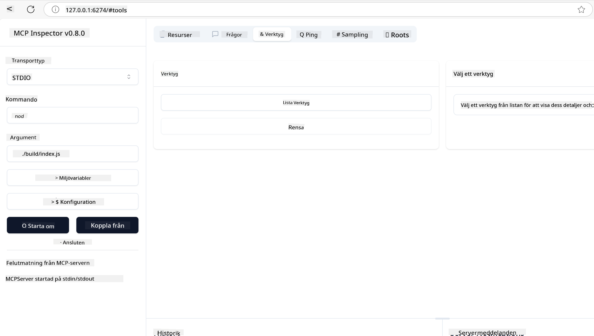
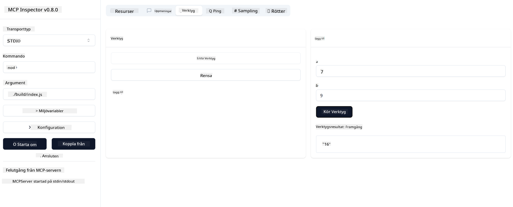

<!--
CO_OP_TRANSLATOR_METADATA:
{
  "original_hash": "262e6e510f0c3fe1e36180eadcd67c33",
  "translation_date": "2025-06-02T17:35:24+00:00",
  "source_file": "03-GettingStarted/01-first-server/README.md",
  "language_code": "sv"
}
-->
### -2- Skapa projekt

Nu när du har installerat SDK:n, låt oss skapa ett projekt nästa steg:

### -3- Skapa projektfiler

### -4- Skapa serverkod

### -5- Lägg till ett verktyg och en resurs

Lägg till ett verktyg och en resurs genom att lägga till följande kod:

### -6 Slutgiltig kod

Låt oss lägga till den sista koden vi behöver så att servern kan starta:

### -7- Testa servern

Starta servern med följande kommando:

### -8- Kör med inspector

Inspector är ett utmärkt verktyg som kan starta upp din server och låter dig interagera med den så att du kan testa att den fungerar. Låt oss starta den:

> [!NOTE]
> Det kan se annorlunda ut i "command"-fältet eftersom det innehåller kommandot för att köra en server med din specifika runtime/

Du bör se följande användargränssnitt:

1. Anslut till servern genom att välja knappen Connect  
   När du ansluter till servern bör du nu se följande:

   

1. Välj "Tools" och "listTools", du bör se "Add" visas, välj "Add" och fyll i parameter-värdena.

   Du bör se följande svar, alltså ett resultat från verktyget "add":

   

Grattis, du har lyckats skapa och köra din första server!

### Officiella SDK:er

MCP erbjuder officiella SDK:er för flera språk:
- [C# SDK](https://github.com/modelcontextprotocol/csharp-sdk) - Underhålls i samarbete med Microsoft
- [Java SDK](https://github.com/modelcontextprotocol/java-sdk) - Underhålls i samarbete med Spring AI
- [TypeScript SDK](https://github.com/modelcontextprotocol/typescript-sdk) - Den officiella TypeScript-implementeringen
- [Python SDK](https://github.com/modelcontextprotocol/python-sdk) - Den officiella Python-implementeringen
- [Kotlin SDK](https://github.com/modelcontextprotocol/kotlin-sdk) - Den officiella Kotlin-implementeringen
- [Swift SDK](https://github.com/modelcontextprotocol/swift-sdk) - Underhålls i samarbete med Loopwork AI
- [Rust SDK](https://github.com/modelcontextprotocol/rust-sdk) - Den officiella Rust-implementeringen

## Viktiga punkter

- Att sätta upp en MCP-utvecklingsmiljö är enkelt med språksspecifika SDK:er
- Att bygga MCP-servrar innebär att skapa och registrera verktyg med tydliga scheman
- Testning och felsökning är avgörande för pålitliga MCP-implementationer

## Exempel

- [Java Calculator](../samples/java/calculator/README.md)
- [.Net Calculator](../../../../03-GettingStarted/samples/csharp)
- [JavaScript Calculator](../samples/javascript/README.md)
- [TypeScript Calculator](../samples/typescript/README.md)
- [Python Calculator](../../../../03-GettingStarted/samples/python)

## Uppgift

Skapa en enkel MCP-server med ett verktyg du väljer:
1. Implementera verktyget i ditt föredragna språk (.NET, Java, Python eller JavaScript).
2. Definiera inparametrar och returvärden.
3. Kör inspector-verktyget för att säkerställa att servern fungerar som den ska.
4. Testa implementationen med olika indata.

## Lösning

[Lösning](./solution/README.md)

## Ytterligare resurser

- [Build Agents using Model Context Protocol on Azure](https://learn.microsoft.com/azure/developer/ai/intro-agents-mcp)
- [Remote MCP with Azure Container Apps (Node.js/TypeScript/JavaScript)](https://learn.microsoft.com/samples/azure-samples/mcp-container-ts/mcp-container-ts/)
- [.NET OpenAI MCP Agent](https://learn.microsoft.com/samples/azure-samples/openai-mcp-agent-dotnet/openai-mcp-agent-dotnet/)

## Vad händer härnäst

Nästa: [Kom igång med MCP-klienter](/03-GettingStarted/02-client/README.md)

**Ansvarsfriskrivning**:  
Detta dokument har översatts med hjälp av AI-översättningstjänsten [Co-op Translator](https://github.com/Azure/co-op-translator). Även om vi strävar efter noggrannhet, vänligen var medveten om att automatiska översättningar kan innehålla fel eller brister. Det ursprungliga dokumentet på dess modersmål ska betraktas som den auktoritativa källan. För kritisk information rekommenderas professionell mänsklig översättning. Vi ansvarar inte för några missförstånd eller feltolkningar som uppstår till följd av användningen av denna översättning.