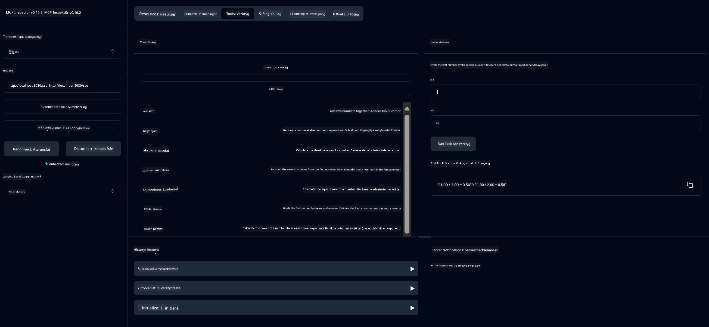

<!--
CO_OP_TRANSLATOR_METADATA:
{
  "original_hash": "ed9cab32cc67c12d8969b407aa47100a",
  "translation_date": "2025-07-13T17:54:45+00:00",
  "source_file": "03-GettingStarted/01-first-server/solution/java/README.md",
  "language_code": "sv"
}
-->
# Basic Calculator MCP Service

Denna tjänst erbjuder grundläggande kalkylatorfunktioner via Model Context Protocol (MCP) med Spring Boot och WebFlux-transport. Den är utformad som ett enkelt exempel för nybörjare som vill lära sig om MCP-implementationer.

För mer information, se referensdokumentationen för [MCP Server Boot Starter](https://docs.spring.io/spring-ai/reference/api/mcp/mcp-server-boot-starter-docs.html).


## Använda tjänsten

Tjänsten exponerar följande API-endpoints via MCP-protokollet:

- `add(a, b)`: Addera två tal
- `subtract(a, b)`: Subtrahera det andra talet från det första
- `multiply(a, b)`: Multiplicera två tal
- `divide(a, b)`: Dividera det första talet med det andra (med kontroll för noll)
- `power(base, exponent)`: Beräkna potens av ett tal
- `squareRoot(number)`: Beräkna kvadratroten (med kontroll för negativa tal)
- `modulus(a, b)`: Beräkna resten vid division
- `absolute(number)`: Beräkna absolutvärdet

## Beroenden

Projektet kräver följande viktiga beroenden:

```xml
<dependency>
    <groupId>org.springframework.ai</groupId>
    <artifactId>spring-ai-starter-mcp-server-webflux</artifactId>
</dependency>
```

## Bygga projektet

Bygg projektet med Maven:
```bash
./mvnw clean install -DskipTests
```

## Köra servern

### Med Java

```bash
java -jar target/calculator-server-0.0.1-SNAPSHOT.jar
```

### Med MCP Inspector

MCP Inspector är ett användbart verktyg för att interagera med MCP-tjänster. För att använda det med denna kalkylatortjänst:

1. **Installera och starta MCP Inspector** i ett nytt terminalfönster:
   ```bash
   npx @modelcontextprotocol/inspector
   ```

2. **Öppna web UI** genom att klicka på URL:en som visas av appen (vanligtvis http://localhost:6274)

3. **Konfigurera anslutningen**:
   - Ställ in transporttypen till "SSE"
   - Ange URL till din körande servers SSE-endpoint: `http://localhost:8080/sse`
   - Klicka på "Connect"

4. **Använd verktygen**:
   - Klicka på "List Tools" för att se tillgängliga kalkylatoroperationer
   - Välj ett verktyg och klicka på "Run Tool" för att köra en operation



**Ansvarsfriskrivning**:  
Detta dokument har översatts med hjälp av AI-översättningstjänsten [Co-op Translator](https://github.com/Azure/co-op-translator). Även om vi strävar efter noggrannhet, vänligen observera att automatiska översättningar kan innehålla fel eller brister. Det ursprungliga dokumentet på dess modersmål bör betraktas som den auktoritativa källan. För kritisk information rekommenderas professionell mänsklig översättning. Vi ansvarar inte för eventuella missförstånd eller feltolkningar som uppstår vid användning av denna översättning.