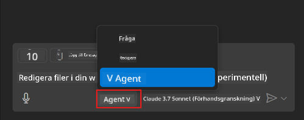
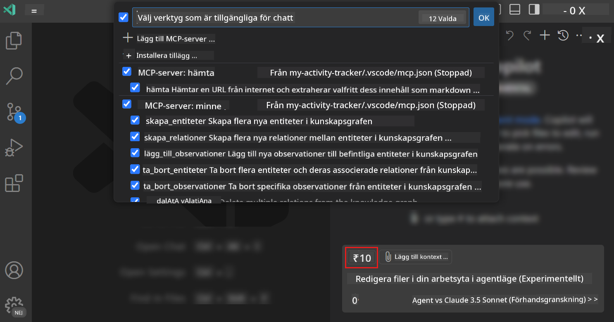
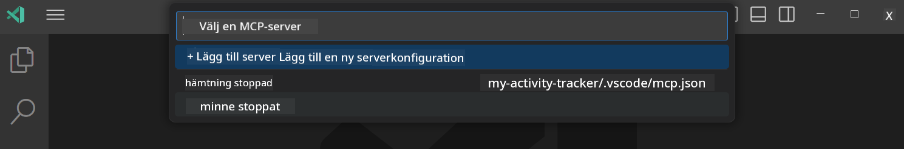
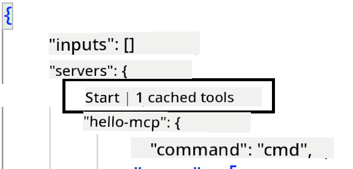

<!--
CO_OP_TRANSLATOR_METADATA:
{
  "original_hash": "d940b5e0af75e3a3a4d1c3179120d1d9",
  "translation_date": "2025-08-26T17:50:42+00:00",
  "source_file": "03-GettingStarted/04-vscode/README.md",
  "language_code": "sv"
}
-->
# Använda en server från GitHub Copilot Agent-läge

Visual Studio Code och GitHub Copilot kan fungera som en klient och använda en MCP-server. Varför skulle vi vilja göra det, kanske du undrar? Jo, det innebär att vilka funktioner MCP-servern än har kan nu användas direkt i din IDE. Tänk dig att du till exempel lägger till GitHubs MCP-server, vilket skulle göra det möjligt att kontrollera GitHub via kommandon istället för att skriva specifika kommandon i terminalen. Eller föreställ dig något som generellt kan förbättra din utvecklarupplevelse, allt styrt av naturligt språk. Nu börjar du se fördelarna, eller hur?

## Översikt

Den här lektionen täcker hur man använder Visual Studio Code och GitHub Copilots Agent-läge som en klient för din MCP-server.

## Lärandemål

I slutet av denna lektion kommer du att kunna:

- Använda en MCP-server via Visual Studio Code.
- Köra funktioner som verktyg via GitHub Copilot.
- Konfigurera Visual Studio Code för att hitta och hantera din MCP-server.

## Användning

Du kan kontrollera din MCP-server på två olika sätt:

- Användargränssnitt, du kommer att se hur detta görs senare i kapitlet.
- Terminal, det är möjligt att kontrollera saker från terminalen med hjälp av `code`-kommandot:

  För att lägga till en MCP-server till din användarprofil, använd kommandoradsalternativet --add-mcp och tillhandahåll JSON-serverkonfigurationen i formen {\"name\":\"server-name\",\"command\":...}.

  ```
  code --add-mcp "{\"name\":\"my-server\",\"command\": \"uvx\",\"args\": [\"mcp-server-fetch\"]}"
  ```

### Skärmdumpar





Låt oss prata mer om hur vi använder det visuella gränssnittet i nästa avsnitt.

## Tillvägagångssätt

Så här behöver vi närma oss detta på hög nivå:

- Konfigurera en fil för att hitta vår MCP-server.
- Starta/anslut till servern för att få den att lista sina funktioner.
- Använd dessa funktioner via GitHub Copilot Chat-gränssnittet.

Bra, nu när vi förstår flödet, låt oss prova att använda en MCP-server via Visual Studio Code genom en övning.

## Övning: Använda en server

I denna övning kommer vi att konfigurera Visual Studio Code för att hitta din MCP-server så att den kan användas via GitHub Copilot Chat-gränssnittet.

### -0- Förberedelse, aktivera MCP-serverupptäckt

Du kan behöva aktivera upptäckt av MCP-servrar.

1. Gå till `File -> Preferences -> Settings` i Visual Studio Code.

1. Sök efter "MCP" och aktivera `chat.mcp.discovery.enabled` i filen settings.json.

### -1- Skapa konfigurationsfil

Börja med att skapa en konfigurationsfil i projektets rot, du behöver en fil som heter MCP.json och placera den i en mapp som heter .vscode. Den ska se ut så här:

```text
.vscode
|-- mcp.json
```

Nästa steg är att lägga till en serverpost.

### -2- Konfigurera en server

Lägg till följande innehåll i *mcp.json*:

```json
{
    "inputs": [],
    "servers": {
       "hello-mcp": {
           "command": "node",
           "args": [
               "build/index.js"
           ]
       }
    }
}
```

Här är ett enkelt exempel ovan på hur man startar en server skriven i Node.js. För andra runtime-miljöer, ange rätt kommando för att starta servern med hjälp av `command` och `args`.

### -3- Starta servern

Nu när du har lagt till en post, låt oss starta servern:

1. Hitta din post i *mcp.json* och se till att du hittar "play"-ikonen:

    

1. Klicka på "play"-ikonen, du bör se att verktygsikonen i GitHub Copilot Chat ökar antalet tillgängliga verktyg. Om du klickar på verktygsikonen ser du en lista över registrerade verktyg. Du kan markera/avmarkera varje verktyg beroende på om du vill att GitHub Copilot ska använda dem som kontext:

  

1. För att köra ett verktyg, skriv en prompt som du vet matchar beskrivningen av ett av dina verktyg, till exempel en prompt som "lägg till 22 och 1":

  

  Du bör se ett svar som säger 23.

## Uppgift

Försök att lägga till en serverpost i din *mcp.json*-fil och se till att du kan starta/stoppa servern. Se också till att du kan kommunicera med verktygen på din server via GitHub Copilot Chat-gränssnittet.

## Lösning

[Lösning](./solution/README.md)

## Viktiga lärdomar

De viktigaste lärdomarna från detta kapitel är följande:

- Visual Studio Code är en utmärkt klient som låter dig använda flera MCP-servrar och deras verktyg.
- GitHub Copilot Chat-gränssnittet är hur du interagerar med servrarna.
- Du kan be användaren om inmatningar som API-nycklar som kan skickas till MCP-servern när du konfigurerar serverposten i *mcp.json*-filen.

## Exempel

- [Java Kalkylator](../samples/java/calculator/README.md)
- [.Net Kalkylator](../../../../03-GettingStarted/samples/csharp)
- [JavaScript Kalkylator](../samples/javascript/README.md)
- [TypeScript Kalkylator](../samples/typescript/README.md)
- [Python Kalkylator](../../../../03-GettingStarted/samples/python)

## Ytterligare resurser

- [Visual Studio-dokumentation](https://code.visualstudio.com/docs/copilot/chat/mcp-servers)

## Vad händer härnäst

- Nästa: [Skapa en stdio-server](../05-stdio-server/README.md)

---

**Ansvarsfriskrivning**:  
Detta dokument har översatts med hjälp av AI-översättningstjänsten [Co-op Translator](https://github.com/Azure/co-op-translator). Även om vi strävar efter noggrannhet, bör det noteras att automatiserade översättningar kan innehålla fel eller brister. Det ursprungliga dokumentet på dess originalspråk bör betraktas som den auktoritativa källan. För kritisk information rekommenderas professionell mänsklig översättning. Vi ansvarar inte för eventuella missförstånd eller feltolkningar som uppstår vid användning av denna översättning.