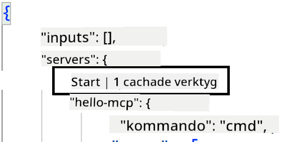
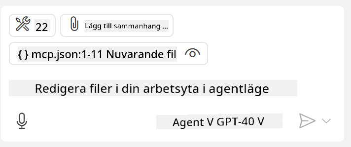

<!--
CO_OP_TRANSLATOR_METADATA:
{
  "original_hash": "c37fabfbc0dcbc9a4afb6d17e7d3be9f",
  "translation_date": "2025-05-17T11:09:16+00:00",
  "source_file": "03-GettingStarted/04-vscode/README.md",
  "language_code": "sv"
}
-->
Låt oss prata mer om hur vi använder det visuella gränssnittet i de kommande avsnitten.

## Tillvägagångssätt

Här är hur vi behöver närma oss detta på en hög nivå:

- Konfigurera en fil för att hitta vår MCP-server.
- Starta/Anslut till servern för att få den att lista sina funktioner.
- Använd dessa funktioner genom GitHub Copilots chattgränssnitt.

Bra, nu när vi förstår flödet, låt oss försöka använda en MCP-server genom Visual Studio Code genom en övning.

## Övning: Konsumera en server

I denna övning kommer vi att konfigurera Visual Studio Code för att hitta din MCP-server så att den kan användas från GitHub Copilots chattgränssnitt.

### -0- Försteg, aktivera upptäckten av MCP-server

Du kan behöva aktivera upptäckten av MCP-servrar.

1. Gå till `File -> Preferences -> Settings` in Visual Studio Code.

1. Search for "MCP" and enable `chat.mcp.discovery.enabled` i settings.json-filen.

### -1- Skapa konfigurationsfil

Börja med att skapa en konfigurationsfil i din projektrot, du behöver en fil som heter MCP.json och placera den i en mapp som heter .vscode. Den ska se ut så här:

```text
.vscode
|-- mcp.json
```

Nästa steg är att se hur vi kan lägga till en serverpost.

### -2- Konfigurera en server

Lägg till följande innehåll i *mcp.json*:

```json
{
    "inputs": [],
    "servers": {
       "hello-mcp": {
           "command": "cmd",
           "args": [
               "/c", "node", "<absolute path>\\build\\index.js"
           ]
       }
    }
}
```

Här är ett enkelt exempel ovan på hur man startar en server skriven i Node.js, för andra runtime-miljöer ange rätt kommando för att starta servern med `command` and `args`.

### -3- Starta servern

Nu när du har lagt till en post, låt oss starta servern:

1. Hitta din post i *mcp.json* och se till att du hittar "spela"-ikonen:

    

1. Klicka på "spela"-ikonen, du bör se verktygsikonen i GitHub Copilot chat öka antalet tillgängliga verktyg. Om du klickar på den verktygsikonen, kommer du att se en lista över registrerade verktyg. Du kan markera/avmarkera varje verktyg beroende på om du vill att GitHub Copilot ska använda dem som kontext: 

  

1. För att köra ett verktyg, skriv en prompt som du vet kommer att matcha beskrivningen av ett av dina verktyg, till exempel en prompt som "lägg till 22 till 1":

  

  Du bör se ett svar som säger 23.

## Uppgift

Försök lägga till en serverpost till din *mcp.json*-fil och se till att du kan starta/stoppa servern. Se till att du också kan kommunicera med verktygen på din server via GitHub Copilots chattgränssnitt.

## Lösning

[Lösning](./solution/README.md)

## Viktiga punkter

De viktiga punkterna från detta kapitel är följande:

- Visual Studio Code är en utmärkt klient som låter dig konsumera flera MCP-servrar och deras verktyg.
- GitHub Copilots chattgränssnitt är hur du interagerar med servrarna.
- Du kan be användaren om inmatningar som API-nycklar som kan skickas till MCP-servern när du konfigurerar serverposten i *mcp.json*-filen.

## Exempel

- [Java Kalkylator](../samples/java/calculator/README.md)
- [.Net Kalkylator](../../../../03-GettingStarted/samples/csharp)
- [JavaScript Kalkylator](../samples/javascript/README.md)
- [TypeScript Kalkylator](../samples/typescript/README.md)
- [Python Kalkylator](../../../../03-GettingStarted/samples/python) 

## Ytterligare resurser

- [Visual Studio-dokumentation](https://code.visualstudio.com/docs/copilot/chat/mcp-servers)

## Vad kommer härnäst

- Nästa: [Skapa en SSE-server](/03-GettingStarted/05-sse-server/README.md)

**Ansvarsfriskrivning**:  
Detta dokument har översatts med hjälp av AI-översättningstjänsten [Co-op Translator](https://github.com/Azure/co-op-translator). Vi strävar efter noggrannhet, men var medveten om att automatiserade översättningar kan innehålla fel eller felaktigheter. Det ursprungliga dokumentet på dess ursprungsspråk bör betraktas som den auktoritativa källan. För kritisk information rekommenderas professionell mänsklig översättning. Vi ansvarar inte för eventuella missförstånd eller misstolkningar som uppstår vid användning av denna översättning.