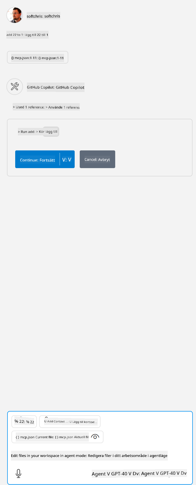

<!--
CO_OP_TRANSLATOR_METADATA:
{
  "original_hash": "5ef8f5821c1a04f7b1fc4f15098ecab8",
  "translation_date": "2025-07-13T19:43:09+00:00",
  "source_file": "03-GettingStarted/04-vscode/solution/README.md",
  "language_code": "sv"
}
-->
Detta motsvarar att köra ett kommando som detta: `node build/index.js`.

- Ändra denna serverpost så att den passar var din serverfil är placerad eller vad som behövs för att starta din server beroende på din valda runtime och serverplats.

## Använd funktionerna i servern

- Klicka på `play`-ikonen när du har lagt till *mcp.json* i *./vscode*-mappen,

    Observera att verktygsikonen ändras för att visa fler tillgängliga verktyg. Verktygsikonen finns precis ovanför chattfältet i GitHub Copilot.

## Kör ett verktyg

- Skriv en prompt i ditt chattfönster som matchar beskrivningen av ditt verktyg. Till exempel, för att aktivera verktyget `add`, skriv något i stil med "add 3 to 20".

    Du bör se ett verktyg presenteras ovanför chattens textfält som indikerar att du kan välja att köra verktyget, som i denna bild:

    

    Att välja verktyget bör ge ett numeriskt resultat som säger "23" om din prompt var som vi nämnde tidigare.

**Ansvarsfriskrivning**:  
Detta dokument har översatts med hjälp av AI-översättningstjänsten [Co-op Translator](https://github.com/Azure/co-op-translator). Även om vi strävar efter noggrannhet, vänligen observera att automatiska översättningar kan innehålla fel eller brister. Det ursprungliga dokumentet på dess modersmål bör betraktas som den auktoritativa källan. För kritisk information rekommenderas professionell mänsklig översättning. Vi ansvarar inte för eventuella missförstånd eller feltolkningar som uppstår vid användning av denna översättning.