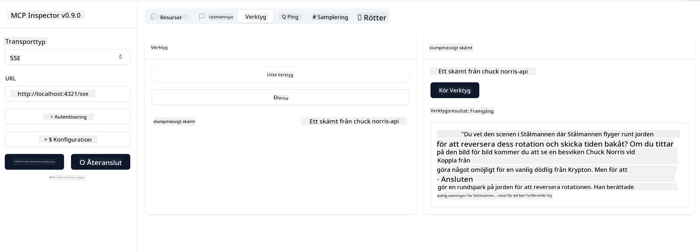

<!--
CO_OP_TRANSLATOR_METADATA:
{
  "original_hash": "0a8086dc4bf89448f83e7936db972c42",
  "translation_date": "2025-05-17T11:36:18+00:00",
  "source_file": "03-GettingStarted/05-sse-server/README.md",
  "language_code": "sv"
}
-->
Nu när vi vet lite mer om SSE, låt oss bygga en SSE-server härnäst.

## Övning: Skapa en SSE-server

För att skapa vår server behöver vi hålla två saker i åtanke:

- Vi behöver använda en webbserver för att exponera ändpunkter för anslutning och meddelanden.
- Bygg vår server som vi normalt gör med verktyg, resurser och kommandon när vi använde stdio.

### -1- Skapa en serverinstans

För att skapa vår server använder vi samma typer som med stdio. Men för transporten behöver vi välja SSE.

Låt oss lägga till de nödvändiga rutterna härnäst.

### -2- Lägg till rutter

Låt oss lägga till rutter som hanterar anslutningen och inkommande meddelanden:

Låt oss lägga till funktioner till servern härnäst.

### -3- Lägg till serverfunktioner

Nu när vi har definierat allt som är specifikt för SSE, låt oss lägga till serverfunktioner som verktyg, kommandon och resurser.

Din fullständiga kod bör se ut så här:

Bra, vi har en server som använder SSE, låt oss testa den härnäst.

## Övning: Debugga en SSE-server med Inspector

Inspector är ett fantastiskt verktyg som vi såg i en tidigare lektion [Skapa din första server](/03-GettingStarted/01-first-server/README.md). Låt oss se om vi kan använda Inspector även här:

### -1- Köra Inspector

För att köra Inspector måste du först ha en SSE-server igång, så låt oss göra det härnäst:

1. Kör servern

1. Kör Inspector

    > ![NOTE]
    > Kör detta i ett separat terminalfönster än där servern körs. Observera också att du behöver justera kommandot nedan för att passa den URL där din server körs.

    ```sh
    npx @modelcontextprotocol/inspector --cli http://localhost:8000/sse --method tools/list
    ```

    Att köra Inspector ser likadant ut i alla körmiljöer. Notera hur vi istället för att ange en sökväg till vår server och ett kommando för att starta servern istället anger URL:en där servern körs och vi anger också `/sse`-rutten.

### -2- Testa verktyget

Anslut servern genom att välja SSE i rullgardinsmenyn och fyll i URL-fältet där din server körs, till exempel http:localhost:4321/sse. Klicka nu på "Connect"-knappen. Som tidigare, välj att lista verktyg, välj ett verktyg och ange inmatningsvärden. Du bör se ett resultat som nedan:



Bra, du kan arbeta med Inspector, låt oss se hur vi kan arbeta med Visual Studio Code härnäst.

## Uppgift

Försök bygga ut din server med fler funktioner. Se [denna sida](https://api.chucknorris.io/) för att till exempel lägga till ett verktyg som anropar ett API, du bestämmer hur servern ska se ut. Ha kul :)

## Lösning

[Lösning](./solution/README.md) Här är en möjlig lösning med fungerande kod.

## Viktiga Lärdomar

Lärdomarna från detta kapitel är följande:

- SSE är den andra stödda transporten bredvid stdio.
- För att stödja SSE behöver du hantera inkommande anslutningar och meddelanden med ett webb-ramverk.
- Du kan använda både Inspector och Visual Studio Code för att konsumera SSE-server, precis som stdio-servrar. Notera hur det skiljer sig lite mellan stdio och SSE. För SSE behöver du starta upp servern separat och sedan köra ditt Inspector-verktyg. För Inspector-verktyget finns det också vissa skillnader i att du behöver ange URL:en.

## Exempel 

- [Java Kalkylator](../samples/java/calculator/README.md)
- [.Net Kalkylator](../../../../03-GettingStarted/samples/csharp)
- [JavaScript Kalkylator](../samples/javascript/README.md)
- [TypeScript Kalkylator](../samples/typescript/README.md)
- [Python Kalkylator](../../../../03-GettingStarted/samples/python) 

## Ytterligare Resurser

- [SSE](https://developer.mozilla.org/en-US/docs/Web/API/Server-sent_events)

## Vad Nästa

- Nästa: [Komma igång med AI Toolkit för VSCode](/03-GettingStarted/06-aitk/README.md)

**Ansvarsfriskrivning**:  
Detta dokument har översatts med hjälp av AI-översättningstjänsten [Co-op Translator](https://github.com/Azure/co-op-translator). Vi strävar efter noggrannhet, men var medveten om att automatiska översättningar kan innehålla fel eller felaktigheter. Det ursprungliga dokumentet på sitt modersmål bör betraktas som den auktoritativa källan. För kritisk information rekommenderas professionell mänsklig översättning. Vi ansvarar inte för eventuella missförstånd eller feltolkningar som uppstår vid användning av denna översättning.