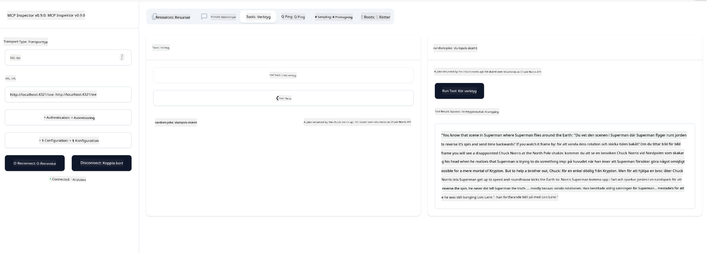

<!--
CO_OP_TRANSLATOR_METADATA:
{
  "original_hash": "3dd2f1e39277c31b0e57e29d165354d6",
  "translation_date": "2025-06-13T00:01:50+00:00",
  "source_file": "03-GettingStarted/05-sse-server/README.md",
  "language_code": "sv"
}
-->
Nu när vi vet lite mer om SSE, låt oss bygga en SSE-server nästa steg.

## Övning: Skapa en SSE-server

För att skapa vår server behöver vi ha två saker i åtanke:

- Vi behöver använda en webbserver för att exponera endpoints för anslutning och meddelanden.
- Bygg vår server som vi brukar göra med verktyg, resurser och prompts när vi använde stdio.

### -1- Skapa en serverinstans

För att skapa vår server använder vi samma typer som med stdio. Men för transporten behöver vi välja SSE.

Låt oss lägga till de nödvändiga rutterna nästa steg.

### -2- Lägg till rutter

Låt oss lägga till rutter som hanterar anslutningen och inkommande meddelanden:

Låt oss lägga till funktioner till servern nästa steg.

### -3- Lägg till serverfunktioner

Nu när vi har definierat allt som är specifikt för SSE, låt oss lägga till serverfunktioner som verktyg, prompts och resurser.

Din fullständiga kod ska se ut så här:

Bra, vi har en server som använder SSE, låt oss testa den nästa steg.

## Övning: Debugga en SSE-server med Inspector

Inspector är ett utmärkt verktyg som vi såg i en tidigare lektion [Skapa din första server](/03-GettingStarted/01-first-server/README.md). Låt oss se om vi kan använda Inspector även här:

### -1- Starta Inspector

För att köra Inspector måste du först ha en SSE-server igång, så låt oss göra det nu:

1. Starta servern

1. Starta Inspector

    > ![NOTE]
    > Kör detta i ett separat terminalfönster från där servern körs. Observera också att du behöver justera kommandot nedan för att passa URL:en där din server körs.

    ```sh
    npx @modelcontextprotocol/inspector --cli http://localhost:8000/sse --method tools/list
    ```

Att köra Inspector ser likadant ut i alla runtime-miljöer. Notera hur vi istället för att skicka en sökväg till vår server och ett kommando för att starta servern, istället skickar URL:en där servern körs och vi specificerar även `/sse`-routen.

### -2- Testa verktyget

Anslut till servern genom att välja SSE i dropdown-menyn och fyll i url-fältet där din server körs, till exempel http://localhost:4321/sse. Klicka sedan på "Connect"-knappen. Precis som tidigare, välj att lista verktyg, välj ett verktyg och ange inmatningsvärden. Du bör se ett resultat som nedan:



Bra, du kan arbeta med Inspector, låt oss se hur vi kan arbeta med Visual Studio Code nästa steg.

## Uppgift

Försök bygga ut din server med fler funktioner. Se [denna sida](https://api.chucknorris.io/) för att till exempel lägga till ett verktyg som anropar ett API, du bestämmer hur servern ska se ut. Ha kul :)

## Lösning

[Lösning](./solution/README.md) Här är en möjlig lösning med fungerande kod.

## Viktiga lärdomar

De viktigaste lärdomarna från detta kapitel är följande:

- SSE är den andra stödda transporttypen efter stdio.
- För att stödja SSE måste du hantera inkommande anslutningar och meddelanden med ett webbframework.
- Du kan använda både Inspector och Visual Studio Code för att konsumera SSE-servrar, precis som stdio-servrar. Observera hur det skiljer sig lite mellan stdio och SSE. För SSE behöver du starta servern separat och sedan köra ditt Inspector-verktyg. För Inspector-verktyget finns det också skillnader i att du behöver specificera URL:en.

## Exempel

- [Java Calculator](../samples/java/calculator/README.md)
- [.Net Calculator](../../../../03-GettingStarted/samples/csharp)
- [JavaScript Calculator](../samples/javascript/README.md)
- [TypeScript Calculator](../samples/typescript/README.md)
- [Python Calculator](../../../../03-GettingStarted/samples/python)

## Ytterligare resurser

- [SSE](https://developer.mozilla.org/en-US/docs/Web/API/Server-sent_events)

## Vad händer härnäst

- Nästa: [HTTP Streaming med MCP (Streamable HTTP)](/03-GettingStarted/06-http-streaming/README.md)

**Ansvarsfriskrivning**:  
Detta dokument har översatts med hjälp av AI-översättningstjänsten [Co-op Translator](https://github.com/Azure/co-op-translator). Även om vi strävar efter noggrannhet, vänligen observera att automatiska översättningar kan innehålla fel eller brister. Det ursprungliga dokumentet på dess modersmål bör betraktas som den auktoritativa källan. För kritisk information rekommenderas professionell mänsklig översättning. Vi ansvarar inte för några missförstånd eller feltolkningar som uppstår till följd av användningen av denna översättning.