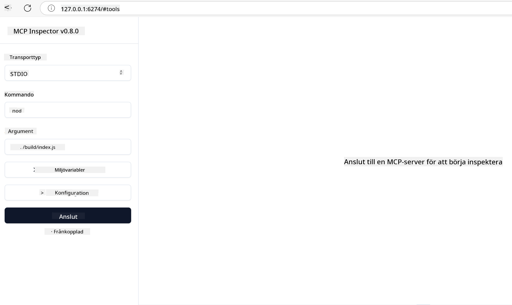

<!--
CO_OP_TRANSLATOR_METADATA:
{
  "original_hash": "717f34718a773f6cf52d8445e40a96bf",
  "translation_date": "2025-05-17T12:44:00+00:00",
  "source_file": "03-GettingStarted/07-testing/README.md",
  "language_code": "sv"
}
-->
## Testning och felsökning

Innan du börjar testa din MCP-server är det viktigt att förstå de tillgängliga verktygen och bästa praxis för felsökning. Effektiv testning säkerställer att din server beter sig som förväntat och hjälper dig snabbt att identifiera och lösa problem. Följande avsnitt beskriver rekommenderade metoder för att validera din MCP-implementering.

## Översikt

Denna lektion täcker hur man väljer rätt testmetod och det mest effektiva testverktyget.

## Lärandemål

I slutet av denna lektion kommer du att kunna:

- Beskriva olika metoder för testning.
- Använda olika verktyg för att effektivt testa din kod.

## Testning av MCP-servrar

MCP erbjuder verktyg för att hjälpa dig testa och felsöka dina servrar:

- **MCP Inspector**: Ett kommandoradsverktyg som kan köras både som ett CLI-verktyg och som ett visuellt verktyg.
- **Manuell testning**: Du kan använda ett verktyg som curl för att köra webbförfrågningar, men vilket verktyg som helst som kan köra HTTP fungerar.
- **Enhetstestning**: Det är möjligt att använda ditt föredragna testningsramverk för att testa funktionerna hos både server och klient.

### Använda MCP Inspector

Vi har beskrivit användningen av detta verktyg i tidigare lektioner, men låt oss prata om det lite på hög nivå. Det är ett verktyg byggt i Node.js och du kan använda det genom att kalla på `npx`-exekverbar fil som temporärt laddar ner och installerar verktyget själv och rensar upp sig när det är klart med att köra din förfrågan.

[MCP Inspector](https://github.com/modelcontextprotocol/inspector) hjälper dig:

- **Upptäck serverkapaciteter**: Automatisk upptäckt av tillgängliga resurser, verktyg och uppmaningar
- **Testa verktygsutförande**: Prova olika parametrar och se svaren i realtid
- **Visa servermetadata**: Granska serverinfo, scheman och konfigurationer

En typisk körning av verktyget ser ut så här:

```bash
npx @modelcontextprotocol/inspector node build/index.js
```

Ovanstående kommando startar en MCP och dess visuella gränssnitt och lanserar ett lokalt webbgränssnitt i din webbläsare. Du kan förvänta dig att se en instrumentpanel som visar dina registrerade MCP-servrar, deras tillgängliga verktyg, resurser och uppmaningar. Gränssnittet låter dig interaktivt testa verktygsutförande, inspektera servermetadata och visa svar i realtid, vilket gör det lättare att validera och felsöka dina MCP-serverimplementeringar.

Så här kan det se ut: 

Du kan också köra detta verktyg i CLI-läge, i vilket fall du lägger till `--cli` attribut. Här är ett exempel på att köra verktyget i "CLI"-läge som listar alla verktyg på servern:

```sh
npx @modelcontextprotocol/inspector --cli node build/index.js --method tools/list
```

### Manuell testning

Förutom att köra inspektorverktyget för att testa serverkapaciteter, är en annan liknande metod att köra en klient som kan använda HTTP, som till exempel curl.

Med curl kan du testa MCP-servrar direkt med HTTP-förfrågningar:

```bash
# Example: Test server metadata
curl http://localhost:3000/v1/metadata

# Example: Execute a tool
curl -X POST http://localhost:3000/v1/tools/execute \
  -H "Content-Type: application/json" \
  -d '{"name": "calculator", "parameters": {"expression": "2+2"}}'
```

Som du kan se från ovanstående användning av curl, använder du en POST-förfrågan för att anropa ett verktyg med en nyttolast bestående av verktygets namn och dess parametrar. Använd den metod som passar dig bäst. CLI-verktyg tenderar generellt att vara snabbare att använda och låter sig skriptas, vilket kan vara användbart i en CI/CD-miljö.

### Enhetstestning

Skapa enhetstester för dina verktyg och resurser för att säkerställa att de fungerar som förväntat. Här är ett exempel på testkod.

```python
import pytest

from mcp.server.fastmcp import FastMCP
from mcp.shared.memory import (
    create_connected_server_and_client_session as create_session,
)

# Mark the whole module for async tests
pytestmark = pytest.mark.anyio


async def test_list_tools_cursor_parameter():
    """Test that the cursor parameter is accepted for list_tools.

    Note: FastMCP doesn't currently implement pagination, so this test
    only verifies that the cursor parameter is accepted by the client.
    """

 server = FastMCP("test")

    # Create a couple of test tools
    @server.tool(name="test_tool_1")
    async def test_tool_1() -> str:
        """First test tool"""
        return "Result 1"

    @server.tool(name="test_tool_2")
    async def test_tool_2() -> str:
        """Second test tool"""
        return "Result 2"

    async with create_session(server._mcp_server) as client_session:
        # Test without cursor parameter (omitted)
        result1 = await client_session.list_tools()
        assert len(result1.tools) == 2

        # Test with cursor=None
        result2 = await client_session.list_tools(cursor=None)
        assert len(result2.tools) == 2

        # Test with cursor as string
        result3 = await client_session.list_tools(cursor="some_cursor_value")
        assert len(result3.tools) == 2

        # Test with empty string cursor
        result4 = await client_session.list_tools(cursor="")
        assert len(result4.tools) == 2
    
```

Den föregående koden gör följande:

- Utnyttjar pytest-ramverket som låter dig skapa tester som funktioner och använda assert-satser.
- Skapar en MCP-server med två olika verktyg.
- Använder `assert`-satsen för att kontrollera att vissa villkor är uppfyllda.

Ta en titt på [hela filen här](https://github.com/modelcontextprotocol/python-sdk/blob/main/tests/client/test_list_methods_cursor.py)

Med ovanstående fil kan du testa din egen server för att säkerställa att kapaciteter skapas som de ska.

Alla större SDK:er har liknande testsektioner så att du kan anpassa dig till din valda runtime.

## Exempel

- [Java Kalkylator](../samples/java/calculator/README.md)
- [.Net Kalkylator](../../../../03-GettingStarted/samples/csharp)
- [JavaScript Kalkylator](../samples/javascript/README.md)
- [TypeScript Kalkylator](../samples/typescript/README.md)
- [Python Kalkylator](../../../../03-GettingStarted/samples/python)

## Ytterligare resurser

- [Python SDK](https://github.com/modelcontextprotocol/python-sdk)

## Vad kommer härnäst

- Nästa: [Distribution](/03-GettingStarted/08-deployment/README.md)

**Ansvarsfriskrivning**:  
Detta dokument har översatts med hjälp av AI-översättningstjänsten [Co-op Translator](https://github.com/Azure/co-op-translator). Vi strävar efter noggrannhet, men var medveten om att automatiserade översättningar kan innehålla fel eller felaktigheter. Det ursprungliga dokumentet på dess modersmål bör betraktas som den auktoritativa källan. För kritisk information rekommenderas professionell mänsklig översättning. Vi ansvarar inte för eventuella missförstånd eller misstolkningar som uppstår vid användning av denna översättning.